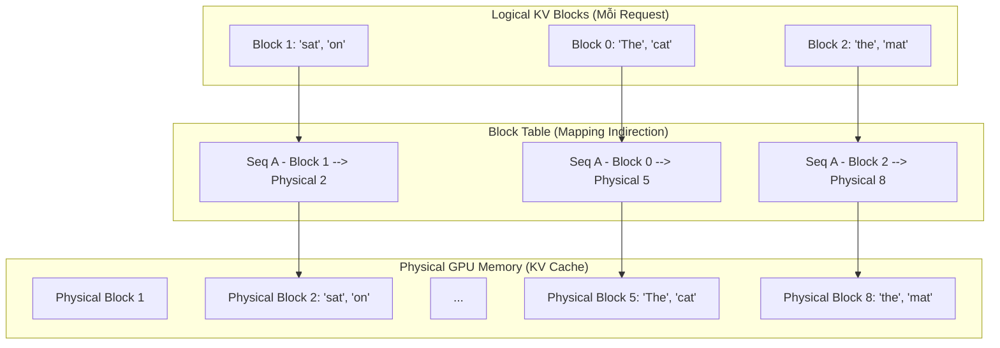

Khi bước ra khỏi những định nghĩa "GenAI là gì?", Kỹ sư hệ thống phải đối mặt với thực tế khốc liệt của việc đưa Mô hình Ngôn ngữ Lớn [LLM] vào Production. Khác với Microservices truyền thống (Stateless), LLM Serving tiêu tốn tài nguyên khủng khiếp và là một hệ thống **Memory-bound** (Bị giới hạn bởi Băng thông bộ nhớ).

Bài viết này mổ xẻ kiến trúc vật lý đằng sau quá trình **Inference (Suy luận)**, tập trung vào bài toán cốt lõi: Làm sao để sinh token nhanh hơn, tối đa hóa Throughput (FinOps), và không làm sập GPU (OOM).

---

## 1. Bản chất Kiến trúc Thực thi: Compute vs. Memory Bound

Mô hình LLM hoạt động theo cơ chế **Autoregressive Generation** (Dự đoán tự hồi quy). Để sinh ra token thứ $N+1$, mô hình phải truy cập lại trạng thái của toàn bộ dãy sequence từ token $1$ đến $N$.

Quá trình Inference chia làm hai pha cực kỳ khác biệt về đặc tính phần cứng:

1.  **Prefill Phase (Pha Đọc - Compute-bound):** Mô hình nhận toàn bộ prompt của user. Ma trận được nhân song song trên GPU. GPU hoạt động hết công suất (TFLOPS cao).
2.  **Decode Phase (Pha Sinh từ - Memory-bound):** Mô hình nhả ra từng token một tuần tự. Lúc này, Compute ALU gần như rảnh rỗi, nhưng GPU phải vận chuyển một lượng dữ liệu khổng lồ (Model Weights + Trạng thái Context) từ VRAM vào Streaming Multiprocessors (SMs) cho *mỗi một token mới*.

### Bài toán Cổ chai: Sự bùng nổ của KV Cache
Để tránh việc phải tính toán lại Attention Score từ đầu, hệ thống lưu trữ các vector **Key (K)** và **Value (V)** vào VRAM. Đây gọi là **KV Cache**.

:::danger
VRAM của GPU không bị chiếm dụng chủ yếu bởi Model Weights, mà bởi KV Cache. Một sequence dài 8,000 tokens của mô hình 70B có thể ngốn hàng Gigabytes KV Cache *cho mỗi user request*. Ở quy mô 100 concurrent requests, GPU sẽ nhanh chóng sập (OOMKilled) dù Compute (TFLOPS) vẫn đang rảnh rỗi.
:::

---

## 2. Giải cứu VRAM với vLLM & PagedAttention

Trước 2023, các hệ thống Inference cấp phát bộ nhớ KV Cache một cách tĩnh (Static Allocation) dựa trên chiều dài tối đa (e.g., cấp luôn 4096 tokens dù prompt chỉ dài 10 tokens). Hậu quả: **Internal Fragmentation** (Phân mảnh nội vi) cực kỳ trầm trọng, lãng phí hơn 60% VRAM.

Dự án **vLLM** giải quyết bài toán này bằng **PagedAttention**, mượn ý tưởng Memory Paging từ Hệ điều hành (OS).

### Cơ chế Hoạt động của PagedAttention

Thay vì cấp phát một vùng nhớ liền kề (contiguous) khổng lồ, PagedAttention chia KV Cache thành các **Blocks (Trang nhớ)** có kích thước cố định (ví dụ: 16 tokens/block).



**Tại sao nó đột phá?**
-   **Cấp phát theo nhu cầu (Demand Allocation):** Chỉ cấp thêm 1 block vật lý khi request thực sự sinh ra thêm token. VRAM lãng phí giảm xuống $<4\%$.
-   **Chia sẻ bộ nhớ (Memory Sharing):** Khi sử dụng Prompt Caching hoặc sinh nhiều câu trả lời (Parallel Sampling/Beam Search), các câu trả lời chia sẻ chung các block KV Cache của phần prompt gốc (như Copy-on-Write).

---

## 3. Kiến Trúc Trade-offs (Staff Engineer Perspective)

Không có công cụ nào hoàn hảo. Triển khai LLM là việc cân bằng (Trade-off) liên tục giữa các chỉ số SLA (Service Level Agreement).

### 3.1. Throughput vs. Latency (TTFT)
Hệ thống vLLM sử dụng **Continuous Batching** (Chèn request mới vào batch đang chạy thay vì chờ batch cũ xong hoàn toàn).
-   **Batch Size lớn:** Compute Utilization tăng $\rightarrow$ **Throughput tăng** (Rất tốt cho FinOps/Lợi nhuận).
-   **Đánh đổi:** Tăng Batch Size khiến GPU phải chia sẻ Memory Bandwidth. **TTFT (Time To First Token)** sẽ tăng vọt, gây giật lag cho UX Chatbot.

### 3.2. Block Size Tuning trong vLLM
Trong PagedAttention, kích thước block (VD: 16 tokens hay 256 tokens) là một tham số nhạy cảm:
-   **Block quá nhỏ:** Tăng áp lực lên Block Table (bảng tra cứu metadata). Chi phí Pointer Indirection làm chậm CUDA kernels.
-   **Block quá lớn:** Gây trở lại hiện tượng Phân mảnh nội (Internal Fragmentation).

### 3.3. vLLM vs. TensorRT-LLM
-   **vLLM:** Hoạt động linh hoạt (Runtime Dynamic), dễ deploy, hỗ trợ hàng trăm models. **Trade-off:** Chấp nhận một chút overhead từ Python scheduler và PagedAttention kernels.
-   **TensorRT-LLM (NVIDIA):** Biên dịch trước (AOT Compilation) Computation Graph. Siêu tối ưu phần cứng trên H100. **Trade-off:** Cứng nhắc, tốn thời gian build Engine cho từng Batch Size/Sequence Length cụ thể.

---

## 4. Xử lý Incident OOM & Cấu hình Thực chiến

Một incident kinh điển là GPU bị `OOMKilled`. 
**Root Cause:** Traffic tăng đột biến hoặc User gửi prompt quá dài (Context Window bùng nổ KV Cache).

Dưới đây là cấu hình Python thực chiến sử dụng **vLLM** trên môi trường phân tán (Multi-GPU), tối ưu để ngăn chặn OOMKilled:

```python
from vllm import LLM, SamplingParams

# Triển khai Llama-3-70B (yêu cầu nhiều VRAM)
llm = LLM(
    model="meta-llama/Meta-Llama-3-70B-Instruct",
    # 1. Tensor Parallelism (TP): Cắt model ra làm 4 mảnh, chạy trên 4 GPUs 
    # kết nối qua NVLink để chia sẻ bộ nhớ (VD: 4x A100 80GB)
    tensor_parallel_size=4,  
    
    # 2. CHỐNG OOM: Chỉ cấp tối đa 90% VRAM cho Weights + KV Cache, 
    # giữ lại 10% safety buffer cho các hoạt động cấp phát OS
    gpu_memory_utilization=0.9, 
    
    # 3. Tuning Block Size (Default 16): Tăng lên 32 nếu prompt thường dài
    # để giảm áp lực lên Block Table (Indirection Overhead)
    block_size=32,
    
    # 4. FinOps: Giới hạn context length để tránh KV cache tràn
    max_model_len=8192,
    
    # 5. Tối ưu Latency (TTFT)
    enforce_eager=False # Bật CUDA Graph
)

# Cấu hình Decoding (Temperature/Top-P)
sampling_params = SamplingParams(
    temperature=0.0, # Deterministic cho Data Processing
    max_tokens=1024
)

prompts = ["Phân tích kiến trúc PagedAttention"]
outputs = llm.generate(prompts, sampling_params)

for output in outputs:
    print(f"Generated text: {output.outputs[0].text}")
```

---

## 5. Tổng Kết

Trong Data Engineering hiện đại, Inference LLM là một bài toán **Distributed Systems Design (Hệ thống phân tán)**. Để đạt được SLA cao, Kỹ sư không thể coi LLM như một API "gọi là chạy". Bạn phải đi sâu vào hạ tầng: quản lý Memory Fragmentation, định cấu hình Continuous Batching, và sử dụng Tensor Parallelism để chia tải KV Cache qua các kết nối NVLink băng thông cao.

## Nguồn Tham Khảo (References)
1.  **vLLM Paper:** *Efficient Memory Management for Large Language Model Serving with PagedAttention (Kwon et al., SOSP 2023)*.
2.  **Mastering LLM Inference:** Hướng dẫn tối ưu KV Cache từ NVIDIA Developer Blog.
3.  **TensorRT-LLM Documentation:** Tối ưu hóa Inference Engine ở cấp độ Compilation Graph.
