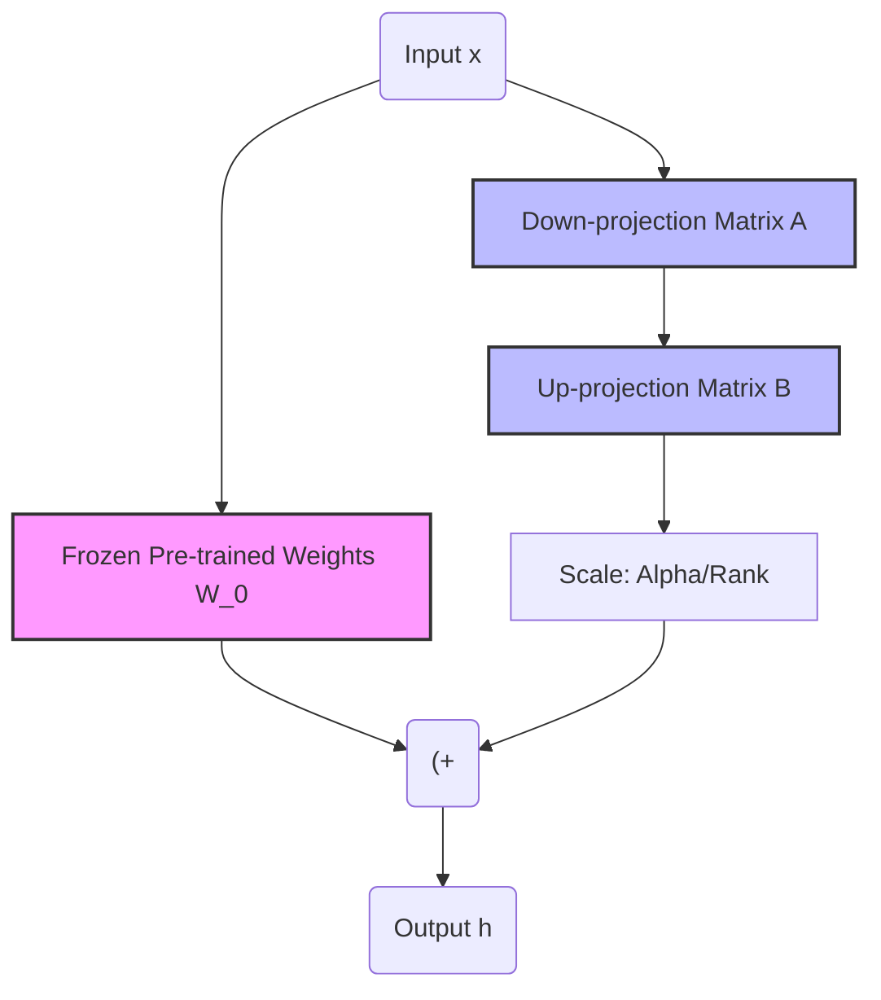

**LoRA (Low-Rank Adaptation)** không chỉ là một thuật toán; dưới góc nhìn của một Data/ML Engineer, nó là một giải pháp kiến trúc xuất sắc nhằm giải quyết bài toán FinOps (chi phí hạ tầng) và Storage Bottleneck khi tinh chỉnh (Fine-tuning) các Mô hình Ngôn ngữ Lớn (LLM).

Thay vì phải nhân bản toàn bộ hàng chục tỷ tham số (Full Fine-Tuning) cho mỗi tác vụ (điều dẫn đến sự bùng nổ lưu trữ hệ thống), LoRA "đóng băng" (freeze) mô hình gốc và tiêm (inject) các ma trận hạng thấp (low-rank matrices) vào mạng neural. Điều này cho phép phục vụ hàng chục "nhân cách" AI khác nhau trên cùng một GPU vật lý.

---

## 1. Kiến trúc Thực thi Vật lý (Physical Execution Architecture)

### 1.1 Cơ chế tiêm Adapter (Adapter Injection)

Trong kiến trúc Transformer, phần tiêu tốn nhiều toán tử nhân ma trận (MatMul) nhất là khối Attention, đặc biệt là các ma trận Query ($W_q$) và Value ($W_v$). LoRA can thiệp thẳng vào luồng thực thi này.


*Nguồn: HuggingFace - Sơ đồ phân rã ma trận trong LoRA.*

Thay vì cập nhật trực tiếp ma trận trọng số gốc $W_0 \in \mathbb{R}^{d \times k}$ (với kích thước hàng chục GB), kiến trúc chia tách nhánh (split-path architecture) được áp dụng:
1. **Đường dữ liệu gốc (Main Path):** Dữ liệu đi qua ma trận $W_0$ (chỉ đọc, đóng băng).
2. **Đường Adapter (Side-car Path):** Dữ liệu đi qua hai ma trận nhỏ $B \in \mathbb{R}^{d \times r}$ và $A \in \mathbb{R}^{r \times k}$.
3. **Phân phối (Aggregation):** Kết quả hai đường được cộng lại với nhau (Element-wise addition) và nhân với một tỷ lệ (Scaling factor).



### 1.2 Đánh đổi Hệ thống (Systemic Trade-offs)

Về mặt thiết kế hệ thống, việc áp dụng LoRA đưa chúng ta vào một số sự đánh đổi cốt lõi:
- **Storage Cost vs. Memory Bandwidth:** Bằng cách giữ Adapter nhỏ (vài chục MB), chi phí lưu trữ S3/EBS giảm 99%. Tuy nhiên, trong quá trình huấn luyện, Memory Bandwidth bị ép do GPU phải load song song hai đường $W_0$ và $(A, B)$.
- **Rank ($r$) vs. Throughput:** Tăng $r$ giúp Adapter học được các đặc trưng phức tạp hơn (tốt cho lập trình/toán học), nhưng làm tăng số tham số huấn luyện, kéo theo việc ăn nhiều VRAM hơn cho Optimizer States (AdamW cần gấp đôi dung lượng của parameters).

---

## 2. FinOps và Tính toán Chi phí (VRAM Capacity Planning)

Một sai lầm chí mạng của các đội ngũ ML là "Out of Memory" (OOMKilled) vì không tính toán kỹ VRAM trước khi phân bổ 인스턴스 (EC2 Instances) như AWS `g5.2xlarge` hay `p4d.24xlarge`.

### 2.1 Công thức VRAM cho LoRA

Giả sử chúng ta Fine-tune mô hình LLaMA-3 8B (với Float16, 1 tham số = 2 Bytes):
- **Base Model ($W_0$):** \$8 \times 10^9 \times 2 = 16 \text{ GB}$.
- **LoRA Parameters ($r=16, \alpha=32$):** Chỉ khoảng 1% - 2% (khoảng 30-50 MB).
- **Gradients (Float16):** Bằng số LoRA parameters x 2 Bytes = 50 MB.
- **Optimizer States (AdamW):** AdamW lưu trữ `m` và `v` ở định dạng Float32 (4 Bytes/tham số). Số VRAM cần = Số LoRA param x 4 x 2 = 100 MB.
- **Activations (Context Window):** Batch size và Sequence length quyết định. (Thường chiếm vài GB).

=> Tổng cộng, chỉ cần khoảng **18-20 GB VRAM**, vừa khít cho một GPU RTX 4090 (24GB) hoặc AWS `g5.xlarge` (\$1.006/giờ). Nếu Full Fine-tuning, con số này có thể vọt lên hơn 100 GB VRAM (cần hệ thống Multi-GPU).

### 2.2 Triển khai Huấn luyện Thực chiến (Python Executable)

Để chống tràn RAM khi khởi tạo mô hình 16-bit, chúng ta kết hợp **QLoRA** (lượng tử hóa 4-bit) thông qua thư viện `bitsandbytes`.

```python
import torch
from transformers import AutoModelForCausalLM, BitsAndBytesConfig
from peft import LoraConfig, get_peft_model, prepare_model_for_kbit_training

# 1. FinOps Caching & 4-bit Quantization (Chống OOM)
# Lượng tử hoá W_0 xuống NF4 (NormalFloat4)
bnb_config = BitsAndBytesConfig(
    load_in_4bit=True,
    bnb_4bit_quant_type="nf4",
    bnb_4bit_use_double_quant=True,
    bnb_4bit_compute_dtype=torch.bfloat16 # Giảm thiểu lỗi chính xác khi backward
)

# Load base model vào VRAM
model = AutoModelForCausalLM.from_pretrained(
    "meta-llama/Meta-Llama-3-8B",
    quantization_config=bnb_config,
    device_map="auto" 
)

# Chuẩn bị cho K-bit training (gradient checkpointing để đổi Compute lấy VRAM)
model = prepare_model_for_kbit_training(model)

# 2. Định nghĩa cấu hình LoRA Adapter
peft_config = LoraConfig(
    r=16,                           # Bottleneck rank
    lora_alpha=32,                  # Scaling factor (= 2*r)
    target_modules=[                # Gắn Adapter vào mọi Attention & MLP projection
        "q_proj", "k_proj", "v_proj", "o_proj", 
        "gate_proj", "up_proj", "down_proj"
    ],
    lora_dropout=0.05,
    bias="none",
    task_type="CAUSAL_LM"
)

# 3. Tiêm (Inject) LoRA vào Base Model
peft_model = get_peft_model(model, peft_config)
peft_model.print_trainable_parameters()
# Expected Output: trainable params: 41,943,040 || all params: 8,072,204,288 || trainable%: 0.5196%
```

---

## 3. Rủi ro Vận hành (Operational Risks & Incidents)

Trong môi trường Production, việc huấn luyện LoRA rất suôn sẻ, nhưng việc **Serving Multi-LoRA** (phục vụ nhiều LoRA adapters trên cùng một Base Model) lại là một cơn ác mộng về Infrastructure.

### 3.1 Vấn đề "Context Switching" trong GPU (Multi-LoRA Bottleneck)
Khi có 3 luồng người dùng gọi 3 Adapters khác nhau (Y tế, Lập trình, Pháp lý) trong cùng một thời điểm:
- **Sai lầm:** Tải Base Model 3 lần vào VRAM -> 🔴 **OOMKilled**.
- **Giải pháp cũ:** Một Base Model trong VRAM, hot-swap (tráo) các Adapter liên tục. 
- **Incident (Latency Spike):** Thao tác copy trọng số Adapter vào GPU RAM mất khoảng 50-200ms mỗi lần tráo. Khi concurrency lên 100 req/s, GPU bị nghẽn do bus PCIe phải tải dữ liệu liên tục (PCIe Bottleneck), dẫn đến Latency tăng vọt lên hàng giây.

### 3.2 Giải pháp Kiến trúc: vLLM Multi-LoRA Serving với PagedAttention
vLLM (một engine serving LLM tốc độ cao) giải quyết vấn đề này thông qua kỹ thuật **Batched Inference cho Multi-LoRA**. Thay vì tráo Adapter cho từng request, vLLM nạp toàn bộ các Adapters vào VRAM (chúng rất nhỏ, chỉ khoảng 50MB mỗi cái, 100 cái cũng chỉ tốn 5GB). 

Khi infer, vLLM gom (batch) các tokens của người dùng yêu cầu Adapter A lại với nhau, tính toán một lượt qua đường nhánh của Adapter A, kết hợp PagedAttention để tránh phân mảnh VRAM.

**Cấu hình vLLM CLI khởi chạy Multi-LoRA:**
```bash
# Cấu hình khởi chạy vLLM hỗ trợ nhiều LoRA (Bật max_loras để giới hạn tránh OOM)
vllm serve meta-llama/Meta-Llama-3-8B \
    --enable-lora \
    --max-loras 4 \
    --max-lora-rank 32 \
    --gpu-memory-utilization 0.9 \
    --port 8000
```

*Trong cấu hình trên, `--max-loras` là một Guardrail. Nếu không giới hạn, một số lượng lớn Adapters được nạp vào VRAM sẽ nuốt chửng bộ nhớ dành cho KV Cache, khiến hệ thống từ chối các sequence dài (Context Window OOM).*

### 3.3 Catastrophic Forgetting (Quên Thảm Họa) trong LoRA
Mặc dù LoRA giúp hạn chế "Quên thảm họa" tốt hơn Full Fine-Tuning do Base Model bị đóng băng, nhưng bản thân Adapter vẫn có thể "học vẹt" (overfit) vào dữ liệu mới và bóp méo output.
- **Biểu hiện:** Huấn luyện Adapter để trả lời JSON. Sau huấn luyện, Adapter trả lời JSON hoàn hảo nhưng mất khả năng tóm tắt văn bản.
- **Khắc phục:** Trộn dữ liệu huấn luyện (Data Mixing). Thêm khoảng 5-10% dữ liệu Pre-training (hoặc instruction-tuning gốc) vào tập dữ liệu Fine-tuning của LoRA.

---

## Tóm tắt Hệ thống (System Summary)

- **Storage & FinOps:** Giảm lưu trữ mô hình từ hàng trăm GB xuống vài chục MB. Chi phí huấn luyện giảm từ hàng nghìn USD xuống còn chưa tới \$10 bằng việc dùng các Single GPU (RTX 3090/4090/A10G).
- **Kiến trúc mạng:** Tách nhánh ma trận (Low-rank decomposition) song song với ma trận gốc, sau đó cộng (Merge) hoặc hot-swap lúc Inference.
- **Production Serving:** Bắt buộc sử dụng các framework tối ưu như `vLLM` hoặc `TGI` với tính năng Multi-LoRA để tránh nghẽn cổ chai PCIe do chuyển đổi ngữ cảnh liên tục.

---

## Nguồn Tham Khảo (References)

*   [LoRA: Low-Rank Adaptation of Large Language Models (Hu et al., 2021) - Arxiv](https://arxiv.org/abs/2106.09685)
*   [QLoRA: Efficient Finetuning of Quantized LLMs (Dettmers et al., 2023) - Arxiv](https://arxiv.org/abs/2305.14314)
*   [vLLM Documentation: Multi-LoRA Serving](https://docs.vllm.ai/en/latest/models/lora.html)
*   [HuggingFace PEFT (Parameter-Efficient Fine-Tuning) GitHub Repository](https://github.com/huggingface/peft)
*   [AWS Machine Learning Blog: Fine-tune Llama 2 with LoRA](https://aws.amazon.com/blogs/machine-learning/fine-tune-llama-2-for-text-generation-on-amazon-sagemaker/)
