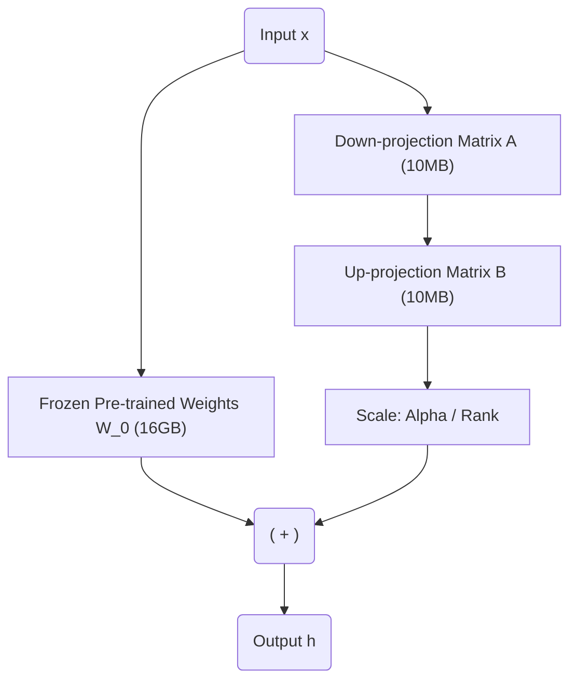

Trong kỷ nguyên Generative AI (GenAI), việc huấn luyện lại (Full Fine-Tuning) các Mô hình Ngôn ngữ Lớn (LLMs) có kích thước hàng chục Tỷ tham số như LLaMA 3 hay Mixtral đòi hỏi hàng chục cụm GPU H100 trị giá hàng triệu Đô-la. 

Để giải bài toán bất khả thi về kinh phí (FinOps) này, kỹ thuật **PEFT (Parameter-Efficient Fine-Tuning)** ra đời, mà ngôi sao sáng nhất là **LoRA (Low-Rank Adaptation)** do Microsoft Research giới thiệu (2021). 

Dưới góc nhìn của một ML Engineer, LoRA không chỉ là một thuật toán toán học. Nó là một **Giải pháp Kiến trúc Phân lớp (Layered Architecture)** xuất sắc, cho phép đóng băng (Freeze) trí thông minh gốc của LLM, và chỉ "cấy ghép" (Inject) thêm các module nhỏ xíu (vài chục MB) để điều hướng mô hình làm theo các tác vụ cụ thể.

---

## 1. Kiến Trúc Thực Thi Vật Lý (Physical Architecture)

Trong kiến trúc Transformer, các cỗ máy "Ngốn RAM" và Compute mạnh nhất là các Khối Attention, đặc biệt là các ma trận Query ($W_q$), Key ($W_k$), và Value ($W_v$). LoRA can thiệp thẳng vào luồng thực thi vật lý này.

### Cơ chế Cấy ghép Adapter (Adapter Injection)
Thay vì cập nhật trực tiếp ma trận trọng số gốc $W_0 \in \mathbb{"R"}^{d \times k}$ (Với kích thước hàng chục Gigabytes), kiến trúc **Chia tách nhánh (Split-path Architecture)** được áp dụng:

1. **Đường Dữ liệu Gốc (Main Path):** Dữ liệu đi qua ma trận $W_0$. Ma trận này bị "Đóng băng" (Frozen) hoàn toàn. Mọi đạo hàm (Gradients) đi qua đây đều bị chặn lại, không tốn VRAM để cập nhật.
2. **Đường Adapter (Side-car Path):** Dữ liệu đi song song qua hai ma trận siêu nhỏ $B \in \mathbb{"R"}^{d \times r}$ và $A \in \mathbb{"R"}^{r \times k}$ (Với $r \ll d, k$).
3. **Tổng hợp (Aggregation):** Kết quả từ hai nhánh được cộng lại với nhau (Element-wise addition) và nhân với một tỷ lệ (Scaling factor là $\frac{"\alpha"}{r}$).



### Đánh đổi Hệ thống (Systemic Trade-offs)
Việc áp dụng LoRA đưa chúng ta vào một số sự đánh đổi kiến trúc cốt lõi:
- **Storage Cost vs. Memory Bandwidth:** Bằng cách giữ Adapter nhỏ bé (Khoảng 50MB), chi phí lưu trữ S3/EBS giảm 99.9% so với việc copy toàn bộ model 16GB. Tuy nhiên, trong quá trình huấn luyện, Băng thông bộ nhớ GPU (Memory Bandwidth) bị ép mạnh do CUDA phải Load song song hai đường $W_0$ và $(A, B)$ từ VRAM vào Compute Cores.
- **Rank ($r$) vs. VRAM Throughput:** Tăng $r$ (Ví dụ từ 16 lên 256) giúp Adapter chứa nhiều "Chất xám" hơn (Đặc biệt tốt cho các Task phức tạp như Code, Toán học). Nhưng cái giá phải trả là số lượng tham số huấn luyện tăng vọt, kéo theo việc ăn bạo VRAM cho Optimizer States.

---

## 2. FinOps VRAM: Tại sao GPU luôn báo OOMKilled?

Một sai lầm chí mạng của các đội ngũ ML là báo cáo ngân sách sai lệch, dẫn đến "Out of Memory" (OOMKilled) vì không tính toán kỹ dung lượng VRAM trước khi thuê các Instance trên AWS (như `g5.2xlarge` - 1 GPU A10G 24GB).

### 2.1 Bài toán VRAM cho LoRA truyền thống
Giả sử chúng ta Fine-tune LLaMA-3 8B (Định dạng Float16, 1 Tham số = 2 Bytes):
- **Base Model ($W_0$):** \$8 \times 10^9 \times 2 = 16 \text{" GB VRAM"}$.
- **LoRA Parameters ($r=16$):** Khoảng 1% tổng tham số = 50 MB.
- **Gradients (Đạo hàm):** Bằng số LoRA parameters x 2 Bytes = 50 MB.
- **Optimizer States (AdamW):** Thuật toán AdamW cần lưu trữ Momentums (`m` và `v`) ở định dạng Float32 (4 Bytes/param). Số VRAM cần = Số LoRA param x 2 x 4 Bytes = 200 MB.
- **Activations (Context Window):** Lưu trữ giá trị trung gian cho quá trình Backpropagation. Tùy thuộc vào Batch Size và Sequence Length, nó sẽ ngốn từ **4GB đến 10GB**.

=> **Tổng cộng:** Chúng ta cần khoảng **22GB - 26GB VRAM**. Việc nhét nó vào RTX 4090 24GB là cực kỳ rủi ro, rất dễ OOM nếu Sequence Length bị đẩy lên 4096 tokens.

### 2.2 Cứu cánh QLoRA (Quantized LoRA)
Để hệ thống hoàn toàn vừa vặn trong Single GPU 24GB, kỹ thuật **QLoRA** ra đời. Thay vì nạp Base Model ở dạng 16-bit (16GB), QLoRA lượng tử hóa (Quantize) nó xuống định dạng 4-bit (NF4 - NormalFloat4).
- **Base Model (4-bit):** Chỉ còn tiêu tốn **4 GB VRAM**.
- Kết hợp với **Gradient Checkpointing** (Đổi Compute lấy Memory), tổng VRAM tiêu thụ chỉ còn vỏn vẹn **~12 GB VRAM**. Bạn thậm chí có thể train LLaMA-3 trên Google Colab T4 miễn phí!

**Mã nguồn HuggingFace PEFT Thực chiến:**
```python
import torch
from transformers import AutoModelForCausalLM, BitsAndBytesConfig
from peft import LoraConfig, get_peft_model, prepare_model_for_kbit_training

# 1. Cấu hình QLoRA (Lượng tử hóa 4-bit chống OOM)
bnb_config = BitsAndBytesConfig(
    load_in_4bit=True,
    bnb_4bit_quant_type="nf4",
    bnb_4bit_use_double_quant=True,
    bnb_4bit_compute_dtype=torch.bfloat16 # Dùng bfloat16 cho Compute để giữ độ chính xác
)

# 2. Tải mô hình gốc vào VRAM
model = AutoModelForCausalLM.from_pretrained(
    "meta-llama/Meta-Llama-3-8B",
    quantization_config=bnb_config,
    device_map="auto" 
)

# Kích hoạt Gradient Checkpointing (Giảm Memory Activations)
model = prepare_model_for_kbit_training(model)

# 3. Định nghĩa Cấu hình LoRA Adapter
peft_config = LoraConfig(
    r=16,                           # Bottleneck rank
    lora_alpha=32,                  # Scaling factor (Thường set = 2*r)
    target_modules=[                # Gắn Adapter vào mọi Attention & MLP modules
        "q_proj", "k_proj", "v_proj", "o_proj", 
        "gate_proj", "up_proj", "down_proj"
    ],
    lora_dropout=0.05,
    bias="none",
    task_type="CAUSAL_LM"
)

# 4. Tiêm (Inject) LoRA vào Mô hình
peft_model = get_peft_model(model, peft_config)
peft_model.print_trainable_parameters()
# Output: trainable params: 41,943,040 || all params: 8B || trainable%: 0.51%
```

---

## 3. Rủi ro Vận hành (Operational Risks) & Multi-LoRA Serving

Trong phòng Lab, huấn luyện LoRA rất suôn sẻ. Nhưng ra môi trường Production, bài toán **Multi-LoRA Serving** (Phục vụ nhiều "Nhân cách" AI trên cùng 1 cụm GPU) là một cơn ác mộng về Infrastructure.

### 3.1 Cổ chai PCIe (PCIe Bottleneck) khi Hot-Swap
Ví dụ: Bạn có 1 Model Chatbot. User A muốn Chatbot làm "Luật sư" (Gọi Adapter A). User B muốn Chatbot làm "Bác sĩ" (Gọi Adapter B).
- **Sai lầm (OOM):** Load Base Model 2 lần vào VRAM. GPU sẽ nổ tung ngay lập tức.
- **Giải pháp thô sơ (Hot-Swap):** Giữ 1 Base Model trong VRAM. Khi Request của User A tới, xóa Adapter cũ khỏi GPU, copy Adapter A từ Ổ cứng RAM (CPU) qua cáp PCIe vào GPU.
- **Sự cố (Incident):** Việc Hot-Swap Adapter 50MB qua cổng PCIe tốn khoảng 50ms-100ms. Khi hệ thống có 100 Request/giây (Concurrency) yêu cầu tráo Adapter liên tục, cổng cáp PCIe bị nghẽn cổ chai vật lý. GPU bị đình trệ (Stall), khiến Latency của mọi User tăng vọt lên hàng chục giây.

### 3.2 Giải pháp Kiến trúc: vLLM & PagedAttention
Framework phục vụ hàng đầu hiện nay là **vLLM** giải quyết triệt để vấn đề này. 
Thay vì tráo (Swap) liên tục, vLLM nạp sẵn (Pre-load) **TOÀN BỘ các Adapters** vào trong VRAM cùng một lúc (Vì chúng rất nhỏ, 100 Adapters cũng chỉ tốn 5GB VRAM).

Khi Inference, vLLM sử dụng **Batched Multi-LoRA**: Nó gom (Batch) các Token của User A và User B chạy chung 1 lượt qua Base Model. Khi đến lớp Attention, Token của ai sẽ được rẽ nhánh vào đúng Ma trận Adapter của người đó. Kết hợp với **PagedAttention** (Quản lý bộ nhớ VRAM giống như Virtual Memory của Hệ điều hành), vLLM loại bỏ hoàn toàn sự phân mảnh bộ nhớ.

**Cấu hình vLLM CLI khởi chạy Multi-LoRA:**
```bash
# Khởi chạy vLLM Server hỗ trợ Multi-LoRA
vllm serve meta-llama/Meta-Llama-3-8B \
    --enable-lora \
    --max-loras 8 \
    --max-lora-rank 32 \
    --gpu-memory-utilization 0.9 \
    --port 8000
```
*(Lưu ý Guardrail: Tham số `--max-loras` là để giới hạn số lượng Adapter. Nếu nạp quá nhiều Adapter, VRAM dùng cho KV-Cache sẽ bị hụt, làm giảm số lượng Token Context tối đa).*

### 3.3 Hội chứng "Catastrophic Forgetting" (Quên Thảm Họa)
LoRA giúp hạn chế "Quên thảm họa" tốt hơn so với Full Fine-Tuning. Tuy nhiên, Adapter vẫn có nguy cơ "Học vẹt" (Overfit).
- **Biểu hiện:** Bạn Fine-tune Adapter để model trả về định dạng JSON nghiêm ngặt. Sau khi train, Model in ra JSON hoàn hảo, nhưng bỗng dưng... mất khả năng giao tiếp tiếng Việt.
- **Khắc phục:** Nguyên tắc **Data Mixing**. Luôn trộn thêm 5% - 15% dữ liệu Pre-training chung (Hoặc dữ liệu hội thoại Instruction-tuning gốc) vào tập Data huấn luyện của bạn để làm "Mỏ neo" [Anchor] kiến thức cho mô hình.

---

## Nguồn Tham Khảo (References)

1. **Microsoft Research:** [LoRA: Low-Rank Adaptation of Large Language Models (Arxiv]][https://arxiv.org/abs/2106.09685]
2. **University of Washington:** [QLoRA: Efficient Finetuning of Quantized LLMs (Arxiv]][https://arxiv.org/abs/2305.14314]
3. **vLLM Official Docs:** [Using LoRA with vLLM for Multi-Tenant Serving][https://docs.vllm.ai/en/latest/models/lora.html]
4. **HuggingFace Blog:** [Parameter-Efficient Fine-Tuning using PEFT](https://huggingface.co/blog/peft]
