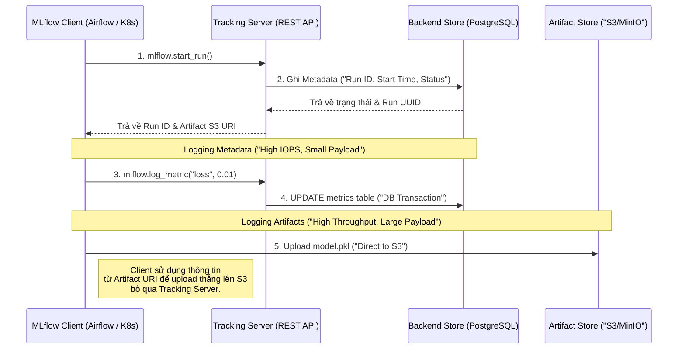

Trong Kỹ thuật Phần mềm (Software Engineering), Git giúp quản lý vòng đời của Source Code. Trong Kỹ thuật Dữ liệu (Data Engineering), Data Catalog (như Amundsen, DataHub) quản lý vòng đời của Data. Còn đối với Machine Learning (MLOps), bài toán phức tạp hơn theo cấp số nhân: Chúng ta cần liên kết đồng thời **Code**, **Data**, **Hyperparameters**, và **Model Weights** thành một thể thống nhất, có thể truy xuất lại (Reproducible) bất cứ lúc nào. Đó chính là bài toán mà MLflow giải quyết.

MLflow không chỉ là một thư viện Python. Dưới góc nhìn Thiết kế Hệ thống (System Design), nó là một **Kiến trúc phân tán (Distributed Architecture)** được thiết kế chuyên biệt để quản lý State (Trạng thái) của hàng triệu quá trình huấn luyện mô hình.

---

## 1. Kiến trúc Vật lý (Physical Architecture)

Một hệ thống MLflow Production tiêu chuẩn bao gồm 4 thành phần Logic (Logical Tiers):

1. **MLflow Client**: Các Pipeline huấn luyện (Training Pipelines) chạy phân tán trên Apache Airflow, Kubernetes Pods, Databricks Clusters, hoặc Jupyter Notebooks của Data Scientist.
2. **Tracking Server**: Một Lightweight REST API Server (Thường triển khai bằng Gunicorn hoặc FastAPI). Nó đóng vai trò là Control Plane trung tâm, điều phối mọi giao tiếp.
3. **Backend Store**: Cơ sở dữ liệu quan hệ (PostgreSQL / MySQL). Nơi này **CHỈ** lưu trữ *Metadata*: Các thông số (Parameters), Metrics (kiểu dữ liệu Float/Int), Tags, và trạng thái của Run. Dữ liệu tại đây có cấu trúc chặt chẽ, dung lượng nhỏ, nhưng **tần suất Ghi (Write IOPS) cực kỳ cao**.
4. **Artifact Store**: Object Storage (Amazon S3, Google Cloud Storage, Azure Blob, hoặc MinIO). Đây là nơi chứa *Payloads* khổng lồ: Trọng số (Weights) của Model (file `.pkl`, `.safetensors`, `.h5`), hình ảnh dự đoán, biểu đồ, và các tệp TensorBoard. Tần suất Write thấp hơn nhưng **Băng thông (Throughput) cực lớn**.

### Trực quan hóa Luồng dữ liệu (Data Flow)



### Đánh đổi Kiến trúc: Direct vs. Proxied Artifact Access

**1. Direct Access (Truy cập Trực tiếp - Mặc định):** Như sơ đồ trên, Client nhận đường dẫn S3 từ Tracking Server, sau đó dùng Credentials (như IAM Role / Access Key) của chính Client để đẩy file thẳng lên S3.
- **Ưu điểm**: Throughput (Băng thông) tối đa. Tracking Server hoàn toàn không bị ảnh hưởng (CPU/RAM) khi các model khổng lồ (vài chục GB) được upload.
- **Nhược điểm (Rủi ro Bảo mật)**: *Secret Sprawl*. Mọi Worker Node tham gia huấn luyện (Hàng trăm máy) đều phải được cấp quyền IAM Write vào hệ thống S3.

**2. Proxied Artifact Access (Từ phiên bản 1.24+):**
- **Cơ chế**: Client upload Artifact trực tiếp cho Tracking Server thông qua giao thức HTTP. Tracking Server sẽ assume một IAM Role mạnh duy nhất để đẩy tiếp lên S3 thay cho Client. Client lúc này chỉ cần có Token của MLflow (MLFLOW_TRACKING_TOKEN).
- **Trade-off (Bottleneck)**: Tracking Server lập tức trở thành **Nút thắt cổ chai (Bottleneck)** về Network I/O và Memory. Nếu có 100 Jobs cùng đẩy model 2GB, Tracking Server sẽ cạn kiệt RAM, dẫn đến `OOMKilled` (Out of Memory), toàn bộ luồng CI/CD MLOps bị đình trệ. Cần cấu hình Auto-scaling (Kubernetes HPA) và Load Balancer (ALB) cực kỳ chặt chẽ nếu sử dụng phương án Proxy này.

---

## 2. Rủi ro Vận hành (Operational Risks) & Real-world Incidents

### Incident 1: "Cartesian Explosion" & Database Thrashing
Bảng `metrics` trong Backend Store (PostgreSQL) của MLflow lưu trữ theo cấu trúc Key-Value: Mỗi khi gọi lệnh `mlflow.log_metric()`, nó sẽ chèn (INSERT) một Row mới bao gồm `(run_uuid, key, value, timestamp, step)`.

Hãy thử nhẩm tính toán học hệ thống: Nếu hệ thống chạy 1,000 Runs, mỗi Run train 10,000 Epochs, và Data Scientist log 10 Metrics/Epoch $\rightarrow$ Bảng `metrics` sẽ phải gánh **100,000,000 Rows**. 
*Hậu quả:* PostgreSQL sẽ nhanh chóng cạn kiệt IOPS (Input/Output Operations Per Second), hiện tượng Table Bloat xảy ra liên tục, và bất kỳ truy vấn READ nào trên giao diện MLflow UI (Lọc Runs tốt nhất) đều sẽ quay mòng mòng và Time-out.

**Cách khắc phục (Remediation):**
- Sử dụng hàm Batch `mlflow.log_metrics()` thay vì lặp vòng For gọi từng `log_metric`.
- Áp dụng kỹ thuật **Downsampling**: Chỉ lưu Metric sau mỗi 10 hoặc 100 Steps đối với các vòng lặp Deep Learning (PyTorch/TensorFlow) dài hạn. Giữ Database "Sạch".

### Incident 2: Dependency Hell (Xung đột Môi trường Đóng gói)
Thành phần MLflow Models sử dụng Concept `Flavor` để đóng gói mô hình (VD: `mlflow.sklearn`, `mlflow.pytorch`). Lỗi chí mạng nhất khi triển khai (Model Serving) là file `conda.yaml` vô tình Capture luôn các thư viện C-level (như thư viện GPU CUDA/C++ build riêng trên máy tính cá nhân chạy Ubuntu của Data Scientist).
Khi Container phục vụ Model chạy trên môi trường Alpine Linux siêu nhẹ trên Kubernetes, lệnh `pip install` sẽ văng lỗi C-Compiler và sập toàn bộ Pipeline.

**Cách khắc phục:** Cần Review kỹ Metadata của Model thông qua luồng CI (Continuous Integration) trước khi cho phép thăng cấp (Promote) mô hình lên môi trường `Production` trên Model Registry. Luôn tách biệt các Dependency Inference (Nhẹ) với các Dependency Training (Rất nặng).

---

## 3. Triển khai Thực chiến (Executable Infrastructure)

Một cụm MLflow độc lập (Self-hosted) được cấu hình bằng `docker-compose.yml`, tích hợp MinIO đóng vai trò Artifact Store và PostgreSQL đóng vai trò Backend Store. Đây là tiêu chuẩn vàng (Golden Standard) cho các Team On-Premise.

```yaml
# docker-compose.yml
version: '3.8'

services:
  db:
    image: postgres:15-alpine
    environment:
      - POSTGRES_USER=mlflow_user
      - POSTGRES_PASSWORD=mlflow_pass
      - POSTGRES_DB=mlflow_db
    volumes:
      - pgdata:/var/lib/postgresql/data
    healthcheck:
      test: ["CMD-SHELL", "pg_isready -U mlflow_user"]
      interval: 5s
      timeout: 5s
      retries: 5

  minio:
    image: minio/minio
    command: server /data --console-address ":9001"
    environment:
      - MINIO_ROOT_USER=admin_minio
      - MINIO_ROOT_PASSWORD=supersecret_minio
    volumes:
      - minio_data:/data
    ports:
      - "9000:9000"
      - "9001:9001"

  mlflow-tracking:
    image: python:3.10-slim
    command: >
      bash -c "pip install mlflow psycopg2-binary boto3 && 
      mlflow server
      --backend-store-uri postgresql://mlflow_user:mlflow_pass@db:5432/mlflow_db
      --default-artifact-root s3://mlflow-artifacts/
      --host 0.0.0.0
      --port 5000"
    environment:
      - AWS_ACCESS_KEY_ID=admin_minio
      - AWS_SECRET_ACCESS_KEY=supersecret_minio
      - MLFLOW_S3_ENDPOINT_URL=http://minio:9000 # Ép giao tiếp qua S3 API cục bộ
    ports:
      - "5000:5000"
    depends_on:
      db:
        condition: service_healthy
      minio:
        condition: service_started

volumes:
  pgdata:
  minio_data:
```

### Tích hợp trên Python Client (Data Scientist Side)
Để Data Scientist có thể tương tác với cụm hạ tầng vừa triển khai, Client bắt buộc phải khai báo đầy đủ Routing Parameters. Đoạn Code này đại diện cho chế độ **Direct Access**:

```python
import os
import mlflow
import mlflow.sklearn
from sklearn.ensemble import RandomForestRegressor

# Cấu hình chỉ đạo việc gửi Metadata (Parameters, Metrics) tới Control Plane (Tracking Server)
mlflow.set_tracking_uri("http://localhost:5000")

# Cấu hình Authentication & Routing để Client tự đẩy Model File lên Artifact Store (MinIO)
# Bỏ qua hoàn toàn Tracking Server khi Upload Payload lớn
os.environ["AWS_ACCESS_KEY_ID"] = "admin_minio"
os.environ["AWS_SECRET_ACCESS_KEY"] = "supersecret_minio"
os.environ["MLFLOW_S3_ENDPOINT_URL"] = "http://localhost:9000"

mlflow.set_experiment("fraud_detection_experiment")

with mlflow.start_run():
    rf = RandomForestRegressor(n_estimators=100, max_depth=5)
    # rf.fit(X_train, y_train) # Giả lập quá trình Training
    
    # 1. Ghi Parameter vào PostgreSQL thông qua HTTP POST tới localhost:5000
    mlflow.log_param("n_estimators", 100)
    
    # 2. Upload Model Trực tiếp lên S3/MinIO (localhost:9000)
    mlflow.sklearn.log_model(rf, "random_forest_model")
```

---

## 4. Tối ưu Chi phí (FinOps) & Dọn dẹp (Garbage Collection)

Rất ít Kỹ sư (Developer) để ý rằng: Mặc định, khi người dùng (hoặc Script API) xóa một Run trên giao diện MLflow UI, hệ thống **CHỈ** thực hiện `Soft Delete` (đánh dấu cột `deleted_time` trong Database). Toàn bộ File Model Weights nặng hàng chục GB trên Amazon S3 vẫn còn nguyên vẹn! Lâu ngày, điều này tạo ra một "Bãi rác" khổng lồ gây thất thoát tài chính (Storage Cost/FinOps Disaster).

**Giải pháp Thực thi FinOps (Cost Control):**
1. **Thiết lập Garbage Collection:**
   Phải cấu hình một Cronjob (hoặc Airflow DAG) chạy định kỳ để dọn dẹp vật lý:
   ```bash
   # Lệnh này sẽ xóa vĩnh viễn (Hard Delete) Metadata trong Database 
   # VÀ gọi API của Cloud Provider (S3) để xóa các Artifacts rác.
   mlflow gc --backend-store-uri postgresql://...
   ```
2. **S3 Lifecycle Policies:**
   Kết hợp AWS S3 Bucket Policies để tự động dịch chuyển (Transition) các object Model cũ (Không nằm trong trạng thái `Production` của Model Registry) sang vùng lưu trữ lạnh siêu rẻ như *S3 Glacier*, hoặc tự động hủy (Expire) sau 60 ngày thử nghiệm.

---

## 5. Model Registry & Phân phối Mô hình với Apache Spark (Batch Inference)

Giai đoạn cuối cùng của vòng đời MLOps là phân phối mô hình (Serving). Trong Data Engineering, triển khai mô hình thành một điểm REST API (như Flask hay FastAPI) thường gặp các điểm nghẽn nghiêm trọng về Network Latency (HTTP Overhead) khi phải gửi Request cho từng dòng (Row) trong tập dữ liệu Data Lake hàng tỷ Records.

Giải pháp thiết kế ưu việt hơn cho dữ liệu khổng lồ là sử dụng **Batch Inference (Dự đoán hàng loạt)** thông qua Apache Spark. Mô hình MLflow lúc này được biến thành một **UDF (User Defined Function)** chạy song song trên hàng nghìn CPU Cores của cụm Cluster:

```python
from pyspark.sql import SparkSession
import mlflow.pyfunc

spark = SparkSession.builder.appName("BatchInference").getOrCreate()
df = spark.read.parquet("s3a://data-lake/transactions/2026/06/")

# 1. Tự động kéo model đang ở trạng thái "Production" từ Model Registry
# Lợi ích: Không bao giờ phải Hardcode Version ID trong Spark Job!
model_uri = "models:/FraudDetectionModel/Production"

# 2. Biên dịch (Compile) model thành hàm PySpark UDF
predict_udf = mlflow.pyfunc.spark_udf(spark, model_uri)

# 3. Phân tán xử lý trên hàng trăm Worker Nodes
predictions_df = df.withColumn("is_fraud", predict_udf("feature_array"))

# Ghi kết quả lại xuống Data Lake (Lakehouse)
predictions_df.write.parquet("s3a://data-lake/predictions/2026/06/")
```

**Trade-off & Sự cố [Spill-to-disk/OOM]:**
Mặc dù Batch Inference bằng Spark UDF cực kỳ mạnh mẽ, kiến trúc PySpark giao tiếp với Python (thông qua Cầu nối `Py4J` và Apache Arrow) đòi hỏi thao tác Serialize và Deserialize dữ liệu liên tục giữa quy trình **JVM (Java Virtual Machine)** và quy trình **Python Worker**.
Đối với các Model Deep Learning nặng (hoặc Random Forest quá sâu), bộ nhớ dùng cho việc trao đổi dữ liệu này có thể nhanh chóng làm tràn RAM của Executor, dẫn tới lỗi `OOMKilled` kinh điển, hoặc dữ liệu bị trào xuống đĩa cứng (Spill-to-disk) làm chậm hiệu suất hàng nghìn lần. 
*Giải pháp Platform:* Cấu hình `spark.executor.memoryOverhead` cao hơn nhiều so với mức mặc định, hoặc ưu tiên dùng các ML Framework chạy C-native nếu có thể.

---

## Nguồn Tham Khảo (References)

* [MLflow Architecture - Official Documentation][https://mlflow.org/docs/latest/tracking.html#tracking-server]
* [Design of MLflow Model Registry][https://mlflow.org/docs/latest/model-registry.html]
* Martin Kleppmann, *Designing Data-Intensive Applications*, Chapter 10: Batch Processing (áp dụng cho luồng Spark UDF inference).
* [Databricks: Managed MLflow and The MLOps Lifecycle](https://www.databricks.com/product/managed-mlflow]
