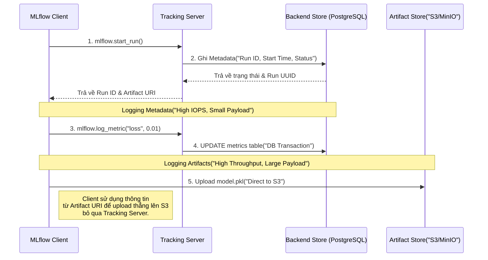

Trong kỹ thuật phần mềm, Git giúp quản lý vòng đời của Source Code. Trong Data Engineering, Data Catalog (như Amundsen, DataHub) quản lý vòng đời của Data. Còn đối với Machine Learning, bài toán phức tạp hơn nhiều: Chúng ta cần liên kết đồng thời **Code**, **Data**, **Hyperparameters**, và **Model Weights** thành một thể thống nhất. Đó chính là bài toán mà MLflow giải quyết.

MLflow không chỉ là một thư viện Python. Dưới góc nhìn thiết kế hệ thống (System Design), nó là một kiến trúc phân tán (distributed architecture) được thiết kế chuyên biệt để quản lý State (trạng thái) của hàng triệu quá trình huấn luyện mô hình.

## 1. Kiến trúc Vật lý (Physical Architecture)

Một hệ thống MLflow Production tiêu chuẩn bao gồm 4 thành phần logic (logical tiers):

1. **MLflow Client**: Các pipeline huấn luyện (Training Pipelines) chạy phân tán trên Airflow, Kubernetes Pods, hoặc Jupyter Notebooks.
2. **Tracking Server**: Một lightweight REST API Server (thường triển khai bằng Gunicorn hoặc FastAPI). Nó đóng vai trò là Control Plane trung tâm.
3. **Backend Store**: Cơ sở dữ liệu quan hệ (PostgreSQL / MySQL). Nơi này chỉ lưu trữ *Metadata*: Các thông số (Parameters), Metrics (số int/float), Tags, và trạng thái của Run. Dữ liệu tại đây có cấu trúc, dung lượng nhỏ, nhưng **tần suất Write cực kỳ cao**.
4. **Artifact Store**: Object Storage (AWS S3, Google Cloud Storage, Azure Blob, hoặc MinIO). Đây là nơi chứa *Payloads* khổng lồ: Weights của model (file `.pkl`, `.safetensors`, `.h5`), hình ảnh, biểu đồ, và các tệp cấu hình.

### Trực quan hóa Luồng dữ liệu (Data Flow)



### Đánh đổi Kiến trúc: Direct vs. Proxied Artifact Access

**1. Direct Access (Mặc định):** Như sơ đồ trên, Client nhận đường dẫn từ Tracking Server, sau đó dùng Credentials (như IAM Role / Access Key) của chính Client để đẩy file lên S3.
- **Ưu điểm**: Throughput (băng thông) tối đa. Tracking Server hoàn toàn không bị ảnh hưởng khi các model nặng vài chục GB được upload.
- **Nhược điểm (Rủi ro)**: Secret Sprawl. Mọi worker node tham gia huấn luyện đều phải được cấp quyền Write vào hệ thống S3.

**2. Proxied Artifact Access (Từ phiên bản 1.24+):**
- **Cơ chế**: Client upload artifact trực tiếp cho Tracking Server thông qua HTTP HTTP. Tracking Server sẽ assume một IAM Role duy nhất để đẩy tiếp lên S3 thay cho Client. Client lúc này chỉ cần có Token của MLflow.
- **Trade-off (Bottleneck)**: Tracking Server lập tức trở thành Nút thắt cổ chai về Network I/O và Memory. Nếu có 100 jobs cùng đẩy model 2GB, Tracking Server sẽ cạn kiệt RAM, dẫn đến OOMKilled (Out of Memory), toàn bộ luồng CI/CD model bị đình trệ. Cần cấu hình Auto-scaling và Load Balancer (ví dụ ALB trên AWS) cực kỳ chặt chẽ nếu sử dụng phương án này.

## 2. Rủi ro Vận hành (Operational Risks) & Real-world Incidents

### Incident 1: "Cartesian Explosion" & Database Thrashing
Bảng `metrics` trong Backend Store của MLflow lưu trữ theo cấu trúc Key-Value: Mỗi khi gọi lệnh `mlflow.log_metric()`, nó sẽ tạo một row mới bao gồm `(run_uuid, key, value, timestamp, step)`.

Hãy thử nhẩm tính: Nếu hệ thống chạy 1,000 runs, mỗi run train 10,000 epochs, và bạn log 10 metrics/epoch $\rightarrow$ Bảng `metrics` sẽ phải gánh **100,000,000 rows**. 
Hậu quả là PostgreSQL sẽ nhanh chóng cạn kiệt IOPS (Input/Output Operations Per Second), Table Bloat xảy ra liên tục, và bất kỳ truy vấn READ nào trên giao diện MLflow UI đều sẽ quay mòng mòng (Timeout).

**Cách khắc phục (Remediation):**
- Sử dụng `mlflow.log_metrics()` (batch write) thay vì lặp qua từng `log_metric`.
- Áp dụng kỹ thuật **Downsampling**: Chỉ lưu metric sau mỗi 10 hoặc 100 steps đối với các vòng lặp Deep Learning dài hạn.

### Incident 2: Dependency Hell (Xung đột Môi trường Đóng gói)
Thành phần MLflow Models sử dụng concept `flavor` để đóng gói mô hình. Lỗi phổ biến nhất khi triển khai model (Serving) là file `conda.yaml` hoặc `requirements.txt` vô tình capture luôn các thư viện C-level gắn liền với hệ điều hành của môi trường huấn luyện (ví dụ các thư viện CUDA/C++ build riêng trên máy tính cá nhân chạy Ubuntu).
Khi container phục vụ model chạy trên Alpine Linux, `pip install` sẽ văng lỗi thất bại toàn tập.
**Cách khắc phục:** Cần review kỹ metadata của Model trước khi cho phép thăng cấp (Promote) trên Model Registry, và tách biệt các dependency phục vụ Inference với các dependency nặng nề phục vụ Training.

## 3. Triển khai Thực chiến (Executable Infrastructure)

Một cụm MLflow độc lập được cấu hình bằng `docker-compose.yml`, tích hợp MinIO đóng vai trò Artifact Store và PostgreSQL đóng vai trò Backend Store.

```yaml
# docker-compose.yml
version: '3.8'

services:
  db:
    image: postgres:15-alpine
    environment:
      - POSTGRES_USER=mlflow_user
      - POSTGRES_PASSWORD=mlflow_pass
      - POSTGRES_DB=mlflow_db
    volumes:
      - pgdata:/var/lib/postgresql/data
    healthcheck:
      test: ["CMD-SHELL", "pg_isready -U mlflow_user"]
      interval: 5s
      timeout: 5s
      retries: 5

  minio:
    image: minio/minio
    command: server /data --console-address ":9001"
    environment:
      - MINIO_ROOT_USER=admin_minio
      - MINIO_ROOT_PASSWORD=supersecret_minio
    volumes:
      - minio_data:/data
    ports:
      - "9000:9000"
      - "9001:9001"

  mlflow-tracking:
    image: python:3.10-slim
    command: >
      bash -c "pip install mlflow psycopg2-binary boto3 && 
      mlflow server
      --backend-store-uri postgresql://mlflow_user:mlflow_pass@db:5432/mlflow_db
      --default-artifact-root s3://mlflow-artifacts/
      --host 0.0.0.0
      --port 5000"
    environment:
      - AWS_ACCESS_KEY_ID=admin_minio
      - AWS_SECRET_ACCESS_KEY=supersecret_minio
      - MLFLOW_S3_ENDPOINT_URL=http://minio:9000 # Giao tiếp qua S3 API
    ports:
      - "5000:5000"
    depends_on:
      db:
        condition: service_healthy
      minio:
        condition: service_started

volumes:
  pgdata:
  minio_data:
```

### Tích hợp trên Python Client (Data Scientist Side)
Để Data Scientist có thể tương tác với cụm hạ tầng vừa triển khai, Client bắt buộc phải khai báo đầy đủ Routing Parameters:

```python
import os
import mlflow
import mlflow.sklearn
from sklearn.ensemble import RandomForestRegressor

# Cấu hình gởi Metadata tới Control Plane
mlflow.set_tracking_uri("http://localhost:5000")

# Cấu hình Authentication để Client tự đẩy file lên Artifact Store (Direct Access)
os.environ["AWS_ACCESS_KEY_ID"] = "admin_minio"
os.environ["AWS_SECRET_ACCESS_KEY"] = "supersecret_minio"
os.environ["MLFLOW_S3_ENDPOINT_URL"] = "http://localhost:9000"

mlflow.set_experiment("fraud_detection_experiment")

with mlflow.start_run():
    rf = RandomForestRegressor(n_estimators=100, max_depth=5)
    # Giả lập training
    # rf.fit(X_train, y_train)
    
    # 1. Ghi Parameter vào PostgreSQL
    mlflow.log_param("n_estimators", 100)
    
    # 2. Upload Model Trực tiếp lên S3 (Bỏ qua Tracking Server)
    mlflow.sklearn.log_model(rf, "random_forest_model")
```

## 4. Tối ưu Chi phí (FinOps) & Dọn dẹp (Garbage Collection)

Rất ít kỹ sư để ý rằng: Mặc định, khi người dùng (hoặc API) xóa một Run trên giao diện MLflow UI, hệ thống **CHỈ** thực hiện `Soft Delete` (đánh dấu cột `deleted_time` trong Database). Toàn bộ file model weights nặng hàng GB trên S3 vẫn còn nguyên! Lâu ngày, điều này sẽ tạo ra bãi rác khổng lồ gây thất thoát tài chính (Storage Cost).

**Giải pháp Thực thi FinOps:**
1. **Thiết lập Garbage Collection:**
   Phải cấu hình một Cronjob (hoặc Airflow DAG) chạy định kỳ để dọn dẹp vật lý:
   ```bash
   # Lệnh này sẽ xóa vĩnh viễn (Hard delete) metadata trong Database 
   # và gọi S3 API để xóa các Artifacts thuộc về các deleted runs.
   mlflow gc --backend-store-uri postgresql://...
   ```
2. **S3 Lifecycle Policies:**
   Kết hợp AWS S3 Bucket Policies để tự động dịch chuyển (transition) các object model cũ (không nằm trong trạng thái `Production` của Model Registry) sang vùng lưu trữ lạnh như *S3 Glacier*, hoặc tự động hủy (expire) sau 60 ngày.

## 5. Model Registry & Phân phối Mô hình với Apache Spark

Giai đoạn cuối cùng của vòng đời MLOps là phân phối mô hình. Trong Kỹ thuật Dữ liệu, triển khai mô hình thành một điểm REST API (như Flask hay FastAPI) thường gặp các điểm nghẽn nghiêm trọng về Network Latency (HTTP overhead) khi phải request API cho từng dòng (Row) trong tập dữ liệu hàng tỷ records.

Giải pháp thiết kế ưu việt hơn là sử dụng **Batch Inference (Dự đoán hàng loạt)** thông qua Apache Spark. Mô hình MLflow lúc này được biến thành một **UDF (User Defined Function)** chạy song song trên cụm cluster:

```python
from pyspark.sql import SparkSession
import mlflow.pyfunc

spark = SparkSession.builder.appName("BatchInference").getOrCreate()
df = spark.read.parquet("s3://data-lake/transactions/2026/06/")

# 1. Tự động kéo model đang ở trạng thái "Production" từ Model Registry
# Không bao giờ phải hardcode Version ID!
model_uri = "models:/FraudDetectionModel/Production"

# 2. Biên dịch (Compile) model thành hàm PySpark UDF
predict_udf = mlflow.pyfunc.spark_udf(spark, model_uri)

# 3. Phân tán xử lý trên hàng trăm Worker Nodes
predictions_df = df.withColumn("is_fraud", predict_udf("feature_array"))

# Ghi kết quả lại xuống Data Lake
predictions_df.write.parquet("s3://data-lake/predictions/2026/06/")
```

**Trade-off & Sự cố (Spill-to-disk/OOM):**
Mặc dù Batch Inference cực kỳ mạnh mẽ, kiến trúc PySpark giao tiếp với Python (thông qua Py4J và PyArrow) đòi hỏi Serialize và Deserialize dữ liệu liên tục giữa quy trình **JVM (Java Virtual Machine)** và quy trình **Python Worker**. Đối với các Model Deep Learning (hoặc Random Forest quá sâu), bộ nhớ dùng cho việc trao đổi dữ liệu này có thể nhanh chóng tràn RAM của Executor, dẫn tới lỗi `OOMKilled` kinh điển, hoặc dữ liệu bị trào xuống đĩa cứng (Spill-to-disk) làm chậm hiệu suất hàng nghìn lần. Giải pháp bao gồm: Cấu hình `spark.executor.memoryOverhead` cao hơn, hoặc ưu tiên dùng các framework C-native thay vì pure Python.

## Nguồn Tham Khảo (References)

* [MLflow Architecture - Official Documentation](https://mlflow.org/docs/latest/tracking.html#tracking-server)
* [Design of MLflow Model Registry](https://mlflow.org/docs/latest/model-registry.html)
* Martin Kleppmann, *Designing Data-Intensive Applications*, Chapter 10: Batch Processing (áp dụng cho luồng Spark UDF inference).
* [Databricks: Managed MLflow and The MLOps Lifecycle](https://www.databricks.com/product/managed-mlflow)
