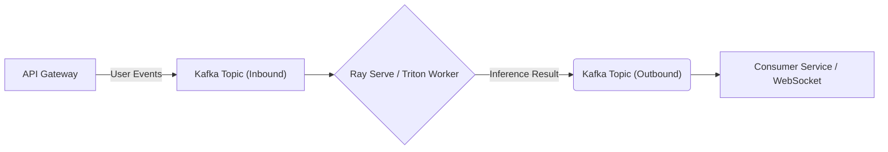

Khi một Data Scientist huấn luyện xong mô hình, họ thường nghĩ việc bọc nó bằng một API `FastAPI` và gọi `model.generate()` là hoàn tất. Tuy nhiên, trong môi trường Production với hàng nghìn Requests mỗi giây và giá thuê GPU A100 lên tới hàng chục nghìn đô la, **Model Serving (hay Inference Serving)** là một bài toán **Kiến trúc Hệ thống (System Architecture) & Quản lý Tài nguyên (Resource Management)** khốc liệt nhất của MLOps.

Đặc biệt trong kỷ nguyên Generative AI, khi Large Language Models (LLMs) yêu cầu bộ nhớ VRAM khổng lồ không chỉ cho Trọng số (Weights) mà còn cho Dữ liệu Ngữ cảnh (KV Cache), các kiến trúc API truyền thống sẽ sụp đổ ngay lập tức bởi **Internal Memory Fragmentation (Phân mảnh bộ nhớ trong)** và **OOMKilled (Tràn RAM)**.

Bài viết này đi sâu vào cách các Engine hiện đại như **vLLM**, **Triton Inference Server** và **Ray Serve** định hình lại kiến trúc Serving.

---

## 1. Phân loại Kiến trúc Inference (Serving Architectures)

Sự đánh đổi (Trade-off) cốt lõi trong mọi hệ thống Inference là **Throughput (Thông lượng - Số request/giây)** vs. **Latency (Độ trễ - Thời gian chờ của 1 request)**.

### 1.1. Batch Inference (Xử lý Lô Ngoại tuyến)
- **Use-case:** Chấm điểm tín dụng cho 10 triệu khách hàng mỗi đêm, hoặc phân loại hàng triệu hình ảnh.
- **Systemic Trade-off:** Không quan tâm đến Latency (Có thể mất 5 tiếng để chạy xong). Hệ thống sẽ gom data thành các lô (Batches) khổng lồ và nhồi vào GPU để đạt **Throughput tối đa (100% GPU Utilization)**.
- **Công cụ:** Apache Spark phân tán, Databricks, Ray Data.

### 1.2. Real-time Inference (Xử lý Thời gian thực)
- **Use-case:** Chatbot AI, Hệ thống gợi ý (Recommendation), Phát hiện gian lận (Fraud Detection).
- **Systemic Trade-off:** Phải trả kết quả trong vòng <200ms. Nếu chỉ xử lý 1 Request tại một thời điểm (Batch Size = 1), GPU sẽ bị "Đói dữ liệu" (Starvation) vì tốc độ tính toán của nó nhanh hơn tốc độ truyền dữ liệu từ CPU/RAM sang VRAM.

### 1.3. Streaming Inference (Event-Driven Architecture)
Để chống lại các "Cơn bão Traffic" (Traffic Spikes) làm sập Model Server, kiến trúc Production sử dụng Kafka hoặc Kinesis làm bộ đệm (Buffer).



---

## 2. Kỹ thuật Batching: Chìa Khóa của Thông Lượng

Không một kỹ sư hệ thống nào chạy thẳng mã PyTorch thô lên Production. Họ dùng các Engine tích hợp sẵn các thuật toán Batching.

### 2.1. Dynamic Batching (Gom Lô Động)
- Thay vì xử lý ngay khi Request đến, Server sẽ mở một **Delay Window** (Ví dụ: chờ tối đa 10ms). 
- Nó gom các Request nhỏ lẻ (User A, User B, User C) thành một Tensor Lớn `(Batch_Size=3)` và ném vào GPU 1 lần duy nhất. 
- *Kết quả:* Chịu hy sinh 10ms Latency để đổi lấy Throughput tăng gấp 5 lần.

### 2.2. Continuous Batching (Đặc Trị cho LLM)
Với LLM, văn bản được sinh ra từng Token một (Auto-regressive). Nếu dùng Batching truyền thống, GPU phải chờ Request dài nhất hoàn thành (Ví dụ sinh 1000 tokens) thì mới được giải phóng Batch, làm lãng phí tài nguyên của các Request ngắn (Sinh 5 tokens).
- **Continuous Batching (Iteration-level Scheduling):** Cho phép chèn Request mới vào Batch, hoặc đẩy Request đã xong ra khỏi Batch **ngay tại thời điểm sinh xong 1 Token**, mà không cần đợi cả Lô hoàn thành. Đây là kỹ thuật cốt lõi giúp các hệ thống Chatbot xử lý hàng ngàn User cùng lúc.

---

## 3. Kiến trúc vLLM: Giải mã PagedAttention & KV Cache

Khi phục vụ LLM, GPU VRAM lưu trữ 2 thứ:
1. **Model Weights:** Trọng số tĩnh (Cố định).
2. **KV Cache (Key-Value Cache):** Bộ nhớ động lưu lại bối cảnh của các Tokens đã sinh ra để tránh việc phải tính toán lại Attention từ đầu.

### Nỗi ám ảnh Phân Mảnh (Fragmentation) và OOM
Trong PyTorch truyền thống, KV Cache yêu cầu được phân bổ **Bộ Nhớ Liền Kề (Contiguous Memory)**. Ngay khi User bắt đầu chat, hệ thống phải "Đặt chỗ" (Pre-allocate) lượng VRAM tương đương với độ dài tối đa của câu trả lời (Ví dụ 4096 tokens).
- **Thực tế:** User chỉ yêu cầu trả lời câu *"Xin chào" (2 tokens)*. 
- **Hậu quả:** 4094 tokens bộ nhớ bị khóa chặt không ai được dùng. Hiện tượng này gọi là **Internal Fragmentation**, gây lãng phí tới 80% VRAM. Cụm GPU báo `OOMKilled` (Hết RAM) và từ chối phục vụ, dù RAM thật sự đang rất trống!

### Cuộc Cách Mạng: PagedAttention (Từ UC Berkeley)
**vLLM** ra đời và vay mượn khái niệm **Virtual Memory & Paging** của Hệ Điều Hành (OS).
- Nó chia KV Cache thành các "Trang" (Pages/Blocks), mỗi Block chứa số lượng token cố định (Ví dụ 16 tokens).
- Các Blocks này **KHÔNG CẦN** nằm liền kề trong VRAM vật lý.
- Một **Block Table** làm nhiệm vụ ánh xạ (Mapping) giữa Logical Tokens của User và Physical Blocks trong VRAM. Hệ thống chỉ cấp phát Block mới khi quá trình sinh Token thực sự cần đến.

=> **FinOps Impact:** PagedAttention giảm mức lãng phí VRAM xuống dưới **4%**. Điều này cho phép tăng Batch Size lên gấp 3-4 lần trên cùng 1 con GPU, tiết kiệm trực tiếp hàng chục nghìn đô hạ tầng.

### Tensor Parallelism (Cắt Lớp Mô hình)
Khi một Model quá lớn (Ví dụ LLaMA-3 70B nặng ~140GB) không thể nhét vừa 1 con GPU A100 (80GB). vLLM sử dụng **Tensor Parallelism (TP)** để "Cắt dọc" các ma trận trọng số, rải đều chúng lên 2 hoặc 4 con GPU. Khi tính toán, các GPU sẽ trao đổi dữ liệu với nhau qua mạng NVLink tốc độ siêu cao.

```bash
# Lệnh khởi chạy vLLM Production với PagedAttention và Tensor Parallelism
python3 -m vllm.entrypoints.openai.api_server \
    --model meta-llama/Llama-3-70B-Instruct \
    --gpu-memory-utilization 0.90 \
    --max-num-batched-tokens 8192 \
    --tensor-parallel-size 4 # Chia model lên 4 con GPU
```

---

## 4. Triton Inference Server: Hệ Sinh Thái Đa Mô Hình

Nếu hệ thống của bạn phức tạp - không chỉ có LLM mà còn Computer Vision (YOLO), Audio (Whisper), và Recommendation (DLRM) -> **NVIDIA Triton Inference Server** là giải pháp tối thượng.

Triton cho phép:
1. **Concurrent Execution:** Chạy đồng thời nhiều mô hình (Của PyTorch, ONNX, TensorRT) trên **CÙNG 1 con GPU**. Nó tự động lập lịch để các mô hình không dẫm chân lên nhau.
2. **Model Ensembles (Pipeline Pipeline):** Xây dựng DAG Workflow. Ví dụ: Input Audio -> Model Whisper (Speech-to-Text) -> Output Text -> Model LLaMA. Triton truyền dữ liệu giữa các Model trực tiếp trong không gian VRAM (Zero-copy), không hề copy về CPU hay gọi Network I/O, độ trễ gần như bằng 0.

---

## 5. Ray Serve: Điều Phối Phân Tán (Orchestration)

Khi công ty scale lên hàng trăm Model Endpoints, chạy trên hàng nghìn Node Kubernetes, bạn sẽ đối mặt với **Dependency Hell** (Model A cần PyTorch 1.13, Model B cần PyTorch 2.1).

**Ray Serve** (Công nghệ đằng sau OpenAI) là một Framework Orchestration cho phép bạn:
- Đóng gói Môi trường (Conda/Pip) cô lập cho *Từng Model Endpoint* ngay trên cùng một Cluster vật lý.
- Quản lý Scale-to-Zero (Giảm số Worker về 0 khi không có Traffic để tiết kiệm tiền) và Auto-scaling.
- Gọi các vLLM Worker hoặc Triton Worker từ xa như những hàm Python bình thường.

```python
import ray
from ray import serve
from fastapi import FastAPI

app = FastAPI()

@serve.deployment(num_replicas=2, ray_actor_options={"num_gpus": 1})
@serve.ingress(app)
class LLMDeployment:
    def __init__(self):
        # Khởi tạo vLLM Engine bên trong Ray Actor
        self.engine = initialize_vllm_engine()
        
    @app.post("/generate")
    async def generate[self, prompt: str]:
        return await self.engine.generate(prompt)

serve.run(LLMDeployment.bind())
```

---

## 6. Nguồn Tham Khảo (References)

1. **UC Berkeley Research:** [Efficient Memory Management for Large Language Model Serving with PagedAttention (vLLM Paper)](https://arxiv.org/abs/2309.06180)
2. **Anyscale Blog:** [Continuous Batching for LLM Inference](https://www.anyscale.com/blog/continuous-batching-llm-inference)
3. **NVIDIA Documentation:** [Triton Inference Server Architecture](https://github.com/triton-inference-server/server)
4. **Ray Serve Official Docs:** [Scalable and Programmable Model Serving](https://docs.ray.io/en/latest/serve/index.html)
