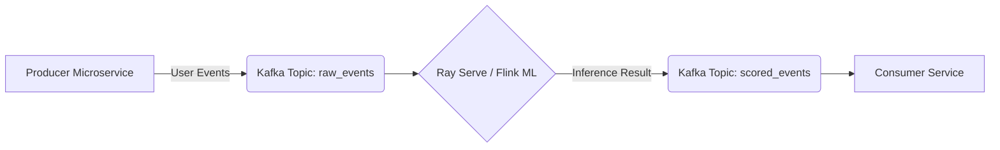

Model Serving (hay Inference Serving) không phải là việc viết một API FastAPI đơn giản bằng thư viện `transformers`. Trong môi trường Production với hàng triệu requests và GPU đắt đỏ, Model Serving là một bài toán **Distributed Systems & Resource Management**.

Đặc biệt trong kỷ nguyên Generative AI (LLMs), khi các mô hình có kích thước VRAM lên tới hàng chục, hàng trăm GB, những thách thức như **KV Cache Fragmentation**, **OOMKilled** (Out Of Memory), hay **Queueing Delays** diễn ra thường xuyên. 

Bài viết này sẽ đi sâu vào kiến trúc thực thi vật lý (Physical Execution) của các hệ thống Model Serving chuyên dụng như NVIDIA Triton, vLLM, và Ray Serve, kèm theo các bài toán tối ưu FinOps.

---

## 1. Phân loại Mô hình Kiến trúc Phục vụ (Serving Architectures)

Sự đánh đổi cốt lõi trong Inference là **Throughput (Thông lượng)** vs. **Latency (Độ trễ)**.

### 1.1. Batch (Offline) vs. Real-time (Online) Inference

- **Batch Inference (Offline)**: Đẩy toàn bộ dữ liệu qua mô hình trong một lô lớn (ví dụ: chấm điểm tín dụng 10 triệu user mỗi đêm bằng Apache Spark và MLflow).
  - *Systemic Trade-off*: Tối đa hóa Hardware Utilization (GPU Compute), Throughput cực cao. Latency có thể tính bằng giờ. Tiết kiệm chi phí (FinOps) bằng cách dùng Spot Instances (AWS) hoặc Preemptible VMs (GCP).
- **Real-time Inference (Online)**: Điển hình là Chatbot LLM, Fraud Detection, Recommendation Systems. Hệ thống nhận 1 request từ Client và phải trả về kết quả ngay.
  - *Systemic Trade-off*: Yêu cầu Low Latency (vài chục đến vài trăm ms). Nếu không có kỹ thuật tối ưu, Hardware Utilization sẽ cực kỳ thấp do việc tính toán từng `Batch Size = 1` làm GPU bị đói dữ liệu (*GPU Starvation*).

### 1.2. Streaming Inference (Event-Driven)
Thay vì dùng API Gateway đồng bộ (Synchronous), các hệ thống như Kafka hoặc Kinesis Data Streams sẽ điều phối Request.


- **Lợi ích vận hành:** Tự động *buffer* (đệm) các luồng traffic spikes hoặc Retry Storms, tránh làm sập Model Server. Tách rời (Decouple) hoàn toàn producer và AI worker.

---

## 2. Các Kỹ thuật Tối ưu Hóa Cốt Lõi (Core Optimizations)

Không một công ty công nghệ lớn nào chạy thẳng PyTorch/Transformers raw lên Production. Họ sử dụng các **Inference Engines** được tối ưu hóa như **TensorRT, ONNX Runtime, vLLM Engine**.

### 2.1. Dynamic Batching (Batching Động)
Với Real-time inference, để giải quyết vấn đề *GPU Starvation*, hệ thống dùng Dynamic Batching:
- **Nguyên lý:** Server lắng nghe trong một khoảng thời gian chờ siêu nhỏ (Delay Window, ví dụ: 5ms-10ms). Gom các request riêng lẻ (R1, R2, R3) thành một Tensor lớn `(Batch_Size=3, ...)` và đẩy vào GPU một lần duy nhất.
- **Trade-off:** Tăng Latency một chút (do tốn thời gian chờ gom) nhưng Throughput có thể tăng gấp 3 đến 10 lần.

### 2.2. Continuous Batching (LLM Specific)
Mô hình ngôn ngữ lớn (LLMs) sinh văn bản (Text Generation) bằng cách trả về từng token (Auto-regressive). Batching tĩnh truyền thống thất bại thảm hại vì các câu hỏi có độ dài câu trả lời khác nhau (R1 sinh ra 5 tokens, R2 sinh ra 100 tokens).

**Continuous Batching (Iteration-level Scheduling)** chèn thêm request mới hoặc đẩy request đã hoàn thành ra khỏi batch ngay tại cấp độ tạo ra 1 token (*token-level*), không cần đợi cả batch lớn xong. Kỹ thuật này giúp Utilization của GPU liên tục ở mức > 90%.

---

## 3. Quản trị Bộ nhớ LLM: Nỗi Ám Ảnh KV Cache & PagedAttention

Khi phục vụ LLM, GPU VRAM không chỉ lưu **Model Weights** (Trọng số). Một phần cực kỳ khổng lồ được dùng làm **KV Cache** (Key-Value Cache) lưu lại bối cảnh (context) các tokens đã tạo trước đó, tránh việc Model phải tính attention lại từ đầu.

**Vấn đề (Real-world Incident):** 
- Khi dùng PyTorch nguyên bản, KV Cache yêu cầu phân bổ **Contiguous Memory** (Bộ nhớ liền kề). Nghĩa là hệ thống phải "đặt chỗ" (allocate) lượng VRAM bằng với *Maximum Sequence Length* cho TẤT CẢ các request ngay từ đầu.
- **Hậu quả:** Gây ra **Internal Fragmentation (Phân mảnh bộ nhớ trong)** khổng lồ lên tới 60-80%. Cụm GPU báo lỗi `OOMKilled` (Hết bộ nhớ) hoặc từ chối phục vụ, mặc dù phần lớn VRAM thực tế đang hoàn toàn trống!

### Bước ngoặt: PagedAttention (vLLM Engine)

Để khắc phục, đội ngũ UC Berkeley tạo ra **vLLM** - vay mượn trực tiếp khái niệm **Virtual Memory & Paging** từ Hệ Điều Hành (OS). 


- **Nguyên lý:** Chia KV Cache thành các "Pages" (khối) có kích thước cố định (ví dụ chứa 16 tokens). Các blocks này KHÔNG cần nằm liền kề trong Physical VRAM. 
- Một **Block Table** làm nhiệm vụ map (ánh xạ) giữa Logical tokens của request sang Physical VRAM blocks. Hệ thống chỉ cấp phát block mới khi quá trình generation thực sự cần.
- **FinOps Impact:** Giảm Fragmentation xuống dưới 4%. Cho phép tăng kích thước Batch Size an toàn lên gấp 2-4 lần, tiết kiệm trực tiếp hàng ngàn đô la hạ tầng.

**Ví dụ Bash/Terraform khởi chạy vLLM Server trên Production:**
```bash
# Triển khai vLLM engine với Continuous Batching, PagedAttention và Tensor Parallelism
python3 -m vllm.entrypoints.openai.api_server \
    --model meta-llama/Llama-3-8B-Instruct \
    --gpu-memory-utilization 0.9 \
    --max-num-batched-tokens 8192 \
    --tensor-parallel-size 2 # Sharding model weights trên 2 GPUs
```

---

## 4. Triton Inference Server: Hệ Sinh Thái Đa Mô Hình (Multi-Model Serving)

Nếu kiến trúc AI của công ty bạn phức tạp - không chỉ có LLM mà còn Computer Vision (YOLOv8), Recommendation System (DLRM), Voice (Whisper) -> **NVIDIA Triton Inference Server** là tiêu chuẩn công nghiệp (De-facto Standard).


**Tại sao Data Engineers/MLOps chọn Triton?**
1. **Concurrent Model Execution:** Có thể tải đồng thời nhiều mô hình (PyTorch, TensorFlow, TensorRT) trên CÙNG một GPU vật lý. Triton tự động quản lý contention (xung đột) tài nguyên.
2. **Model Ensembles (Pipeline Pipeline in VRAM):** Cho phép build DAG workflow. *Ví dụ:* Output của mô hình Voice (Speech-to-Text) làm Input trực tiếp cho mô hình LLM. Triton xử lý truyền dữ liệu trực tiếp trong không gian bộ nhớ GPU (bằng C++), hoàn toàn không có Network I/O hay CPU Memory copy (Zero-copy).

**Code Thực Chiến: Cấu hình `config.pbtxt` kích hoạt Dynamic Batching trong Triton:**
```protobuf
name: "resnet50_tensorrt"
platform: "tensorrt_plan"
max_batch_size: 128
dynamic_batching {
  preferred_batch_size: [ 32, 64, 128 ]
  max_queue_delay_microseconds: 5000  # Đợi tối đa 5ms để gom batch
}
instance_group [
  {
    count: 2 # Chạy 2 instances (workers) của mô hình chạy song song trên 1 GPU
    kind: KIND_GPU
  }
]
```

---

## 5. Rủi Ro Vận Hành & Troubleshooting (Real-world Incidents)

1. **Thảm họa OOMKilled & Spiky Traffic:** 
   - *Incident:* Hệ thống đột ngột hứng 10,000 reqs/s. API worker đẩy toàn bộ xuống GPU. VRAM phình to (OOMKilled), container restart, downtime toàn hệ thống (Cascading Failure).
   - *Khắc phục:* Kiến trúc phải có hàng đợi (Queue) ở mức Framework (như Ray Serve hoặc Triton) với cờ giới hạn truy cập đồng thời (`max_concurrent_queries`). Phải cài đặt cơ chế HTTP 429 Rate Limiting hoặc Backpressure để từ chối khéo các request thừa thay vì làm sập toàn bộ Cụm.

2. **Nút thắt cổ chai "Cold Start" (Khởi động lạnh):**
   - *Incident:* Khi tải tăng, Kubernetes HPA scale up thêm Pod. Nhưng Pod kéo mô hình LLM nặng 40GB từ S3 qua mạng VPC mất tận 5 phút. Trong 5 phút đó, users gặp Timeout.
   - *Khắc phục:* 
     - Không lưu trọng số trên S3, hãy lưu trên hệ thống Shared File System tốc độ siêu cao gắn thẳng vào Cụm Kubernetes (như Amazon FSx for Lustre hoặc GCP Filestore).
     - Sử dụng công cụ `safetensors` thay vì Pickle `.pt` để kích hoạt Lazy Loading.

3. **Dependency Hell trong Microservices ML:**
   - *Incident:* Team CV dùng PyTorch 1.13, Team NLP dùng PyTorch 2.1. Cố nhồi chung vào một container gây ra Conflict thư viện.
   - *Khắc phục:* Sử dụng **Ray Serve**. Framework này cho phép đóng gói Environment (Conda/Pip) theo *từng Model Endpoint riêng biệt* trên cùng một cụm Cluster vật lý. Tránh hoàn toàn chuyện Conflict.

---

## Nguồn Tham Khảo (References)

* [vLLM: Easy, fast, and cheap LLM serving for everyone (vLLM Blog)](https://blog.vllm.ai/2023/06/20/vllm.html)
* [Efficient Memory Management for Large Language Model Serving with PagedAttention (arXiv:2309.06180)](https://arxiv.org/abs/2309.06180)
* [NVIDIA Triton Inference Server Architecture - Official Documentation](https://github.com/triton-inference-server/server/blob/main/docs/customization_guide/architecture.md)
* [Ray Serve: Scalable and Programmable Model Serving](https://docs.ray.io/en/latest/serve/index.html)
* [Netflix Technology Blog: Machine Learning Platform (Model Serving)](https://netflixtechblog.com/)
