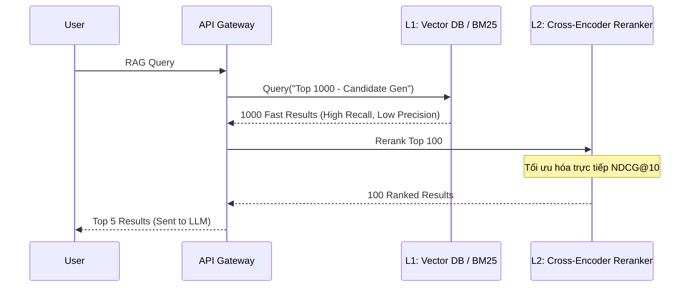

Trong lĩnh vực **Information Retrieval (IR)** và đặc biệt là hệ thống **Retrieval-Augmented Generation (RAG)** hiện đại, chất lượng của đoạn văn bản (Context) được truy xuất quyết định sự sống còn của câu trả lời cuối cùng. Không giống như Classification Models đo lường nhị phân bằng Precision/Recall, các hệ thống Ranking (Xếp hạng) đòi hỏi các thước đo nhạy bén với vị trí (Position-aware metrics). 

**NDCG (Normalized Discounted Cumulative Gain)** và **MRR (Mean Reciprocal Rank)** là hai thước đo chuẩn công nghiệp (Industry Standard) trong bài toán này. Tuy nhiên, khi chuyển từ Search Engine truyền thống (phục vụ con người) sang RAG (phục vụ LLMs), chúng ta phải đối mặt với một loạt các rủi ro hệ thống như **Position Bias** và **Lost in the Middle**.

---

## 1. MRR vs. NDCG: Sự khác biệt cốt lõi

### 1.1. MRR (Mean Reciprocal Rank)
- **Bản chất:** Tập trung duy nhất vào vị trí của tài liệu **ĐÚNG ĐẦU TIÊN** (First relevant document).
- **Công thức:** $\text{"MRR"} = \frac{"1"}{|Q|} \sum_{"i=1"}^{|Q|} \frac{"1"}{\text{"rank"}_i}$ (với $\text{"rank"}_i$ là thứ hạng của kết quả đúng đầu tiên).
- **Sử dụng khi:** Có một và chỉ một "câu trả lời đúng" duy nhất. (Ví dụ: "Thủ đô của Việt Nam là gì?"). Nó đòi hỏi tính nhị phân (Đúng/Sai).

### 1.2. NDCG (Normalized Discounted Cumulative Gain)
NDCG sinh ra để xử lý **Graded Relevance (Độ liên quan theo mức độ)**. Nó chấp nhận rằng có tài liệu "rất liên quan" (Điểm = 3), "hơi liên quan" (Điểm = 1), và "không liên quan" (Điểm = 0).
Toán học đằng sau NDCG chia làm 3 bước:
1.  **Cumulative Gain (CG):** Tổng điểm liên quan của tất cả tài liệu trả về. (Thiếu nhạy cảm với vị trí).
2.  **Discounted Cumulative Gain (DCG):** Phạt các tài liệu nằm ở vị trí sâu bằng hàm Logarit. Sự khác biệt giữa Top 1 và Top 2 lớn hơn rất nhiều so với Top 10 và 11. 
    $$DCG_p = \sum_{"i=1"}^{p} \frac{"2^{rel_i"} - 1}{\log_2(i + 1)}$$
3.  **Normalized DCG (NDCG):** Chuẩn hóa DCG bằng cách chia cho IDCG (Ideal DCG - giá trị lý tưởng nhất nếu các tài liệu được sắp xếp hoàn hảo giảm dần). Điều này giúp so sánh chất lượng Ranking giữa các truy vấn khác nhau.
- **Sử dụng khi:** Trong RAG, LLM thường cần tổng hợp thông tin từ NHIỀU tài liệu khác nhau. Do đó, NDCG vượt trội hơn MRR vì nó thưởng điểm cho hệ thống trả về được *càng nhiều* tài liệu liên quan ở top đầu càng tốt.

---

## 2. Thách thức trong RAG: Position Bias và "Lost in the Middle"

Các thước đo IR truyền thống (như NDCG) được thiết kế dựa trên hành vi của **Con người (Human Consumption)**: Người dùng đọc từ trên xuống dưới và sự chú ý giảm dần (Diminishing Attention) một cách tuyến tính/logarit.

Nhưng **LLMs (Machine Consumption)** không đọc như con người. LLM nạp toàn bộ Context Window vào ma trận Attention cùng một lúc.
- **Lost in the Middle:** Nghiên cứu chỉ ra rằng LLMs bị bias nặng nề vào các vị trí: Nó chú ý rất tốt vào tài liệu ở ĐẦU và CUỐI context, nhưng lại "quên" (hoặc giảm trọng số) các tài liệu nằm ở GIỮA.
- **Distractor Impact (Tác động của Rác):** Trong IR truyền thống, một tài liệu "rác" (Irrelevant) nằm ở Top 5 chỉ đơn giản là làm giảm NDCG. Nhưng trong RAG, tài liệu "rác" này bị nhồi vào LLM và có thể trực tiếp làm LLM bị Hallucination (ảo giác).

**Best Practice:** Đừng bao giờ đánh giá RAG chỉ bằng NDCG. Luôn ghép cặp Retrieval Metrics (NDCG, MRR) với **Generation Metrics** (Faithfulness, Answer Relevance, Groundedness) đo bằng các Framework như Ragas hay TruLens.

---

## 3. Kiến trúc Thực thi Vật lý (Physical Execution)

Trong các hệ thống phân tán, quá trình tìm kiếm không bao giờ đánh giá toàn bộ kho dữ liệu hàng tỷ records bằng một AI Model nặng nề. Thay vào đó, hệ thống sử dụng thiết kế **Two-Stage Retrieval (Truy xuất 2 giai đoạn)** để cân bằng giữa NDCG và Latency.



1. **L1 - Candidate Generation (Lọc thô):** Sử dụng Inverted Index (Elasticsearch BM25) hoặc HNSW Vector Index (Milvus, Pinecone). Giai đoạn này đề cao Recall (Lấy ra 1000 tài liệu càng nhanh càng tốt, chi phí cực rẻ).
2. **L2 - Reranking (Tái xếp hạng):** Chạy LLM Cross-Encoders (như Cohere Rerank, BGE-Reranker) trên Top 100 kết quả từ L1. Cross-Encoder vô cùng chậm và tốn GPU, nhưng mang lại điểm NDCG cao nhất.

---

## 4. Thực chiến: Tính toán NDCG quy mô lớn với PySpark

Data Engineers không tính NDCG cho một query. Chúng ta tính nó cho hàng triệu logs (Clickstream data/RAG trace logs) mỗi ngày. Chạy vòng lặp `for` trên Pandas sẽ gây OOM (Out of Memory). Hãy dùng Window Functions của PySpark.

```python
from pyspark.sql import SparkSession
from pyspark.sql.window import Window
import pyspark.sql.functions as F

spark = SparkSession.builder.appName("NDCG_Pipeline").getOrCreate()

# Schema: query_id, document_id, relevance_score (từ human label hoặc LLM-as-a-Judge)
df = spark.read.parquet("s3://data-lake/rag-logs/date=2026-06-26/")

# Window mô hình: sắp xếp theo thứ hạng mô hình dự đoán (model_rank)
window_model = Window.partitionBy("query_id").orderBy(F.col("model_rank").asc())

# Window lý tưởng (Ideal): sắp xếp giảm dần theo relevance_score
window_ideal = Window.partitionBy("query_id").orderBy(F.col("relevance_score").desc())

K = 10 # Tính NDCG@10

def calculate_dcg(rank_col):
    # Áp dụng công thức (2^rel - 1) / log2(rank + 1)
    return (F.pow(2, F.col("relevance_score")) - 1) / F.log2(rank_col + 1)

df_metrics = df.withColumn("model_pos", F.row_number().over(window_model)) \
               .withColumn("ideal_pos", F.row_number().over(window_ideal)) \
               .filter(F.col("model_pos") <= K) \
               .withColumn("dcg_val", calculate_dcg(F.col("model_pos"))) \
               .withColumn("idcg_val", calculate_dcg(F.col("ideal_pos")))

# Tổng hợp tính NDCG
ndcg_df = df_metrics.groupBy("query_id").agg(
    (F.sum("dcg_val") / F.sum("idcg_val")).alias("ndcg_at_10")
).fillna(0.0) # Handle ZeroDivisionError cho các query không có IDCG

ndcg_df.show(5)
```

---

## 5. Rủi ro Vận hành (Operational Risks) & Troubleshooting

Trong thực tế, triển khai một pipeline L1-L2 Reranking tiềm ẩn nhiều rủi ro sập hệ thống (System Outage). 

### 5.1. OOMKilled do Cartesian Explosion ở Giai đoạn L2
- **Triệu chứng (Incident):** Container của L2 (Reranker) liên tục bị Crash/OOMKilled, P99 Latency tăng vọt lên 5000ms.
- **Root Cause:** Hệ thống L1 bị lỏng lẻo trả về quá nhiều Candidates (ví dụ: truy vấn quá chung chung, ném 5,000 documents sang L2 thay vì 100). Reranker sử dụng GPU/CPU để cross-encode tất cả các cặp `(query, document)`. Độ phức tạp tính toán bị kích nổ bùng phát, dẫn tới cạn kiệt RAM và bị Kernel bắn tín hiệu `SIGKILL`.
- **Troubleshooting:** Áp dụng **Hard Limit** (ví dụ: `top_k=100` bắt buộc cho L2) và sử dụng **Circuit Breakers**. Nếu kích thước payload từ L1 vượt quá threshold, bỏ qua L2 và trả về thẳng kết quả L1 (Degraded State) để bảo vệ Availability (Tính sẵn sàng).

### 5.2. Hiện tượng Hồi quy (Model Regression) do "Missing Labels"
- **Triệu chứng:** Triển khai Reranker bằng Vector DB mới, NDCG rớt thê thảm trên Dashboard nhưng Business Metrics [Conversion Rate] lại tăng.
- **Nguyên nhân:** Tập đánh giá (Judgment list) thiếu nhãn (Unjudged Documents). Vector DB tìm ra các tài liệu ngữ nghĩa rất xuất sắc nhưng hệ thống chưa từng ghi nhận điểm (mặc định $rel=0$). Trong khi đó hệ thống cũ (Keyword Match) chỉ trả ra các tài liệu cũ đã được gán nhãn sẵn $rel=3$. Mô hình mới bị NDCG phạt oan.
- **Khắc phục:** Theo dõi chỉ số **Unjudged Rate**. Nếu quá lớn, dừng so sánh NDCG Offline ngay lập tức và chuyển sang đánh giá A/B Testing Online hoặc dùng LLM-as-a-Judge để tự động chấm điểm bù các Unjudged Documents.

---

## 6. Systemic Trade-offs & FinOps (Tối ưu Chi phí)

Tối ưu hóa NDCG luôn đòi hỏi sự đánh đổi khốc liệt:

- **NDCG vs. Latency:** Đẩy lượng tài liệu vào L2 Reranker từ 100 lên 1,000 sẽ giúp tăng NDCG@10 thêm khoảng 2%. Tuy nhiên, P99 Latency sẽ tăng gấp 10 lần (từ 50ms lên 500ms). Trong E-commerce/RAG, độ trễ sinh ra luồng sập (Timeout). *Trade-off: Phải giới hạn Window Size của Reranker ở mức an toàn.*
- **FinOps Optimization:** Chạy Cross-Encoders trên GPU Nvidia A10G rất đắt. Để cắt giảm tới 60% Cloud Bill:
  1. Dùng **Semantic Caching** (Redis) cho 60% truy vấn đuôi dài (Power Law).
  2. Sử dụng các mô hình đã lượng tử hóa (Quantized INT8) như `bge-reranker-v2-m3` hoặc compile qua ONNX Runtime để chạy trực tiếp trên các CPU Instances (như AWS Graviton3 `c7g`) thay vì dùng GPU đắt đỏ.

---

## Nguồn Tham Khảo (References)
*   **Manning, Raghavan, Schütze - Introduction to Information Retrieval** (Chương 8: Đánh giá trong IR - Sách gối đầu giường của mọi Kỹ sư Search). 
*   **Netflix TechBlog:** [Offline Evaluation of Ranking][https://netflixtechblog.com/]
*   **Stanford NLP:** [Lost in the Middle: How Language Models Use Long Contexts][https://arxiv.org/abs/2307.03172]
*   **Ragas Documentation:** [RAG Evaluation Framework Metrics][https://docs.ragas.io/]
*   **Pinecone:** [Two-Stage Retrieval & Reranking Architecture](https://www.pinecone.io/learn/series/rag/rerankers/]
