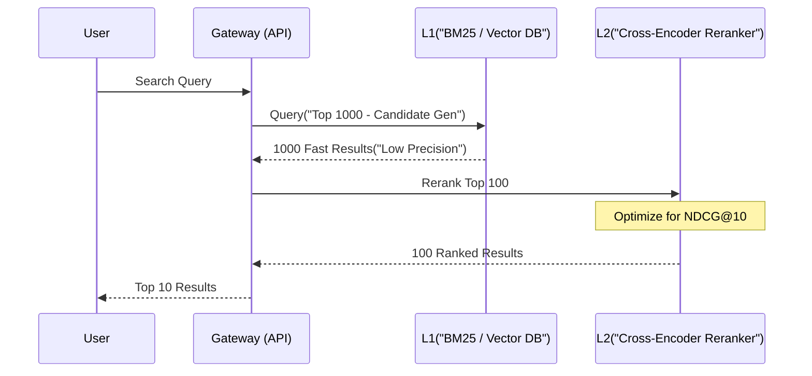

NDCG (Normalized Discounted Cumulative Gain) là thước đo chuẩn công nghiệp (industry standard) để đánh giá chất lượng của các hệ thống Xếp hạng (Ranking) như Search Engine, Recommender Systems và pipeline RAG (Retrieval-Augmented Generation). Không giống như Precision hay Recall chỉ quan tâm đến tính nhị phân (Đúng/Sai), NDCG trừng phạt nặng nề (penalize) các hệ thống trả về kết quả liên quan ở vị trí thấp. 

Trong thực tế vận hành tại các công ty lớn (Netflix, Spotify, Amazon), việc tối ưu NDCG không chỉ là một bài toán Toán học mà là một bài toán Hệ thống (Systems Engineering) đi kèm với những đánh đổi khốc liệt về Latency, Compute Cost và Memory.

---

## Kiến trúc Thực thi Vật lý (Physical Execution)

Trong các hệ thống phân tán, quá trình tìm kiếm không bao giờ đánh giá toàn bộ kho dữ liệu bằng một model nặng nề. Thay vào đó, hệ thống sử dụng thiết kế **Two-Stage Retrieval (Truy xuất 2 giai đoạn)** để cân bằng giữa NDCG và Latency.



1. **L1 - Candidate Generation (Lọc thô):** Sử dụng Inverted Index (BM25) hoặc HNSW Vector Index (OpenSearch, Pinecone). Giai đoạn này đề cao Recall (lấy ra 1000-2000 tài liệu nhanh nhất có thể).
2. **L2 - Reranking (Tái xếp hạng):** Chạy Learning-to-Rank (LTR) bằng XGBoost (LambdaMART) hoặc LLM Cross-Encoders (như Cohere Rerank) trên Top 100 kết quả từ L1 để tối ưu hóa trực tiếp điểm NDCG.

*(Tham khảo kiến trúc mẫu:* `` *)*

---

## Bản chất Toán học đằng sau NDCG

Dưới góc nhìn toán học, NDCG chia vấn đề thành 3 lớp:

1. **Cumulative Gain (CG):** Tổng điểm liên quan của tất cả tài liệu trả về. (Thiếu nhạy cảm với vị trí).
2. **Discounted Cumulative Gain (DCG):** Phạt các tài liệu liên quan nằm ở vị trí sâu bằng hàm Logarit. Sự khác biệt giữa Top 1 và Top 2 lớn hơn rất nhiều so với Top 10 và Top 11. 
   $$DCG_p = \sum_{i=1}^{p} \frac{2^{rel_i} - 1}{\log_2(i + 1)}$$
3. **Normalized DCG (NDCG):** Chuẩn hóa DCG bằng cách chia cho IDCG (Ideal DCG - giá trị lý tưởng nhất nếu các tài liệu được sắp xếp hoàn hảo). Điều này giúp so sánh chất lượng Ranking giữa các truy vấn khác nhau (vì có truy vấn dễ, có truy vấn khó).

---

## Show, Don't Tell: Thực thi Pipeline NDCG

### 1. Tính toán Offline NDCG ở quy mô lớn (PySpark)

Data Engineers không tính NDCG cho một query. Chúng ta tính nó cho hàng triệu logs (Clickstream data) mỗi ngày. Chạy vòng lặp `for` trên Pandas sẽ gây ra hiện tượng OOM (Out of Memory) hoặc chạy mất nhiều ngày. Thay vào đó, hãy dùng Window Functions của PySpark.

```python
from pyspark.sql import SparkSession
from pyspark.sql.window import Window
import pyspark.sql.functions as F

spark = SparkSession.builder.appName("NDCG_Pipeline").getOrCreate()

# Schema giả định: query_id, document_id, relevance_score (từ human label hoặc click)
df = spark.read.parquet("s3://data-lake/search-logs/date=2026-06-26/")

# Window phân cụm theo query_id, sắp xếp theo thứ hạng mô hình dự đoán
window_model = Window.partitionBy("query_id").orderBy(F.col("model_rank").asc())

# Window lý tưởng (Ideal), sắp xếp giảm dần theo relevance_score
window_ideal = Window.partitionBy("query_id").orderBy(F.col("relevance_score").desc())

# Tính DCG và IDCG với K=10
K = 10

def calculate_dcg(rank_col):
    return (F.pow(2, F.col("relevance_score")) - 1) / F.log2(rank_col + 1)

df_metrics = df.withColumn("model_pos", F.row_number().over(window_model)) \
               .withColumn("ideal_pos", F.row_number().over(window_ideal)) \
               .filter(F.col("model_pos") <= K) \
               .withColumn("dcg_val", calculate_dcg(F.col("model_pos"))) \
               .withColumn("idcg_val", calculate_dcg(F.col("ideal_pos")))

# Aggregation
ndcg_df = df_metrics.groupBy("query_id").agg(
    (F.sum("dcg_val") / F.sum("idcg_val")).alias("ndcg_at_10")
).fillna(0.0) # Handle ZeroDivisionError

ndcg_df.show(5)
```

### 2. Triển khai OpenSearch với LTR (Terraform)

Để tích hợp LTR đánh giá NDCG vào production, bạn cần cấu hình OpenSearch cluster thông qua Terraform. 

```hcl
resource "aws_opensearch_domain" "search_cluster" {
  domain_name           = "prod-search-ltr"
  engine_version        = "OpenSearch_2.11"

  cluster_config {
    instance_type          = "r6g.2xlarge.search" # RAM-heavy instances cho Inverted Index
    instance_count         = 5
    zone_awareness_enabled = true
  }

  advanced_options = {
    "rest.action.multi.allow_explicit_index" = "true"
    # Tuning cache size để chống tràn RAM khi rank
    "indices.queries.cache.size"             = "15%" 
  }

  ebs_options {
    ebs_enabled = true
    volume_size = 500
    volume_type = "gp3"
    iops        = 3000 # Critical for High Throughput read
  }
}
```

---

## Rủi ro Vận hành (Operational Risks) & Troubleshooting

Trong thực tế, triển khai một pipeline tối ưu NDCG tiềm ẩn nhiều rủi ro sập hệ thống. 

### 1. OOMKilled do Cartesian Explosion ở Giai đoạn L1
- **Triệu chứng:** Container của L2 (Reranker) liên tục bị Crash/OOMKilled, P99 Latency tăng vọt lên 5000ms.
- **Nguyên nhân (Root Cause):** Hệ thống L1 trả về quá nhiều Candidates (ví dụ: truy vấn quá chung chung như "áo", trả về 100,000 documents thay vì 1,000). Reranker sử dụng GPU/CPU để cross-encode tất cả các cặp `(query, document)`. Độ phức tạp là $O(N)$ nhưng với BERT base, mỗi phép toán tốn kém vô cùng, dẫn tới tràn RAM.
- **Giải pháp (Troubleshooting):** Áp dụng Hard Limit (ví dụ: `size=500` cho L1) và sử dụng Circuit Breakers. Nếu kích thước payload từ L1 vượt quá threshold, bỏ qua L2 và trả về thẳng kết quả L1 (Degraded State) để bảo vệ Availability.

### 2. Hiện tượng "Missing Labels" và Hồi quy NDCG (Model Regression)
- **Triệu chứng:** NDCG rớt thê thảm trên Dashboard nhưng Business Metrics (Conversion Rate, Clicks) lại tăng.
- **Nguyên nhân:** Tập đánh giá (Judgment list) thiếu nhãn (Unjudged Documents). Reranker mới (Dùng Semantic Search) tìm ra các tài liệu rất xuất sắc nhưng chưa từng được con người đánh giá (mặc định $rel=0$). Trong khi đó Reranker cũ (Keyword Match) chỉ trả ra các tài liệu cũ đã được gán nhãn $rel=3$. Do đó, mô hình mới bị NDCG phạt oan.
- **Giải pháp:** Theo dõi chỉ số **Unjudged Rate**. Nếu > 10%, dừng so sánh NDCG ngay lập tức và chuyển sang đánh giá A/B Testing Online (Interleaving).

---

## Systemic Trade-offs: Latency vs. Throughput vs. Relevance

Tối ưu hóa NDCG luôn đòi hỏi sự đánh đổi (Trade-off):

- **NDCG vs. Latency:** Tăng số lượng tài liệu đẩy vào L2 Reranker (Ví dụ: Rerank top 1000 thay vì Top 100) sẽ giúp tăng NDCG@10 thêm khoảng 2-3%. Tuy nhiên, P99 Latency sẽ tăng gấp 10 lần (từ 50ms lên 500ms). Trong e-commerce, trễ 100ms làm giảm 1% doanh thu. *Trade-off: Phải giới hạn Window Size của Reranker ở mức an toàn.*
- **Cross-Encoder vs Bi-Encoder:** Bi-Encoder (so sánh Vector Cosine) cho phép pre-compute offline, cực kỳ nhanh (Latency tính bằng microsecond), throughput lớn nhưng NDCG thấp. Cross-Encoder (cấp query và document cùng lúc vào Transformers) có NDCG cao nhất nhưng Latency rất lớn và không thể pre-compute. *Trade-off: Dùng Bi-Encoder cho L1 và Cross-Encoder cho L2.*

---

## Tối ưu Chi phí (FinOps)

Chạy LLM Rerankers để đua top NDCG trên mọi truy vấn sẽ đốt sạch ngân sách hạ tầng (Cloud Bill).
1. **Semantic Caching:** Khoảng 60-70% lượng Search Queries tuân theo phân phối đuôi dài (Power Law / Pareto). Sử dụng Redis hoặc Elasticache để cache kết quả đã rerank của các truy vấn phổ biến. 
2. **CPU-Optimized Rerankers:** Chạy Cross-Encoders trên GPU rất đắt (Nvidia A10G/T4). Có thể sử dụng các mô hình nhỏ (như `bge-reranker-v2-m3` hoặc LightGBM/XGBoost LambdaMART) đã được lượng tử hóa (Quantized INT8) hoặc compile qua ONNX Runtime để chạy trực tiếp trên CPU instances (như AWS Graviton3 `c7g`), tiết kiệm tới 60% chi phí.

---

## Nguồn Tham Khảo (References)

1. [Netflix TechBlog: Offline Evaluation of Ranking](https://netflixtechblog.com) - Mổ xẻ cách Netflix dùng NDCG để đánh giá recommendation systems.
2. [Spotify Engineering: Evaluating Personalization](https://engineering.atspotify.com) - Ứng dụng NDCG vào bài toán Home screen.
3. [AWS Machine Learning Blog: OpenSearch Learning to Rank](https://aws.amazon.com/blogs/machine-learning) - Giải pháp kiến trúc chi tiết cho L1-L2 ranking pipeline.
4. [Manning, Raghavan, Schütze - Introduction to Information Retrieval](https://nlp.stanford.edu/IR-book/pdf/08eval.pdf) - Chương 8: Đánh giá trong IR (Sách gối đầu giường của mọi Data Engineer). 
5. Cấu hình Terraform tham khảo từ tài liệu chính thức của [Terraform AWS Provider (OpenSearch)](https://registry.terraform.io/providers/hashicorp/aws/latest/docs/resources/opensearch_domain).
