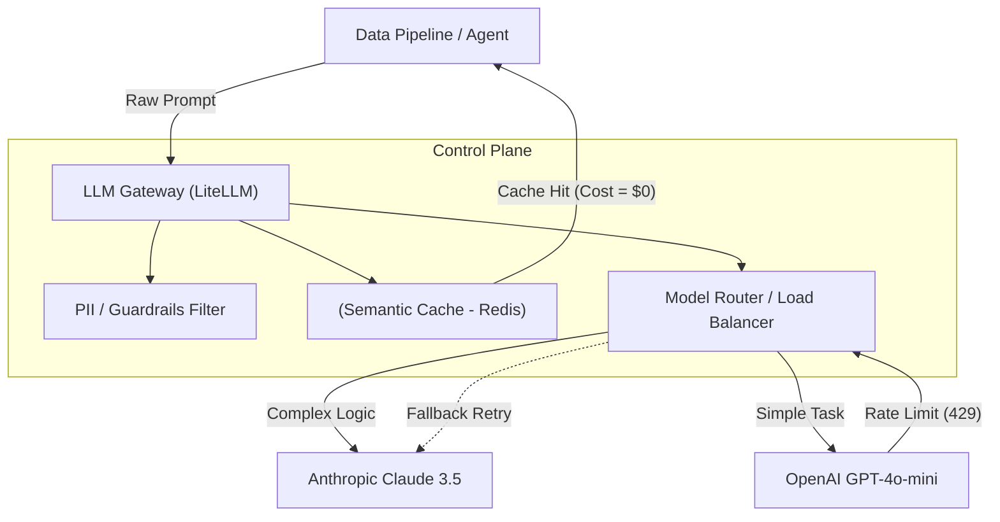

Khi phát triển ứng dụng GenAI trên máy cá nhân, việc bạn ngồi tinh chỉnh các chuỗi văn bản (*"Act as a Data Engineer..."*) có thể đem lại kết quả tốt. Tuy nhiên, khi hệ thống cần xử lý hàng triệu Requests mỗi ngày, **Prompt Engineering (Kỹ nghệ Gợi ý) không còn là nghệ thuật giao tiếp với AI, mà nó chuyển hoàn toàn sang bài toán Kiến trúc Phân tán (Distributed System Architecture) và Tối ưu hoá Đo lường được (Empirical Optimization).**

Là một System/Data Engineer, mục tiêu của bạn là xây dựng Data Pipeline tích hợp LLM chạy ổn định, không bị sập bởi *Rate Limit*, kiểm soát ảo giác (Hallucination) thông qua kỹ thuật ép kiểu dữ liệu (Structured Outputs), và tối ưu hoá chi phí (FinOps) thông qua *Prompt Caching*.

Bài viết này sẽ mổ xẻ cấu trúc vật lý của hệ thống Prompt Engineering, từ tầng Gateway đến các khung suy luận nâng cao như Chain-of-Thought và ReAct.

---

## 1. Các Khung Suy Luận (Reasoning Frameworks): CoT & ReAct

Đằng sau một câu Prompt tốt không phải là từ vựng trau chuốt, mà là sự định hướng luồng tư duy cho Model. Hai công trình nghiên cứu định hình Generative AI hiện đại là **Chain of Thought** và **ReAct**.

### 1.1. Chain-of-Thought (CoT) Prompting
Được giới thiệu bởi Google Research (Wei et al., 2022), **Chain of Thought (Chuỗi Suy luận)** chứng minh rằng LLM có thể giải quyết các bài toán Toán học hay Logic phức tạp nếu nó được ép phải sinh ra các bước suy luận trung gian (Intermediate reasoning steps) trước khi đưa ra câu trả lời cuối cùng.

- **Vấn đề của Standard Prompt:** Hỏi "Bóng đèn nào sáng nhất?" -> LLM đưa ra kết quả sai ngay lập tức vì thiếu không gian tư duy.
- **Sức mạnh của CoT:** Chỉ bằng cách thêm câu thần chú *"Let's think step by step"* (Hoặc cung cấp 1-2 ví dụ có kèm lời giải chi tiết), LLM sẽ tự động phân rã bài toán, đánh giá từng dữ kiện, trước khi kết luận. Đây cũng là nền tảng cốt lõi của dòng mô hình **OpenAI o1/o3** (Được huấn luyện bằng Reinforcement Learning để sinh ra các CoT ẩn khổng lồ trước khi trả lời).

### 1.2. ReAct (Reasoning and Acting)
Mặc dù CoT rất mạnh, nhưng nó bị "Mù" (Blind). LLM chỉ suy luận dựa trên kiến thức tĩnh đã học, dễ dẫn đến Ảo giác (Hallucination) hoặc Lỗi rẽ nhánh (Error Propagation). 
Năm 2023, nghiên cứu **ReAct** (Yao et al.) ra đời, kết hợp **Reasoning (Suy luận)** và **Acting (Hành động)**.

- LLM không chỉ suy nghĩ *"Tôi cần làm gì tiếp theo?"* mà nó còn sinh ra các Lệnh gọi API (Action: Search Wikipedia, Query Database).
- Hệ thống thực thi Lệnh đó, trả kết quả (Observation) về cho LLM. LLM lại tiếp tục suy luận (Thought) trên kết quả vừa nhận được.
- Cơ chế vòng lặp `Thought -> Action -> Observation` này là nền tảng của mọi hệ thống Agentic AI hiện đại (Như LangChain Agents).

---

## 2. Kiến trúc LLM Gateway (Control Plane)

Trong Production, các Microservices **không bao giờ** được phép gọi trực tiếp đến API của OpenAI hay Anthropic. Thay vào đó, tất cả requests phải đi qua một lớp Proxy Trung gian gọi là **LLM Gateway** (Ví dụ: LiteLLM, Kong AI Gateway).

LLM Gateway đóng vai trò như một Control Plane quản lý toàn bộ luồng Prompt:
- **Model Routing (Điều phối Model):** Điều hướng các prompts dễ (Dịch thuật) sang model rẻ tiền (GPT-4o-mini), và prompts cần suy luận phức tạp (ReAct) sang model đắt tiền (Claude 3.5 Sonnet).
- **Prompt Injection Guardrails:** Tự động chèn System Prompt bảo mật của công ty vào mọi Request, chặn các cuộc tấn công Prompt Injection.
- **Semantic Caching:** Lưu trữ Cache ngữ nghĩa trên Redis để trả lời lại các câu hỏi tương tự mà không tốn tiền gọi API.



### Cấu hình LiteLLM YAML Thực chiến
Thay vì nhúng logic lằng nhằng trong Code, ta dùng Declarative Configuration (YAML) để điều phối LLM:

```yaml
# litellm_config.yaml
model_list:
  - model_name: gpt-4o
    litellm_params:
      model: openai/gpt-4o
      api_key: os.environ/OPENAI_API_KEY
  - model_name: claude-3-5
    litellm_params:
      model: anthropic/claude-3-5-sonnet-20240620

router_settings:
  routing_strategy: usage-based-routing
  fallback_models: ["gpt-4o", "claude-3-5"]
  num_retries: 3           # Chống Retry Storms
  timeout: 30              # Cắt request nếu Latency > 30s
  redis_host: "localhost"
  cache: True              # Kích hoạt Semantic Caching
```

---

## 3. Lập trình Khai báo với DSPy (Declarative Prompting)

Hạn chế lớn nhất của Prompt Engineering truyền thống là **Sự mong manh (Fragility)**. Khi bạn nâng cấp từ LLaMA 2 lên LLaMA 3, toàn bộ những câu Prompt bạn "Mát-xa" bằng tay trước đó có thể mất tác dụng hoàn toàn.

**DSPy (Từ Stanford NLP)** sinh ra để thay đổi mô hình này: **Thay vì viết chuỗi Prompt, bạn lập trình các Module Suy luận.**

Trong DSPy, bạn không viết: *"Bạn là một chuyên gia. Hãy trích xuất thực thể..."*. Bạn chỉ khai báo **Input (Đầu vào)** và **Output (Đầu ra)**. Sau đó, Optimizer (Bộ tối ưu hóa) của DSPy sẽ chạy qua tập dữ liệu mẫu (Dataset) của bạn, đánh giá kết quả, và **tự động biên dịch (Compile) ra câu Prompt Few-shot hoàn hảo nhất cho Model hiện tại**.

```python
import dspy

# 1. Khai báo LLM
turbo = dspy.OpenAI(model='gpt-4o-mini')
dspy.settings.configure(lm=turbo)

# 2. Khai báo Signature (Mục đích cốt lõi thay vì Prompt dài dòng)
class ExtractData(dspy.Signature):
    """Trích xuất danh sách các công nghệ từ Cloud Architecture Logs."""
    log_text = dspy.InputField(desc="Văn bản mô tả hệ thống")
    technologies = dspy.OutputField(desc="Danh sách công nghệ (list of strings)")

# 3. Định nghĩa Module suy luận với Chain-of-Thought
class TechExtractor(dspy.Module):
    def __init__(self):
        super().__init__()
        # DSPy tự động ép mô hình suy luận CoT trước khi trả kết quả
        self.prog = dspy.ChainOfThought(ExtractData)
        
    def forward(self, text):
        return self.prog(log_text=text)

# 4. Khi dùng trên Production (Sau khi Compile)
extractor = TechExtractor()
result = extractor(text="Dịch vụ EKS gửi message qua MSK, sau đó load vào Redshift.")
print[result.technologies]
# KẾT QUẢ: ['Amazon EKS', 'Amazon MSK', 'Amazon Redshift']
```

---

## 4. Rủi ro Vận hành (Operational Risks) & Khắc phục

Khi đưa LLM vào Data Pipeline (Ví dụ: Chấm điểm 1 triệu Review của người dùng mỗi đêm), những sự cố phân tán sau chắc chắn sẽ xảy ra:

### 4.1. Rách Lược Đồ Dữ Liệu (Schema Fragmentation)
- **Sự cố:** Pipeline (Ví dụ Airflow) mong đợi LLM trả về đúng chuẩn JSON. Nhưng LLM bị Ảo giác và chèn thêm câu *"Chắc chắn rồi, đây là kết quả của bạn: {JSON}"*. Hành động này làm sập toàn bộ Parser của Data Warehouse.
- **Khắc phục:** Tuyệt đối không dùng Prompt để ép định dạng JSON. Hãy sử dụng tính năng **Structured Outputs** ở cấp độ API (Của OpenAI) kết hợp với **Pydantic Models** để ép LLM trả về đúng Schema 100%.

### 4.2. Context Window Overflow (Tràn Bộ Nhớ Ngữ Cảnh)
- **Sự cố:** Trong hệ thống RAG, Developer nhồi 50 trang tài liệu PDF vào Prompt để LLM đọc. Điều này làm Token vượt giới hạn (Ví dụ >128k Tokens), khiến Request bị huỷ (Truncated) hoặc gây tràn VRAM (OOMKilled) nếu dùng LLM cục bộ. Hơn nữa, Latency (Độ trễ) sẽ tăng lên hàng phút.
- **Khắc phục:** Sử dụng thuật toán **Re-ranking (Cross-Encoder)** trong Pipeline RAG để chỉ chọn lọc Top 3 đoạn văn bản mang tính quyết định nhất nhét vào Prompt. 

### 4.3. Bão Thử Lại (Retry Storms) & Rate Limit 429
- **Sự cố:** Khi gọi API của OpenAI và gặp lỗi HTTP 429 (Too Many Requests). Nếu Code của bạn dùng vòng lặp `while True` để Retry ngay lập tức, hàng ngàn Thread đang chạy song song sẽ tạo ra một "Cơn bão Retry" đánh gục mọi hạn mức (Quota) còn sót lại của hệ thống.
- **Khắc phục:** 
  1. Sử dụng thuật toán **Exponential Backoff with Jitter** (Lùi bước theo hàm mũ có thêm độ nhiễu ngẫu nhiên) khi Retry.
  2. Dùng Fallback Models trên LLM Gateway (Tự động switch sang AWS Bedrock nếu OpenAI bị sập).

---

## 5. Tối ưu Chi phí (FinOps) với Prompt Caching

Trong các hệ thống Agentic AI (AI tự động suy luận nhiều bước ReAct), System Prompt và Context (Ví dụ: Một cuốn cẩm nang công ty dài 50,000 Tokens) thường được gửi đi gửi lại hàng chục lần trong một phiên làm việc. Chi phí sẽ cực kỳ khủng khiếp nếu tính tiền cho toàn bộ 50,000 Tokens đó mỗi lần gọi.

**Prompt Caching** (Ví dụ: Anthropic Context Caching) là một cuộc cách mạng FinOps. Nó cho phép nhà cung cấp "Lưu trữ" phần đầu của Prompt [System Prompt + Long Context]. Khi Agent gọi API lần thứ 2, bạn chỉ phải trả tiền cho đoạn lệnh mới thêm vào ở đuôi. Giá thành giảm tới 90% và độ trễ (Latency) giảm từ 10s xuống còn <1s.

---

## 6. Nguồn Tham Khảo (References)
1. **Google Research:** [Chain-of-Thought Prompting Elicits Reasoning in Large Language Models (Arxiv)](https://arxiv.org/abs/2201.11903)
2. **Princeton University:** [ReAct: Synergizing Reasoning and Acting in Language Models (Arxiv)](https://arxiv.org/abs/2210.03629)
3. **Stanford NLP:** [DSPy: Compiling Declarative Language Model Calls (Arxiv)](https://arxiv.org/abs/2310.03714)
4. **OpenAI:** [Structured Outputs Architecture](https://platform.openai.com/docs/guides/structured-outputs)
5. **Anthropic:** [Prompt Caching Mechanism](https://docs.anthropic.com/en/docs/build-with-claude/prompt-caching)
