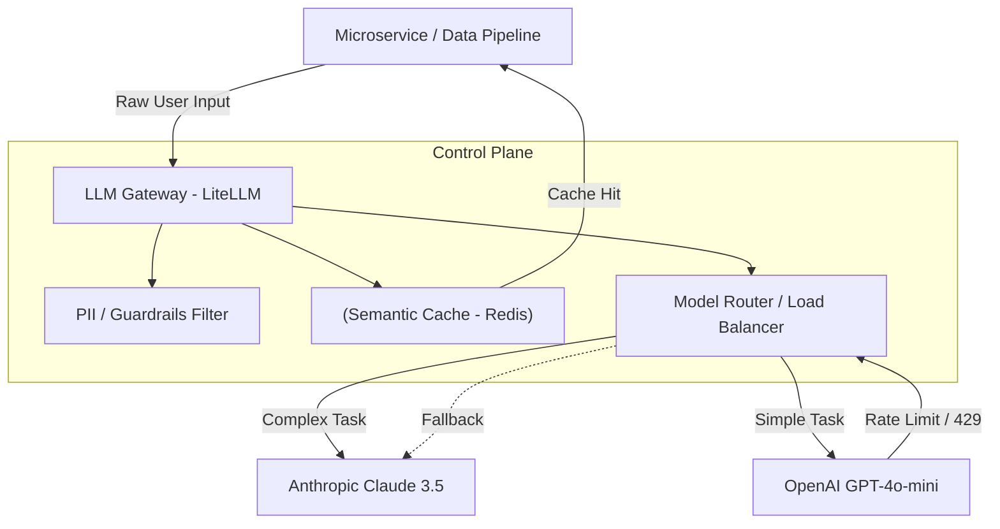
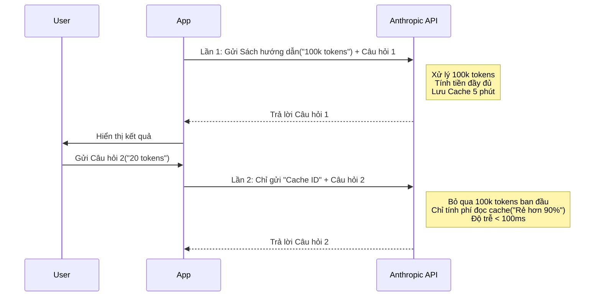

Khi phát triển ứng dụng AI cục bộ, việc bạn liên tục tinh chỉnh các chuỗi văn bản ("Act as a Data Engineer...") và thêm vào các câu lệnh (Zero-shot, Few-shot) có thể đem lại kết quả tốt. Tuy nhiên, khi hệ thống cần xử lý hàng triệu requests, **Prompt Engineering (Kỹ nghệ Gợi ý) không còn là "nghệ thuật giao tiếp với AI", mà nó chuyển hoàn toàn sang bài toán Kiến trúc Hệ thống (System Architecture).**

Là một Data Engineer hoặc ML Engineer, mục tiêu của bạn là làm sao để Data Pipeline tích hợp LLM chạy ổn định, không bị dính *Rate Limit*, tối ưu hoá chi phí (FinOps) thông qua *Prompt Caching*, và thay đổi prompts một cách có hệ thống chứ không phải đoán mò (Guess-and-check).

Bài viết này sẽ mổ xẻ cấu trúc vật lý của hệ thống Prompt Engineering trong Production.

---

## 1. Kiến trúc Vật lý của LLM System (LLM Gateway)

Trong Production, các services không bao giờ được phép gọi trực tiếp đến API của OpenAI, Anthropic hay Google. Thay vào đó, tất cả requests phải đi qua một lớp trung gian gọi là **LLM Gateway** (ví dụ: LiteLLM, Kong AI Gateway, Portkey).

LLM Gateway đóng vai trò như một Control Plane giúp bạn quản lý Prompt Engineering ở quy mô lớn:
- **Model Routing:** Điều hướng các prompts dễ (như trích xuất dữ liệu cơ bản) sang model rẻ tiền (GPT-4o-mini), và các prompts cần suy luận phức tạp (Chain-of-Thought) sang model đắt tiền (Claude 3.5 Sonnet).
- **Prompt Templating & Injection:** Tự động chèn System Prompt của toàn công ty (như quy tắc bảo mật) vào mọi request trước khi gửi đi.
- **Semantic Caching:** Lưu trữ các câu trả lời để tiết kiệm chi phí và giảm Latency (độ trễ).



### 1.1. Cấu hình thực chiến (LiteLLM YAML)

Thay vì viết code xử lý lằng nhằng trong ứng dụng, ta định nghĩa logic điều hướng (Routing) và Retry bằng YAML (Declarative Configuration):

```yaml
# litellm_config.yaml
model_list:
  - model_name: gpt-4o
    litellm_params:
      model: openai/gpt-4o
      api_key: os.environ/OPENAI_API_KEY
  - model_name: claude-3-5-sonnet
    litellm_params:
      model: anthropic/claude-3-5-sonnet-20240620
      api_key: os.environ/ANTHROPIC_API_KEY

router_settings:
  routing_strategy: usage-based-routing
  fallback_models: ["gpt-4o", "claude-3-5-sonnet"]
  num_retries: 3           # Chống Retry Storms
  timeout: 30              # Cắt request nếu Latency quá cao
  redis_host: "localhost"
  redis_port: 6379
  cache: True              # Bật Semantic Caching
```

---

## 2. Lập trình Khai báo với DSPy (Declarative Self-improving Python)


Hạn chế lớn nhất của Prompt Engineering truyền thống là sự mong manh (Fragility). Chỉ cần thay đổi model (từ Llama 3 sang GPT-4), toàn bộ những đoạn prompt bạn "căn chỉnh bằng tay" trước đó có thể không còn hiệu quả.

**DSPy (phát triển bởi Stanford NLP)** sinh ra để thay đổi mô hình này: **Từ việc điều chỉnh chuỗi (String Tinkering) sang Tối ưu hóa có hệ thống (Systematic Optimization).**

Thay vì viết: *"Bạn là một chuyên gia. Hãy suy nghĩ từng bước và trích xuất thực thể..."*, bạn chỉ cần khai báo **Đầu vào (Input)** và **Đầu ra (Output)**. Optimizer của DSPy sẽ chạy qua tập dữ liệu mẫu và tự động sinh ra prompt hoàn hảo nhất cho Model đó.

### 2.1. Mã thực thi DSPy trong Data Pipeline

```python
import dspy

# 1. Khai báo LLM sử dụng (Có thể trỏ về LLM Gateway)
turbo = dspy.OpenAI(model='gpt-3.5-turbo', max_tokens=1000)
dspy.settings.configure(lm=turbo)

# 2. Khai báo Signature (Mục đích cốt lõi thay vì viết prompt dài dòng)
class ExtractData(dspy.Signature):
    """Trích xuất danh sách các công nghệ từ nhật ký hệ thống."""
    log_text = dspy.InputField(desc="Văn bản mô tả nhật ký")
    technologies = dspy.OutputField(desc="Danh sách các công nghệ (list of strings)")

# 3. Định nghĩa Module suy luận
class TechExtractor(dspy.Module):
    def __init__(self):
        super().__init__()
        # Tự động chèn kỹ thuật Chain-of-Thought (CoT) vào quá trình suy luận
        self.prog = dspy.ChainOfThought(ExtractData)
        
    def forward(self, text):
        return self.prog(log_text=text)

# 4. Thực thi (Optimizer có thể được thêm vào sau để tự động Few-shot)
extractor = TechExtractor()
result = extractor(text="Hệ thống microservices bắn message qua Kafka, sau đó lưu trữ log tại S3 và dùng Apache Spark để ETL ban đêm.")

print(result.technologies)
# Kết quả: ['Kafka', 'S3', 'Apache Spark']
```

Bằng cách sử dụng DSPy, nếu bạn đổi sang Llama 3, bạn chỉ cần cấu hình lại `dspy.settings`, hệ thống DSPy Optimizer (Teleprompters) sẽ tự động chạy lại và sinh ra một chuỗi prompt hoàn toàn mới tối ưu cho Llama 3.

---

## 3. Rủi ro Vận hành (Operational Risks) và Troubleshooting

Khi ép LLM vào một Data Pipeline (Ví dụ: Batch job phân tích 100,000 bản ghi đánh giá của khách hàng), bạn sẽ gặp các sự cố vật lý không thể tránh khỏi.

### 3.1. Rách lược đồ Dữ liệu (Schema Fragmentation / Hallucination)
- **Vấn đề:** Data pipeline phía sau (như Airflow -> Snowflake) mong đợi LLM trả về một JSON có schema cố định. Tuy nhiên, LLM bị "ảo giác" và trả về thêm text (Ví dụ: `Dưới đây là kết quả JSON của bạn: { ... }`), làm sập JSON parser ở bước sau.
- **Cách khắc phục:** 
  - **Sử dụng Structured Outputs:** Ép LLM trả về đúng cấu trúc thông qua API thay vì Prompt. 
  - **Sử dụng Pydantic Validator:** Cắt gọt và xác thực dữ liệu ngay tại Gateway.

```python
# Ví dụ ép schema bằng OpenAI API (Pydantic)
from pydantic import BaseModel
from openai import OpenAI

client = OpenAI()

class ResponseSchema(BaseModel):
    sentiment: str
    confidence: float

completion = client.beta.chat.completions.parse(
    model="gpt-4o",
    messages=[
        {"role": "user", "content": "Dịch vụ quá tệ, tôi chờ 30 phút mà không có ai hỗ trợ!"}
    ],
    response_format=ResponseSchema, # Ép chuẩn output ở cấp độ API
)

print(completion.choices[0].message.parsed.sentiment) # Output an toàn tuyệt đối
```

### 3.2. Context Window Overflow (Tràn bộ nhớ ngữ cảnh) & OOMKilled
- **Vấn đề:** Khi bạn thực hiện kỹ thuật RAG (Retrieval-Augmented Generation) và nhồi quá nhiều tài liệu vào một Prompt, số lượng Token vượt quá giới hạn Context Window của mô hình (ví dụ 128K tokens). Điều này làm cho request bị huỷ (Truncated) hoặc gây ra hiện tượng tràn RAM (OOM) nếu bạn tự host LLM nội bộ (Local LLM).
- **Trade-off (Latency vs Accuracy):** Nhồi càng nhiều Context vào Prompt, độ chính xác càng cao nhưng **Latency (Độ trễ) tăng vọt** và **Cost (Chi phí) rất đắt đỏ**. Đánh đổi thời gian chờ của User để đổi lấy câu trả lời đầy đủ.
- **Cách khắc phục:** 
  - Dùng thuật toán Re-ranking trong hệ thống RAG để chỉ nhét Top 3 tài liệu quan trọng nhất vào Prompt.
  - Cấu hình Alerting theo dõi `prompt_tokens` và `completion_tokens` trên Datadog/Grafana.

### 3.3. Retry Storms (Bão Thử lại) & HTTP 429 Rate Limit
- **Vấn đề:** Khi gọi API của OpenAI và gặp lỗi `429 Too Many Requests`. Nếu không cấu hình cẩn thận, các pipeline chạy song song sẽ liên tục retry ngay lập tức, tạo ra "cơn bão retry" đánh gục mọi quota tài nguyên còn sót lại.
- **Cách khắc phục:** Sử dụng thuật toán **Exponential Backoff with Jitter** (Lùi bước theo hàm mũ có thêm độ nhiễu). Hoặc dựa vào LLM Gateway để cấu hình Fallback sang nhà cung cấp khác (AWS Bedrock / Azure OpenAI).

---

## 4. Tối ưu Chi phí (FinOps) với Prompt Caching

Một bài toán kinh điển của Prompt Engineering trong Production là **Cost**. Trong các hệ thống Agentic AI (AI tự động tư duy nhiều bước) hoặc RAG, System Prompt và Context (như một cuốn cẩm nang công ty dài 100 trang) thường được gửi đi gửi lại hàng ngàn lần. 

**Prompt Caching** (như tính năng của Anthropic hoặc OpenAI API) cho phép nhà cung cấp "lưu trữ" (cache) phần đầu của Prompt (System Prompt + Long Context). Khi user hỏi thêm, bạn chỉ phải trả tiền cho phần lệnh nhỏ mới thêm vào (rẻ hơn 50-80%) và độ trễ giảm đáng kể.



---

## 5. Nguồn Tham Khảo (References)
* [DSPy: Compiling Declarative Language Model Calls into State-of-the-Art Pipelines (Stanford NLP)](https://arxiv.org/abs/2310.03714)
* [LiteLLM Architecture & Routing (Official Docs)](https://docs.litellm.ai/docs/routing)
* [Prompt Caching in Anthropic Claude (Anthropic Docs)](https://docs.anthropic.com/en/docs/build-with-claude/prompt-caching)
* [Structured Outputs (OpenAI Platform)](https://platform.openai.com/docs/guides/structured-outputs)
