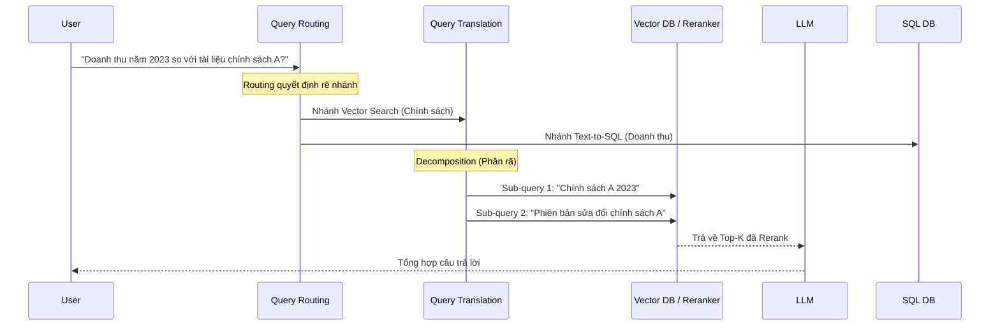

Các mô hình ngôn ngữ lớn (LLM) sở hữu khả năng suy luận xuất sắc. Tuy nhiên, khi đưa vào môi trường Production, các hệ thống AI thuần túy sẽ thất bại do ba nguyên nhân chí tử:
1. **Ảo giác (Hallucination)**: LLM có xu hướng "bịa" ra thông tin khi gặp câu hỏi ngoài dữ liệu huấn luyện.
2. **Dữ liệu lỗi thời (Knowledge Cutoff)**: Việc Fine-tuning liên tục để cập nhật thông tin mới là bài toán bất khả thi về Compute Cost.
3. **Thiếu ngữ cảnh nội bộ (Data Silos)**: LLM không có quyền truy cập vào CSDL nội bộ của doanh nghiệp.

**RAG (Retrieval-Augmented Generation)** ra đời như một Mẫu thiết kế (Design Pattern) giải quyết triệt để 3 vấn đề trên. Tuy nhiên, RAG cấp độ doanh nghiệp (Advanced RAG) khác hoàn toàn với Naive RAG (RAG cơ bản). Bài viết này sẽ mổ xẻ hệ thống RAG dưới lăng kính của một **Staff Data Engineer**.

---

## 1. Naive RAG vs. Advanced RAG

### A. Naive RAG
Kiến trúc tuyến tính đơn giản: **Index (Nhúng vector) $\rightarrow$ Retrieve (Tìm Top-K) $\rightarrow$ Generate (Sinh Text)**. 
- **Điểm yếu:** Độ nhạy (Recall) thấp, dễ trượt các câu hỏi phức tạp (multi-hop questions), cực kỳ nhạy cảm với cách người dùng diễn đạt (phrasing).

### B. Advanced RAG
Biến RAG thành một **Agentic Workflow** đa bước. Hệ thống không đi thẳng vào tìm kiếm mà có các lớp phân tích và định tuyến câu hỏi.



---

## 2. Các Kỹ thuật Inference Nâng Cao (Advanced Retrieval)

Trong luồng Inference (Truy xuất thời gian thực), độ trễ (Latency) và độ chính xác (Precision) là hai ranh giới sống còn.

### 2.1. Query Translation & Expansion (Biến đổi câu hỏi)
Người dùng thường đặt câu hỏi ngắn gọn hoặc lủng củng. Query Translation dùng một LLM nhỏ sửa lại câu hỏi trước khi tìm kiếm:
- **Multi-Query (Fan-out):** Sinh ra 3-5 biến thể đồng nghĩa của câu hỏi gốc để vét cạn không gian Vector (Tăng Recall).
- **Decomposition:** Chẻ một câu hỏi phức tạp ("Multi-hop question") thành nhiều Sub-queries nhỏ để trị.
- **HyDE (Hypothetical Document Embeddings):** Thay vì nhúng (embed) trực tiếp câu hỏi của user, hệ thống yêu cầu LLM "bịa" ra một câu trả lời giả định. Sau đó, nhúng câu trả lời giả định đó để đem đi tìm kiếm trong Vector DB. 

### 2.2. Query Routing (Định tuyến)
Đóng vai trò là "Cảnh sát giao thông". Tuỳ vào ý định của User, Router sẽ đẩy request xuống Vector DB (để tìm text), xuống SQL Database (để tìm số liệu), hoặc ra Web Search.

### 2.3. Hybrid Search & Reranking
Chỉ dùng Vector Search (Semantic) sẽ bị mù với các từ khóa Exact Match (VD: Mã lỗi, Tên model, Số ID). 
- **Hybrid Search:** Kết hợp Vector Search + Keyword Search (BM25) và hợp nhất bằng Reciprocal Rank Fusion (RRF).
- **Reranking:** Dùng mô hình Cross-encoder (chậm, tốn GPU) để xếp hạng lại 50 kết quả tìm được từ Vector DB xuống top 3 tinh túy nhất cho LLM.

---

## 3. Rủi Ro Vận Hành (Operational Risks)

Hệ thống RAG Production không chết ở thuật toán AI, mà chết ở Data Engineering Pipeline.

### A. Vector Database OOM (Out of Memory)
* **Căn nguyên:** Các thuật toán Indexing như **HNSW (Hierarchical Navigable Small World)** tải toàn bộ đồ thị bộ nhớ vào RAM để truy xuất siêu tốc. Khi hàng tỷ vectors được nạp, RAM cạn kiệt, Linux kích hoạt OOMKilled.
* **Đánh đổi hệ thống (Trade-off):** Chuyển sang dùng Index **IVF-PQ (Inverted File with Product Quantization)**. IVF-PQ nén các vector (làm giảm Precision/Recall một chút) nhưng tiết kiệm bộ nhớ lên tới 80%.

### B. Dữ Liệu Lỗi Thời (Stale Index)
* **Căn nguyên:** Embedding là một "Materialized View" của dữ liệu gốc. Nếu dữ liệu gốc (trong Postgres/Confluence) bị đổi mà Vector DB chưa cập nhật, RAG sẽ trả lời sai (Ảo giác cục bộ).
* **Khắc phục:** Áp dụng **Change Data Capture (CDC)**. Sử dụng Debezium để bắt các luồng cập nhật từ DB, đẩy vào Kafka, sau đó Flink sẽ stream và trigger Pipeline Re-embedding (nhúng lại các dòng dữ liệu thay đổi theo thời gian thực) thay vì Batch ban đêm.

### C. Rate Limit & Bão Thử Lại (Throttling / Retry Storms)
Khi đẩy hàng triệu chunk vào Embedding API, bạn sẽ gặp lỗi `HTTP 429 Too Many Requests`. Nếu không giới hạn luồng, hệ thống sẽ tự DDOS chính mình.

**Code Thực chiến (Async Batching + Exponential Backoff):**
Sử dụng `asyncio.Semaphore` để bóp băng thông và `tenacity` để lùi thời gian thử lại an toàn.

```python
import asyncio
from tenacity import retry, wait_exponential, stop_after_attempt

# Semaphore giới hạn tối đa 50 request song song để không chọc giận Rate Limit
sem = asyncio.Semaphore(50) 

@retry(
    wait=wait_exponential(multiplier=1, min=2, max=60), 
    stop=stop_after_attempt(5)
)
async def embed_chunk_with_retry(chunk_text, client):
    async with sem:
        response = await client.embeddings.create(
            input=chunk_text, model="text-embedding-3-small"
        )
        return response.data[0].embedding

async def process_chunks[chunks, client]:
    tasks = [embed_chunk_with_retry(chunk, client] for chunk in chunks]
    return await asyncio.gather(*tasks)
```

---

## 4. Tối Ưu Chi Phí (FinOps) Và Latency Trade-offs

Việc áp dụng Advanced RAG đi kèm với một cái giá: **Thời gian và Tiền bạc**.
- **Latency Tradeoff:** Thêm Query Translation + Reranking khiến Time-to-First-Token (TTFT) tăng mạnh. Hệ thống cần được thiết kế **Adaptive** (Chỉ trigger Rerank với câu hỏi khó, bypass với câu hỏi dễ).
- **Semantic Caching:** Để tránh gọi LLM tốn tiền, sử dụng Semantic Cache (Redis). Nếu user gõ một câu hỏi tương tự câu hỏi 5 phút trước (Cosine distance < 0.05), Cache trả thẳng câu trả lời. Giảm chi phí API về `$0` và Latency về `10ms`.
- **Tiered Storage:** Không lưu toàn bộ lịch sử 10 năm trên RAM Vector DB. Đẩy các vector "lạnh" xuống Object Storage (S3/GCS), chỉ giữ vector "nóng" trên SSD/RAM.

---

## Nguồn Tham Khảo [References]
* [Retrieval-Augmented Generation for Knowledge-Intensive NLP Tasks (Lewis et al., 2020]][https://arxiv.org/abs/2005.11401]
* [Advanced RAG Techniques - LlamaIndex Documentation][https://docs.llamaindex.ai/en/stable/optimizing/advanced_retrieval/advanced_retrieval/]
* [Vector Databases and Vector Search - Pinecone][https://www.pinecone.io/learn/vector-database/]
* [Databricks: Building scalable Generative AI applications with Lakehouse](https://www.databricks.com/blog/building-genai-applications-lakehouse-architecture]
