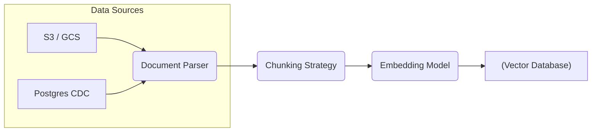
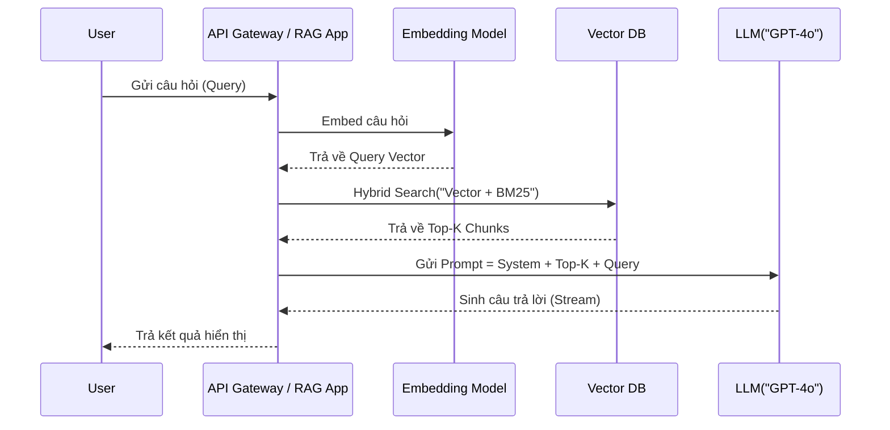

Các mô hình ngôn ngữ lớn (LLM) sở hữu khả năng ngôn ngữ và suy luận logic xuất sắc. Tuy nhiên, khi đưa vào môi trường doanh nghiệp Enterprise, các hệ thống AI thuần túy (chỉ dựa vào LLM prompt) sẽ gãy vỡ ngay lập tức do ba nguyên nhân chí tử:

1. **Ảo giác (Hallucination)**: LLM có xu hướng "bịa" ra thông tin (confabulation) khi gặp các câu hỏi ngoài phạm vi dữ liệu huấn luyện, gây ra những rủi ro pháp lý và vận hành khôn lường.
2. **Dữ liệu lỗi thời (Knowledge Cutoff)**: Trọng số (weights) của mô hình bị đóng băng sau khi pre-training. Việc tái huấn luyện (retraining) hay Fine-tuning liên tục để cập nhật thông tin là bài toán bất khả thi về mặt tài chính (GPU Compute).
3. **Thiếu ngữ cảnh nội bộ (Data Privacy & Silos)**: Các LLM thương mại không thể, và không được phép, truy cập vào cơ sở dữ liệu riêng tư (Ví dụ: dữ liệu giao dịch, tài liệu bảo mật nội bộ) của công ty.

**RAG (Retrieval-Augmented Generation)** ra đời như một mẫu thiết kế (Design Pattern) tiêu chuẩn để giải quyết các hạn chế này. Nó biến LLM từ một "chuyên gia thuộc lòng" thành một "nghiên cứu viên có thư viện mở" (open-book exam).

Trong bài viết này, chúng ta sẽ không nói về RAG cơ bản (đọc text -> embedding -> query). Thay vào đó, chúng ta sẽ "mổ xẻ" hệ thống RAG dưới lăng kính của một **Staff Data Engineer**: Pipeline vật lý diễn ra như thế nào, làm sao tối ưu hóa hiệu suất truy xuất, và đánh đổi (Trade-offs) trong thiết kế hệ thống.

---

## Kiến trúc Thực thi Vật lý (Physical Execution)

Một hệ thống RAG cấp độ Enterprise (Advanced RAG) được chia làm hai luồng (pipelines) tách biệt hoàn toàn về mặt vòng đời và đặc tính workload: **Data Ingestion Pipeline** (chạy batch hoặc streaming) và **Inference Pipeline** (chạy realtime).


*(Minh họa luồng kiến trúc RAG cơ bản - Nguồn: LlamaIndex)*

### 1. Data Ingestion Pipeline (Luồng chuẩn bị dữ liệu)

Nhiệm vụ của pipeline này là ETL (Extract, Transform, Load) dữ liệu phi cấu trúc thành các Vector và lưu trữ vào Vector Database. Quá trình này đòi hỏi Compute cao.



* **Document Parsing & Extraction:** Các tài liệu (PDF, Word, HTML) cần được parse thành text thuần. Các kỹ sư thường dùng công cụ OCR hoặc parsers (như Unstructured.io) để bóc tách cả bảng biểu và metadata (ngày tạo, tác giả).
* **Chunking (Cắt nhỏ dữ liệu):** Dữ liệu quá lớn sẽ tràn Context Window của LLM, quá nhỏ sẽ mất ngữ cảnh. 
* **Embedding Generation:** Gọi API (như `text-embedding-3-large`) hoặc tự host các mô hình mã nguồn mở (như `BGE-M3`) để biến các chunk thành các mảng số thực (vectors).
* **Vector Indexing:** Ghi (Upsert) dữ liệu vào Vector Database (Milvus, Pinecone, hoặc pgvector).

**Code Thực chiến (Terraform cấu hình Pinecone Index Serverless):**

Thay vì click tay trên UI, các hệ thống production luôn được quản lý bằng Infrastructure as Code (IaC) để đảm bảo tính Reproducibility.

```hcl
resource "pinecone_index" "enterprise_knowledge" {
  name      = "corp-docs-index"
  dimension = 1536 # Kích thước vector của OpenAI text-embedding-3-small
  metric    = "cosine"

  spec {
    serverless {
      cloud  = "aws"
      region = "us-west-2"
    }
  }
}
```

### 2. Inference Pipeline (Luồng Suy luận)

Khi user đặt câu hỏi, hệ thống yêu cầu tốc độ phản hồi cực thấp (Low Latency).



#### Các kỹ thuật tối ưu hóa tại Inference (Advanced RAG):
1. **Query Rewriting:** Người dùng thường gõ rất vắn tắt (VD: "Làm sao config cái đó?"). Hệ thống phải dùng một LLM nhỏ hoặc rules để viết lại câu hỏi rõ ràng (VD: "Làm sao cấu hình tham số acks=all trong Kafka?").
2. **Hybrid Search (Tìm kiếm lai):** Chỉ dùng Semantic (Vector) Search là không đủ, nhất là với các mã lỗi (`OOMKilled`) hoặc tên riêng biệt. Hệ thống phải kết hợp với Keyword Search (BM25) và dùng Reciprocal Rank Fusion (RRF) để gộp kết quả.
3. **Reranking:** Lấy Top 50 kết quả từ Vector DB (nhanh), sau đó dùng mô hình Cross-Encoder (chậm hơn, chính xác hơn) như Cohere Rerank để xếp hạng lại, rồi mới lấy Top 5 mớm cho LLM.

---

## Rủi ro Vận hành (Operational Risks) & Khắc phục

Triển khai RAG không phải lúc nào cũng suôn sẻ. Dưới đây là những "vũng lầy" thực tế mà hệ thống gặp phải:

### 1. Vector Database OOM (Out of Memory)
* **Triệu chứng:** Container của Milvus hoặc Weaviate liên tục bị Restart hoặc báo lỗi OOMKilled.
* **Nguyên nhân:** Các chỉ mục (Index) như HNSW tải toàn bộ đồ thị bộ nhớ vào RAM để truy xuất nhanh (in-memory). Khi hàng tỷ vectors được nạp, dung lượng RAM bị cạn kiệt.
* **Khắc phục:** Đánh đổi (Trade-off) sang thuật toán Indexing khác như **IVF-PQ (Inverted File with Product Quantization)**. PQ sẽ nén các vector (làm giảm độ chính xác một chút) nhưng tiết kiệm bộ nhớ lên tới 70-80%. Hoặc cấu hình `Spill-to-disk` (ghi tạm xuống ổ cứng nếu tràn RAM).

### 2. Rate Limit & API Throttling
* **Triệu chứng:** Pipeline Ingestion (đẩy hàng triệu docs/ngày) bị nghẽn do gọi API Embedding của OpenAI bị trả về mã lỗi `429 Too Many Requests`.
* **Khắc phục:** 
    * Thiết kế luồng gọi API bất đồng bộ với giới hạn concurrency bằng Python `asyncio.Semaphore`.
    * Áp dụng Exponential Backoff & Jitter.

**Code Thực chiến (Async Batching với Python):**
```python
import asyncio
from tenacity import retry, wait_exponential, stop_after_attempt

# Dùng Semaphore để giới hạn số lượng request đồng thời
sem = asyncio.Semaphore(50) 

@retry(wait=wait_exponential(multiplier=1, min=2, max=10), stop=stop_after_attempt(5))
async def embed_chunk_with_retry(chunk_text, client):
    async with sem:
        response = await client.embeddings.create(
            input=chunk_text, model="text-embedding-3-small"
        )
        return response.data[0].embedding

async def process_chunks(chunks, client):
    tasks = [embed_chunk_with_retry(chunk, client) for chunk in chunks]
    return await asyncio.gather(*tasks)
```

### 3. Dữ liệu lỗi thời (Stale Index)
* **Triệu chứng:** Nhân viên thay đổi chính sách trong Confluence, nhưng bot vẫn trả lời theo chính sách cũ của tuần trước.
* **Khắc phục:** Áp dụng kiến trúc CDC (Change Data Capture). Thay vì chạy cronjob batch mỗi đêm, sử dụng Debezium để bắt sự kiện thay đổi dữ liệu từ DB (Postgres/MySQL) đẩy thẳng vào Kafka, sau đó có một Flink job hoặc Spark Structured Streaming trigger pipeline re-embedding ngay lập tức.

---

## Systemic Trade-offs (Đánh đổi Hệ thống)

Trong thiết kế hệ thống, không có "viên đạn bạc" (No Silver Bullet). Các kỹ sư cần cân nhắc kỹ các Trade-offs sau khi build RAG:

| Tiêu chí | Lựa chọn A | Lựa chọn B | Đánh đổi (Trade-off) |
| :--- | :--- | :--- | :--- |
| **Vector Index Type** | **HNSW (Hierarchical Navigable Small World)** | **IVF-PQ (Inverted File with Product Quantization)** | **Latency vs. Resource:** HNSW cho độ trễ cực thấp và Recall cao, nhưng ăn RAM khủng khiếp. IVF-PQ nén dữ liệu giúp tiết kiệm RAM, nhưng Recall giảm và tốc độ chậm hơn ở tập dữ liệu nhỏ. |
| **Chunk Size** | **Small (Ví dụ: 128 tokens)** | **Large (Ví dụ: 1024 tokens)** | **Precision vs. Context:** Chunk nhỏ giúp truy tìm (Precision) cực chính xác nhưng LLM thiếu ngữ cảnh tổng quan để trả lời. Chunk lớn có ngữ cảnh tốt nhưng dễ bị nhiễu do tìm nhầm (chứa cả ý không liên quan). *Giải pháp:* Dùng kỹ thuật Parent-Child Retrieval. |
| **Embedding Location**| **Gọi API (OpenAI/Cohere)** | **Self-hosted (BGE / E5 trên GPU riêng)** | **Compute Cost vs. Operational Overhead:** API dễ dùng nhưng chi phí sẽ cao khi volume dữ liệu khổng lồ và dữ liệu nhạy cảm có thể lọt ra ngoài. Self-hosted rẻ hơn lúc scale, bảo mật 100%, nhưng tốn công kỹ sư MLOps duy trì Cluster và cấu hình Triton Inference Server. |

---

## Tối ưu Chi phí (FinOps) cho RAG

Vận hành LLM ở quy mô lớn là bài toán "đốt tiền" nếu không có kiến trúc vững.

1. **Semantic Caching:**
   Với các câu hỏi lặp lại, thay vì gọi lại LLM (tốn phí $ / 1M tokens), sử dụng Semantic Cache (như Redis với Vector Search). Hệ thống sẽ so khớp vector của câu hỏi mới với các câu hỏi cũ trong cache. Nếu độ tương đồng > 0.95, lấy thẳng câu trả lời đã sinh ra trước đó để trả về. Vừa tiết kiệm tiền LLM API, vừa giảm độ trễ (Latency từ 5s xuống 10ms).
2. **Tiered Storage trong Vector DB:**
   Không phải dữ liệu nào cũng cần truy xuất realtime trên bộ nhớ RAM đắt đỏ. Sử dụng các Vector DB hỗ trợ Tiered Storage (như Milvus), đẩy các tài liệu cũ (lịch sử log, báo cáo năm ngoái) xuống Object Storage (S3), và chỉ giữ các tài liệu "nóng" trên SSD/RAM.

---

## Nguồn Tham Khảo (References)

1. [Retrieval-Augmented Generation for Knowledge-Intensive NLP Tasks (Lewis et al., 2020)](https://arxiv.org/abs/2005.11401) - *Paper gốc của Facebook AI giới thiệu khái niệm RAG.*
2. [Advanced RAG Techniques - LlamaIndex Documentation](https://docs.llamaindex.ai/en/stable/optimizing/advanced_retrieval/advanced_retrieval/) - *Tài liệu chuẩn mực về Parent-Child Retrieval, Query Transformation.*
3. [Vector Databases and Vector Search - Pinecone](https://www.pinecone.io/learn/vector-database/) - *Giải thích sâu về HNSW và IVF-PQ dưới góc độ cấu trúc dữ liệu.*
4. [Databricks: Building scalable Generative AI applications with Lakehouse](https://www.databricks.com/blog/building-genai-applications-lakehouse-architecture) - *Góc nhìn Enterprise Architecture cho RAG.*
5. Designing Data-Intensive Applications (Martin Kleppmann) - *Lý thuyết cơ bản về Indexing và Distributed Systems (Chương 3).*
