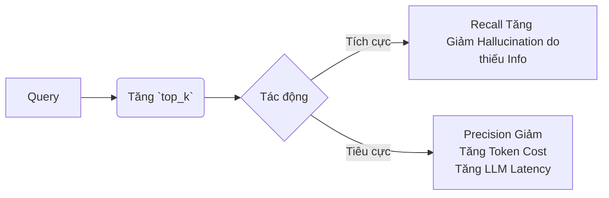

Khi thiết kế hệ thống tìm kiếm thông tin (Information Retrieval) hoặc RAG (Retrieval-Augmented Generation) ở quy mô Production, kỹ sư dữ liệu không nhìn **Recall (Độ phủ)** và **Precision (Độ chính xác)** qua lăng kính ma trận nhầm lẫn (Confusion Matrix) lý thuyết. Chúng ta nhìn nó dưới góc độ: **Đánh đổi giữa Băng thông xử lý (Throughput), Độ trễ (Latency), và Chi phí Token (FinOps).**

Bài viết này mổ xẻ cách Recall và Precision chi phối các quyết định thiết kế hệ thống RAG và cách xử lý các sự cố vận hành phát sinh do việc cố gắng tối ưu hóa hai chỉ số này.

---

## 1. Bản chất Hệ thống của Recall & Precision

Trong môi trường truy xuất dữ liệu khổng lồ (hàng tỷ vectors), hai chỉ số này đại diện cho sự giằng co về mặt tài nguyên:

*   **Recall (Độ phủ):** Tỷ lệ tài liệu liên quan (Relevant Documents) mà hệ thống quét và trả về được trên tổng số tài liệu liên quan thực sự tồn tại trong Database.
    *   *Tư duy hệ thống:* Recall thấp nghĩa là hệ thống bị "mù thông tin" (Information Blindness). Để LLM không bị ảo giác (Hallucination), bạn phải cung cấp đủ context. Để tăng Recall, ta thường phải tăng `top_k` hoặc giảm ngưỡng similarity threshold.
*   **Precision (Độ chính xác):** Tỷ lệ tài liệu thực sự liên quan trong rổ kết quả mà hệ thống vừa truy xuất.
    *   *Tư duy hệ thống:* Precision thấp nghĩa là hệ thống đang "bơm rác" (Noise) vào LLM. Điều này gây ra hiệu ứng Context Dilution (loãng ngữ cảnh), tăng nguy cơ "Lost in the middle", và đội chi phí Token API lên gấp nhiều lần.

### Sự đánh đổi (The Trade-Off)

Việc cố gắng kéo Recall lên 100% bằng cách tải hàng nghìn candidate chunks (`top_k = 1000`) sẽ khiến Precision tụt thê thảm. Ở cấp độ hạ tầng, điều này dẫn đến:
1. **Network IO Bottleneck:** Quá trình vận chuyển lượng lớn vector payloads từ VectorDB sang Application Layer gây nghẽn băng thông.
2. **FinOps Disaster:** Nhồi 1000 chunks vào LLM prompt (dù model có hỗ trợ 1M context window) sẽ làm nổ chi phí Inference.



---

## 2. Kiến trúc Thực thi Vật lý: 2-Stage Retrieval (Hybrid Search + Reranking)

Để phá vỡ giới hạn Trade-off này, các hệ thống RAG Enterprise (như kiến trúc tại Databricks, Netflix, hay Pinecone) sử dụng cơ chế **2-Stage Retrieval** (Truy xuất hai giai đoạn).


*(Minh họa: Kiến trúc Hybrid Search và Reranking. Nguồn ảnh: Sanity/Pinecone)*

### Giai đoạn 1: Maximizing Recall với Hybrid Search
Tại tầng Vector Database (Milvus, Qdrant, hoặc Elasticsearch), chúng ta chạy song song hai engine:
- **Dense Vector Search (HNSW):** Bắt ngữ nghĩa (Semantic) -> Tối ưu Recall cho các query phức tạp.
- **Sparse Keyword Search (BM25):** Bắt từ khóa chính xác (Lexical) -> Tối ưu Precision cho danh từ riêng, mã lỗi (SKU, Error Code).

Dưới đây là cấu hình Python thực tế sử dụng Qdrant Client để thực thi Hybrid Search kết hợp RRF (Reciprocal Rank Fusion):

```python
# Thực thi Hybrid Search trên Qdrant để tối đa hóa Recall
from qdrant_client import QdrantClient
from qdrant_client.models import Prefetch, QueryRequest

client = QdrantClient(url="http://localhost:6333")

# Bước 1: Fetch lượng lớn candidates (high recall)
query_request = QueryRequest(
    prefetch=[
        Prefetch(
            query=bm25_query_vector, 
            using="sparse", 
            limit=100 # Kéo rộng lưới để tăng Recall
        ),
        Prefetch(
            query=dense_query_vector, 
            using="dense", 
            limit=100 
        ),
    ],
    query="rrf", # Sử dụng Reciprocal Rank Fusion gộp điểm
    limit=50 # Giảm xuống còn 50 candidates
)

results = client.query_points("rag_collection", query_request)
```

### Giai đoạn 2: Maximizing Precision với Cross-Encoder Reranker
Lấy 50 candidates từ Giai đoạn 1 và đưa qua một Cross-Encoder model (ví dụ: `cohere/rerank-english-v3.0` hoặc `bge-reranker-v2-m3`). Cross-Encoder tuy nặng (Compute-intensive) nhưng vì chỉ chạy trên 50 chunks nên đảm bảo được Latency, giúp lọc ra top 5 chunks tinh khiết nhất (Precision cực cao) để nhồi vào LLM.

---

## 3. Rủi ro Vận hành (Operational Risks) & Khắc phục

Việc cấu hình hệ thống thiên vị Recall hoặc Precision có thể dẫn đến các sự cố nghiêm trọng.

### Incident 1: VectorDB OOMKilled (Out-of-Memory) do Recall Tham Lam
Khi Data Scientists muốn tối đa hóa Recall, họ thường tăng tham số `ef_search` trong thuật toán HNSW của VectorDB.
*   **Vấn đề:** Tham số `ef_search` (kích thước danh sách candidate động trong lúc duyệt graph) tỷ lệ thuận với số node cần giữ trong RAM. Trong các đợt Traffic Spike, hàng nghìn concurrent queries với `ef_search = 500` sẽ khiến RAM phình to đột ngột, dẫn đến tiến trình bị hệ điều hành tắt ép buộc (OOMKilled - Out Of Memory).
*   **Khắc phục (Fix):** Giới hạn cứng `ef_search` ở cấu hình Cluster, áp dụng Rate Limiting, hoặc chuyển sang DiskANN (Spill-to-disk) nếu hạ tầng dùng SSD NVMe.

```yaml
# Cấu hình an toàn HNSW trong qdrant_config.yaml để tránh OOM
hnsw_index:
  m: 16                           # Mức độ kết nối graph vừa phải
  ef_construct: 100               # Build chậm nhưng index chất lượng
  full_scan_threshold: 10000      # Nếu filter query < 10k, full scan cho lẹ (đỡ tốn memory nhảy graph)
  max_elements_per_segment: 200000
```

### Incident 2: Context Dilution & API Rate Limit
*   **Vấn đề:** Nếu lấy `top_k = 20` chunk từ PDF (mỗi chunk 500 tokens) -> Context dài 10,000 tokens. Điều này không chỉ tiêu tốn hàng ngàn đô la API hàng tháng (FinOps Alert) mà còn khiến LLM mất tập trung, sinh ra ảo giác.
*   **Khắc phục (Fix):** Áp dụng **Metadata Pre-filtering** ngay tại VectorDB. Filter bằng SQL-like condition trước khi tính KNN Distance giúp loại bỏ triệt để Vector rác, vừa giữ Recall cao trong tập subset, vừa bảo vệ Precision.

```json
// Elasticsearch query config - Pre-filtering to boost precision and speed
{
  "knn": {
    "field": "content_vector",
    "query_vector": [0.1, -0.2, ...],
    "k": 5,
    "num_candidates": 50,
    "filter": {
      "bool": {
        "must": [
          { "term": { "doc_type": "technical_spec" } },
          { "range": { "publish_year": { "gte": 2023 } } }
        ]
      }
    }
  }
}
```

---

## 4. Tóm tắt Tiêu chuẩn Thiết kế (Design Principles)

1. **Đừng phụ thuộc vào LLM để lọc rác:** LLM không phải là máy lọc nhiễu. Hãy tối ưu **Precision** ở tầng Reranking (Cross-Encoder) trước khi dữ liệu chạm đến LLM.
2. **Recall nằm ở Data Pipeline, không chỉ ở Query:** Nếu Chunking Strategy sai, hoặc thiếu Metadata enrichment lúc Ingestion, thì thuật toán HNSW xịn đến mấy cũng không cứu được Recall.
3. **FinOps - Theo dõi Metric Token/Query:** Nếu Token/Query tăng đột biến mà CSAT (Customer Satisfaction) không tăng, hệ thống của bạn đang bị béo phì do cố nhồi Recall. Cần tinh chỉnh lại ngưỡng Similarity Threshold.

---

## 5. Nguồn Tham Khảo (References)

*   [Pinecone: Precision and Recall in Information Retrieval](https://www.pinecone.io/learn/offline-evaluation/)
*   [Milvus Engineering: Hybrid Search and Reranking for better RAG](https://milvus.io/docs/multi-vector-search.md)
*   [Elasticsearch Docs: kNN search and exact filtering](https://www.elastic.co/guide/en/elasticsearch/reference/current/knn-search.html)
*   *Designing Data-Intensive Applications* (Martin Kleppmann) - Phân tích về Trade-offs trong lưu trữ và truy vấn thông tin quy mô lớn.
