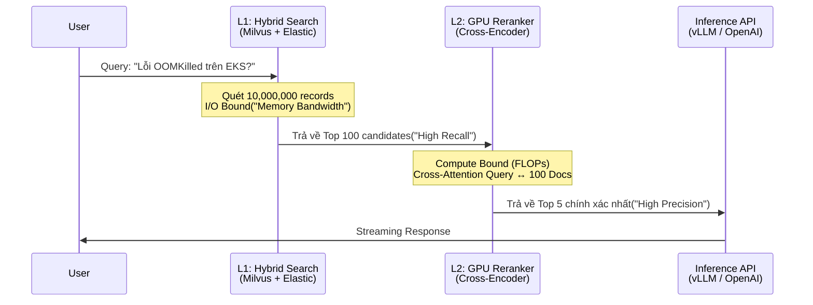

Để xây dựng một hệ thống RAG (Retrieval-Augmented Generation) đạt chuẩn Enterprise, việc chỉ sử dụng **Bi-Encoder** (Vector Embeddings) cho Semantic Search là không đủ. Trong thực tế vận hành, Vector Search thường gặp vấn đề nghiêm trọng về Precision (Độ chính xác) khi bối cảnh truy vấn trở nên phức tạp hoặc mang ý nghĩa phủ định. 

Giải pháp chuẩn công nghiệp hiện nay là kiến trúc **Two-Stage Retrieval** (Truy xuất hai giai đoạn), trong đó **Cross-Encoder Reranker** đóng vai trò là "chốt chặn" cuối cùng, chấm điểm lại các tài liệu ứng viên để tối đa hóa chất lượng ngữ cảnh (Context Quality) trước khi đẩy vào LLM.

## 1. Kiến trúc Thực thi Vật lý (Physical Execution)

Để hiểu tại sao Reranker lại đắt đỏ về mặt tính toán (Compute-bound) nhưng đem lại độ chính xác tuyệt đối, chúng ta cần mổ xẻ sự khác biệt về **Graph Execution** giữa Bi-Encoder và Cross-Encoder.


*Nguồn: SBERT Documentation - Minh họa luồng đi của Tensors trong hai kiến trúc.*

### Bi-Encoder (Giai đoạn 1: Recall)
- **Cơ chế:** Câu truy vấn (Query) và Tài liệu (Document) đi qua hai nhánh Transformer tách biệt (không hề giao tiếp với nhau trong quá trình encode).
- **Physical Execution:** Vì chúng tách biệt, bạn có thể **tính toán trước (Pre-compute)** toàn bộ vector của hàng triệu Document và đẩy vào RAM của Vector Database (như Milvus, Pinecone). Khi User gửi Query, hệ thống chỉ chạy inference cho Query đó ($O(1)$) và thực hiện tính toán khoảng cách vector (thường là HNSW / Dot Product).
- **Điểm nghẽn (Bottleneck):** Xảy ra hiện tượng "Information Bottleneck". Toàn bộ ngữ cảnh của một trang giấy bị ép (squeeze) vào một vector 768 chiều. Các sắc thái từ vựng (ví dụ: phủ định) rất dễ bị mất mát.

### Cross-Encoder Reranker (Giai đoạn 2: Precision)
- **Cơ chế:** Nối ghép (Concatenate) Query và Document thành một chuỗi duy nhất: `[CLS] Query [SEP] Document [SEP]`. Chuỗi này được bơm trực tiếp vào mạng Transformer.
- **Cross-Attention:** Tại *mọi* layer của Transformer, token của Query sẽ liên tục "nhìn thấy" (attend to) token của Document và ngược lại. Cơ chế Self-Attention $O(N^2)$ này tạo ra một ma trận tương tác chéo hoàn hảo.
- **Physical Execution:** Bạn **không thể tính toán trước**. Mọi thao tác inference phải diễn ra *On-the-fly* tại thời điểm User query. Nếu Giai đoạn 1 trả về 100 tài liệu (K=100), Cross-Encoder phải thực hiện 100 lần forward pass qua toàn bộ mạng Neural.



## 2. Triển khai Hệ thống (Show me the Code)

Dưới đây là kiến trúc thực chiến khi bạn tự host (Self-host) một mô hình Reranker lớn (như `BAAI/bge-reranker-large`) trên hạ tầng AWS SageMaker.

### 2.1. Cấu hình Infrastructure-as-Code (Terraform)
Cross-Encoder ngốn cực nhiều Compute (FLOPs) nhưng lại không yêu cầu VRAM quá khổng lồ như LLM. Do đó, thay vì cấp phát các instance `p4d` đắt đỏ, Staff Engineer thường chọn các dòng GPU T4 (`g4dn`) hoặc L4 (`g5`) để tối ưu chi phí.

```hcl
resource "aws_sagemaker_model" "reranker_model" {
  name               = "bge-reranker-large-v1"
  execution_role_arn = aws_iam_role.sagemaker_role.arn

  primary_container {
    image = "763104351884.dkr.ecr.us-east-1.amazonaws.com/huggingface-pytorch-inference:2.0.0-transformers4.28.1-gpu-py310-cu118-ubuntu20.04"
    environment = {
      HF_MODEL_ID       = "BAAI/bge-reranker-large"
      HF_TASK           = "text-classification"
      # Tuning worker threads để tránh GIL (Global Interpreter Lock) bottleneck
      SAGEMAKER_MODEL_SERVER_WORKERS = "4" 
    }
  }
}

resource "aws_sagemaker_endpoint_configuration" "reranker_config" {
  name = "reranker-endpoint-config"

  production_variants {
    variant_name           = "AllTraffic"
    model_name             = aws_sagemaker_model.reranker_model.name
    initial_instance_count = 2 # Multi-AZ High Availability
    instance_type          = "ml.g4dn.xlarge" # 1x NVIDIA T4 (16GB VRAM) - Tối ưu FinOps
  }
}
```

### 2.2. Chống OOM với Python Generators
Nếu L1 (Retriever) trả về K=200 tài liệu, việc nhét toàn bộ 200 cặp [Query, Doc] vào GPU cùng lúc sẽ gây nổ VRAM (CUDA OutOfMemoryError) ngay lập tức vì độ phức tạp của Self-Attention là bậc hai $O(L^2)$ theo độ dài chuỗi $L$. Để khắc phục, ta buộc phải băm nhỏ (chunking) luồng inference.

```python
import torch
from transformers import AutoModelForSequenceClassification, AutoTokenizer
from typing import List, Tuple, Iterator

def chunked_rerank(query: str, docs: List[str], batch_size: int = 16) -> Iterator[Tuple[str, float]]:
    """
    Sử dụng Python Generator để stream batch qua GPU,
    ngăn chặn CUDA OOMKilled khi K (số lượng candidates) quá lớn.
    """
    # Load model vào GPU và bật Half Precision (FP16) để giảm một nửa footprint VRAM
    tokenizer = AutoTokenizer.from_pretrained("BAAI/bge-reranker-base")
    model = AutoModelForSequenceClassification.from_pretrained(
        "BAAI/bge-reranker-base"
    ).half().cuda()
    
    pairs = [[query, doc] for doc in docs]
    
    # Xử lý theo từng mini-batch
    for i in range(0, len(pairs), batch_size):
        batch = pairs[i:i + batch_size]
        
        # Đóng gói Tensors và đẩy vào GPU (H2D Transfer)
        inputs = tokenizer(
            batch, 
            padding=True, 
            truncation=True, 
            max_length=512, 
            return_tensors="pt"
        ).to('cuda')
        
        with torch.no_grad(): # Tắt Autograd Graph để giải phóng 50% RAM
            outputs = model(**inputs, return_dict=True)
            # Flatten tensor về 1D mảng float
            scores = outputs.logits.view(-1,).float()
            
        # Yield ngay kết quả để GC (Garbage Collector) dọn dẹp Tensor,
        # Tránh việc lưu trữ toàn bộ Tensor trên RAM host gây Spill-to-disk
        yield from zip([b[1] for b in batch], scores.cpu().tolist())

# Thực thi và lấy Top 3
# candidates = [doc1, doc2, ..., doc200]
# ranked_docs = sorted(chunked_rerank("Cách fix OOM?", candidates, batch_size=32), key=lambda x: x[1], reverse=True)[:3]
```

## 3. Rủi ro Vận hành (Operational Risks)

Khi đưa Reranker lên môi trường Production, các kỹ sư thường đối mặt với hai sự cố (Incidents) kinh điển:

### 3.1. Latency Spikes do Cartesian Explosion
- **Vấn đề:** Đội Data Science quyết định tăng `top_k` của ElasticSearch từ 50 lên 500 với hy vọng Reranker sẽ tìm được "kim đáy bể". 
- **Hệ quả:** Latency của hệ thống tăng vọt từ 150ms lên 2.5 giây. Reranker là một bài toán **Compute-Bound** hạng nặng. Thời gian xử lý tăng tuyến tính (thậm chí bùng nổ) với số lượng tài liệu đầu vào.
- **Khắc phục:** Thiết lập Circuit Breaker cứng: không bao giờ đẩy quá $K=100$ tài liệu vào Reranker. Nếu cần quét diện rộng hơn, hãy quay lại tune Giai đoạn 1 (tối ưu hóa BM25 Weights hoặc fine-tune Embedding Model).

### 3.2. GPU CUDA OOMKilled
- **Vấn đề:** Document chunk size được cấu hình quá dài (ví dụ 2048 tokens). Khi nối chuỗi `[CLS] Query [SEP] Doc [SEP]`, tổng số lượng tokens vượt quá `max_position_embeddings` của mô hình (thường là 512). Hoặc tệ hơn, nếu không bật `truncation=True`, CUDA VRAM sẽ bị ăn thủng do ma trận attention \$2048 \times 2048$ tốn gấp 16 lần RAM so với ma trận \$512 \times 512$.
- **Khắc phục:** Luôn giới hạn `max_length=512` khi tokenize. Nếu tài liệu quá dài, bắt buộc phải dùng thuật toán sliding window hoặc áp dụng kiến trúc *ColBERT* (Late Interaction) thay cho thuần Cross-Encoder.

## 4. Tối ưu Chi phí (FinOps) & System Trade-offs

Kiến trúc Two-Stage Retrieval là minh chứng rõ nhất cho sự đánh đổi (Trade-off) trong System Design: Bạn dùng CPU/Memory rẻ tiền để "lọc thô", và dùng GPU đắt tiền để "gọt giũa".

1. **Self-Hosted GPU vs. Managed API:** 
   - Duy trì một cụm SageMaker GPU 24/7 (VD: 2 máy `g4dn.xlarge`) sẽ tiêu tốn khoảng ~\$1,000/tháng. Nếu lưu lượng truy vấn hệ thống (QPS) của bạn thấp hoặc rải rác, phần lớn thời gian GPU sẽ nằm chơi (idle).
   - **Quyết định FinOps:** Chuyển sang sử dụng **Cohere Rerank API** (trả tiền theo số lượng request/tokens). Bạn chuyển mô hình chi phí từ CapEx sang OpEx. Chỉ khi QPS cực kỳ lớn và ổn định, việc Self-host mới đạt điểm hòa vốn (Break-even point).
   
2. **Latency vs Precision Trade-off:**
   - Dùng mô hình Reranker lớn (như BGE-Reranker-Large) có thể đạt điểm NDCG@10 cực cao, nhưng đánh đổi lại 200-300ms độ trễ.
   - Đối với các ứng dụng Real-time Chatbot, đôi khi sử dụng mô hình Bi-Encoder siêu tốc độ, kết hợp với metadata filtering cứng (ví dụ lọc SQL `WHERE category='x'`) lại mang lại UX tốt hơn là chèn thêm Reranker.

## Nguồn Tham Khảo (References)

1. [Sentence-Transformers: Cross-Encoders vs Bi-Encoders Architecture](https://www.sbert.net/examples/applications/cross-encoder/README.html)
2. [Cohere Rerank: Boosting Retrieval Performance](https://txt.cohere.com/rerank/)
3. [BAAI BGE Reranker - HuggingFace Repository](https://huggingface.co/BAAI/bge-reranker-large)
4. *Designing Data-Intensive Applications*, Martin Kleppmann (O'Reilly Media) - Chương Batch Processing & Stream Processing (Mở rộng về nguyên lý bottlenecks).
