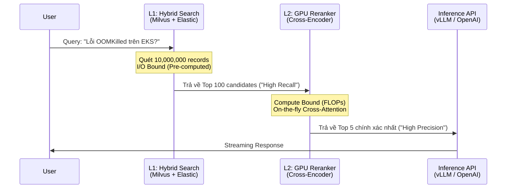

Để xây dựng một hệ thống RAG (Retrieval-Augmented Generation) đạt chuẩn Enterprise, việc chỉ sử dụng **Bi-Encoder** (Vector Embeddings) cho Semantic Search là sự ngây thơ về mặt thiết kế. 

Trong thực tế vận hành, Vector Search thường gặp vấn đề nghiêm trọng về **Precision (Độ chính xác)** khi bối cảnh truy vấn trở nên phức tạp, mang ý nghĩa phủ định, hoặc yêu cầu so khớp từ vựng chính xác (Lexical match). 

Giải pháp chuẩn công nghiệp hiện nay là kiến trúc **Two-Stage Retrieval (Truy xuất hai giai đoạn)**, trong đó **Cross-Encoder Reranker** đóng vai trò là "chốt chặn" cuối cùng, chấm điểm lại các tài liệu ứng viên để tối đa hóa chất lượng ngữ cảnh [Context Quality] trước khi đẩy vào LLM.

---

## 1. Kiến trúc Thực thi Vật lý (Physical Execution)

Dưới góc nhìn Staff Engineer, bạn không thể chọn mô hình chỉ dựa trên bảng xếp hạng (Leaderboard). Bạn phải hiểu sự khác biệt về **Graph Execution** và giới hạn Vật lý của phần cứng.

### 1.1. Bi-Encoder (Giai đoạn 1: Lưới lọc thô - High Recall)
-   **Cơ chế:** Câu truy vấn (Query) và Tài liệu (Document) đi qua hai nhánh Transformer độc lập.
-   **Physical Execution:** Tính toán độc lập cho phép bạn **Pre-compute (tính toán trước)** toàn bộ vector của hàng triệu Document và đẩy vào RAM của Vector Database (Milvus, Pinecone). Khi User gửi Query, hệ thống chỉ chạy Inference cho Query đó ($O(1)$) và tính khoảng cách vector (Cosine Similarity).
-   **Systemic Trade-off:** Cực kỳ nhanh (Độ trễ Sub-millisecond), Scale tốt cho hàng tỷ records. Tuy nhiên, nó mắc lỗi **Information Bottleneck**: Ép cả một trang A4 vào một vector 768 chiều khiến các sắc thái ngữ nghĩa tinh tế (Nuance) bị mất.

### 1.2. Cross-Encoder Reranker (Giai đoạn 2: Lưới lọc tinh - High Precision)
-   **Cơ chế:** Nối ghép (Concatenate) Query và Document thành chuỗi: `[CLS] Query [SEP] Document [SEP]`. Chuỗi này được bơm trực tiếp vào Transformer.
-   **Cross-Attention:** Tại *mọi* layer, token của Query liên tục "nhìn thấy" (attend to) token của Document. Cơ chế Self-Attention $O(N^2)$ tạo ra sự thấu hiểu ngữ nghĩa sâu sắc.
-   **Systemic Trade-off:** **Bạn KHÔNG THỂ Pre-compute.** Mọi thao tác Inference phải diễn ra *On-the-fly* lúc Runtime. Nếu Giai đoạn 1 trả về 100 tài liệu (K=100), hệ thống phải thực hiện 100 lần forward pass qua toàn bộ mạng Neural.



---

## 2. Rủi ro Vận hành (Operational Risks)

Khi đưa Reranker lên Production, các kỹ sư thường đối mặt với hai sự cố (Incidents) kinh điển:

### 2.1. Latency Spikes do Cartesian Explosion
-   **Vấn đề:** Đội Data Science quyết định tăng `top_k` của VectorDB từ 50 lên 500 với hy vọng Reranker sẽ tìm được "kim đáy bể".
-   **Hệ quả:** Latency hệ thống tăng vọt từ 150ms lên 2.5 giây. Reranker là bài toán **Compute-Bound** cực nặng. Thời gian xử lý tăng tuyến tính [thậm chí bùng nổ] với số lượng tài liệu đầu vào $K$.
-   **Staff-Level Solution:** Thiết lập **Circuit Breaker** cứng: Không bao giờ đẩy quá $K=100$ tài liệu vào Reranker. Sử dụng kiến trúc Asynchronous Processing hoặc các mô hình thu gọn (Distilled Models) như *TinyBERT* nếu Latency là SLA tối thượng.

### 2.2. GPU CUDA OOMKilled
-   **Vấn đề:** Khi nối chuỗi `[CLS] Query [SEP] Doc [SEP]`, tổng token vượt quá `max_position_embeddings` (thường là 512]. Độ phức tạp của Self-Attention là bậc hai $O(L^2)$ theo độ dài chuỗi $L$. Nhét 100 tài liệu dài vào 1 Batch sẽ lập tức làm sập VRAM (CUDA OutOfMemoryError).
-   **Khắc phục:** Bắt buộc phải cấu hình `truncation=True` và băm nhỏ (chunking) luồng Inference bằng Python Generator.

---

## 3. Mã nguồn Thực chiến & FinOps

Kiến trúc Two-Stage Retrieval là minh chứng rõ nhất cho sự đánh đổi (Trade-off) chi phí: Dùng CPU/Memory rẻ tiền để "lọc thô", và dùng GPU đắt tiền để "gọt giũa".

### 3.1. Đánh đổi Chi phí: Self-Host vs. API
Duy trì một cụm GPU [VD: 2 máy `g4dn.xlarge`] chạy mô hình mã nguồn mở (BGE-Reranker) tốn khoảng ~$1,000/tháng. Nếu lưu lượng truy vấn (QPS) rải rác, phần lớn thời gian GPU sẽ nằm chơi (idle).

**Chiến lược FinOps tối ưu:**
Đối với hầu hết các doanh nghiệp, sử dụng **Managed API (như Cohere Rerank)** chuyển đổi mô hình chi phí từ CapEx sang OpEx (Trả theo số request). Chỉ khi QPS cực kỳ lớn và ổn định (đạt Break-even point), việc Self-host mới có lãi.

### 3.2. Triển khai với Cohere API & Python Generator
Đoạn code dưới đây tích hợp Cohere Rerank API, kết hợp cơ chế Chunking để tránh Timeout khi số lượng Candidate Documents quá lớn.

```python
import cohere
from typing import List, Dict

# Khởi tạo Cohere Client
co = cohere.Client('YOUR_API_KEY')

def chunked_rerank(query: str, docs: List[str], chunk_size: int = 50] -> List[Dict]:
    """
    Sử dụng Generator Pattern để chia nhỏ lượng documents gửi lên API.
    Tránh lỗi "Payload Too Large" và kiểm soát chi phí (FinOps).
    """
    all_results = []
    
    # Chia danh sách docs thành các chunk nhỏ [ví dụ 50 docs/lần]
    for i in range(0, len(docs), chunk_size):
        chunk = docs[i:i + chunk_size]
        
        # Gọi Cohere Rerank API (Mô hình đa ngữ English + API v3 mới nhất]
        response = co.rerank(
            model="rerank-multilingual-v3.0",
            query=query,
            documents=chunk,
            top_n=5 # Lọc lấy Top 5 tốt nhất trong từng chunk
        )
        
        # Lưu kết quả và map lại index gốc
        for result in response.results:
            all_results.append({
                "document": chunk[result.index],
                "relevance_score": result.relevance_score
            })
            
    # Sort lại kết quả cuối cùng từ tất cả các chunk
    final_ranked = sorted(all_results, key=lambda x: x["relevance_score"], reverse=True)
    
    return final_ranked[:5] # Trả về Top 5 tuyệt đối

# Giả lập: Vector DB trả về 200 candidates
# vector_results = ["Doc 1...", "Doc 2...", ..., "Doc 200..."]
# best_contexts = chunked_rerank("Làm sao tối ưu FinOps RAG?", vector_results)
```

---

## 4. Tổng Kết

Trong hệ thống RAG, sự khác biệt giữa một bản Demo (PoC) và Sản phẩm Production nằm ở "Reranking Gap". Khi Vector Search trả về kết quả "tạm được nhưng không quá xuất sắc", việc chèn thêm **Cross-Encoder Reranker** chính là điểm tối ưu ROI (Return on Investment) cao nhất. Hãy luôn nhớ thiết lập các giới hạn cứng (Circuit Breakers) cho `top_k` và `max_length` để bảo vệ GPU khỏi sự cố OOMKilled.

## Nguồn Tham Khảo (References)
1.  **Sentence-Transformers Architecture:** Phân tích sự khác biệt giữa Cross-Encoders và Bi-Encoders.
2.  **Cohere Rerank Documentation:** Giải pháp Reranker API tối ưu cho FinOps.
3.  **BAAI BGE Reranker:** Mô hình Reranker mã nguồn mở hàng đầu trên HuggingFace.
4.  **Designing Data-Intensive Applications** - Martin Kleppmann (Lý thuyết về Bottlenecks trong Data Systems).
