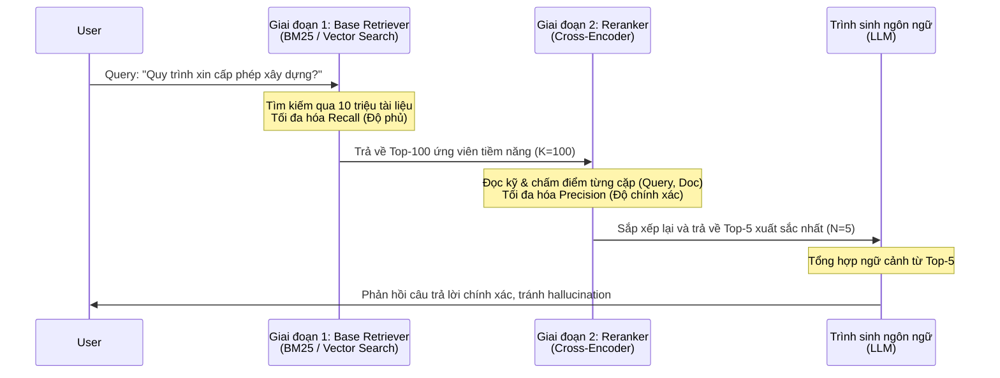

Reranker (Mô hình xếp hạng lại) là một Neural Network kiến trúc **Cross-Encoder** thường được đặt ở giai đoạn cuối của luồng truy xuất thông tin RAG. Nó nhận vào một tập hợp nhỏ các tài liệu đã được tìm thấy sơ bộ bởi thuật toán Semantic Search (như Bi-Encoder, hay Vector Embeddings) hoặc Lexical Search (như BM25), rồi đánh giá chi tiết sự tương quan giữa câu hỏi của người dùng và từng tài liệu. Cuối cùng, nó sẽ "chấm điểm" (score) và sắp xếp lại kết quả, đẩy các tài liệu chính xác nhất lên vị trí ưu tiên.

Trong bối cảnh bùng nổ của các ứng dụng RAG (Retrieval-Augmented Generation), chất lượng của bước truy xuất ngữ cảnh (retrieval) là yếu tố sống còn. Nếu ngữ cảnh cung cấp cho mô hình ngôn ngữ (LLM - Large Language Model) chứa thông tin sai lệch hoặc mang nhiều "nhiễu" (noise), LLM sẽ rất dễ sinh ra hiện tượng ảo giác (hallucination) hoặc bỏ sót những chi tiết quan trọng nhất. Reranker ra đời như một "bộ lọc tinh" mạnh mẽ để giải quyết triệt để vấn đề này, cải thiện đáng kể độ tin cậy của toàn bộ hệ thống.

## Sự Khác Biệt Giữa Bi-Encoder (Embedding) và Cross-Encoder (Reranker)


Để hiểu rõ giá trị thực sự của Reranker, chúng ta cần đi sâu vào kiến trúc và so sánh sự khác biệt toán học cũng như logic giữa hai phương pháp đo lường tính tương đồng chính: **Bi-Encoder** và **Cross-Encoder**.

```mermaid
graph TD
    subgraph "Bi-Encoder Architecture("Embeddings")"
        Q1["Query"] -->|Encode| E1["Transformer / BERT"]
        D1["Document"] -->|Encode| E2["Transformer / BERT"]
        E1 --> V1["Query Vector"]
        E2 --> V2["Doc Vector"]
        V1 --> S1("("Cosine<br>Similarity""))
        V2 --> S1
        S1 --> Score1["Similarity Score"]
    end

    subgraph "Cross-Encoder Architecture("Reranker")"
        Q2["Query"] --> C["Concatenate: <br> CLS + Query + SEP + Document"]
        D2["Document"] --> C
        C --> TR["Transformer Layers<br>Full Self-Attention"]
        TR --> FF["Feed Forward / Classifier"]
        FF --> Score2["Relevance Score"]
    end
```

### 1. Bi-Encoder (Embedding Models)
- **Cách thức hoạt động:** Câu truy vấn (Query) và Tài liệu (Document) được đưa qua mạng nơ-ron (ví dụ: BERT) một cách **hoàn toàn độc lập** để tạo ra hai vector dày đặc (dense vectors). Mức độ tương đồng sau đó được đo bằng các hàm khoảng cách hình học đơn giản, ví dụ như Cosine Similarity hoặc Dot Product.
- **Ưu điểm vượt trội (Tốc độ):** Vì quá trình encode độc lập, bạn có thể tính toán trước vector (pre-compute) cho hàng triệu, thậm chí hàng tỷ tài liệu và lưu trữ vào cơ sở dữ liệu vector (Vector Database như Milvus, Pinecone, Qdrant). Khi có Query mới, hệ thống chỉ cần tốn thời gian embed cái Query đó và sử dụng thuật toán ANN (Approximate Nearest Neighbors) để tìm kiếm khoảng cách cực nhanh, chỉ mất vài mili-giây.
- **Nhược điểm (Mất mát thông tin):** Xảy ra tình trạng "information bottleneck". Toàn bộ ngữ nghĩa phong phú của một đoạn văn bản dài bị ép vào một vector số thực với số chiều cố định (như 768 hoặc 1536 chiều). Đặc biệt nghiêm trọng là Query và Document không hề "giao tiếp" với nhau trong quá trình biểu diễn. Từ "apple" trong Query không thể nhận biết được từ "macbook" trong Document khi đi qua các lớp nơ-ron.

### 2. Cross-Encoder (Reranker)
- **Cách thức hoạt động:** Khác với Bi-encoder, Reranker đem nối (concatenate) thẳng Query và Document lại với nhau bằng các token phân cách đặc biệt (ví dụ: `[CLS] Query [SEP] Document [SEP]`). Chuỗi văn bản dài này được đẩy vào chung một mạng Transformer.
- **Cơ chế Attention Chéo (Cross-Attention):** Ở từng lớp (layer) của mạng neural Transformer, thông qua cơ chế **Self-Attention**, mọi từ trong Query đều có thể "nhìn thấy" (attend to) mọi từ trong Document và ngược lại. Khả năng tương tác chéo sâu sắc này giúp mô hình nắm bắt trọn vẹn ngữ cảnh.
- **Ưu điểm vượt trội (Độ chính xác):** Đạt được độ chính xác (Precision) cao nhất trong các mô hình truy xuất hiện nay. Mô hình Reranker giỏi trong việc phân biệt các sắc thái từ vựng tinh tế, hiểu được ý nghĩa phủ định, từ đồng nghĩa/trái nghĩa, hoặc sự liên kết ẩn ý mà biểu diễn vector độc lập dễ bị bỏ qua.
- **Nhược điểm (Chi phí tính toán):** Cực kỳ nặng về mặt tính toán và **không thể tính toán trước** (cannot pre-compute). Mọi cặp (Query, Document) phải đi xuyên qua toàn bộ các lớp Transformer tại thời điểm truy vấn (on-the-fly). Chạy Cross-encoder trên toàn bộ kho dữ liệu là bất khả thi trong thời gian thực.

## So Sánh Nhanh Reranker và Bi-Encoder

| Tiêu chí | Bi-Encoder (Vector Embeddings) | Cross-Encoder (Reranker) |
| :--- | :--- | :--- |
| **Mức độ chính xác (Accuracy)** | Khá / Tốt | Rất xuất sắc |
| **Tốc độ (Speed)** | Rất nhanh (vài ms) | Chậm hơn nhiều (hàng chục tới hàng trăm ms) |
| **Tính toán trước (Pre-compute)** | Có thể (Vector DB) | Không thể (Tính toán trực tiếp) |
| **Mở rộng quy mô (Scalability)** | Hàng triệu đến hàng tỷ tài liệu | Bị giới hạn (thường chỉ xử lý top 50 - 500 tài liệu) |
| **Chi phí hạ tầng** | Trung bình (Tốn RAM cho Vector DB) | Cao (Thường yêu cầu GPU để suy luận nhanh) |
| **Khả năng hiểu bối cảnh sâu** | Kém (dễ nhầm các câu phủ định) | Tốt (bắt được sắc thái ngữ nghĩa chính xác) |

> [!NOTE]
> **ColBERT (Late Interaction) - Phương pháp dung hòa:** Mới đây, các kiến trúc như ColBERT (Contextualized Late Interaction over BERT) đã xuất hiện. Thay vì tạo một vector duy nhất cho toàn bộ văn bản, ColBERT lưu trữ vector cho *từng token* của tài liệu. Khi truy vấn, mô hình thực hiện phép tính ma trận MaxSim giữa tất cả token của Query và Document. Phương pháp này giữ được nhiều tương tác giống Reranker nhưng có thể cache lại được một phần giống Bi-encoder. Dù vậy, nó tiêu tốn dung lượng ổ đĩa khổng lồ.

## Kiến Trúc Truy Xuất Hai Giai Đoạn (Two-Stage Retrieval)

Để tận dụng ưu điểm của cả hai thế giới (tốc độ của Embeddings/BM25 và độ chính xác của Reranker), tiêu chuẩn công nghiệp hiện nay cho các hệ thống RAG là áp dụng kiến trúc **Two-Stage Retrieval**.



### 1. Giai đoạn 1 (First-stage Retrieval / Recall)
Mục tiêu là tìm ra một tập hợp các ứng viên tiềm năng từ toàn bộ cơ sở dữ liệu một cách nhanh nhất có thể, tránh việc bỏ lỡ tài liệu liên quan (tối ưu hóa độ phủ - Recall).
- Các phương pháp thường dùng: Lexical Search (như BM25, TF-IDF qua ElasticSearch) bắt từ khóa rất tốt, hoặc Dense Retrieval (Vector Bi-Encoder) bắt ngữ nghĩa chung.
- Xu hướng hiện tại là dùng **Hybrid Search** (kết hợp cả BM25 và Vector Search) và lấy ra khoảng **Top-50 đến Top-100** tài liệu mang sang giai đoạn tiếp theo.

### 2. Giai đoạn 2 (Second-stage Retrieval / Precision)
Sử dụng **Cross-Encoder Reranker** để đọc lại cẩn thận Top-100 tài liệu vừa nhận được và cho điểm lại (rescore). Sau quá trình Rerank, tài liệu ít liên quan bị đẩy xuống dưới cùng. Hệ thống chỉ bóc tách **Top-3 đến Top-5** tài liệu có điểm Reranker cao nhất để nạp vào LLM.

## Ưu Điểm Tuyệt Đối Của Reranker Trong RAG

Việc bổ sung thêm một layer Reranker mang lại những lợi ích thực tiễn dễ dàng đong đếm được:

1. **Khắc phục "Lost in the Middle":** Các mô hình ngôn ngữ lớn (như GPT-4, Claude) được chứng minh là gặp hiện tượng mất tập trung khi bị nhồi nhét một ngữ cảnh quá dài (ví dụ 20-30 tài liệu). Thông tin ở đoạn giữa thường bị LLM "bỏ quên". Reranker giúp loại bỏ phần lớn thông tin thừa thãi, chỉ giữ lại vài tài liệu cực "đậm đặc" về thông tin, giảm độ nhiễu và làm cho LLM sinh phản hồi bám sát hơn.
2. **Tiết kiệm chi phí API:** Việc giảm lượng tài liệu đầu vào (từ 20 xuống 3 tài liệu) làm giảm đáng kể lượng Token Context truyền vào LLM, trực tiếp giúp giảm chi phí gọi API từ OpenAI/Anthropic và tăng tốc độ thời gian phản hồi (Time-to-First-Token).
3. **Phân biệt sắc thái câu hỏi (Đặc biệt là phủ định):** Bi-encoder rất dễ nhầm lẫn. Ví dụ: Query là *"Các dự án không sử dụng React"*. Vector search có thể trả về các tài liệu nói về *"Các dự án chuyên sử dụng React"* vì chúng có chung quá nhiều vựng cốt lõi. Reranker với attention-chéo sẽ nhận biết chính xác từ "không" (not) và đánh tụt hạng các tài liệu sai.
4. **Mô-đun Độc lập linh hoạt:** Bạn không cần đập bỏ hệ thống truy xuất cũ (Elasticsearch hay Milvus). Reranker là một mảnh ghép thêm vào rất độc lập. Nó có thể kết nối với mọi Retriever và cải thiện lập tức chất lượng tìm kiếm chung.

## Ví Dụ Thực Hành Tích Hợp Reranker (Python)

### Cài đặt tự host Reranker bằng thư viện `sentence-transformers`

Sử dụng thư viện `sentence-transformers` là cách đơn giản nhất để triển khai một mạng Cross-Encoder locally. Cực kỳ phù hợp cho môi trường nội bộ bảo mật (on-premise).

```python
from sentence_transformers import CrossEncoder

# Khởi tạo mô hình Reranker. Ở đây dùng một mô hình nhỏ gọn huấn luyện trên MS MARCO
# Đối với tiếng Việt, bạn có thể tham khảo các mô hình đa ngôn ngữ như bge-reranker-m3
model = CrossEncoder('cross-encoder/ms-marco-MiniLM-L-6-v2', max_length=512)

user_query = "Làm thế nào để bảo mật API Key?"
retrieved_docs = [
    "API Key là một chuỗi ký tự dùng để xác thực ứng dụng gọi đến API.",
    "Bạn không bao giờ được hardcode API key trong mã nguồn. Hãy sử dụng biến môi trường (Environment Variables) hoặc AWS Secrets Manager.",
    "Hướng dẫn cách tạo API key trên hệ thống quản trị của nền tảng Stripe.",
    "Sử dụng HTTPS để mã hóa dữ liệu truyền tải, tuy nhiên API key vẫn có thể bị lộ nếu lưu trong file cấu hình public."
]

# Reranker yêu cầu đầu vào là một mảng các cặp: [ [Query, Doc1], [Query, Doc2], ... ]
pairs = [[user_query, doc] for doc in retrieved_docs]

# Tiến hành cho điểm các cặp
# Kết quả là một mảng chứa điểm logic (logits)
scores = model.predict(pairs)

# Kết hợp danh sách tài liệu và điểm, sau đó sắp xếp theo điểm giảm dần (cao nhất đứng đầu)
ranked_results = sorted(zip(retrieved_docs, scores), key=lambda x: x[1], reverse=True)

print(f"Query: '{user_query}'\n")
for idx, (doc, score) in enumerate(ranked_results):
    print(f"Rank {idx+1} | Score: {score:.4f} | {doc[:80]}...")

# Kết quả thực tế thường đẩy tài liệu thứ hai (nói về việc dùng biến môi trường để bảo mật) lên Top 1.
```

### Sử dụng Cohere Rerank API (Dành cho Production)

Nếu hệ thống của bạn yêu cầu hiệu năng cao, độ trễ thấp và không muốn gánh vác chi phí vận hành máy chủ GPU đắt đỏ, các dịch vụ API Reranker chuyên biệt như của Cohere là "chân ái".

```python
import cohere

# Khởi tạo client Cohere bằng API Key
co = cohere.Client('YOUR_COHERE_API_KEY')

query = "Chính sách hoàn tiền khi hủy vé máy bay"
docs = [
    "Để mua thêm hành lý ký gửi, quý khách cần thực hiện trước giờ bay ít nhất 4 tiếng.",
    "Nếu quý khách hủy chuyến bay trước 24 giờ, tiền vé sẽ được hoàn lại 80% dưới dạng voucher.",
    "Chúng tôi không hỗ trợ hoàn tiền cho các hạng vé siêu khuyến mãi và vé mua trong các đợt flash sale.",
    "Quy định chung về hành lý xách tay và hàng hóa nguy hiểm bị cấm mang lên máy bay."
]

# Gọi API Rerank (chỉ định top_n = 2 để lấy 2 kết quả tốt nhất)
response = co.rerank(
    query=query,
    documents=docs,
    top_n=2,
    model='rerank-multilingual-v3.0' # Model đa ngôn ngữ, rất mạnh cho tiếng Việt
)

print("Kết quả Rerank từ Cohere:")
for result in response.results:
    # result.index là vị trí gốc của document trong mảng docs
    original_doc = docs[result.index]
    print(f"Độ liên quan: {result.relevance_score:.4f} - Văn bản: {original_doc}")
```

> [!TIP]
> **Lưu ý triển khai API Reranker:** Gửi đi nhiều tài liệu sẽ làm tăng độ trễ mạng (network latency) và chi phí API. Một mẹo phổ biến là giới hạn độ dài của từng `document` hoặc chỉ lấy ra Top 50 kết quả từ Vector Search để gửi lên Cohere.

## Các Mô Hình Reranker Nổi Bật Hiện Nay

Thế giới AI nguồn mở và thương mại đang chứng kiến sự bùng nổ của nhiều mô hình Reranker chất lượng cực cao:

- **BGE Reranker (BAAI):** Bộ sưu tập mô hình đến từ Học viện Trí tuệ Nhân tạo Bắc Kinh (BAAI). Các phiên bản như `bge-reranker-large` hay `bge-reranker-v2-m3` thống trị nhiều bảng xếp hạng đánh giá truy xuất mở (MTEB). Đặc biệt, bản `m3` hỗ trợ hơn 100 ngôn ngữ bao gồm Tiếng Việt cực kỳ tốt và được release mã nguồn mở.
- **Cohere Rerank:** API Reranker có chất lượng thuộc hàng top thế giới (`cohere-rerank-v3-english`, `rerank-multilingual-v3.0`). Hỗ trợ cửa sổ ngữ cảnh lên đến 4K tokens, giúp Rerank được các văn bản dài mà không cần chia nhỏ quá mức.
- **Jina Reranker:** Nổi lên gần đây với `jina-reranker-v2-base-multilingual`, điểm đặc biệt của Jina là khả năng xử lý **cửa sổ ngữ cảnh cực kỳ dài** (lên đến 8192 tokens), cho phép bạn rerank nguyên cả một trang web hoặc một hợp đồng dài mà không bị lỗi tràn token.
- **Mixedbread AI (`mxbai-rerank`):** Mô hình tối ưu hóa đặc biệt về hiệu năng chạy, cung cấp chất lượng cao nhưng yêu cầu tài nguyên bộ nhớ cực thấp, rất tiện cho các ứng dụng chạy trên Edge CPU hay các máy chủ chi phí thấp.
- **Sentence-Transformers (HuggingFace):** Cung cấp các model quen thuộc (ví dụ họ `ms-marco-MiniLM-L-6-v2`) rất phù hợp cho mục đích giáo dục, thử nghiệm vì chúng siêu nhỏ và load nhanh.

## Đo Lường Đánh Giá (Evaluation)

Khi thiết lập hệ thống truy xuất với Reranker, làm sao để biết Reranker của bạn có hoạt động hiệu quả không? Thông thường, giới khoa học dữ liệu sử dụng các metrics (thước đo) chính sau:

- **NDCG@10 (Normalized Discounted Cumulative Gain):** Chỉ số đo lường độ chính xác của việc sắp xếp hạng. Nó không chỉ kiểm tra xem tài liệu đúng có nằm trong danh sách không, mà còn đánh giá tài liệu đó có nằm "đúng vị trí" (càng cao càng tốt) hay không.
- **MRR (Mean Reciprocal Rank):** Đo lường thứ hạng của tài liệu đúng *đầu tiên* xuất hiện trong danh sách. Nếu tài liệu đúng nằm top 1, điểm là 1. Nếu ở top 2, điểm là 0.5.
- **Hit Rate / Recall@K:** Tỉ lệ có bao nhiêu phần trăm truy vấn tìm được tài liệu chính xác trong top K kết quả (K thường là 3, 5, hoặc 10).

> [!WARNING]
> **Cân bằng giữa Độ trễ (Latency) và Độ chính xác (Accuracy)**
> Dùng Reranker lớn (như BGE-large với 560 triệu tham số) xử lý top 100 văn bản có thể tốn hơn 1 giây trên CPU. Hãy chắc chắn đo đạc thời gian tính toán của luồng RAG. Nếu ứng dụng đòi hỏi realtime cao, hãy giảm `top_K` từ Retriever xuống mức 30-50, hoặc dùng Reranker nhẹ hơn (như BGE-base hay MiniLM), hoặc thiết lập GPU chuyên dụng cho luồng Rerank.

## Tài Liệu Tham Khảo

* [Cohere Rerank: Boosting Retrieval Performance](https://txt.cohere.com/rerank/)
* [Hiểu sâu về Two-Stage Retrieval with BM25 & Cross-Encoders](https://towardsdatascience.com/a-deep-dive-into-two-stage-retrieval-with-bm25-and-cross-encoders-7265bc729f28)
* [BGE Reranker (BAAI) trên HuggingFace](https://huggingface.co/BAAI/bge-reranker-large)
* [Sentence Transformers - Hệ thống Cross-Encoders](https://www.sbert.net/examples/applications/cross-encoder/README.html)
* **Jina AI Reranker V2: Hỗ trợ đa ngôn ngữ và Ngữ cảnh dài**
* [Pinecone: Khái niệm về Reranking Models trong Vector Search](https://www.pinecone.io/learn/series/rag/rerankers/)
