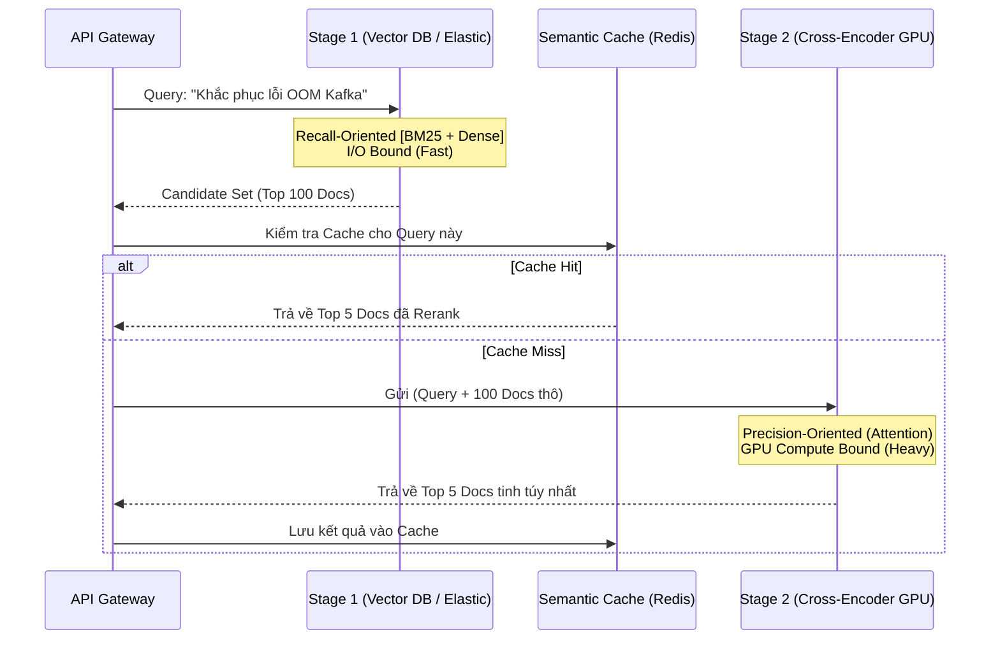

Khi xây dựng hệ thống Retrieval-Augmented Generation (RAG) ở quy mô Enterprise, Vector Search thuần túy (Bi-encoder) nhanh chóng bộc lộ điểm yếu: **Độ nhiễu cao (Noise)**.
Nếu bạn gửi toàn bộ 20 tài liệu tìm được vào một LLM (như GPT-4), LLM sẽ bị hội chứng **"Lost in the Middle"** (Rơi rụng thông tin ở giữa). Mô hình chỉ chú ý đến tài liệu đầu và tài liệu cuối, phớt lờ các thông tin quan trọng nằm ở giữa Context Window.

Để giải quyết vấn đề này, kiến trúc **Two-Stage Retrieval (Truy xuất Hai giai đoạn)** ra đời, và lớp **Reranking (Tái sắp xếp)** chính là trái tim của giai đoạn hai, giúp lọc lấy "tinh hoa" trước khi đẩy cho LLM.

Bài này là mảnh ghép cuối trong chuỗi retrieval: đọc trước [RAG](/concepts/9-genai-machine-learning/rag/), [Embeddings](/concepts/9-genai-machine-learning/embeddings/) và [Hybrid Search](/concepts/9-genai-machine-learning/hybrid-search/) nếu chưa nắm Stage 1.

---

## 1. Kiến Trúc Two-Stage Retrieval

Việc dùng mô hình Deep Learning nặng (Cross-encoder) để so sánh trực tiếp câu truy vấn với hàng triệu tài liệu là bất khả thi về mặt toán học ($O(N)$ Compute) và tài nguyên (GPU OOM). Two-Stage Retrieval là sự thỏa hiệp hoàn hảo.



### Phân rã Hệ thống:
1. **Stage 1 (Broad Retrieval - Lưới Rộng):** Sử dụng các thuật toán nhẹ như BM25 (Sparse) hoặc Bi-Encoder (Dense) chạy trên chỉ mục HNSW. Mục tiêu: **Tối đa hóa Recall** (Không bỏ sót). Nút thắt: I/O Disk/RAM.
2. **Stage 2 (Precise Reranking - Phễu Hẹp):** Nhận đầu vào là Top $K$ ($K \approx 100$) từ Stage 1. Sử dụng Cross-Encoder để tính Relevance Score chính xác. Mục tiêu: **Tối đa hóa Precision**. Nút thắt: GPU Compute (FLOPs).

---

## 2. Cross-Encoder: Trùm Cuối Reranking

Trái với Bi-Encoder (so khớp hai mảng số tĩnh), **Cross-Encoder** đưa trực tiếp câu truy vấn và tài liệu vào chung một chuỗi token:
`[CLS] Query [SEP] Document [SEP]`

Cơ chế **Self-Attention** cho phép mọi token của câu truy vấn tương tác trực tiếp với mọi token của tài liệu. Điều này giúp mô hình hiểu được từ đồng nghĩa, mệnh đề phủ định (Ví dụ: "Không dùng Kafka"), và trật tự từ phức tạp.

### Code Thực chiến: HuggingFace TEI
Các Data Engineer chuyên nghiệp sẽ deploy Reranker như một Microservice độc lập sử dụng **Text Embeddings Inference [TEI]** của HuggingFace (viết bằng Rust + FlashAttention) để chịu tải cao.

```yaml
# docker-compose.yml
services:
  reranker:
    image: ghcr.io/huggingface/text-embeddings-inference:86-1.2
    deploy:
      resources:
        reservations:
          devices:
            - driver: nvidia
              count: 1
              capabilities: [gpu]
    environment:
      # BAAI model hỗ trợ đa ngôn ngữ cực tốt (Việt, Anh)
      - MODEL_ID=BAAI/bge-reranker-v2-m3
      - MAX_CLIENT_BATCH_SIZE=32
```

---

## 3. Hybrid Search & Reciprocal Rank Fusion (RRF)

Nếu hệ thống không có ngân sách chạy GPU Reranker, **Reciprocal Rank Fusion (RRF)** là "viên đạn bạc". Nó kết hợp danh sách BM25 (chuyên bắt keyword exact-match) và Vector Dense (chuyên bắt semantic).

RRF sử dụng toán học nội suy để dung hợp thứ hạng:
$$ RRF\_Score(d) = \frac{"1"}{k + rank_{"BM25"}(d)} + \frac{"1"}{k + rank_{"Dense"}(d)} $$

Trong Elasticsearch/OpenSearch, bạn có thể đẩy thẳng logic RRF xuống Database Engine, loại bỏ hoàn toàn việc phải kéo hàng nghìn record qua mạng về Application Layer:

```json
POST /docs/_search
{
  "retriever": {
    "rrf": {
      "retrievers": [
        { "standard": { "query": { "match": { "content": "lỗi OOM Kafka" }}}},
        { "knn": { "field": "embedding", "query_vector": [0.12, ...], "k": 100 }}
      ],
      "rank_constant": 60,        // k trong công thức RRF
      "rank_window_size": 100
    }
  }
}
```

Hằng số `k=60` (mặc định của paper gốc) làm phẳng chênh lệch giữa các thứ hạng đầu: tài liệu hạng 1 và hạng 5 chỉ chênh ~0.003 điểm RRF, nên một tài liệu xuất hiện ở **cả hai** danh sách (dù hạng trung bình) dễ thắng tài liệu chỉ đứng đầu một danh sách — đúng triết lý "đồng thuận giữa hai hệ tìm kiếm đáng tin hơn một hệ tự tin".

---

## 4. Rủi Ro Vận Hành (Operational Risks)

Khi Reranking lên Production, Kỹ sư hệ thống thường gặp 3 sự cố đẫm máu:

### A. CUDA Out of Memory (OOMKilled)
- **Căn nguyên:** Stage 1 ném lên tham số `top_k=1000`. Cross-Encoder phải build ma trận Attention cho 1000 văn bản dài. VRAM 16GB của T4 bị "nổ".
- **Khắc phục:** Ép kiểu cứng (Hard limit) giới hạn Candidate Size $K \le 100$.

### B. Mất điểm do Truncation (Cắt cụt)
- **Căn nguyên:** Đa số Cross-Encoder bị giới hạn ở 512 tokens. Nếu key insight nằm ở đoạn cuối của tài liệu dài, mô hình sẽ mù.
- **Khắc phục:** Dùng chiến lược **Max-P (Max Passage)**. Chia tài liệu dài thành nhiều chunk nhỏ. Rerank tất cả chunk và lấy điểm chunk cao nhất đại diện cho tài liệu gốc.

### C. Đỉnh Trễ Hệ Thống (Latency Spike)
- **Căn nguyên:** Rerank 100 docs bằng LLM API tốn 2 giây.
- **Khắc phục:** **Semantic Caching**. Dùng Redis lưu Vector của Query. Nếu Query mới có Vector Distance sát với Query cũ (< 0.05), móc Cache trả luôn Top 5 Docs đã Rerank, bypass toàn bộ GPU.

---

## 5. Tối Ưu Chi Phí (FinOps) Và Context Window

Reranking là lá chắn thép bảo vệ ví tiền của doanh nghiệp:
- **Không có Reranking:** Bạn ném Top 20 tài liệu (20,000 tokens) vào GPT-4. LLM bị dính "Lost in the Middle", sinh ra ảo giác [Hallucination], và bạn mất **~$0.1 / Query**.
- **Có Reranking:** Hệ thống bóp từ Top 100 thô xuống Top 3 tinh túy nhất. Bạn gửi 3,000 tokens vào GPT-4. Bạn giữ được Context Window sạch sẽ (hạn chế ảo giác) và chỉ mất **~$0.015 / Query**.

Reranking giúp cắt giảm tới **85% chi phí API LLM** mà lại tăng chất lượng câu trả lời.

---

## Liên kết trong site

Đo lường chất lượng reranker bằng [NDCG](/concepts/9-genai-machine-learning/ndcg/) và [Recall](/concepts/9-genai-machine-learning/recall/); dùng [LLM-as-a-Judge](/concepts/9-genai-machine-learning/llm-as-a-judge/) để đánh giá end-to-end; hạ tầng Stage 1 xem [Vector Database](/concepts/3-storage-engines-formats/vector-database/).

## Nguồn Tham Khảo (References)

* [Lost in the Middle: How Language Models Use Long Contexts (arXiv:2307.03172)](https://arxiv.org/abs/2307.03172)
* [Cohere Rerank: State-of-the-Art Search and RAG](https://cohere.com/rerank)
* [Elasticsearch: Reciprocal Rank Fusion (RRF) API](https://www.elastic.co/guide/en/elasticsearch/reference/current/rrf.html)
* [HuggingFace Text Embeddings Inference (TEI)](https://github.com/huggingface/text-embeddings-inference)
