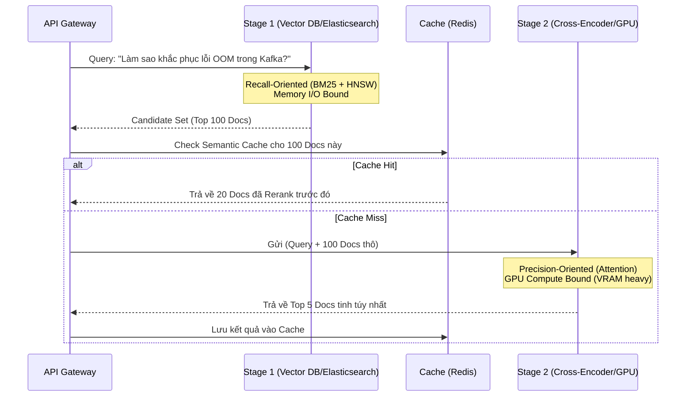

Khi xây dựng các hệ thống tìm kiếm (Search Engine) hoặc Retrieval-Augmented Generation (RAG) ở quy mô Enterprise (hàng tỷ tài liệu), Vector Search thuần túy (Bi-encoder) nhanh chóng bộc lộ điểm yếu chết người: **Mất mát ngữ cảnh**. Việc nén một tài liệu dài thành một mảng số thực (dense vector) 1536 chiều chắc chắn sẽ đánh rơi các tiểu tiết ngữ nghĩa, từ khóa phủ định, và cấu trúc câu phức tạp. 

Để giải quyết vấn đề này, kiến trúc **Two-Stage Retrieval (Truy xuất Hai giai đoạn)** ra đời, và lớp **Reranking (Tái sắp xếp)** chính là trái tim của giai đoạn hai. Bài viết này sẽ mổ xẻ Reranking dưới lăng kính của System Design, mổ xẻ các nút thắt vận hành (Bottlenecks) và chia sẻ mã nguồn cấu hình thực chiến.

---

## 1. Kiến trúc Thực thi Vật lý (Physical Execution Architecture)

Việc so sánh trực tiếp câu truy vấn với hàng triệu tài liệu bằng một mô hình Deep Learning là bất khả thi về mặt toán học ($O(N)$ Compute) và tài nguyên (GPU OOM). Two-Stage Retrieval là sự thỏa hiệp hoàn hảo giữa **Tốc độ (Latency)** và **Độ chính xác tuyệt đối (Precision)**.



### Phân rã Hệ thống:
1. **Stage 1 (Retrieval - Mở rộng lưới):** Sử dụng các thuật toán nhẹ như BM25 (Sparse) hoặc Bi-Encoder (Dense) chạy trên chỉ mục HNSW/FAISS. Mục tiêu là "không bỏ sót" (High Recall). Nút thắt ở đây là **Memory I/O** (tải index từ Disk/RAM).
2. **Stage 2 (Reranking - Khép chặt phễu):** Nhận đầu vào là Top $K$ ($K \approx 100$) từ Stage 1. Sử dụng mô hình nặng (Cross-Encoder) để tính toán điểm số Relevance Score chính xác. Nút thắt chuyển sang **GPU Compute (FLOPs)**.

---

## 2. Cross-Encoder: Trùm Cuối của Reranking

Trái với Bi-Encoder (chỉ tính Cosine Similarity giữa hai vector độc lập), **Cross-Encoder** đưa trực tiếp cả câu truy vấn và tài liệu vào chung một chuỗi token:
`[CLS] Query [SEP] Document [SEP]`

Cơ chế **Cross-Attention** trong các tầng Transformer cho phép mọi token của câu truy vấn tương tác (attend) với mọi token của tài liệu ở mọi layer. Điều này giúp mô hình hiểu được:
- Từ đồng nghĩa theo ngữ cảnh (Contextual Synonyms).
- Sự hoán đổi từ ngữ.
- Các mệnh đề phủ định (Ví dụ: "Không bao gồm Kafka").

### Sự Đánh đổi (Systemic Trade-offs)
- **Tốc độ:** Tăng tuyến tính $O(N)$ theo số lượng Candidate.
- **Phần cứng:** Bắt buộc phải có GPU (Nvidia T4/A10g) nếu muốn Latency < 100ms.
- **Độ dài Context:** Đa số Cross-Encoder bị giới hạn cứng ở 512 tokens.

### Code Thực chiến: Triển khai Cross-Encoder với HuggingFace TEI

Thay vì dùng thư viện `sentence-transformers` ngây thơ (chạy trên CPU và không có batching), các Data Engineer chuyên nghiệp sẽ deploy Reranker như một Microservice sử dụng **Text Embeddings Inference (TEI)** của HuggingFace, tối ưu hóa bằng Rust và FlashAttention.

```yaml
# docker-compose.yml
version: '3.8'
services:
  reranker:
    image: ghcr.io/huggingface/text-embeddings-inference:86-1.2
    deploy:
      resources:
        reservations:
          devices:
            - driver: nvidia
              count: 1
              capabilities: [gpu]
    environment:
      # Sử dụng model BAAI đa ngôn ngữ (Hỗ trợ tiếng Việt rất tốt)
      - MODEL_ID=BAAI/bge-reranker-v2-m3
      - MAX_CLIENT_BATCH_SIZE=32
      - MAX_CONCURRENT_REQUESTS=128
    ports:
      - "8080:80"
```

*Sử dụng Python client gọi TEI Microservice:*
```python
import httpx

payload = {
    "query": "Reverse ETL là gì?",
    "texts": [
        "ETL là quá trình trích xuất dữ liệu từ DB đẩy vào Data Warehouse.",
        "Reverse ETL đồng bộ dữ liệu đã xử lý từ Warehouse ngược về SaaS (Salesforce).", # Target
        "DBT là công cụ transformation dữ liệu."
    ]
}

response = httpx.post("http://localhost:8080/rerank", json=payload)
print(response.json()) 
# Ouput sẽ rank text thứ 2 lên cao nhất với score áp đảo.
```

---

## 3. Reciprocal Rank Fusion (RRF) - Không tốn GPU

Khi hệ thống không có ngân sách cho GPU Reranker, hoặc khi cần kết hợp Hybrid Search (Sparse + Dense), **Reciprocal Rank Fusion (RRF)** là "viên đạn bạc".

Thay vì tính toán bằng Machine Learning, RRF sử dụng một công thức toán học nội suy vị trí (Rank) của tài liệu trên nhiều danh sách kết quả khác nhau.

$$ RRF\_Score(d) = \sum_{r \in R} \frac{1}{k + rank_r(d)} $$

Với $k$ thường được set = 60 (hằng số làm mượt).

### Code Thực chiến: Elasticsearch RRF

Trong Elasticsearch/OpenSearch, bạn có thể đẩy thẳng logic RRF xuống Database Engine, loại bỏ hoàn toàn việc phải kéo hàng nghìn record về Application Layer để tự tính toán.

```json
// POST /my-knowledge-base/_search
{
  "retriever": {
    "rrf": {
      "retrievers": [
        {
          "standard": {
            "query": {
              "match": {
                "content": "Kafka OOM troubleshooting"
              }
            }
          }
        },
        {
          "knn": {
            "field": "content_vector",
            "query_vector": [0.1, 0.4, -0.2, ...],
            "k": 50,
            "num_candidates": 100
          }
        }
      ],
      "rank_window_size": 50,
      "rank_constant": 60
    }
  },
  "size": 5
}
```
*Lưu ý: Query trên chạy trực tiếp ở Data Node, giảm thiểu tối đa Network Shuffle.*

---

## 4. Rủi ro Vận hành (Operational Risks & Incidents)

Trong thực tế, khi Reranking được đưa lên Production, các hệ thống thường gặp phải những bài toán "đẫm máu":

### A. CUDA Out of Memory (OOMKilled)
- **Căn nguyên:** API nhận tham số `top_k=1000` từ hệ thống Retrieval. Mỗi tài liệu dài 500 tokens. Tổng ma trận Attention sinh ra làm nổ VRAM 16GB của card T4.
- **Khắc phục:** Ép kiểu cứng (Hard limit) giới hạn `Candidate Size` truyền vào Reranker tối đa $K=150$. Sử dụng Dynamic Batching (TEI / vLLM).

### B. Mất điểm do Truncation (Văn bản dài)
- **Căn nguyên:** Cross-Encoder cắt cụt (truncate) tài liệu ở token thứ 512. Nếu thông tin quan trọng nằm ở đoạn cuối của tài liệu dài, mô hình sẽ đánh trượt tài liệu đó.
- **Khắc phục:** Kỹ thuật **Max-P (Max Passage)**. Chia tài liệu lớn thành các đoạn nhỏ (chunks). Rerank từng chunk và lấy điểm số cao nhất của chunk đó đại diện cho toàn bộ tài liệu gốc.

### C. Latency Spike (Đỉnh trễ hệ thống)
- **Căn nguyên:** User submit một query phức tạp yêu cầu rerank 200 docs. Hệ thống mất 1.5 giây chỉ để tính toán điểm số.
- **Khắc phục:** Triển khai **Semantic Caching**. Redis lưu các kết quả (Vector Query -> Top K Docs đã Rerank). Nếu có query tương tự (Vector Distance < 0.05), trả về thẳng Cache, bỏ qua hoàn toàn mô hình.

---

## 5. Tối ưu Chi phí (FinOps) cho RAG

Việc không có Reranking hoặc gửi toàn bộ 50 tài liệu thô vào Context Window của GPT-4o là một thảm họa về FinOps.

Giả sử: 1 tài liệu = 1,000 tokens.
- **Không có Reranking:** Gửi 20 tài liệu vào GPT-4o = 20,000 tokens / 1 truy vấn. Chi phí: ~\$0.1 / Query.
- **Có Reranking:** Rerank 20 tài liệu (Chi phí GPU cực nhỏ hoặc dùng API Cohere ~\$0.002). Chỉ gửi Top 3 tài liệu vào GPT-4o = 3,000 tokens. Chi phí: ~\$0.015 / Query.

**Kết luận:** Reranking giúp cắt giảm tới **85% chi phí API LLM**, đồng thời giảm mạnh độ nhiễu (noise), hạn chế trực tiếp Hallucination vì Context giờ đây toàn là "tinh hoa" thay vì rác rưởi.

---

## Nguồn Tham Khảo (References)

1. [Cohere Rerank: State-of-the-Art Search and RAG](https://cohere.com/rerank)
2. [HuggingFace Text Embeddings Inference (TEI) - High Performance Deployment](https://github.com/huggingface/text-embeddings-inference)
3. [Reciprocal Rank Fusion outperforms Condorcet and individual Rank Learning Methods (Cormack et al., 2009)](https://plg.uwaterloo.ca/~gvcormac/cormacksigir09-rrf.pdf)
4. [BGE Reranker v2 - BAAI FlagEmbedding Open Source](https://github.com/FlagOpen/FlagEmbedding/tree/master/FlagEmbedding/reranker)
5. [Elasticsearch: Reciprocal Rank Fusion (RRF) API Official Documentation](https://www.elastic.co/guide/en/elasticsearch/reference/current/rrf.html)
