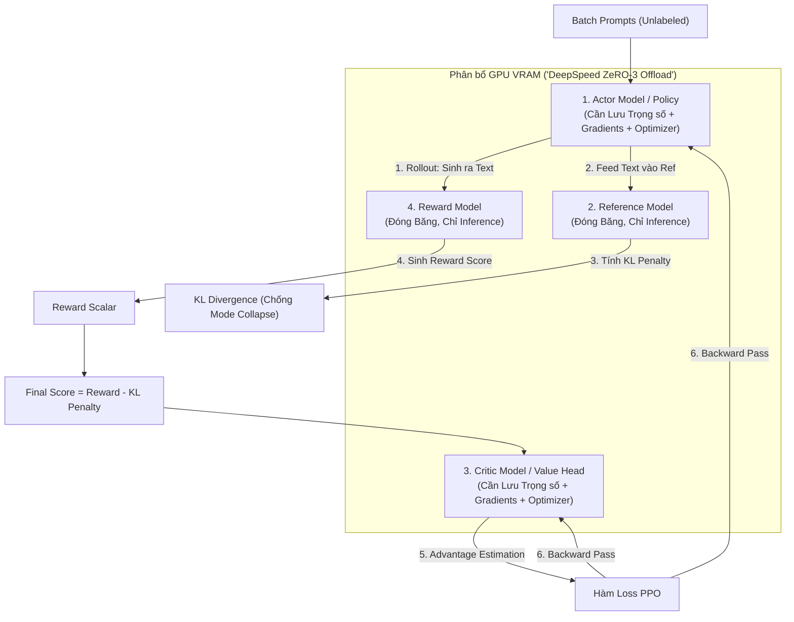

Trong hệ sinh thái Generative AI, **RLHF (Reinforcement Learning from Human Feedback)** không chỉ đơn thuần là một "Thuật toán" (Algorithm). Dưới góc nhìn Data/ML Engineering, đây là một hệ thống phân tán phức tạp nhằm "Căn chỉnh" (Align) các Large Language Models (LLM) đã qua giai đoạn Pre-training. 

Nếu Pre-training dạy Model cách tính toán xác suất từ vựng, thì RLHF dạy Model cách tuân thủ định dạng, logic và an toàn (Helpful, Honest, Harmless).

Tuy nhiên, việc triển khai RLHF bằng **PPO (Proximal Policy Optimization)** trong môi trường Production là một bài toán đánh đố về **FinOps** và **Memory Management (Quản lý VRAM)**. Bài viết này sẽ mổ xẻ kiến trúc vật lý của RLHF, cách cấu hình DeepSpeed để tránh thảm họa OOMKilled, và tại sao DPO (Direct Preference Optimization) lại là "Cứu cánh" của ngành MLOps hiện đại.

---

## 1. Kiến trúc Thực thi Vật lý của RLHF (Physical Execution)

Quá trình RLHF cổ điển (Được OpenAI ứng dụng thành công trên ChatGPT) bao gồm 3 Data Pipelines tuần tự:

1.  **Supervised Fine-Tuning (SFT):** Bootstrap Model gốc với hàng vạn Prompt chất lượng cao do con người viết.
2.  **Reward Modeling (RM):** Huấn luyện một Model thứ hai (Reward Model) để đóng vai trò "Trọng tài", chấm điểm câu trả lời thay cho con người.
3.  **PPO (Reinforcement Learning):** Actor Model sinh ra văn bản, RM chấm điểm, và hệ thống dùng thuật toán PPO để cập nhật trọng số cho Actor.

### Tại sao PPO lại là "Cơn Ác Mộng" về VRAM?

Khác với quá trình Fine-Tuning (SFT) thông thường chỉ cần Load 1 Model lên GPU và tính Gradient, PPO yêu cầu hệ thống phải Load **4 Models** vào trong GPU Cluster cùng một lúc.



*Bài toán Toán học về FinOps:* Nếu bạn Train một Model Llama-3 8B, bản thân trọng số (fp16) đã chiếm khoảng 16GB.
*   **Actor Model:** Cần VRAM cho Weights (16GB), Gradients (16GB), Optimizer States (Adam chiếm x2 Weights = 32GB). Tổng: ~64GB.
*   **Critic Model (Value Network):** Kích thước tương đương Actor, ~64GB.
*   **Reference Model:** Chỉ cần Weights (Không backprop). ~16GB.
*   **Reward Model:** Chỉ cần Weights. ~16GB.

$\rightarrow$ Tổng cộng VRAM yêu cầu lên tới **~160GB**, vượt quá dung lượng của 2 card GPU NVIDIA H100 (80GB) đắt đỏ nhất hiện nay, chưa tính KV Cache cho quá trình Generation.

---

## 2. Cấu hình DeepSpeed ZeRO-3 cho TRL PPO (Thực Chiến)

Để vượt qua giới hạn vật lý này, chúng ta không thể dùng DP (Data Parallel) thuần túy (Mỗi GPU chứa 1 bản copy của Model). Ta buộc phải cấu hình **DeepSpeed ZeRO-3** để "Băm nhỏ" (Shard) trọng số, Gradients, và Optimizer States của cả 4 Models ra rải rác trên nhiều Nodes GPU.

Dưới đây là một cấu hình `deepspeed_config.json` cấp Production khi kết hợp cùng thư viện `trl` (Transformer Reinforcement Learning) của Hugging Face:

```json
{
  "train_batch_size": 128,
  "train_micro_batch_size_per_gpu": 4,
  "gradient_accumulation_steps": 8,
  "zero_optimization": {
    "stage": 3,
    "offload_optimizer": {
      "device": "cpu",
      "pin_memory": true
    },
    "offload_param": {
      "device": "cpu",
      "pin_memory": true
    },
    "overlap_comm": true,
    "contiguous_gradients": true,
    "reduce_bucket_size": 5e7,
    "stage3_prefetch_bucket_size": 5e7,
    "stage3_param_persistence_threshold": 1e5
  },
  "gradient_clipping": 1.0,
  "fp16": {
    "enabled": true,
    "loss_scale": 0,
    "loss_scale_window": 1000,
    "initial_scale_power": 16,
    "hysteresis": 2
  }
}
```

Và cách khởi chạy PPO Trainer thông qua Command `accelerate`:

```bash
accelerate launch --config_file accelerate_config.yaml \
    --num_processes 8 \
    train_ppo.py \
    --model_name "meta-llama/Meta-Llama-3-8B" \
    --reward_model "internal/reward-model-8b-v2" \
    --learning_rate 1.41e-5 \
    --mini_batch_size 4 \
    --gradient_checkpointing True
```

**Trade-off (Compute vs. Memory):** Bật cờ `offload_optimizer` đẩy state sang RAM hệ thống (CPU) và dùng `gradient_checkpointing=True` (Chỉ lưu lại các Checkpoint Activation thay vì toàn bộ Computation Graph) giúp chúng ta nhét vừa cụm 4 Models vào 8x A100 40GB. 
*Đánh đổi lại:* Compute Latency tăng lên khoảng 30-40% do Overhead của PCIe Bus (Nút thắt truyền dữ liệu CPU-GPU) và việc CPU phải tính toán lại Forward Pass (Re-materialization) trong pha Backward Pass.

---

## 3. Direct Preference Optimization (DPO): Đột Phá Về MLOps

Bởi vì PPO quá nặng nề về chi phí vận hành (FinOps) và tỷ lệ Crash hệ thống cao, giới nghiên cứu (Stanford, 2023) đã giới thiệu thuật toán **DPO (Direct Preference Optimization)**. 

DPO tái cấu trúc hoàn toàn Toán học của RLHF. Thay vì cần một Reward Model độc lập, DPO tối ưu trực tiếp Policy Model (Actor) bằng cách coi chính nó là một Reward Model ngầm định. Nó biến bài toán Học Tăng Cường (RL) thành bài toán Học Có Giám Sát (Supervised Learning) với hàm Loss Binary Cross-Entropy.

**Về mặt Thiết kế Hệ thống, DPO giải phóng Kỹ sư khỏi 2 gánh nặng chí mạng:**
1.  **Chỉ còn 2 Models trong VRAM:** Actor (Policy) và Reference Model. Hoàn toàn loại bỏ Reward và Critic Models. Giảm ngay 50% Cloud Cost.
2.  **Ổn định tính toán (No Rollouts):** PPO yêu cầu pha "Rollout/Generation" (Mô hình phải Autoregressive tự sinh ra token). Việc này làm GPU rỗng (Idle) chờ đợi, Throughput cực thấp. DPO chỉ cần thực hiện standard Forward/Backward pass đồng thời (Parallel), giúp GPU Utilization có thể đạt 95%+.

### DPO Configuration với Hugging Face TRL (Code Thực Tế)

Dữ liệu đầu vào của DPO không cần Label Score, chỉ cần một bộ 3 (Triplet): `prompt`, `chosen_response`, và `rejected_response`. Dưới đây là Pipeline chuẩn:

```python
import torch
from trl import DPOConfig, DPOTrainer
from transformers import AutoModelForCausalLM, AutoTokenizer
from datasets import load_dataset

model_id = "meta-llama/Meta-Llama-3-8B"

# Load Policy và Reference Model
# Mẹo FinOps: Load Reference Model trong chế độ 4-bit Quantization (bitsandbytes) để ép VRAM xuống tối đa
policy_model = AutoModelForCausalLM.from_pretrained(model_id, torch_dtype=torch.bfloat16)
ref_model = AutoModelForCausalLM.from_pretrained(model_id, torch_dtype=torch.bfloat16)
tokenizer = AutoTokenizer.from_pretrained(model_id)
tokenizer.pad_token = tokenizer.eos_token

# Dataset dạng: {"prompt": "Hi", "chosen": "Hello", "rejected": "Shut up"}
dataset = load_dataset("Anthropic/hh-rlhf", split="train[:5000]")

dpo_config = DPOConfig(
    output_dir="./dpo_llama3_align",
    beta=0.1, # Hệ số phạt KL. Quyết định mức độ Model được phép chệch khỏi Ref Model
    per_device_train_batch_size=4,
    gradient_accumulation_steps=8,
    learning_rate=5e-6,
    max_length=1536,
    max_prompt_length=512,
    gradient_checkpointing=True, # Bắt buộc bật để tránh OOM
    bf16=True, # Dùng bfloat16 cho Ampere+ GPUs để tránh NaN Loss Collapse
)

trainer = DPOTrainer(
    model=policy_model,
    ref_model=ref_model,
    args=dpo_config,
    train_dataset=dataset,
    tokenizer=tokenizer,
)

trainer.train()
```

---

## 4. Rủi ro Vận hành và Sự cố Thực tế (Operational Incidents)

### 4.1. Sự cố Reward Hacking & Mode Collapse
Trong RLHF (PPO), LLM là một cỗ máy tối ưu hóa lạnh lùng. Nó cực kỳ giỏi trong việc "Khai thác lỗ hổng" (Exploit) của Reward Model. Ví dụ: Nếu Reward Model vô tình chấm điểm cao (Positive Bias) cho những câu trả lời "Dài", Policy Model sẽ sinh ra các đoạn văn lặp đi lặp lại vô nghĩa chỉ để "Hack" tối đa hóa điểm số.

**Kiểm soát:** Đây là lý do **Reference Model** bắt buộc phải tồn tại. Hàm phần thưởng thực tế bị trừ đi một khoản phạt gọi là **KL Divergence**.

$$ R(x, y) = r_\theta(x, y) - \beta \log \frac{"\pi_\phi(y|x)"}{\pi_{"ref"}[y|x]} $$

- Nếu Hệ số $\beta$ quá nhỏ $\rightarrow$ Phạt không đủ $\rightarrow$ Model bị Mode Collapse (Sinh text vô nghĩa). 
- Nếu $\beta$ quá lớn $\rightarrow$ Model bám chặt lấy bản gốc SFT, điểm Reward không tăng, quá trình học PPO thất bại hoàn toàn. Vận hành RLHF tốn rất nhiều chu kỳ Compute chỉ để dò siêu tham số $\beta$ này.

### 4.2. VRAM Fragmentation & OOMKilled do Context Length Variable
Trong pha Generation (Rollout) của PPO, LLM sinh ra câu trả lời có độ dài ngẫu nhiên. Nếu một Batch vô tình chứa toàn những câu trả lời đạt kịch trần Max-Token, Memory Allocation cho **KV Cache** sẽ phình to đột biến, dẫn đến **VRAM Fragmentation** và Crash `CUDA Out Of Memory` (OOMKilled) dù lệnh `nvidia-smi` vẫn báo còn 15% VRAM trống.

**Giải pháp Kiến trúc (OpenRLHF):**
Các Framework hiện đại cấp Enterprise (như **OpenRLHF**) giải quyết bài toán này bằng cách:
*   **Decoupling (Phân tách):** Tách biệt hẳn Cluster phục vụ **Inference (Rollout)** và Cluster phục vụ **Training (PPO Backprop)**.
*   Cụm Inference dùng **vLLM (PagedAttention)** để dọn dẹp Fragmentation của KV Cache ở cấp độ Block, sinh Token với Throughput cực cao.
*   Cụm Training thuần túy tính Gradient bằng DeepSpeed. 
*   Hai cụm này giao tiếp với nhau qua cấu trúc **Ray Actor RPC**. 
*   *Đánh đổi:* Setup Network Topology và Orchestration phức tạp hơn rất nhiều so với `trl` chạy chung một Process.

---

## Nguồn Tham Khảo (References)

*   **InstructGPT Architecture:** [Training language models to follow instructions with human feedback (Ouyang et al., 2022]][https://arxiv.org/abs/2203.02155] - Whitepaper gốc định hình kiến trúc RLHF.
*   **Direct Preference Optimization:** [DPO: Your Language Model is Secretly a Reward Model (Rafailov et al., 2023]][https://arxiv.org/abs/2305.18290] - Đột phá loại bỏ Pipeline PPO cồng kềnh.
*   **Hệ thống Phân tán cho RLHF:** [DeepSpeed-Chat: Easy, Fast and Affordable RLHF Training of ChatGPT-like Models at All Scales][https://arxiv.org/abs/2308.01320]
*   **OpenRLHF Architecture (Ray + vLLM):** [OpenRLHF: An Easy-to-use, Scalable and High-performance RLHF Framework](https://github.com/OpenRLHF/OpenRLHF]
