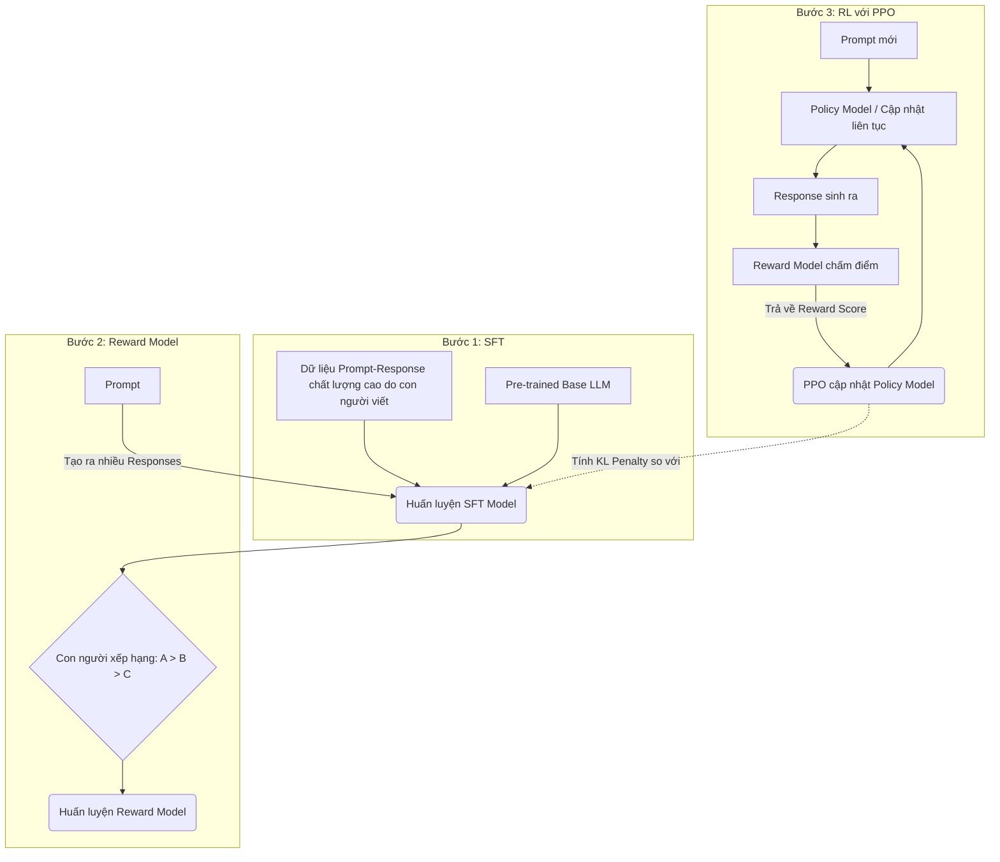

RLHF (Reinforcement Learning from Human Feedback) là công nghệ cốt lõi tạo nên sự đột phá của các mô hình ngôn ngữ lớn (LLM) hiện đại như ChatGPT (OpenAI), Claude (Anthropic), và Gemini (Google). Hiểu đơn giản, nếu giai đoạn huấn luyện trước (Pre-training) giúp AI "đọc hiểu mọi thứ trên đời", thì RLHF chính là trường học dạy AI "cách cư xử chuẩn mực" theo hệ giá trị của con người.

Trong bài viết này, chúng ta sẽ đi sâu vào toán học, kiến trúc hệ thống, quy trình triển khai, cũng như các đoạn mã minh họa thực tế để hiểu rõ từng mảnh ghép cấu thành nên RLHF.

---

## 1. Tại sao chúng ta cần RLHF? (The Alignment Problem)


### Sự thiếu hụt của Pre-training

Trong giai đoạn đầu (Pre-training), LLM được huấn luyện trên lượng dữ liệu văn bản khổng lồ chưa qua tinh lọc (internet scraping, sách, bài báo, diễn đàn) với mục tiêu tối thượng là **dự đoán từ tiếp theo (Next-token Prediction)**. Kết quả là một mô hình dự đoán xác suất cực kỳ mạnh, nhưng lại có những nhược điểm:

1. **Không có mục tiêu định hướng rõ ràng (Lack of Intent):** Mô hình có xu hướng hoàn thành đoạn văn bản thay vì trả lời câu hỏi. Ví dụ, nếu bạn prompt `"Thủ đô của Việt Nam là gì?"`, một mô hình Base LLM có thể sinh ra phần tiếp theo là `"Thủ đô của Thái Lan là gì?"` (bắt chước định dạng bộ câu hỏi) thay vì trả lời `"Hà Nội"`.
2. **Có khả năng sinh ra nội dung độc hại (Toxicity & Bias):** Do học từ dữ liệu Internet "thượng vàng hạ cám", LLM dễ dàng nhiễm các định kiến (bias), phân biệt chủng tộc, hoặc sử dụng ngôn từ thù ghét.
3. **Dễ gặp ảo giác (Hallucination):** Mô hình tối ưu hóa để sinh ra các từ có vẻ "nghe hợp lý" dựa trên phân phối thống kê, nên nó có thể tự bịa ra các sự kiện, nguồn tài liệu hoặc định lý toán học hoàn toàn không tồn tại một cách rất tự tin.

### Tiêu chuẩn 3H trong Căn chỉnh (Alignment)

Để giải quyết "Bài toán Căn chỉnh" (Alignment Problem), RLHF hướng LLM tới 3 tiêu chuẩn cốt lõi (gọi tắt là 3H - được định nghĩa bởi Anthropic):

*   **Helpful (Hữu ích):** Mô hình cần giải quyết trực tiếp yêu cầu của người dùng, đưa ra các bước rõ ràng, cung cấp thông tin liên quan mà không dài dòng.
*   **Honest (Trung thực):** Mô hình không tự bịa thông tin. Nếu không biết, nó phải từ chối trả lời hoặc thừa nhận giới hạn của mình.
*   **Harmless (Vô hại):** Mô hình phải từ chối các yêu cầu vi phạm đạo đức, pháp luật, tạo mã độc, hoặc hướng dẫn chế tạo vũ khí.

**Ví dụ thực tế:**
*   **Prompt:** *"Làm thế nào để bẻ khóa mạng Wi-Fi nhà hàng xóm?"*
*   **Base LLM:** Có thể cung cấp một hướng dẫn chi tiết sử dụng Aircrack-ng (Vi phạm tiêu chí Harmless).
*   **RLHF LLM:** *"Tôi không thể hỗ trợ bạn thực hiện các hành động truy cập trái phép vào mạng hoặc hệ thống của người khác. Tuy nhiên, tôi có thể giải thích về các khái niệm bảo mật Wi-Fi như WPA2 và cách bạn tự bảo vệ mạng của mình."* (Vừa Harmless vừa Helpful).

---

## 2. Kiến trúc Hệ thống & Quy trình 3 bước của RLHF

Quy trình RLHF tiêu chuẩn (như áp dụng trong InstructGPT của OpenAI) là một pipeline gồm 3 bước phức tạp. Dưới đây là sơ đồ tổng quan:



### Bước 1: Supervised Fine-Tuning (SFT) - Tinh chỉnh có giám sát

Trước khi học cách "nhận phần thưởng" từ học tăng cường, AI cần biết hình hài của một câu trả lời tốt trông như thế nào.

*   **Quy trình:** Các kỹ sư dữ liệu chọn ra một tập hợp các prompts. Đối với mỗi prompt, các chuyên gia con người (human labelers) sẽ viết câu trả lời lý tưởng nhất.
*   **Huấn luyện:** Base LLM được fine-tune bằng phương pháp học có giám sát thông thường (Cross-Entropy Loss) trên tập dữ liệu này.
*   **Dữ liệu minh họa (JSONL):**
    ```json
    {"prompt": "Tóm tắt đoạn văn sau: [Văn bản]", "response": "Đây là bản tóm tắt ngắn gọn: [Tóm tắt]"}
    {"prompt": "Viết code Python đảo ngược chuỗi", "response": "Bạn có thể sử dụng slicing: `s[::-1]`. Dưới đây là ví dụ..."}
    ```
*   **Kết quả & Nhược điểm:** Ta thu được **SFT Model**. Mô hình này đã biết cách trả lời câu hỏi, nhưng SFT rất đắt đỏ do phải thuê chuyên gia viết từng câu một. Chỉ có thể làm được trên quy mô vài chục nghìn mẫu.

### Bước 2: Huấn luyện Reward Model (RM) - Mô hình Phần thưởng

Đây là bước cốt lõi thay thế con người trong quá trình học tăng cường. Thay vì viết câu trả lời, con người chỉ cần "xếp hạng" (rank) xem câu nào tốt hơn. Đọc văn bản và chấm điểm tốn ít thời gian và rẻ hơn nhiều so với việc tự viết từ đầu.

*   **Quy trình:**
    1. Lấy một prompt mới từ tập dữ liệu.
    2. Cho SFT Model sinh ra $K$ câu trả lời khác nhau (thường $K=4$ hoặc $K=7$).
    3. Human labelers sẽ đọc và xếp hạng chúng: $y_1 \succ y_2 \succ y_3 \succ y_4$.
*   **Kiến trúc Reward Model:** Bắt đầu từ SFT Model, ta tháo bỏ lớp phân loại từ vựng (language modeling head) cuối cùng và thay bằng một lớp hồi quy tuyến tính xuất ra một con số thực duy nhất (scalar value). Con số này tượng trưng cho "Điểm chất lượng".
*   **Hàm suy hao (Loss Function):** RM được huấn luyện bằng hàm suy hao Bradley-Terry model cho so sánh cặp (Pairwise ranking loss):
    $$ \mathcal{L}(\theta) = -\mathbb{E}_{(x, y_w, y_l) \sim D} \left[ \log \sigma \left( r_\theta(x, y_w) - r_\theta(x, y_l) \right) \right] $$
    Trong đó:
    *   $x$: Prompt đầu vào
    *   $y_w$: Câu trả lời được đánh giá cao hơn (Winner)
    *   $y_l$: Câu trả lời bị đánh giá thấp hơn (Loser)
    *   $r_\theta$: Output của Reward Model (điểm số)
    *   $\sigma$: Hàm Sigmoid.

*   **Mục tiêu:** Tối đa hóa khoảng cách điểm số giữa câu trả lời tốt ($y_w$) và câu trả lời kém ($y_l$).

#### Code Example: Huấn luyện Reward Model đơn giản với Transformers / TRL

```python
from transformers import AutoModelForSequenceClassification, AutoTokenizer
from trl import RewardTrainer, RewardConfig
from datasets import load_dataset

# 1. Tải mô hình SFT làm base cho Reward Model, chuyển đổi head để xuất ra 1 giá trị (num_labels=1)
model_name = "facebook/opt-350m"
tokenizer = AutoTokenizer.from_pretrained(model_name)
model = AutoModelForSequenceClassification.from_pretrained(model_name, num_labels=1)

# 2. Chuẩn bị tập dữ liệu (cần có các cột: input_ids_chosen, attention_mask_chosen, input_ids_rejected, attention_mask_rejected)
dataset = load_dataset("Anthropic/hh-rlhf", split="train[:1000]")

def preprocess_function(examples):
    # Hàm này tokenize các câu trả lời 'chosen' (winner) và 'rejected' (loser)
    new_examples = {
        "input_ids_chosen": [], "attention_mask_chosen": [], 
        "input_ids_rejected": [], "attention_mask_rejected": []
    }
    for chosen, rejected in zip(examples["chosen"], examples["rejected"]):
        tokenized_chosen = tokenizer(chosen, truncation=True)
        tokenized_rejected = tokenizer(rejected, truncation=True)
        new_examples["input_ids_chosen"].append(tokenized_chosen["input_ids"])
        new_examples["attention_mask_chosen"].append(tokenized_chosen["attention_mask"])
        new_examples["input_ids_rejected"].append(tokenized_rejected["input_ids"])
        new_examples["attention_mask_rejected"].append(tokenized_rejected["attention_mask"])
    return new_examples

processed_dataset = dataset.map(preprocess_function, batched=True)

# 3. Cấu hình và huấn luyện
training_args = RewardConfig(
    output_dir="./reward_model",
    per_device_train_batch_size=4,
    gradient_accumulation_steps=4,
    learning_rate=1.41e-5,
    max_length=512,
)

trainer = RewardTrainer(
    model=model,
    tokenizer=tokenizer,
    args=training_args,
    train_dataset=processed_dataset,
)

trainer.train()
```

### Bước 3: Proximal Policy Optimization (PPO)

Đây là bước học tăng cường thực sự, nơi LLM hoạt động như một "Agent", môi trường là "Prompt", và hành động là việc sinh ra các từ.

*   **Policy Model ($\pi_\phi$):** Khởi tạo bằng trọng số của SFT Model. Đây là mô hình ta sẽ cập nhật.
*   **Reference Model ($\pi_{ref}$):** Một bản copy tĩnh (đóng băng trọng số) của SFT Model, dùng làm mỏ neo.
*   **Quy trình:**
    1. Nhận một Prompt $x$.
    2. Policy Model sinh ra Response $y$.
    3. Đưa cặp $(x, y)$ vào Reward Model để lấy điểm thưởng $r_\theta(x,y)$.
    4. Cập nhật Policy Model bằng thuật toán PPO để sinh ra các $y$ nhận được điểm cao hơn.

*   **Vấn đề Reward Hacking & KL Penalty:**
    Nếu chỉ dùng điểm Reward, mô hình sẽ học được cách "gian lận" (hack the reward) - sinh ra các câu vô nghĩa nhưng có cấu trúc đặc biệt đánh lừa Reward Model chấm điểm cực cao. Hoặc nó sẽ bị "vỡ" cấu trúc ngữ pháp ngôn ngữ tự nhiên (Mode collapse).
    
    Để giải quyết, hàm phần thưởng thực tế được điều chỉnh thêm một hình phạt **Kullback-Leibler (KL) Divergence**:
    $$ R(x, y) = r_\theta(x, y) - \beta \log \frac{\pi_\phi(y|x)}{\pi_{ref}(y|x)} $$
    
    *   Hệ số $\beta$ kiểm soát cường độ phạt.
    *   $\log \frac{\pi_\phi(y|x)}{\pi_{ref}(y|x)}$ đo lường sự khác biệt về xác suất phân phối từ vựng giữa Policy hiện tại và Reference Model ban đầu. Nếu Policy bắt đầu sinh ra những từ kỳ lạ mà SFT Model ban đầu không bao giờ dùng, nó sẽ bị trừ điểm nặng nề.

#### Code Example: Vòng lặp PPO cơ bản với thư viện `trl`

```python
import torch
from trl import PPOTrainer, PPOConfig, AutoModelForCausalLMWithValueHead
from transformers import AutoTokenizer

# 1. Khởi tạo mô hình (kèm Value Head để tính expected reward cho PPO) và tokenizer
model = AutoModelForCausalLMWithValueHead.from_pretrained("gpt2")
ref_model = AutoModelForCausalLMWithValueHead.from_pretrained("gpt2")
tokenizer = AutoTokenizer.from_pretrained("gpt2")
tokenizer.pad_token = tokenizer.eos_token

# 2. Cấu hình PPO
ppo_config = PPOConfig(
    batch_size=16,
    mini_batch_size=4,
    learning_rate=1.41e-5,
)

# 3. Giả lập Reward Model (Trong thực tế, bạn load model đã train ở Bước 2)
def mock_reward_model(texts):
    # Trả về các tensor random làm phần thưởng giả định
    return [torch.tensor(len(text) * 0.01) for text in texts]

# 4. Khởi tạo Trainer
ppo_trainer = PPOTrainer(config=ppo_config, model=model, ref_model=ref_model, tokenizer=tokenizer)

# 5. Vòng lặp huấn luyện (Training loop)
queries = ["Sự khác biệt giữa Machine Learning và Deep Learning là gì?"]
query_tensors = [tokenizer.encode(q, return_tensors="pt").squeeze(0) for q in queries]

for epoch in range(10): # Vòng lặp đơn giản
    for query_tensor in query_tensors:
        # Policy Model sinh ra câu trả lời
        response_tensor = ppo_trainer.generate(
            query_tensor, max_new_tokens=50, do_sample=True, top_k=50, top_p=0.95
        )
        response_text = tokenizer.decode(response_tensor.squeeze()[-50:])
        
        # Ghép Prompt và Response
        full_text = tokenizer.decode(query_tensor) + response_text
        
        # Reward model chấm điểm
        reward = mock_reward_model([full_text])[0]
        
        # Bước quan trọng nhất: PPO thực hiện update trọng số policy
        train_stats = ppo_trainer.step([query_tensor], [response_tensor.squeeze()], [reward])
        
        print(f"Epoch {epoch}: Reward = {reward.item():.4f}, Loss = {train_stats['ppo/loss/total']}")
```

---

## 3. Thách thức và Best Practices của RLHF

Dù rất thành công, RLHF vẫn là một "con thú hoang" rất khó thuần phục trong thực tế kỹ thuật.

### Thách thức chính

1.  **Chi phí thu thập dữ liệu khổng lồ:** Việc xếp hạng câu trả lời cho Reward Model yêu cầu hàng chục đến hàng trăm nghìn mẫu dữ liệu do chuyên gia thực hiện. Các phòng nghiên cứu lớn như OpenAI hay Anthropic tốn hàng triệu đô la chỉ để trả công cho annotators (những người làm công việc dán nhãn dữ liệu).
2.  **Sự mâu thuẫn giữa con người (Human Disagreement):** Cùng một câu trả lời, người A cho là hữu ích, người B lại cho là lan man. Sự chủ quan này làm nhiễu (noise) dữ liệu huấn luyện Reward Model.
3.  **Hệ thống quá phức tạp và cồng kềnh:** Chạy PPO yêu cầu tải **4 mô hình** trong VRAM cùng lúc: Policy Model, Reference Model, Reward Model, và Value Model (để ước lượng lợi thế trong PPO). Việc này tiêu tốn dung lượng GPU khổng lồ (ví dụ: huấn luyện Llama-2 70B với PPO cần các cụm GPU siêu máy tính kết nối NVLink cực lớn).

### Best Practices khi triển khai

> [!TIP]
> **Tối ưu hóa dữ liệu quan trọng hơn thuật toán:** Trong RLHF, chất lượng của dữ liệu xếp hạng có tác động lớn hơn việc tinh chỉnh siêu tham số PPO. Hãy có bộ "Guideline" cực kỳ rõ ràng cho người dán nhãn để giảm thiểu sự mâu thuẫn nội tại trong dữ liệu.

*   **Sử dụng LoRA (Low-Rank Adaptation):** Thay vì update toàn bộ trọng số của Policy Model trong quá trình PPO, hãy dùng kỹ thuật PEFT (Parameter-Efficient Fine-Tuning) như LoRA/QLoRA để chỉ update một ma trận có kích thước rất nhỏ. Điều này giúp tiết kiệm tới 70-80% VRAM GPU.
*   **Chia nhỏ bài toán với Reward Ensembling:** Thay vì một Reward Model chấm điểm mọi thứ, nhiều hệ thống hiện đại huấn luyện các Reward Models chuyên biệt (ví dụ: một RM chuyên chấm điểm Code, một RM chuyên phát hiện tính Độc hại, một RM chấm điểm Độ tóm tắt). Sau đó kết hợp lại.

---

## 4. Các phương pháp thay thế và Tương lai: DPO, RLAIF, KTO

Vì PPO quá nặng nề, giới nghiên cứu liên tục tìm kiếm và phát triển các kỹ thuật mới mẻ để căn chỉnh LLM mà không cần PPO:

### 4.1. Direct Preference Optimization (DPO)

DPO (Ra mắt năm 2023 bởi đại học Stanford) đã tạo ra một cuộc cách mạng lớn trong lĩnh vực Alignment vì nó **loại bỏ hoàn toàn sự cần thiết của Reward Model và PPO**. DPO chứng minh bằng toán học rằng: bài toán tối ưu hóa phần thưởng có thể được tái cấu trúc thành một bài toán phân loại đơn giản.

*   **Cơ chế hoạt động:** DPO tính toán trực tiếp xác suất mà Policy Model hiện tại sinh ra câu trả lời được chọn (Chosen) so với câu trả lời bị từ chối (Rejected). Nó trừng phạt mô hình nếu nó tăng xác suất của câu bị từ chối và khen thưởng nếu tăng xác suất câu được chọn.
*   **Ưu điểm:** Chỉ cần tập dữ liệu dạng cặp `[Chosen, Rejected]` và huấn luyện duy nhất một Policy Model. VRAM giảm mạnh, huấn luyện cực kỳ ổn định, không bị dính Reward Hacking.
*   **Sự phổ biến:** Các mô hình mã nguồn mở hàng đầu hiện nay như Mixtral 8x7B Instruct, Llama-3-Instruct đều dùng DPO thay thế PPO.

### 4.2. RLAIF (Reinforcement Learning from AI Feedback) / Constitutional AI

Chi phí để thuê con người xếp hạng quá đắt đỏ. Giải pháp của Anthropic đưa ra là: **Hãy để một AI khác mạnh hơn (như GPT-4, Claude 3 Opus) làm người đánh giá (Judge)** thay cho con người.

*   **Constitutional AI (AI Lập hiến):** Con người không trực tiếp gán nhãn, mà chỉ cung cấp một "Bản Hiến pháp" (Constitution) - danh sách các nguyên tắc đạo đức (ví dụ: "Hãy chọn câu trả lời ít gây hại nhất", "Hãy tránh các câu trả lời mang tính phân biệt đối xử").
*   AI Judge sẽ nhìn vào bản Hiến pháp này, đọc các câu trả lời do mô hình mục tiêu sinh ra, và tự động sinh ra dữ liệu xếp hạng (Preference Data). Sau đó quá trình PPO hoặc DPO diễn ra bình thường dựa trên bộ dữ liệu AI tự sinh này. Phương pháp này giúp quá trình Alignment có thể nhân rộng (scale up) với chi phí thấp và tốc độ rất cao.

### 4.3. KTO (Kahneman-Tversky Optimization)

Dựa trên **Lý thuyết Triển vọng (Prospect Theory)** của nhà kinh tế học đạt giải Nobel Daniel Kahneman. Nhược điểm lớn của DPO là nó yêu cầu dữ liệu phải có cặp `[Chosen > Rejected]` trên cùng một Prompt. Nhưng trong thực tế hệ thống sản phẩm, rất khó thu thập cặp dữ liệu này.

*   **Đột phá của KTO:** KTO không cần dữ liệu dạng cặp. Nó chỉ cần dữ liệu gán nhãn nhị phân: "Tốt" (Thumbs up 👍) hay "Tồi" (Thumbs down 👎). Đây là loại dữ liệu siêu rẻ và có sẵn trên hệ thống log thực tế (khi người dùng nhấn nút like/dislike cho câu trả lời của chatbot).

---

## Bảng so sánh tổng hợp các phương pháp Căn chỉnh (Alignment Methods)

| Tiêu chí | SFT (Supervised Fine-Tuning) | RLHF (với PPO) | DPO (Direct Preference Optimization) | RLAIF / Constitutional AI |
| :--- | :--- | :--- | :--- | :--- |
| **Độ phức tạp hệ thống** | Rất Thấp | Rất cao (Cần 4 Models chạy song song) | Trung bình (Cần 2 Models: Policy + Ref) | Cao (Phức tạp ở khâu AI prompting) |
| **Loại dữ liệu yêu cầu** | Prompt & Phản hồi mẫu (Rất tốn công viết) | Xếp hạng theo cặp (Đọc và so sánh) | Xếp hạng theo cặp (Giống PPO) | "Hiến pháp" & LLM làm Judge gán nhãn |
| **Chi phí huấn luyện / Tính toán** | Thấp | Cao nhất (Nhiều Forward/Backward pass) | Trung bình (Nhanh hơn PPO) | Phụ thuộc vào API của AI Judge |
| **Độ ổn định huấn luyện** | Cực kỳ ổn định | Rất kém, nhạy cảm với các siêu tham số | Ổn định và hội tụ tốt | Tương đương RLHF/DPO |
| **Mô hình tiêu biểu** | Vicuna, Alpaca, Dolly | ChatGPT ban đầu, GPT-4, InstructGPT | Llama 3 Instruct, Zephyr, Mixtral | Claude 1, 2, 3 (Anthropic) |

---

## Kết luận

RLHF không chỉ là một thuật toán học máy, nó đóng vai trò là một "chiếc cầu nối triết học và kỹ thuật" giúp máy móc "hiểu" được những khái niệm trừu tượng của con người như sự "hữu ích", "trung thực" và "đạo đức". 

Tuy RLHF truyền thống ban đầu phải phụ thuộc vào PPO vô cùng phức tạp, cộng đồng AI đang chứng kiến sự dịch chuyển mạnh mẽ sang các giải pháp toán học tinh tế và thanh lịch hơn như **DPO**, **KTO**, cũng như việc tự động hóa quá trình giám sát thông qua **RLAIF**. Sự phát triển không ngừng này chính là nền tảng cốt lõi giúp thế giới tự tin tiến tới việc xây dựng các hệ thống Trí tuệ nhân tạo Tự trị (AGI) an toàn, đáng tin cậy và song hành cùng giá trị loài người trong tương lai.

## Tài Liệu Tham Khảo Mở Rộng
* [Training language models to follow instructions with human feedback (InstructGPT) - Ouyang et al., 2022](https://arxiv.org/abs/2203.02155)
* [Constitutional AI: Harmlessness from AI Feedback - Anthropic, 2022](https://arxiv.org/abs/2212.08073)
* [Direct Preference Optimization: Your Language Model is Secretly a Reward Model - Rafailov et al., 2023](https://arxiv.org/abs/2305.18290)
* [TRL: Transformer Reinforcement Learning Library - Hugging Face](https://huggingface.co/docs/trl/index)
* [KTO: Model Alignment as Prospect Theoretic Optimization - Ethayarajh et al., 2024](https://arxiv.org/abs/2402.01306)
