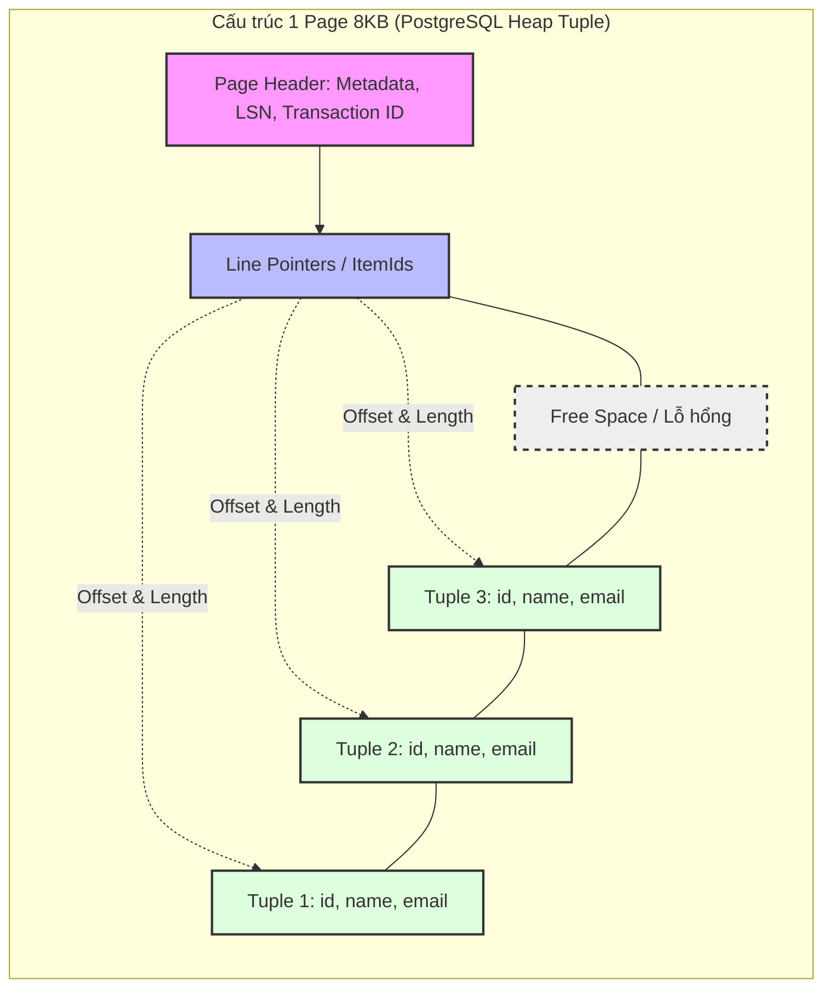

**Row-based Storage** (hay Row-oriented Storage) không chỉ là một khái niệm học thuật. Khi bạn chạy một lệnh `INSERT` vào PostgreSQL hoặc MySQL, dữ liệu vật lý phải được ghi xuống đĩa (disk). Trong kiến trúc Row-based, toàn bộ dữ liệu của một hàng (row/record/tuple) được ghi **kề sát nhau (contiguous)** vào cùng một block bộ nhớ.

Đây là xương sống của mọi hệ thống **OLTP** (Online Transaction Processing). Bài viết này sẽ mổ xẻ Row-based storage dưới lăng kính của một System Engineer: Cơ chế I/O vật lý, Page Layout, và các Trade-offs dẫn tới sập hệ thống.

## 1. Cơ chế Lưu trữ Vật lý: Anatomizing a Page (8KB/16KB)

Database không tương tác với ổ cứng qua từng dòng (row). Hệ điều hành và Database thao tác I/O theo từng **khối (Page hoặc Block)**, thông thường là 8KB (PostgreSQL) hoặc 16KB (InnoDB/MySQL).

Khi bạn truy vấn `SELECT * FROM Users WHERE ID = 1`, Database không quét từng byte, nó tìm vị trí của Page chứa Row đó và nạp toàn bộ Page (8KB) lên RAM (Buffer Pool).

### PostgreSQL Heap Page Layout

Hãy xem cấu trúc một Page trong PostgreSQL:



**Phân tích kỹ thuật (Technical Deep-dive):**
- **Page Header**: Lưu trữ LSN (Log Sequence Number) cho cơ chế WAL (Write-Ahead Logging) và Checkpoint.
- **Line Pointers**: Mảng các con trỏ từ đầu Page trỏ ngược xuống các Tuples ở cuối Page. Giúp O(1) lookup trong nội bộ Page.
- **Tuples (Rows)**: Được ghi bắt đầu từ cuối Page ngược lên trên. Row-based phát huy sức mạnh ở đây: TẤT CẢ các cột của một Row được nén chặt trong cùng một Tuple.

## 2. Row-based I/O & B-Tree Traversals

Tại sao Row-based Storage lại vô đối cho OLTP? Câu trả lời nằm ở **B-Tree** và **Point Lookups**.

Trong MySQL (InnoDB), dữ liệu được tổ chức dưới dạng **Clustered Index**. Tức là, cấu trúc cây B+Tree chứa luôn Data ở tầng Leaf Nodes (các nút lá).


*B-Tree: Các node nội bộ (internal nodes) trỏ đến các node con. Tại Leaf Nodes của Clustered Index, toàn bộ Row được lưu trữ. Nguồn: Wikimedia*

**The I/O Advantage (Lợi thế I/O):**
- Khi có một request thanh toán: `UPDATE accounts SET balance = balance - 100 WHERE id = 999;`
- Nhờ B-Tree, hệ thống chỉ mất $O(\log N)$ I/O operations (thường là 3-4 lần rẽ nhánh) để tìm đúng Page chứa user 999.
- Vì là **Row-based**, nên khi tìm thấy, toàn bộ thông tin (id, name, balance, status) đã nằm sẵn trong Page đó. **Chỉ cần 1 lần Random I/O Read** là lấy đủ mọi thông tin cần thiết.

## 3. Systemic Trade-offs: Latency, Throughput & FinOps

Sử dụng Row-based storage cho hệ thống OLAP (Data Warehouse) là một thảm họa kiến trúc. Dưới đây là sự đánh đổi hệ thống (Trade-offs):

### Read Amplification (Khuếch đại I/O)

Giả sử bảng `Users` có 50 cột. Bạn muốn đếm số user ở VN:
`SELECT COUNT(*) FROM Users WHERE country = 'VN';`

Dù bạn chỉ cần đúng 1 cột `country`, Database vẫn phải bốc toàn bộ 50 cột (toàn bộ Page) từ Disk lên RAM. Hiện tượng **Read Amplification** (đọc dư thừa) này bóp nghẹt băng thông Disk (I/O Bottleneck), quét sạch Buffer Cache (Cache Eviction), và tăng vọt CPU khi giải mã dữ liệu dư thừa. Đây là lý do Column-based storage sinh ra.

### FinOps: Tối ưu Chi phí Disk I/O trên Cloud

Với Row-based, hệ thống của bạn thực hiện **Random I/O** liên tục để đọc/ghi các Row nằm rải rác. Nếu host trên AWS RDS, bạn phải cấp phát IOPS rất lớn (ổ `io2` hoặc `gp3`), dẫn tới chi phí cao. 

Dưới đây là cấu hình Terraform thực chiến cho một DB Row-based OLTP Production, tối ưu cho Random I/O cường độ cao:

```hcl
resource "aws_db_instance" "oltp_postgres" {
  identifier        = "core-payment-db"
  engine            = "postgres"
  engine_version    = "15.4"
  instance_class    = "db.r6g.4xlarge"  # High RAM for Buffer Pool
  allocated_storage = 1000
  
  # FinOps: Dùng gp3 để tách biệt IOPS và Storage thay vì io2 đắt đỏ
  storage_type      = "gp3"
  iops              = 12000 # Random I/O cần IOPS cao để tránh I/O Wait
  throughput        = 500   # MB/s
  
  parameter_group_name = aws_db_parameter_group.pg_tune.name
}

resource "aws_db_parameter_group" "pg_tune" {
  name   = "pg-tune-row-based"
  family = "postgres15"

  parameter {
    name  = "shared_buffers"
    # PostgreSQL khuyến nghị 25% RAM để cache các Pages (Row-based)
    value = "32768" # 32GB
  }
  parameter {
    name  = "random_page_cost"
    # Mặc định là 4.0 (cho ổ HDD). Với SSD gp3, set về 1.1 để Index Scan được ưu tiên
    value = "1.1" 
  }
}
```

## 4. Real-world Incidents: OOMKilled & Page Fragmentation

### Sự cố 1: OOMKilled (Out of Memory) khi đọc Bảng Lớn

Rất nhiều kỹ sư mắc lỗi dùng Row-based như một kho Data Warehouse. Khi chạy một Job ETL để kéo 10 triệu dòng ra Python bằng `cursor.fetchall()`, toàn bộ dữ liệu của 10 triệu dòng (với vô số cột) sẽ bị hút vào RAM của container, gây ra lỗi **JVM OOMKilled** hoặc Python Process bị Linux OOM Killer bắn hạ.

**Giải pháp (Workaround):** Sử dụng Server-side Cursors (Generators) để stream từng Row (hoặc Batch) một cách an toàn mà không làm nổ RAM:

```python
import psycopg2

def extract_row_based_safely(query, batch_size=2000):
    conn = psycopg2.connect("dbname=coredb user=data_engineer")
    
    # name='server_cursor' kích hoạt Server-side cursor trên PostgreSQL
    with conn.cursor(name='server_cursor') as cur:
        cur.execute(query)
        while True:
            # Chỉ kéo từng batch nhỏ Row-based lên RAM (Network Fetch)
            records = cur.fetchmany(batch_size)
            if not records:
                break
            for record in records:
                yield record # Yielding tránh OOM

# Memory usage ổn định ở mức vài chục MB dù kéo 100GB dữ liệu
for row in extract_row_based_safely("SELECT * FROM transactions"):
    write_to_s3(row)
```

### Sự cố 2: MVCC Bloat và Page Fragmentation

Trong PostgreSQL, khi bạn `UPDATE` một Row, database KHÔNG sửa đè trực tiếp (in-place) mà đánh dấu Row cũ là **Dead Tuple** và ghi một Tuple mới vào trong Page (cơ chế MVCC).
Điều này khiến các Page nhanh chóng đầy rác. Nếu tiến trình Autovacuum không chạy kịp, số lượng Page bị phình to (Table Bloat), khiến một câu lệnh `SELECT` phải quét qua hàng nghìn Page đầy Dead Tuples (Disk I/O tăng đột biến, hệ thống bị chậm lại).

**Cách khắc phục:**
1. Tuning lại `autovacuum_vacuum_scale_factor`.
2. Theo dõi chỉ số *Free Space Map (FSM)*.
3. Dùng `pg_repack` hoặc `VACUUM FULL` (sẽ lock table) để dọn dẹp và sắp xếp lại các Page.

## Nguồn Tham Khảo (References)

- [Designing Data-Intensive Applications - Martin Kleppmann (O'Reilly)](https://dataintensive.net/)
- [PostgreSQL Official Documentation: Database Page Layout](https://www.postgresql.org/docs/current/storage-page-layout.html)
- [MySQL InnoDB Architecture - B-Tree Indexes](https://dev.mysql.com/doc/refman/8.0/en/innodb-architecture.html)
- AWS Architecture Blog: [Optimizing PostgreSQL on Amazon RDS](https://aws.amazon.com/blogs/database/best-practices-for-working-with-amazon-aurora-and-amazon-rds-postgresql/)
