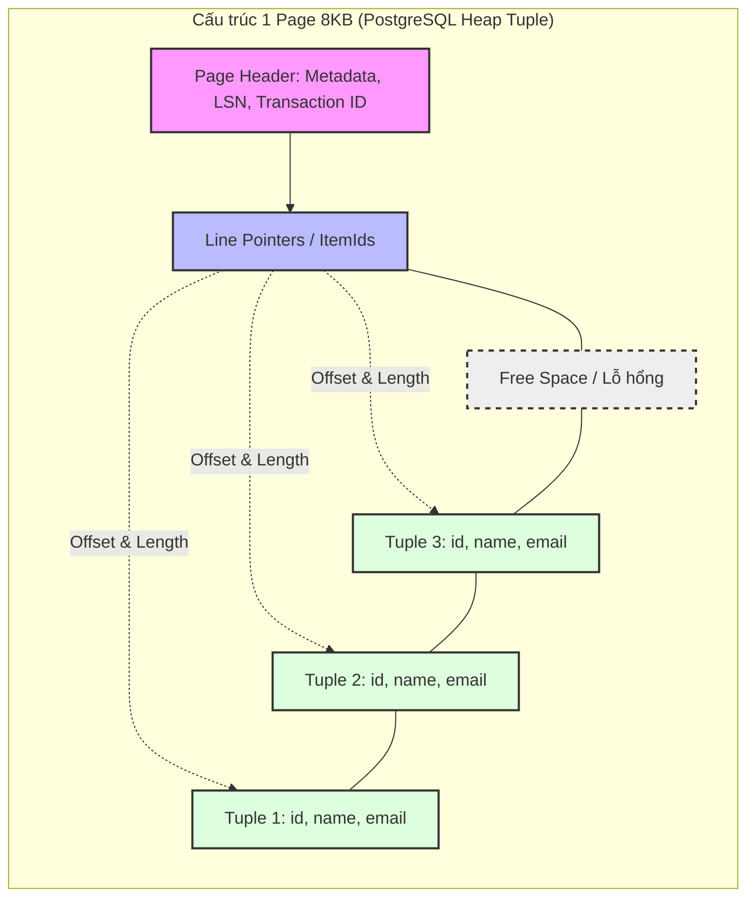

**Row-based Storage** (Lưu trữ hướng dòng) không chỉ là một khái niệm học thuật. Khi bạn chạy một lệnh `INSERT` vào PostgreSQL hoặc MySQL, toàn bộ dữ liệu của một hàng (row/record/tuple) vật lý phải được ghi xuống đĩa (disk) và nằm kề sát nhau (contiguous) trong cùng một block bộ nhớ.

Đây là xương sống của mọi hệ thống **OLTP** (Online Transaction Processing). Khác với các hệ thống OLAP hay AI/ML (GenAI) thường dùng Columnar Storage (Parquet, ORC) để quét hàng tỷ bản ghi, OLTP yêu cầu sự chính xác, tốc độ siêu nhanh (low-latency) khi tương tác với các dòng đơn lẻ. Bài viết này sẽ mổ xẻ Row-based storage dưới lăng kính của một System Engineer: Cơ chế I/O vật lý, Memory Pages, Write-Ahead Logging (WAL), và sự đối đầu kinh điển giữa B-Tree vs LSM-Tree.

---

## 1. Cơ chế Lưu trữ Vật lý: Memory Pages (8KB/16KB)

Database không tương tác với ổ cứng (SSD/HDD) qua từng dòng đơn lẻ. Để tối ưu tốc độ I/O (I/O throughput), Hệ điều hành và Database thao tác đọc/ghi theo từng **khối (Page hoặc Block)**, thông thường là 8KB (như PostgreSQL) hoặc 16KB (như InnoDB của MySQL).

Khi bạn thực hiện truy vấn `SELECT * FROM Users WHERE ID = 1`, Database sẽ không quét từng byte trên đĩa. Nó tìm đúng vị trí của Page chứa bản ghi đó và kéo toàn bộ Page (8KB) lên RAM (vùng này gọi là **Buffer Pool**).

### PostgreSQL Heap Page Layout

Hãy xem cấu trúc một Page vật lý trong PostgreSQL:



**Phân tích kỹ thuật (Technical Deep-dive]:**
- **Page Header**: Nơi lưu trữ siêu dữ liệu (Metadata) như LSN (Log Sequence Number) dùng cho cơ chế Write-Ahead Logging.
- **Line Pointers**: Mảng các con trỏ từ đầu Page trỏ ngược xuống các Tuples vật lý ở cuối Page. Điều này cho phép thao tác tìm kiếm (lookup) diễn ra trong $\mathcal{"O"}(1)$ thời gian nội bộ Page.
- **Tuples (Rows)**: Được xếp từ cuối Page ngược lên trên. Row-based phát huy toàn bộ sức mạnh ở đây: TẤT CẢ các cột (id, name, email) của một User được nén chặt cạnh nhau. Database chỉ cần nạp 1 Page là có toàn bộ thông tin của User đó.

---

## 2. Cấu trúc Dữ liệu Cốt lõi: B-Tree vs. LSM-Tree

Để tổ chức hàng triệu Pages trên ổ cứng sao cho dễ tìm kiếm nhất, Database sử dụng hai cấu trúc dữ liệu kinh điển: B-Tree và LSM-Tree.

### 2.1. B-Tree (B+Tree) - Sự Thống Trị của Hệ Cơ Sở Dữ Liệu Quan Hệ (RDBMS)
B-Tree (cụ thể là B+Tree) là tiêu chuẩn vàng của PostgreSQL, MySQL và Oracle.
- **Cơ chế (In-place Updates):** Khi có thay đổi (UPDATE), hệ thống tìm đúng Page (Leaf Node) chứa Row đó trên ổ cứng và sửa trực tiếp dữ liệu (ghi đè - overwrite). 
- **Ưu điểm:** Tối ưu hóa cực tốt cho thao tác đọc đơn lẻ (Point Lookups) và quét dải (Range Scans). Một cây B+Tree có chiều cao 4 có thể chứa hàng tỷ bản ghi, chỉ tốn 4 phép đọc I/O ($\mathcal{"O"}(\log N)$) để tìm thấy dữ liệu.
- **Nhược điểm:** Phải thực hiện Random I/O (Đọc/Ghi ngẫu nhiên). Dưới tải lượng cập nhật dữ liệu khủng khiếp (Write-heavy workloads), ổ đĩa sẽ bị phân mảnh và thắt cổ chai I/O.

### 2.2. LSM-Tree (Log-Structured Merge-Tree) - Tương lai của Big Data & NoSQL
LSM-Tree sinh ra để tối ưu hóa cho tốc độ Ghi, được dùng bởi Cassandra, RocksDB, ScyllaDB và Kafka.
- **Cơ chế (Append-only):** Thay vì tìm vị trí và ghi đè (In-place), mọi thay đổi được gom lại trên RAM (MemTable). Khi MemTable đầy, nó đổ xuống đĩa thành một file hoàn toàn mới (SSTable - Sorted String Table) bằng thao tác **Sequential I/O** (Ghi tuần tự). Một tiến trình ngầm (Compaction) sẽ chạy sau để gộp các file này lại.
- **Ưu điểm:** Write Throughput khổng lồ, phù hợp hoàn hảo với hệ thống Logging, Timeseries, IoT.
- **Nhược điểm:** Đọc chậm hơn B-Tree (Read Amplification) vì khi query, hệ thống phải rà soát qua nhiều SSTable khác nhau.

---

## 3. Write-Ahead Logging (WAL) & Sự Đảm Bảo ACID

Cho dù dùng B-Tree hay LSM-Tree, bộ nhớ RAM (MemTable hay Buffer Pool) luôn có nguy cơ bị bốc hơi nếu máy chủ mất điện (Power Outage). Để đảm bảo tính bền vững (Durability) trong nguyên tắc ACID, Database sử dụng **Write-Ahead Logging (WAL)**.

- Mọi thao tác sửa đổi dữ liệu, trước khi áp dụng vào Data Pages chính, BẮT BUỘC phải được ghi nối đuôi (Append) vào một file Nhật ký (WAL file) trên ổ cứng trước.
- **Hiệu năng:** Vì WAL là cơ chế Append-only, nó chỉ sinh ra Sequential I/O (nhanh hơn hàng chục lần so với Random I/O của B-Tree updates). Nhờ vậy, Database báo `COMMIT SUCCESS` ngay khi WAL ghi xong, không cần đợi thao tác cập nhật Page phức tạp.
- **Crash Recovery:** Khi sập nguồn và khởi động lại, Database sẽ đọc WAL file, chơi lại (Replay) các lệnh bị bỏ lỡ và khôi phục hệ thống về trạng thái an toàn nhất.

---

## 4. Systemic Trade-offs: Latency, Throughput & FinOps

Sử dụng Row-based storage cho hệ thống OLAP (Data Warehouse/AI Training) là một thảm họa kiến trúc.

### Read Amplification (Khuếch đại I/O)
Giả sử bảng `Users` có 50 cột (id, name, age, email, address, preferences, v.v.). Bạn muốn đếm số lượng user ở Việt Nam:
`SELECT COUNT(id) FROM Users WHERE country = 'VN';`
Dù bạn chỉ cần đụng tới 1 cột `country`, Database B-Tree vẫn phải nạp toàn bộ 50 cột (toàn bộ nội dung Page) từ Disk lên RAM. Hiện tượng **Read Amplification** (đọc dư thừa) này bóp nghẹt băng thông Disk (I/O Bottleneck), quét sạch Buffer Cache (Cache Eviction), và tăng vọt CPU khi giải mã dữ liệu dư thừa. (Đó là lý do Column-based storage sinh ra để trị OLAP).

### FinOps: Tối ưu Chi phí Disk I/O trên Cloud
Với Row-based, hệ thống của bạn thực hiện **Random I/O** liên tục. Nếu host trên AWS RDS, bạn phải cấp phát IOPS rất lớn (ổ `io2` hoặc `gp3`), dẫn tới hóa đơn khổng lồ. 

Dưới đây là cấu hình Terraform thực chiến cho một DB Row-based OLTP Production, tối ưu cho Random I/O cường độ cao:

```hcl
resource "aws_db_instance" "oltp_postgres" {
  identifier        = "core-payment-db"
  engine            = "postgres"
  engine_version    = "15.4"
  instance_class    = "db.r6g.4xlarge"  # High RAM for Buffer Pool
  allocated_storage = 1000
  
  # FinOps: Dùng gp3 để tách biệt IOPS và Storage thay vì io2 đắt đỏ
  storage_type      = "gp3"
  iops              = 12000 # Random I/O cần IOPS cao để tránh I/O Wait
  throughput        = 500   # MB/s
  
  parameter_group_name = aws_db_parameter_group.pg_tune.name
}

resource "aws_db_parameter_group" "pg_tune" {
  name   = "pg-tune-row-based"
  family = "postgres15"

  parameter {
    name  = "shared_buffers"
    # PostgreSQL khuyến nghị 25% RAM để cache các Pages (Row-based)
    value = "32768" # 32GB
  }
  parameter {
    name  = "random_page_cost"
    # Mặc định là 4.0 (cho ổ HDD từ xa xưa). Với SSD gp3 hiện đại, set về 1.1 để Query Planner ưu tiên Index Scan
    value = "1.1" 
  }
}
```

---

## 5. Real-world Incidents: OOMKilled & Page Fragmentation

### Sự cố 1: OOMKilled (Out of Memory) khi đọc Bảng Lớn
Rất nhiều kỹ sư mắc lỗi dùng Database OLTP (Row-based) như một kho Data Warehouse. Khi chạy một Script ETL để kéo 10 triệu dòng ra Python bằng `cursor.fetchall()`, toàn bộ dữ liệu của 10 triệu dòng (với vô số cột) sẽ bị hút vào RAM của container, gây ra lỗi **JVM OOMKilled** hoặc Python Process bị Linux OOM Killer bắn hạ không thương tiếc.

**Giải pháp (Workaround):** Sử dụng Server-side Cursors (Generators) để stream từng Row (hoặc Batch) một cách an toàn mà không làm nổ RAM:

```python
import psycopg2

def extract_row_based_safely(query, batch_size=2000):
    conn = psycopg2.connect("dbname=coredb user=data_engineer")
    
    # name='server_cursor' kích hoạt Server-side cursor trên PostgreSQL
    with conn.cursor(name='server_cursor') as cur:
        cur.execute(query)
        while True:
            # Chỉ kéo từng batch nhỏ Row-based qua đường mạng lên RAM
            records = cur.fetchmany(batch_size)
            if not records:
                break
            for record in records:
                yield record # Sử dụng Yield (Generator) để tránh nổ OOM

# Memory usage ổn định ở mức vài chục MB dù kéo 100GB dữ liệu
for row in extract_row_based_safely("SELECT * FROM transactions"):
    write_to_s3[row]
```

### Sự cố 2: MVCC Bloat và Page Fragmentation
Trong PostgreSQL, cơ chế MVCC (Multi-Version Concurrency Control) yêu cầu rằng khi bạn `UPDATE` một Row, database KHÔNG sửa đè trực tiếp (in-place) lập tức. Nó đánh dấu Row cũ là **Dead Tuple** và tạo ra một Tuple mới, nhét chung vào Page.
Điều này khiến các Page nhanh chóng đầy rác. Nếu tiến trình Autovacuum không chạy kịp, số lượng Page bị phình to (Table Bloat), khiến một câu lệnh `SELECT` phải quét qua hàng nghìn Page đầy Dead Tuples (Disk I/O tăng đột biến, hệ thống bị chậm lại cực độ).

**Cách khắc phục:**
1. Tuning lại `autovacuum_vacuum_scale_factor` (Giảm xuống để chạy Autovacuum nhạy hơn).
2. Theo dõi chỉ số *Free Space Map (FSM)*.
3. Sử dụng công cụ `pg_repack` hoặc `VACUUM FULL` (Cảnh báo: Sẽ lock table toàn cục) để dọn dẹp và sắp xếp lại các Page.

---

## Nguồn Tham Khảo (References)
*   **Designing Data-Intensive Applications** - *Martin Kleppmann (O'Reilly)* - Cuốn sách kinh điển giải thích chi tiết B-Tree, LSM-Tree, và Column-oriented vs Row-oriented.
*   **PostgreSQL Official Documentation:** [Database Page Layout][https://www.postgresql.org/docs/current/storage-page-layout.html]
*   **MySQL InnoDB Architecture:** [B-Tree Indexes & Pages][https://dev.mysql.com/doc/refman/8.0/en/innodb-architecture.html]
*   **AWS Architecture Blog:** [Optimizing PostgreSQL on Amazon RDS](https://aws.amazon.com/blogs/database/best-practices-for-working-with-amazon-aurora-and-amazon-rds-postgresql/]
