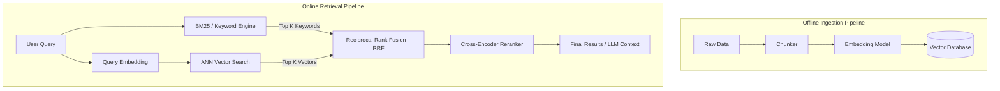

Tìm kiếm ngữ nghĩa (Semantic Search) là trụ cột của hệ sinh thái RAG (Retrieval-Augmented Generation) và GenAI hiện đại. Đối với một Data Engineer, việc hiểu Semantic Search không dừng lại ở khái niệm "máy tính hiểu được ngôn ngữ", mà là bài toán thiết kế một **Vector Database** đủ khả năng chịu tải hàng tỷ bản ghi với độ trễ dưới 10ms (sub-10ms latency).

Bài viết này sẽ mổ xẻ kiến trúc vật lý của hệ thống Semantic Search, so sánh sự đánh đổi của các thuật toán Indexing (HNSW vs IVFFlat), cách xử lý các rủi ro vận hành thực tế (OOMKilled, Stale Data) và tối ưu chi phí (FinOps).

## 1. Sự tiến hóa: Từ Keyword Search đến Hybrid Search

Tìm kiếm truyền thống (Keyword Search) dựa trên thuật toán **BM25** (hoặc TF-IDF), bản chất là đếm tần suất xuất hiện của từ khóa. 
- **Điểm nghẽn hệ thống:** Nó gặp hội chứng "mù đồng nghĩa" (Synonym Blindness) và nhạy cảm với lỗi chính tả (OOV - Out of Vocabulary).
- **Giải pháp:** Semantic Search sử dụng các mô hình học sâu (như `text-embedding-3-small` của OpenAI) để chuyển đổi (embed) cả câu truy vấn và tài liệu thành các **Vector** đa chiều (thường là 768 hoặc 1536 chiều).

Tuy nhiên, trong môi trường Production, Vector Search thuần túy thường thất bại khi người dùng tìm kiếm chính xác các mã định danh (Ví dụ: `SKU-12345` hoặc `NullPointerException`). Do đó, kiến trúc chuẩn hiện nay là **Hybrid Search**.

### Kiến trúc Hybrid Search Pipeline



**Workflow:**
1. **Truy vấn song song:** Hệ thống gửi query đồng thời đến Vector Search (tìm ý nghĩa) và Keyword Search (tìm chính xác từ khóa).
2. **RRF (Reciprocal Rank Fusion):** Thuật toán gộp điểm số từ 2 danh sách kết quả không đồng nhất.
3. **Reranking:** Dùng một mô hình Cross-Encoder nhỏ và chính xác hơn để đánh giá lại (re-score) Top K kết quả trước khi trả về.

## 2. Giải phẫu Vector Database: Indexing Algorithms

Các cơ sở dữ liệu truyền thống dùng B-Tree để đánh chỉ mục. Nhưng trong không gian 1536 chiều, B-Tree hoàn toàn vô dụng do hiện tượng **Curse of Dimensionality** (Lời nguyền số chiều). Vector DB (như Pinecone, Qdrant, Milvus) giải quyết bằng các thuật toán tìm kiếm lân cận gần đúng **ANN (Approximate Nearest Neighbor)**.

Dưới đây là một ảnh minh họa khái niệm K-Nearest Neighbors (KNN), thuật toán nền tảng của các phép tìm kiếm vector:


### 2.1. HNSW (Hierarchical Navigable Small World)

Đây là thuật toán mặc định của hầu hết Vector DB hiện nay.
- **Cơ chế:** Xây dựng một đồ thị đa tầng (multi-layer graph). Tầng trên cùng có ít điểm và kết nối dài (để nhảy nhanh qua không gian), các tầng dưới có nhiều điểm và kết nối ngắn (để dò tìm chính xác).
- **Ưu điểm:** Tỷ lệ chính xác (Recall) cực cao (thường >95%). Hỗ trợ thêm/xóa/sửa (CRUD) dữ liệu động cực tốt mà không làm giảm chất lượng index.
- **Nhược điểm (Trade-off):** Ngốn RAM khủng khiếp. HNSW không chỉ lưu trữ vector mà còn phải lưu cấu trúc đồ thị (edges/links) trong bộ nhớ.

### 2.2. IVFFlat (Inverted File with Flat Compression)

- **Cơ chế:** Sử dụng K-Means để phân cụm (cluster) không gian vector thành các vùng (Voronoi cells). Khi truy vấn, hệ thống chỉ cần tìm cụm gần nhất và quét nội bộ cụm đó.
- **Ưu điểm:** Rất tiết kiệm RAM và thời gian build index cực nhanh. Phù hợp với các dataset khổng lồ (>50M vectors) nhưng tĩnh.
- **Nhược điểm:** Phải có dữ liệu trước để train cụm. Nếu dữ liệu mới được chèn vào có phân phối khác với dữ liệu cũ, index sẽ bị "Stale" (cũ kĩ). Yêu cầu phải chạy quá trình xây dựng lại chỉ mục (`REINDEX`) định kỳ để duy trì độ chính xác.

## 3. Show, Don't Tell: Thực thi Hybrid Search

Thay vì lý thuyết xuông, dưới đây là cách chúng ta cấu hình **Qdrant** qua Terraform và thực thi Hybrid Search bằng Python.

### Terraform Provisioning (Qdrant Cloud)

```hcl
# main.tf
terraform {
  required_providers {
    qdrant = {
      source  = "qdrant/qdrant-cloud"
      version = "~> 1.0.0"
    }
  }
}

resource "qdrant_cluster" "prod_hybrid_search" {
  name           = "ecommerce-search-prod"
  cloud_provider = "aws"
  cloud_region   = "us-east-1"
  
  # Sử dụng RAM + Disk (Tiered Storage) để chống OOM
  node_configuration {
    package_id = "standard"
    size       = "8gb"
  }
}
```

### Python: Thực thi Hybrid Search (Chống OOM)

Khi đẩy dữ liệu vào cluster, sử dụng batch processing thay vì load toàn bộ dữ liệu vào memory:

```python
from qdrant_client import QdrantClient
from qdrant_client.models import PointStruct, VectorParams, Distance

# Kết nối đến Qdrant
client = QdrantClient(url="https://<cluster-url>", api_key="<api-key>")

# Tạo Collection hỗ trợ Hybrid (Dense + Sparse Vectors)
client.create_collection(
    collection_name="products",
    vectors_config={
        "text-dense": VectorParams(size=1536, distance=Distance.COSINE) # OpenAI Embeddings
    },
    sparse_vectors_config={
        "text-sparse": {} # Sparse vector cho Keyword Search
    }
)

# Thực thi Hybrid Query sử dụng RRF tích hợp sẵn của thư viện
results = client.search(
    collection_name="products",
    query_vector=("text-dense", [0.1, 0.2, 0.3, ...]), # Dãy số float 1536 chiều
    query_sparse=("text-sparse", {"indices": [102, 54], "values": [0.8, 0.4]}),
    limit=5,
    with_payload=True
)

for result in results:
    print(f"ID: {result.id}, Score: {result.score}, Product: {result.payload['name']}")
```

## 4. Rủi ro Vận hành (Operational Risks & Incidents)

Làm Data Engineer, bạn cần phải biết hệ thống của mình sẽ sập như thế nào. 

### 4.1. Sự cố OOMKilled do Cartesian Explosion & HNSW
**Tình huống:** Đội Data Science quyết định dùng mô hình embedding có 1536 chiều và bơm 20 triệu bản ghi vào cluster Qdrant / Milvus. Vài tiếng sau, Kubernetes Pod liên tục báo lỗi `OOMKilled` (Out of Memory) và crash loop.
**Nguyên nhân:** Thuật toán HNSW lưu toàn bộ vector và đồ thị chỉ mục trên RAM. 20M vectors x 1536 chiều x 4 bytes (float32) = ~120GB RAM, cộng thêm 30-50% overhead cho cấu trúc đồ thị của HNSW.
**Khắc phục:**
- **Giải pháp tạm thời:** Bật tính năng Mmap (Memory-mapped files) trong Vector DB để đẩy index xuống ổ cứng SSD/NVMe. Đánh đổi: Tốc độ truy vấn (Latency) có thể tăng từ 10ms lên 50-100ms.
- **Giải pháp cốt lõi:** Sử dụng Product Quantization (Xem phần FinOps bên dưới).

### 4.2. Stale Cluster Drop Recall (Với IVFFlat)
**Tình huống:** Hệ thống dùng IVFFlat (như `pgvector`). Sau một tháng chạy tốt, người dùng phàn nàn kết quả tìm kiếm rất tệ.
**Nguyên nhân:** Thuật toán K-Means của IVFFlat được huấn luyện dựa trên lượng dữ liệu của tháng trước. Khi hàng loạt sản phẩm mới (dữ liệu có phân phối khác) được đưa vào, chúng bị nhét vào các cell (Voronoi cell) không còn phù hợp, dẫn đến Recall sụt giảm nghiêm trọng.
**Khắc phục:** Viết một Airflow DAG để chạy lệnh `REINDEX` định kỳ hàng tuần nhằm tái huấn luyện các điểm trọng tâm (centroids) của cụm.

## 5. Tối ưu Chi phí (FinOps trong Vector DB)

RAM là tài nguyên đắt đỏ nhất trên Cloud. Tối ưu Vector Database thực chất là bài toán tối ưu RAM.

### 5.1. Product Quantization (PQ) / Scalar Quantization (SQ)
Thay vì lưu trữ mỗi chiều của vector bằng số nguyên thủy `float32` (4 bytes), chúng ta có thể nén chúng:
- **Scalar Quantization (SQ):** Ép kiểu từ `float32` sang `int8`. Ngay lập tức giảm được 75% lượng RAM tiêu thụ, và do payload nhỏ hơn, tốc độ quét (scan speed) và cache hit rate cũng tăng vọt.
- **Product Quantization (PQ):** Nén dữ liệu sâu hơn bằng cách chia vector thành các khối nhỏ (sub-vectors) và thay thế chúng bằng ID (mã định danh) của centroid gần nhất trong một "codebook" đã được huấn luyện. PQ có thể nén kích thước RAM lên tới 90-97%. 
- **Trade-off:** Cả hai kỹ thuật đều mang tính chất "lossy" (mất mát dữ liệu), sẽ làm giảm độ bao phủ của truy vấn (Recall) khoảng 2-5%. 

### 5.2. Tiered Storage (Lưu trữ phân tầng)
Không phải vector nào cũng được query thường xuyên. Các hệ thống hiện đại (Milvus, Qdrant) hỗ trợ Tiered Storage:
- **Hot Tier:** Sử dụng RAM hoặc NVMe SSD cho dữ liệu thường xuyên truy cập để đảm bảo độ trễ tính bằng mili-giây.
- **Cold Tier:** Đẩy (Offload) dữ liệu ít truy cập xuống các dịch vụ Object Storage (ví dụ Amazon S3). Hệ thống sẽ có một chút độ trễ lớn hơn khi truy vấn chạm phải dữ liệu ở Cold Tier, nhưng bù lại hóa đơn cơ sở hạ tầng có thể giảm tới 80%.

## Nguồn Tham Khảo

* [What is Semantic Search? (Pinecone)](https://www.pinecone.io/learn/semantic-search/)
* [Vector Database Scaling and ANN indexing algorithms (Milvus Blog)](https://milvus.io/blog)
* [Qdrant Documentation: Hybrid Search & Indexing](https://qdrant.tech/documentation/)
* [Billion-scale similarity search with GPUs (Amazon Science)](https://www.amazon.science/publications/billion-scale-similarity-search-with-gpus)
* **Designing Data-Intensive Applications** - Martin Kleppmann (Chương 3: Storage and Retrieval)
