Tìm kiếm ngữ nghĩa (Semantic Search) là trụ cột không thể thay thế của hệ sinh thái RAG (Retrieval-Augmented Generation) và GenAI hiện đại. Đối với một Data Engineer, việc hiểu Semantic Search không dừng lại ở khái niệm "Máy tính hiểu được ngôn ngữ tự nhiên". Bản chất cốt lõi của nó là **Bài toán Thiết kế Hệ thống (System Design)**: Làm sao xây dựng một **Vector Database** đủ sức chịu tải hàng tỷ bản ghi (Billion-scale) với độ trễ dưới 10ms (Sub-10ms Latency) và không làm sập ngân sách Cloud (FinOps).

Bài viết này sẽ mổ xẻ kiến trúc vật lý của hệ thống Semantic Search, so sánh sự đánh đổi (Trade-offs) của các thuật toán Indexing (HNSW vs IVFPQ), và cách xử lý các sự cố vận hành thực tế (OOMKilled, Stale Data).

---

## 1. Sự tiến hóa: Từ Keyword Search đến Hybrid Search

Tìm kiếm truyền thống (Keyword / Lexical Search) dựa trên thuật toán **BM25** (hoặc TF-IDF), bản chất là đếm tần suất xuất hiện và phân bổ của từ khóa trong tài liệu. 
- **Điểm nghẽn hệ thống:** BM25 gặp hội chứng "Mù đồng nghĩa" (Synonym Blindness) và thất bại hoàn toàn trước lỗi chính tả (OOV - Out of Vocabulary).
- **Giải pháp Vector:** Semantic Search sử dụng các mô hình Deep Learning (như `text-embedding-3-large` của OpenAI) để chuyển đổi (Embed) cả câu truy vấn và tài liệu thành các **Vector** đa chiều (thường là 768, 1536 hoặc 3072 chiều) trong một không gian toán học (Latent Space). Điểm tương đồng được tính bằng Khoảng cách Cosine (Cosine Similarity) hoặc Tích vô hướng (Dot Product).

Tuy nhiên, trong môi trường Production, Vector Search thuần túy thường **THẤT BẠI** khi người dùng tìm kiếm chính xác các mã định danh, biệt ngữ (Ví dụ: `SKU-12345`, `NullPointerException`, tên riêng). Do đó, kiến trúc tiêu chuẩn (Industry Standard) hiện nay bắt buộc phải là **Hybrid Search**.

### Kiến trúc Hybrid Search Pipeline

```mermaid
graph TD
    subgraph Offline_Ingestion_Pipeline["Offline Ingestion Pipeline (ETL)"]
        RD[Raw Data / Documents] --> CH[Chunker]
        CH --> EM[Embedding Model]
        EM --> VD[[Vector Database]]
        CH --> KW[[Inverted Index / BM25]]
    end

    subgraph Online_Retrieval_Pipeline["Online Retrieval Pipeline (Real-time)"]
        UQ[User Query] --> QE[Query Embedding]
        UQ --> BM_Q[BM25 / Keyword Engine]
        QE --> ANN[ANN Vector Search]
        
        BM_Q -- Top K Keywords (Lexical] --> RRF["Reciprocal Rank Fusion (RRF)"]
        ANN -- Top K Vectors [Semantic] --> RRF
        
        RRF --> RE[Cross-Encoder Reranker]
        RE --> FR[Final Results / RAG Context]
    end
    
    style Offline_Ingestion_Pipeline fill:#f4f4f8,stroke:#333
    style Online_Retrieval_Pipeline fill:#e6f3ff,stroke:#0066cc
    style RRF fill:#fff3cd,stroke:#ffc107
```



**Sự Đánh Đổi (Trade-offs] của Hybrid Search:**
- **Ưu điểm:** Khắc phục được yếu điểm của cả hai thế giới (Bắt được Context dài, và không bỏ sót Keyword chính xác).
- **Nhược điểm (Latency Overhead):** Hệ thống phải thực thi 2 luồng truy vấn song song (Compute gấp đôi) cộng thêm thời gian chạy thuật toán trộn `RRF`. Reranker (nếu dùng) là một mô hình Neural Network cực nặng, có thể cộng thêm 100-200ms vào Latency tổng. Thiết kế hệ thống phải có Cache layer cực kỳ tốt (như Redis) đứng trước.

---

## 2. Giải phẫu Vector Database: HNSW vs IVFPQ

Các cơ sở dữ liệu quan hệ truyền thống (MySQL, PostgreSQL) dùng B-Tree để đánh chỉ mục (Indexing). Nhưng trong không gian 1536 chiều, B-Tree hoàn toàn vô dụng do hiện tượng **Curse of Dimensionality** (Lời nguyền số chiều) — khoảng cách giữa mọi điểm tiến về bằng nhau. 
Vector DB (như Pinecone, Qdrant, Milvus) giải quyết bằng các thuật toán tìm kiếm lân cận gần đúng **ANN (Approximate Nearest Neighbor)**.

### 2.1. HNSW (Hierarchical Navigable Small World)
Đây là thuật toán "Vua", được cài đặt mặc định trong hầu hết Vector DB.
- **Cơ chế:** Xây dựng một đồ thị đa tầng (Multi-layer Graph). Tầng trên cùng có ít điểm và kết nối dài (như đường cao tốc) để nhảy nhanh qua vùng không gian không liên quan. Các tầng dưới cùng chứa toàn bộ điểm và kết nối ngắn (như đường làng) để dò tìm chính xác.
- **Ưu điểm:** Tỷ lệ chính xác (Recall) cực cao (Thường >95%). Hỗ trợ Streaming Ingestion (Thêm/xóa/sửa dữ liệu động theo thời gian thực) mà không làm hỏng cấu trúc Index.
- **Nhược điểm chí mạng (Memory Footprint):** Ngốn RAM khủng khiếp. HNSW không chỉ lưu trữ Vector mà còn phải lưu cấu trúc Đồ thị (Edges/Links) trong bộ nhớ. Một Dataset 100 triệu vectors 1536D có thể ngốn hàng Trăm GB RAM chỉ riêng cho phần Index.

### 2.2. IVFPQ (Inverted File with Product Quantization)
Khi Dataset chạm ngưỡng Tỷ bản ghi (Billion-scale), HNSW không còn khả thi về mặt tài chính (FinOps). Giải pháp là IVFPQ.
- **Cơ chế:** Kết hợp 2 thuật toán:
  - **IVF (Phân cụm):** Dùng K-Means băm không gian Vector thành các vùng (Voronoi Cells). Khi Query, chỉ tìm vùng gần nhất và quét nội bộ vùng đó (Giảm không gian tìm kiếm).
  - **PQ (Nén):** Chia Vector 1536 chiều thành các khối nhỏ, thay thế bằng ID của một "Từ điển" (Codebook) đã được huấn luyện. 
- **Ưu điểm (FinOps):** Rất tiết kiệm RAM. Ép dung lượng Vector xuống 90-95% kích thước gốc.
- **Nhược điểm (Staleness):** Phải có dữ liệu lịch sử để "Train" cụm K-Means và PQ Codebook trước khi Index. Đây là quá trình tĩnh. Nếu bạn nhét dữ liệu mới (Out of distribution) vào, Index sẽ bị "Stale" (Lỗi thời) và Recall tụt dốc không phanh.

---

## 3. Thực thi Hybrid Search bằng Qdrant (Code Thực Chiến)

Thay vì lý thuyết, dưới đây là cách một Data Engineer cấu hình hạ tầng **Qdrant** qua Terraform và thực thi Hybrid Search bằng Python.

### Terraform Provisioning (Qdrant Cloud)

```hcl
# main.tf
terraform {
  required_providers {
    qdrant = {
      source  = "qdrant/qdrant-cloud"
      version = "~> 1.0.0"
    }
  }
}

resource "qdrant_cluster" "prod_hybrid_search" {
  name           = "ecommerce-search-prod"
  cloud_provider = "aws"
  cloud_region   = "us-east-1"
  
  # Cấu hình FinOps: Sử dụng Tiered Storage (Memmap) để chống OOM
  node_configuration {
    package_id = "standard"
    size       = "16gb"
  }
}
```

### Python: Thực thi Hybrid Search với RRF Integrations

Qdrant (và Milvus) hiện nay đã hỗ trợ lưu trữ Sparse Vector (BM25) và Dense Vector trong cùng một Payload.

```python
from qdrant_client import QdrantClient
from qdrant_client.models import PointStruct, VectorParams, Distance

# Khởi tạo kết nối Qdrant Cluster
client = QdrantClient(url="https://<cluster-url>", api_key="<api-key>")

# Tạo Collection hỗ trợ Hybrid (Dense + Sparse Vectors)
client.create_collection(
    collection_name="enterprise_knowledge",
    vectors_config={
        "text-dense": VectorParams(size=1536, distance=Distance.COSINE) # OpenAI Embeddings
    },
    sparse_vectors_config={
        "text-sparse": {} # Dành cho thuật toán SPLADE hoặc BM25 Token Weights
    }
)

# Thực thi Hybrid Query (Database tự động tính toán RRF ở Backend)
results = client.search(
    collection_name="enterprise_knowledge",
    query_vector=("text-dense", [0.12, -0.05, 0.77, ...]], # Dãy float 1536 chiều
    query_sparse=("text-sparse", {"indices": [102, 54, 881], "values": [0.8, 0.4, 0.9]}],
    limit=5,
    with_payload=True
)

for result in results:
    print(f"ID: {result.id}, Score RRF: {result.score}, Doc: {result.payload['title']}")
```

---

## 4. Rủi ro Vận hành (Operational Risks & Incidents)

Làm Kỹ sư Hệ thống, bạn cần phải dự báo được lúc nào Cluster của mình sẽ "Bốc khói".

### 4.1. Sự cố OOMKilled do HNSW & Cartesian Explosion
**Tình huống (Incident):** Đội RAG Data Science quyết định nâng cấp mô hình embedding lên chiều dài 3072D (OpenAI text-embedding-3-large) và bơm 50 triệu bản ghi vào cluster Qdrant 16GB RAM. Ngay sau khi quá trình Indexing kích hoạt, Kubernetes Pod liên tục văng cờ `OOMKilled` (Out of Memory) và kẹt trong CrashLoopBackOff.
**Nguyên nhân:** Thuật toán HNSW lưu toàn bộ raw vectors và Graph Edges trên RAM. Ước tính: $50M \times 3072 \times 4$ bytes (float32) = ~600GB RAM. Hạ tầng 16GB bị nuốt chửng ngay lập tức.
**Khắc phục (Remediation):**
- Bật tính năng **Mmap (Memory-mapped files)** trong Vector DB để Offload một phần Index xuống đĩa NVMe SSD. Đánh đổi: Disk I/O tăng vọt, Query Latency có thể Spike từ 10ms lên 150ms.
- **Giải pháp FinOps cốt lõi:** Bắt buộc áp dụng **Scalar Quantization (SQ - fp32 -> int8)** để bóp dung lượng xuống 4 lần, hoặc Product Quantization (PQ) kết hợp IVFFlat.

### 4.2. Stale Cluster Drop Recall (Bệnh viện IVFPQ)
**Tình huống:** Một hệ thống Catalog dùng thuật toán IVFFlat (như `pgvector` trên PostgreSQL). Sau đợt Black Friday với 5 triệu sản phẩm mới được nhập kho, người dùng phàn nàn công cụ tìm kiếm không trả ra sản phẩm mới nào dù chúng đã nằm trong Database.
**Nguyên nhân:** Thuật toán K-Means của IVFFlat được "Huấn luyện" dựa trên không gian dữ liệu cũ. Các Vector sản phẩm mới [Có phân phối hoàn toàn khác] bị nhét cưỡng ép vào các Voronoi Cells (Cụm) không phù hợp. Khi Query, hệ thống tìm sai cụm, dẫn đến Recall Drop tàn khốc.
**Khắc phục:** Kiến trúc hệ thống phải có một Airflow DAG chạy lệnh `REINDEX` định kỳ (Weekly) để tái huấn luyện lại (Re-train) các điểm trọng tâm (Centroids) của cụm dựa trên dữ liệu mới nhất.

---

## Nguồn Tham Khảo (References)

* [What is Semantic Search? (Pinecone]][https://www.pinecone.io/learn/semantic-search/]
* [Vector Database Scaling and ANN indexing algorithms (Milvus Architecture]][https://milvus.io/blog]
* [Qdrant Documentation: Hybrid Search & Product Quantization][https://qdrant.tech/documentation/]
* [Billion-scale similarity search with GPUs (Amazon Science]](https://www.amazon.science/publications/billion-scale-similarity-search-with-gpus)
* **Designing Data-Intensive Applications** - Martin Kleppmann (Tham khảo kiến trúc Storage and Retrieval)
