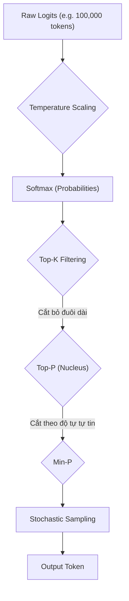

Trong hầu hết các tài liệu vỡ lòng, **Temperature** (Nhiệt độ) được định nghĩa đơn giản là "công tắc điều chỉnh độ sáng tạo" của Mô hình Ngôn ngữ Lớn [[LLM](/concepts/9-genai-machine-learning/llm)). 

Tuy nhiên, dưới lăng kính của một **Staff Data/AI Engineer** xây dựng hệ thống GenAI trên Production, Temperature (kết hợp với Top-P, Top-K) là các hàm xử lý hậu kỳ (Post-processing functions) can thiệp trực tiếp vào **Logits** (điểm số thô chưa chuẩn hóa). Nó quyết định **chiến lược giải mã (Decoding Strategy)**, **tối ưu chi phí (FinOps)**, và **độ ổn định của dữ liệu hạ nguồn (Downstream Reliability)**.

Việc cấu hình ngây thơ (naive) các tham số này có thể dẫn đến hệ lụy dây chuyền: từ việc phá vỡ định dạng JSON làm sập pipeline ETL, cho đến vô hiệu hóa toàn bộ kiến trúc Semantic Cache khiến chi phí API tăng vọt.

---

## 1. Kiến Trúc Thực Thi Vật Lý (The Inference Pipeline)

### 1.1. Cơ chế Logit Scaling

Ở layer cuối cùng của Transformer, mạng nơ-ron xuất ra một mảng các điểm số thô (raw logits) tương ứng với từng token trong từ điển (Vocabulary). Hàm **Softmax** sau đó chuyển đổi logits thành phân phối xác suất ($P$).

Công thức Softmax có tích hợp Temperature ($T$) được định nghĩa:
$$ P(x_i) = \frac{"\exp(z_i / T)"}{\sum_j \exp(z_j / T)} $$

Trong đó, $z_i$ là logit của token $i$. Sự hiện diện của $T$ tạo ra hiệu ứng **Logit Scaling**:

- **Khi $T \to 0$ (Greedy Decoding):** Khoảng cách giữa logit lớn nhất và các phần còn lại bị kéo giãn vô hạn. Hệ thống chọn token duy nhất, chuyển từ "Lấy mẫu ngẫu nhiên" sang "Quyết định" (Deterministic).
- **Khi $T > 1$ (Distribution Smoothing):** Các xác suất bị ép lại gần nhau (phẳng hóa). Token "long-tail" (kém liên quan) đột nhiên có cơ hội được chọn, kích hoạt "sáng tạo" nhưng mở toang cánh cửa cho Ảo giác (Hallucination).

### 1.2. Pipeline Lọc (Top-K, Top-P, Min-P)

Chỉ dùng Temperature là chưa đủ an toàn. Trong kiến trúc hiện đại, Logits phải đi qua một chuỗi các màng lọc trước khi Sampling.



- **Top-K:** Cắt gọt cứng (Hard cutoff). Chỉ giữ lại K token có xác suất cao nhất. Tránh việc LLM chọn các token hoàn toàn vô nghĩa (vốn đã bị Temperature cao khuếch đại).
- **Top-P (Nucleus Sampling):** Cắt gọt động (Dynamic). Giữ lại tập hợp nhỏ nhất các token có tổng xác suất $\ge P$. Vượt trội hơn Top-K vì nó thu hẹp pool khi mô hình tự tin (1-2 token chiếm 90%) và mở rộng pool khi mô hình do dự.
- **Min-P (Modern Standard):** Cắt bỏ các token có xác suất nhỏ hơn một tỷ lệ nhất định so với token dẫn đầu. Cực kỳ hiệu quả để duy trì chất lượng ở Temperature rất cao.

---

## 2. Cấu hình trên vLLM (Production Engine)

Khi vận hành LLM tự lưu trữ (self-hosted) bằng **vLLM**, các tham số này được đóng gói trong `SamplingParams`. Việc chọn tham số thể hiện sự đánh đổi (Systemic Trade-offs) rõ rệt.

```python
from vllm import LLM, SamplingParams

llm = LLM(model="meta-llama/Meta-Llama-3-8B-Instruct", tensor_parallel_size=2)

# 1. Pipeline ETL / Trích xuất JSON (Tối ưu cho Determinism)
params_deterministic = SamplingParams(
    temperature=0.0,      # Kích hoạt Greedy Decoding nội bộ vLLM
    top_p=1.0,            # Bỏ qua Nucleus
    max_tokens=512,
    seed=42               # Cố gắng duy trì tính tái lập
)

# 2. Pipeline Chatbot/Creative (Tối ưu cho Diversity)
params_stochastic = SamplingParams(
    temperature=0.7,      # Làm phẳng phân phối logit
    top_p=0.9,            # Cắt đuôi long-tail bằng Nucleus
    top_k=50,             # Safety net chống rác
    max_tokens=1024
)

# Chạy Inference batched
outputs = llm.generate([
    "Trích xuất JSON từ hợp đồng...",
    "Viết một email marketing..."
], [params_deterministic, params_stochastic]]
```

:::danger
**Ảo tưởng về sự "Chính xác tuyệt đối" khi T=0**
Đặt `temperature=0` không đảm bảo output giống nhau 100% bit-for-bit trên GPU. Trong Distributed Inference, các thao tác toán học như *floating-point atomic additions* trong Flash-Attention có tính bất định (nondeterministic). Kết quả có thể sai lệch nhỏ ở cấp độ dấu phẩy động, đôi khi dẫn đến token divergence trên các cụm H100.
:::

---

## 3. Tối Ưu Chi Phí & Semantic Cache (FinOps)

Trong hệ thống GenAI, chi phí Token là vấn đề sinh tử. Để offload LLM API, kiến trúc chuẩn là sử dụng **Semantic Cache** (Redis/Qdrant). Tuy nhiên, Temperature quyết định sinh mạng của Cache.

### Trade-off: Cacheability vs. Personalization

- **Low Temperature ($T=0$):** Cực kỳ Cache-friendly. Output mang tính quyết định, bạn tự tin trả về kết quả đã cache mà không sợ sai ngữ cảnh. Tỷ lệ Cache Hit cao, giảm 80% chi phí FinOps.
- **High Temperature ($T>0.7$):** Phá vỡ logic Cache. Bản chất user dùng $T=0.8$ là muốn sự đa dạng (Diversity). Nếu bạn Cache và trả về một kết quả cố định, bạn đã triệt tiêu mục đích của T cao.

### Real-world Incident: Cache Poisoning by Temperature
**Tình huống:** Một hệ thống RAG dùng chung Semantic Cache.
1. Pipeline A (Marketing) gọi prompt với $T=0.9$. LLM ảo giác sinh ra số liệu sai nhưng văn phong hay. Lưu vào Cache.
2. Pipeline B (Tài chính) gọi cùng prompt để lấy số liệu, chạy ở $T=0.0$.
3. **Lỗi:** Pipeline B dính *Cache Hit*, lấy kết quả ảo giác của $T=0.9$ đưa thẳng vào báo cáo tài chính.

**Staff-Level Solution:**
Temperature, Top-P BẮT BUỘC phải là một phần của **Cache Key** (hoặc metadata filter). Hai request cùng nội dung nhưng khác `SamplingParams` phải là hai Cache Entries độc lập.

---

## 4. Rủi Ro Vận Hành: Đứt gãy Data Pipeline

Khi tích hợp LLM vào luồng ETL (ví dụ Snowflake), Temperature cao là kẻ thù số một của **Data Formatting**.

**Sự cố:** Cần LLM trả về JSON thuần túy.
- **Khi $T = 0.0$:** Trả về `{"error": "OOM"}`.
- **Khi $T = 0.7$:** Sự san phẳng logit khiến LLM "chatter" (muốn giao tiếp):
  ```json
  Sure, here is your JSON data:
  {"error": "OOM"}
  Hope this helps!
  ```
$\rightarrow$ Hàm `json.loads()` văng `JSONDecodeError`. Dagster/Airflow job thất bại dây chuyền (Domino Effect).

**Khắc phục:** Luôn sử dụng `temperature=0` kết hợp với **Structured Outputs** (JSON Schema Constraint) ở tầng API/vLLM để ép Logits Bias, triệt tiêu hoàn toàn xác suất sinh ra các token ngoài cấu trúc JSON.

---

## 5. Tổng Kết (Systemic Trade-offs)

1. **Determinism vs. Diversity:** $T=0$ mang lại sự ổn định và dễ kiểm thử (Unit Testable). $T$ cao mang lại sáng tạo nhưng biến hệ thống thành một hộp đen phi chuẩn.
2. **FinOps Efficiency vs. UX:** Cố gắng ép Temperature xuống thấp sẽ tăng Cache Hit Rate và tiết kiệm Infra. Đánh đổi lại, trải nghiệm UX (Chatbot) sẽ nhàm chán như kịch bản tĩnh.

Hãy luôn coi Temperature không phải là một "thanh trượt cảm xúc", mà là một **van điều áp [Pressure Valve]** kiểm soát dòng chảy xác suất của Hệ thống Phân tán.

## Nguồn Tham Khảo
1.  [vLLM Documentation: Sampling Parameters](https://docs.vllm.ai/en/latest/dev/sampling_params.html)
2.  [Llama 3 Paper (Meta): Decoding strategies and kernel nondeterminism](https://ai.meta.com/research/publications/llama-3/)
3.  [The Illustrated Word2vec and Text Generation - Jay Alammar](https://jalammar.github.io/)
