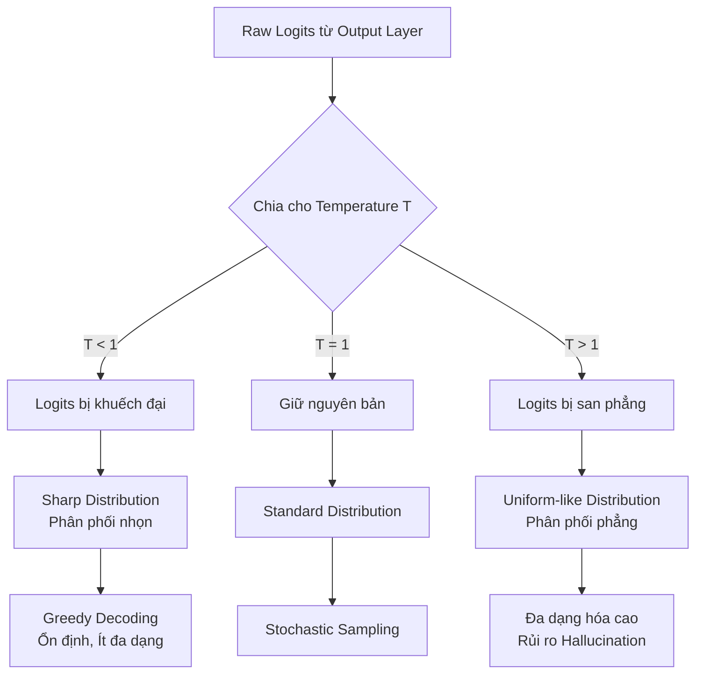
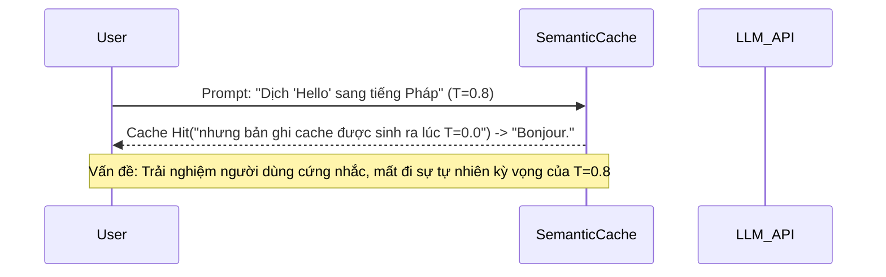

Trong hầu hết các tài liệu vỡ lòng, **Temperature** (Nhiệt độ) được định nghĩa đơn giản là "công tắc điều chỉnh độ sáng tạo" của Mô hình Ngôn ngữ Lớn ([LLM](/concepts/9-genai-machine-learning/llm)). Tuy nhiên, đối với một Data Engineer hoặc Machine Learning Engineer thiết kế hệ thống GenAI trên production, Temperature đóng vai trò quyết định đến **chiến lược giải mã (Decoding Strategy)**, **tối ưu chi phí (FinOps)**, và **độ ổn định của dữ liệu hạ nguồn (Downstream Reliability)**.

Việc thiết lập sai tham số này có thể dẫn đến hệ lụy dây chuyền: từ việc phá vỡ định dạng JSON làm sập pipeline ETL, cho đến việc vô hiệu hóa toàn bộ kiến trúc Semantic Cache khiến chi phí API (Token Cost) tăng vọt.

---

## Kiến Trúc Thực Thi Vật Lý (Physical Execution)

### Cơ chế Logit Scaling

Ở layer cuối cùng của bất kỳ LLM nào, mạng neural sẽ xuất ra một mảng các điểm số thô (raw logits) tương ứng với từng token trong từ điển (Vocabulary). Hàm **Softmax** sau đó sẽ chuyển đổi các logits này thành phân phối xác suất ($P$).

Công thức Softmax có tích hợp Temperature ($T$) được định nghĩa như sau:

$$
P(x_i) = \frac{\exp(z_i / T)}{\sum_j \exp(z_j / T)}
$$

Trong đó, $z_i$ là logit của token thứ $i$. Sự hiện diện của mẫu số $T$ tạo ra một hiệu ứng gọi là **Logit Scaling** (Thu nhỏ/Khuếch đại điểm số):



- **Khi $T \to 0$ (Greedy Decoding):** Khoảng cách giữa logit lớn nhất và các logits khác bị kéo giãn vô hạn. Token có xác suất cao nhất sẽ tiến tới \$1.0$, hệ thống chuyển từ chế độ "Lấy mẫu ngẫu nhiên" (Sampling) sang chế độ "Quyết định" (Deterministic).
- **Khi $T > 1$ (Distribution Smoothing):** Xác suất của các token bị ép lại gần nhau (phân phối phẳng). Các token "long-tail" (ít liên quan) đột nhiên có cơ hội được chọn cao hơn, kích hoạt sự "sáng tạo" nhưng đồng thời mở ra cánh cửa cho ảo giác (Hallucination).

### Cấu hình trên vLLM (Production Engine)

Khi vận hành LLM tự lưu trữ (self-hosted) bằng các engine tối ưu hóa như **vLLM** hay **TGI (Text Generation Inference)**, Temperature được đóng gói trong đối tượng `SamplingParams`.

```python
from vllm import LLM, SamplingParams

# Khởi tạo Engine với Tensor Parallelism
llm = LLM(model="meta-llama/Meta-Llama-3-8B-Instruct", tensor_parallel_size=2)

# 1. Pipeline trích xuất JSON (Data Extraction) - Tối ưu cho độ chính xác
params_deterministic = SamplingParams(
    temperature=0.0,      # Kích hoạt Greedy Decoding nội bộ trong vLLM
    top_p=1.0,            # Bỏ qua Nucleus Sampling
    max_tokens=512,
    seed=42               # Cố gắng duy trì tính tái lập (Reproducibility)
)

# 2. Pipeline Chatbot/Creative (Conversational AI) - Tối ưu cho sự tự nhiên
params_stochastic = SamplingParams(
    temperature=0.7,      # Làm phẳng phân phối logit
    top_p=0.9,            # Cắt bỏ đuôi long-tail (loại trừ các token quá vô lý)
    max_tokens=1024
)

# Chạy Inference batched
outputs = llm.generate([
    "Trích xuất JSON từ hợp đồng...",
    "Viết một bài thơ về Data Engineering..."
], [params_deterministic, params_stochastic])
```

> [!WARNING]
> **Ảo tưởng về sự "Chính xác tuyệt đối" khi T=0**
> Rất nhiều Data Engineer nhầm tưởng rằng đặt `temperature=0` và cố định `seed` sẽ đảm bảo output giống nhau 100% bit-for-bit. Trên thực tế, khi chạy Distributed Inference, các thao tác toán học như *floating-point atomic additions* trong Flash-Attention kernels hay cơ chế chia tải trên nhiều GPU (Tensor Sharding) có tính bất định (nondeterministic). Kết quả có thể sai lệch nhỏ ở cấp độ dấu phẩy động, đôi khi dẫn đến sự thay đổi hoàn toàn của chuỗi sinh ra (token divergence) trên các cụm H100 / A100.

---

## Tối Ưu Chi Phí & Semantic Cache (FinOps)

Trong các hệ thống GenAI quy mô lớn, chi phí Token là một vấn đề nhức nhối. Để giảm tải (offload) API calls tới OpenAI hoặc Anthropic, kiến trúc phổ biến là sử dụng **Semantic Cache** (như GPTCache, Redis Vector). Tuy nhiên, Temperature ảnh hưởng trực tiếp đến Cache Hit Rate.

### Trade-off: Cacheability vs. Personalization



- **Môi trường Low Temperature ($T=0$):** Cực kỳ thân thiện với Cache (Cache-friendly). Bởi vì output mang tính quyết định, bạn có thể tự tin trả về kết quả đã cache mà không sợ sai lệch ngữ cảnh.
- **Môi trường High Temperature ($T>0.7$):** Phá vỡ logic của Cache. Bản chất người dùng truyền $T=0.8$ là để muốn mỗi lần gọi API nhận được một văn bản diễn đạt khác nhau (đa dạng hóa). Nếu bạn Cache và trả về một kết quả cố định, bạn đã triệt tiêu mục đích của Temperature cao.

### Real-world Incident: Cache Poisoning by Temperature

**Tình huống:** Một hệ thống RAG dùng chung một cụm Redis Semantic Cache.
1. Pipeline A (Marketing) gọi prompt tạo nội dung với $T=0.9$. LLM bị "ảo giác" (hallucinate) sinh ra một thông số sai lệch nhưng văn phong rất hay. Kết quả này được lưu vào Cache.
2. Pipeline B (Báo cáo tài chính) gọi cùng một prompt để lấy số liệu, chạy ở chế độ nghiêm ngặt $T=0.0$.
3. **Lỗi:** Pipeline B dính *Cache Hit* từ bản ghi của Pipeline A. Nó lấy kết quả ảo giác của $T=0.9$ đưa thẳng vào báo cáo tài chính.

**Giải pháp Kiến trúc:**
Temperature **BẮT BUỘC** phải là một phần của **Cache Key** (hoặc metadata filter). Hai request có cùng nội dung prompt nhưng khác cấu hình `SamplingParams` (Temperature, Top-p) phải được xử lý như hai Cache Entries độc lập, hoặc bỏ qua Cache hoàn toàn đối với các request có $T > 0.5$.

---

## Rủi Ro Vận Hành (Operational Risks)

Khi triển khai LLM vào các Data Pipeline, Temperature cao là kẻ thù số một của **Data Formatting**.

**Tình huống vỡ Pipeline (Pipeline Breaking Incident):**
Bạn cần LLM phân tích log lỗi và trả về JSON thuần túy để nạp vào Snowflake.
- **Khi $T = 0.0$:** LLM trả về chính xác `{"error": "OOM", "severity": "High"}`.
- **Khi $T = 0.7$:** Sự san phẳng logit khiến LLM muốn "giao tiếp" như con người. Nó sinh ra: 
  ```json
  Sure, here is your JSON data:
  {
    "error": "OOM",
    "severity": "High"
  }
  Hope this helps!
  ```
-> Hàm `json.loads()` trong Python lập tức văng lỗi `JSONDecodeError`. Dagster/Airflow job thất bại dây chuyền (Domino Effect).

**Khắc phục:**
Luôn sử dụng `temperature=0` kết hợp với tính năng ép buộc cấu trúc (Structured Outputs / JSON Mode) do API cung cấp khi cần tích hợp LLM vào các luồng ETL.

---

## Tổng Kết Về Sự Đánh Đổi (Systemic Trade-offs)

1. **Determinism vs. Diversity:** Nhiệt độ 0 mang lại sự ổn định và dễ kiểm thử (Unit Testable). Nhiệt độ cao mang lại giá trị sáng tạo nhưng biến LLM thành một hộp đen không thể kiểm soát.
2. **FinOps Efficiency vs. UX:** Cố gắng ép Temperature xuống thấp sẽ tăng Cache Hit Rate và giảm chi phí hạ tầng cực lớn. Đánh đổi lại, trải nghiệm người dùng cuối (ví dụ trong ứng dụng Chatbot) sẽ trở nên nhàm chán, khô khan và giống hệt một kịch bản tĩnh.

Hãy luôn coi Temperature không phải là một "thanh trượt cảm xúc", mà là một **van điều áp** kiểm soát dòng chảy của xác suất. Việc vặn van quá lớn mà không có các phễu hứng lỗi (Error Handling, Schema Validation) sẽ làm tràn bộ nhớ và sập các hệ thống phân tích hạ nguồn.

---

## Nguồn Tham Khảo (References)

* [vLLM Documentation: Sampling Parameters](https://docs.vllm.ai/en/latest/dev/sampling_params.html)
* [Hugging Face: How to generate text](https://huggingface.co/blog/how-to-generate)
* [Llama 3 Paper (Meta): Decoding strategies and kernel nondeterminism](https://ai.meta.com/research/publications/llama-3/)
* [The Illustrated Word2vec and Text Generation - Jay Alammar](https://jalammar.github.io/)
