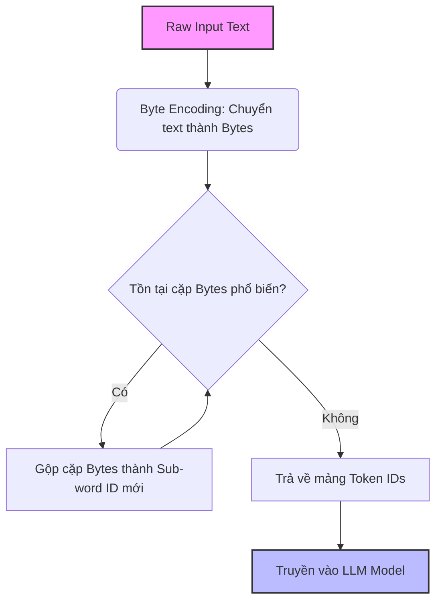

Khi vận hành các hệ thống Generative AI ở quy mô Production, Token không chỉ đơn giản là "những mảnh ghép của từ". Token chính là **đơn vị tính toán vật lý (Compute Unit)** và **đơn vị thanh toán tiền (Billing Unit)**. Mọi bài toán thiết kế kiến trúc hệ thống LLM (Large Language Model) đều xoay quanh việc tối ưu hóa chu trình: Tokenize $\rightarrow$ Compute $\rightarrow$ Detokenize.

## Kiến trúc Thực thi Vật lý (Physical Execution)

Trong kiến trúc [Transformer](https://arxiv.org/abs/1706.03762), văn bản dạng chuỗi không thể trực tiếp truyền qua các lớp Multi-Head Attention. Quá trình Tokenization đóng vai trò là một Data Ingestion Layer siêu nhỏ, biến chuỗi String thành mảng các số nguyên (Integer IDs), sau đó tra cứu trong bảng Embedding Table để lấy ra Vector tương ứng.


*Vị trí của Input Embedding (nơi Token IDs được chuyển hóa) trong kiến trúc Transformer nguyên bản.*

### Byte-Pair Encoding (BPE) & Tiktoken

Hầu hết các LLM hiện đại (GPT-4, Llama 3, Claude 3) đều sử dụng thuật toán nén dữ liệu **Byte-Pair Encoding (BPE)**. Thay vì mã hóa theo từ (Word-level - gây phình to bộ nhớ) hoặc theo ký tự (Char-level - làm dài chuỗi vô tận), BPE hoạt động ở cấp độ Sub-word (một phần của từ).

**Luồng hoạt động của BPE Pipeline:**



Thư viện [`tiktoken`](https://github.com/openai/tiktoken) của OpenAI là một trong những tokenizer nhanh nhất hiện nay, được viết bằng Rust. Dưới đây là cách sử dụng `tiktoken` trong luồng xử lý dữ liệu trước khi gọi API để tiết kiệm chi phí băng thông:

```python
import tiktoken
import logging

def count_tokens_and_estimate_cost(text: str, model: str = "gpt-4o") -> tuple[int, float]:
    """
    Tính toán số lượng token và ước tính chi phí cho Input (Prompt).
    Sử dụng Local compute thay vì gọi API để block các Request quá lớn.
    """
    try:
        # Load encoding dictionary của model (caching locally)
        enc = tiktoken.encoding_for_model(model)
        tokens = enc.encode(text)
        token_count = len(tokens)
        
        # Bảng giá giả định (Input tokens) tính trên 1 triệu tokens
        cost_per_1m = 5.00 # \$5.00 / 1M tokens cho GPT-4o
        estimated_cost = (token_count / 1_000_000) * cost_per_1m
        
        return token_count, estimated_cost
    except Exception as e:
        logging.error(f"Tokenizer error: {e}")
        raise

# Test chặn chuỗi có khả năng gây tràn Context
sample_text = "Data Engineering is critical for GenAI." * 1000
tokens, cost = count_tokens_and_estimate_cost(sample_text)
print(f"Token count: {tokens} | Estimated cost: ${cost:.4f}")
```

## Đánh đổi Hệ thống (Systemic Trade-offs)

### 1. Vocabulary Size vs Context Length (Bottleneck Bộ Nhớ vs Tính Toán)

Thiết kế một Tokenizer là cuộc chiến giữa hai thái cực:
- **Tăng Vocabulary Size (Kích thước từ điển lớn):** Một từ hoàn chỉnh sẽ gói gọn trong 1 token. Điều này giảm *Context Length*, giúp giảm thời gian tính toán của Attention Mechanism (độ phức tạp $O(N^2)$ theo chiều dài chuỗi). **Đánh đổi:** Kích thước Embedding Matrix phình to, tiêu tốn cực nhiều vRAM của GPU.
- **Giảm Vocabulary Size (Cắt nhỏ từ ra):** Từ điển nhỏ, tiết kiệm vRAM. **Đánh đổi:** Một từ bị băm nát thành nhiều token. Ví dụ, tiếng Việt thường gặp tình trạng Fragmentation (phân mảnh) rất nặng nề trong BPE của OpenAI (1 từ tiếng Việt có thể tốn 2-3 tokens). Hệ quả là Context Window nhanh chóng cạn kiệt và mô hình "quên" dữ liệu nhanh hơn.

### 2. Latency (Độ trễ) vs Throughput (Thông lượng) ở Output

Khi LLM sinh ra văn bản (Output), nó sinh ra theo cơ chế **Autoregressive** (từng token một). 
- Chi phí sinh Output Token luôn đắt gấp 2-3 lần Input Token.
- Độ trễ của hệ thống được đo lường bằng chỉ số **Time To First Token (TTFT)** (Thời gian phản hồi token đầu tiên) và **Tokens Per Second (TPS)** (Tốc độ nhả token). Để tối ưu TPS, các kỹ sư phải đánh đổi bằng cách dùng các kỹ thuật *Continuous Batching*, làm tăng TTFT đối với từng người dùng đơn lẻ để đổi lấy thông lượng hệ thống cao hơn.

## Rủi ro Vận hành (Operational Risks) và FinOps

Trong thực tế, rủi ro lớn nhất không phải là mô hình trả lời sai, mà là các sự cố **Runaway Agent Loops (Vòng lặp vô tận của AI Agent)** làm "cháy" thẻ tín dụng hoặc đánh sập hệ thống (Rate Limit Exceeded).

### Sự Cố Vận Hành: Retry Storms & Context Length Exceeded

Khi Agent (như AutoGPT) gọi tool bị lỗi, nó thường tự động retry và đính kèm luôn Error Log vào prompt mới. Log càng ngày càng dài ra sau mỗi lần retry, cho đến khi chạm mốc giới hạn Context Window (ví dụ: 128k tokens của GPT-4o), trả về lỗi `400 Context Length Exceeded`. Nếu không có Circuit Breaker, quá trình retry này sẽ đốt hàng trăm USD chỉ trong vài phút.

### Giải pháp Kiến trúc: Token Gateway & Circuit Breaker

Thay vì để các microservices gọi trực tiếp OpenAI API, chúng ta định tuyến (route) toàn bộ traffic qua một AI Gateway (ví dụ: LiteLLM hoặc Kong API Gateway). Gateway này sẽ:
1. Proxy và đếm số lượng token thực tế (Visibility).
2. Rate Limiting dựa trên User ID hoặc API Key (Quotas).
3. Semantic Caching để chặn các câu lệnh trùng lặp.

**Cấu hình YAML mẫu cho LiteLLM Gateway (AI Proxy):**

```yaml
model_list:
  - model_name: gpt-4
    litellm_params:
      model: openai/gpt-4o
      api_key: os.environ/OPENAI_API_KEY
      # Fallback sang mô hình rẻ hơn nếu gpt-4 bị Rate Limit (429)
      fallbacks: ["claude-3-haiku", "gpt-3.5-turbo"]

router_settings:
  routing_strategy: usage-based-routing
  # Circuit Breaker: Ngắt kết nối người dùng/tenant nếu tiêu thụ quá nhanh
  routing_strategy_args:
    max_tokens_per_minute: 10000 
  # Retry Policy (chống Retry Storms)
  num_retries: 2
  timeout: 30 # Tối đa 30s cho Time To First Token
```

Với cấu hình này, nếu một ứng dụng nội bộ rơi vào vòng lặp vô tận, Gateway sẽ cắt luồng request ngay lập tức khi đạt 10.000 TPM (Tokens Per Minute), đảm bảo an toàn tài chính (FinOps).

## Nguồn Tham Khảo (References)

1. [Attention Is All You Need (Vaswani et al., 2017)](https://arxiv.org/abs/1706.03762) - Nền tảng cốt lõi giải thích chi phí tính toán theo chiều dài chuỗi.
2. [OpenAI Tiktoken Github Repository](https://github.com/openai/tiktoken) - Nơi chứa mã nguồn Tokenizer tốc độ cao viết bằng Rust.
3. [FinOps Foundation: Introduction to AI/ML FinOps](https://www.finops.org/) - Nguyên lý quản trị chi phí Cloud và AI API.
4. [LiteLLM Architecture & Routing](https://docs.litellm.ai/docs/routing) - Tài liệu hệ thống Proxy phân tải và quản lý vòng đời Token trong Production.
