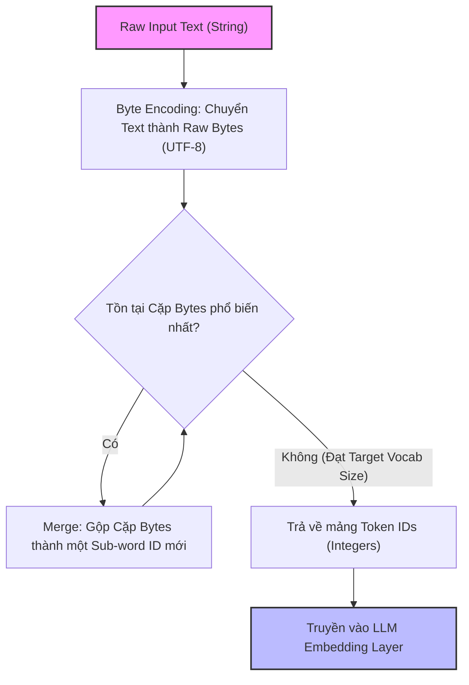

Khi vận hành các hệ thống Generative AI ở quy mô Production, Token không chỉ đơn giản là "Những mảnh ghép của từ". Token chính là **Đơn vị Tính toán Vật lý [Compute Unit]** bên trong GPU và là **Đơn vị Thanh toán Tiền (Billing Unit)** trên hóa đơn Cloud của bạn. 

Mọi bài toán thiết kế kiến trúc hệ thống ứng dụng LLM (Large Language Model) đều xoay quanh việc tối ưu hóa chu trình: **Tokenize (Mã hóa) $\rightarrow$ Compute (Tính toán) $\rightarrow$ Detokenize (Giải mã)**.

---

## 1. Kiến trúc Thực thi Vật lý (Physical Execution)

Trong kiến trúc [Transformer](https://arxiv.org/abs/1706.03762], văn bản dạng chuỗi String thuần túy không thể trực tiếp truyền qua các lớp Multi-Head Attention. Quá trình Tokenization đóng vai trò là một Data Ingestion Layer siêu nhỏ, biến chuỗi String thành mảng các số nguyên (Integer IDs), sau đó tra cứu trong bảng Embedding Table để lấy ra Vector nhiều chiều tương ứng.

### Byte-Pair Encoding (BPE) & Thuật toán Nén
Hầu hết các LLM hiện đại (GPT-4, Llama 3, Claude 3) đều sử dụng thuật toán nén dữ liệu **Byte-Pair Encoding (BPE)**. 
- Thay vì mã hóa theo cấp độ Từ (Word-level - gây phình to bộ nhớ vì số lượng từ vựng vô hạn)
- Thay vì mã hóa theo cấp độ Ký tự (Char-level - làm chuỗi kéo dài vô tận, gây tràn Context Window)
- BPE hoạt động ở cấp độ **Sub-word (Một phần của từ)**, cân bằng được cả hai thái cực trên.

**Luồng hoạt động của BPE Pipeline:**



### Tiktoken: Tokenizer tốc độ cao
Thư viện [`tiktoken`](https://github.com/openai/tiktoken] của OpenAI là một trong những Tokenizer nhanh nhất hiện nay, được viết bằng Rust (vượt qua các giới hạn GIL của Python). Dưới đây là cách sử dụng `tiktoken` trong luồng xử lý dữ liệu trước khi gọi API để thiết lập chốt chặn an toàn (Guardrails) nhằm tiết kiệm chi phí:

```python
import tiktoken
import logging

def check_tokens_and_estimate_cost(prompt_text: str, model: str = "gpt-4o", max_budget: float = 0.50) -> tuple[int, float]:
    """
    Tính toán số lượng token và ước tính chi phí cho Input (Prompt).
    Sử dụng Local Compute (CPU) thay vì gọi API để Block các Request quá đắt đỏ.
    """
    try:
        # Load Encoding Dictionary của Model (Được Cache cục bộ trên máy)
        enc = tiktoken.encoding_for_model(model)
        tokens = enc.encode(prompt_text)
        token_count = len(tokens)
        
        # Bảng giá giả định cho Input tokens (Tính trên 1 triệu tokens)
        cost_per_1m = 5.00 # $5.00 / 1M tokens (GPT-4o Input)
        estimated_cost = (token_count / 1_000_000) * cost_per_1m
        
        # Circuit Breaker Logic
        if estimated_cost > max_budget:
            raise ValueError(f"Payload too expensive! Cost: ${estimated_cost:.4f}, Budget: ${max_budget}")
            
        return token_count, estimated_cost
    except Exception as e:
        logging.error(f"Tokenizer Guardrail Alert: {e}")
        raise

# Test chặn chuỗi RAG Payload khổng lồ có khả năng gây tràn Context hoặc cháy túi
rag_context = "Data Engineering is critical for GenAI FinOps. " * 50000 
tokens, cost = check_tokens_and_estimate_cost(rag_context)
```

---

## 2. Đánh đổi Hệ thống (Systemic Trade-offs)

### 2.1. Vocabulary Size vs Context Length (Nút thắt Bộ nhớ vs Tính toán)
Thiết kế một Tokenizer cho LLM là cuộc chiến vật lý giữa hai thái cực:
- **Tăng Vocabulary Size (Ví dụ: Từ điển 128k - 256k tokens):** Một từ hoàn chỉnh (hoặc cả cụm từ) sẽ gói gọn trong 1 Token duy nhất. Điều này giúp giảm độ dài của câu (Giảm *Context Length*), giúp tăng tốc cực nhanh thời gian tính toán của lớp Attention (Vốn có độ phức tạp $O(N^2)$). 
  - **Đánh đổi (Trade-off):** Kích thước Embedding Matrix ở layer đầu tiên và lớp Projection ở layer cuối cùng sẽ phình to khủng khiếp, tiêu tốn cực kỳ nhiều vRAM (GPU Memory) ngay cả khi chưa load bất kỳ dữ liệu nào.
- **Giảm Vocabulary Size (Cắt vụn từ ra):** Từ điển nhỏ (Ví dụ: 32k tokens của Llama-1), tiết kiệm vRAM. 
  - **Đánh đổi (Trade-off):** Một từ bị "Băm nát" thành 3-4 Tokens. Điển hình là ngữ nghĩa Tiếng Việt thường gặp tình trạng Phân mảnh (Fragmentation) nặng nề trong BPE của OpenAI đời đầu. Hệ quả: Context Window bị ăn mòn rất nhanh, mô hình bị "Đãng trí" sớm, và chi phí API (Tính theo số Tokens) tăng vọt cho cùng một đoạn văn bản.

### 2.2. Chi phí Input vs Output (TTFT và TPS)
Khi LLM sinh ra văn bản trả lời (Output), nó sinh ra theo cơ chế **Autoregressive** (Sinh tuần tự từng Token một).
- Chi phí Compute (Và giá tiền Cloud) để sinh Output Token luôn đắt gấp 2-3 lần so với việc đọc Input Token (Vốn có thể xử lý song song).
- Độ trễ của hệ thống được đo lường bằng hai chỉ số: **Time To First Token - TTFT** (Thời gian chờ token đầu tiên xuất hiện) và **Tokens Per Second - TPS** (Tốc độ nhả token tiếp theo).
- Kỹ sư phải đánh đổi: Để tối ưu hóa TPS (Thông lượng hệ thống), họ phải dùng kỹ thuật *Continuous Batching*, điều này làm tăng TTFT đối với từng người dùng đơn lẻ để đổi lấy năng lực phục vụ hàng nghìn người cùng lúc.

---

## 3. Rủi ro Vận hành (Operational Risks) và Thực thi FinOps

Trong môi trường Production, rủi ro lớn nhất không phải là mô hình trả lời sai, mà là các sự cố **Runaway AI Agents (Vòng lặp vô tận của Agent)** làm "Cháy" thẻ tín dụng hoặc đánh sập hệ thống (Lỗi 429 Rate Limit Exceeded).

### Sự Cố Vận Hành: Retry Storms & Context Length Exceeded
Khi một Autonomous Agent (Như AutoGPT, LangChain Agent) gọi Tool bị lỗi, nó thường tự động Retry và đính kèm luôn chuỗi Error Log khổng lồ vào Prompt tiếp theo. Log càng ngày càng dài ra sau mỗi lần Retry (Cộng dồn Lũy tiến). 

Chỉ sau vài vòng lặp, Payload sẽ chạm mốc giới hạn Context Window (Ví dụ: 128,000 tokens của GPT-4o), API sẽ trả về lỗi `400 Context Length Exceeded`. Tệ hơn nữa, nếu API tiếp nhận thành công, quá trình Retry Storm này sẽ **đốt hàng trăm USD chỉ trong vài phút** do cơ chế tính tiền theo số lượng Token Input cộng dồn.

### Giải pháp Kiến trúc: Token Gateway & Circuit Breaker
Thay vì để các Microservices gọi trực tiếp OpenAI/Anthropic API, Hệ thống Enterprise bắt buộc phải định tuyến (Route) toàn bộ Traffic qua một **AI API Gateway** (Ví dụ: LiteLLM, Kong AI Gateway, hoặc Cloudflare AI Gateway). 

Gateway này đảm nhận 3 vai trò FinOps cốt lõi:
1. **Visibility (Đo lường):** Proxy và đếm số lượng Token thực tế tiêu thụ cho từng Team/Project.
2. **Quotas & Circuit Breaking (Ngắt mạch):** Chặn các Request vượt quá hạn mức tài chính.
3. **Semantic Caching:** Lưu Cache các câu trả lời trùng lặp để trả về ngay lập tức (Cost = $0).

**Cấu hình YAML mẫu cho LiteLLM Gateway (AI Proxy & Guardrails):**

```yaml
model_list:
  - model_name: gpt-4-prod
    litellm_params:
      model: openai/gpt-4o
      api_key: os.environ/OPENAI_API_KEY
      # Fallback tự động sang mô hình rẻ hơn nếu gpt-4 bị Rate Limit (429) hoặc sập
      fallbacks: ["claude-3-haiku", "gpt-3.5-turbo"]

router_settings:
  routing_strategy: usage-based-routing # Cân bằng tải dựa trên số lượng Token
  
  # 1. Circuit Breaker: Ngắt kết nối User/Tenant/Agent nếu tiêu thụ Token quá hung hãn
  routing_strategy_args:
    max_tokens_per_minute: 50000 
    
  # 2. Retry Policy Guardrail (Chống Retry Storms đốt tiền)
  num_retries: 1 # Chỉ cho phép Retry 1 lần duy nhất ở cấp độ Network
  timeout: 45 # Tối đa 45s cho TTFT, nếu quá hạn -> Cắt kết nối
```

Với cấu hình này, nếu một ứng dụng RAG nội bộ bị kẹt trong vòng lặp vô tận (Infinite Loop), Gateway sẽ "Ngắt cầu dao" ngay lập tức khi Tenant đó chạm ngưỡng 50,000 TPM [Tokens Per Minute], bảo vệ hệ thống khỏi thảm họa tài chính (FinOps Disaster).

---

## Nguồn Tham Khảo (References)

1. [Attention Is All You Need (Vaswani et al., 2017]][https://arxiv.org/abs/1706.03762] - Nền tảng cốt lõi giải thích chi phí tính toán tỷ lệ thuận với $O(N^2)$ chiều dài chuỗi.
2. [OpenAI Tiktoken Github Repository][https://github.com/openai/tiktoken] - Nơi chứa mã nguồn Tokenizer tốc độ cao viết bằng Rust.
3. [FinOps Foundation: Introduction to AI/ML FinOps][https://www.finops.org/] - Nguyên lý quản trị chi phí Cloud và AI API.
4. [LiteLLM Architecture & Routing](https://docs.litellm.ai/docs/routing] - Tài liệu hệ thống Proxy phân tải và quản lý vòng đời Token trong hệ thống Production.
