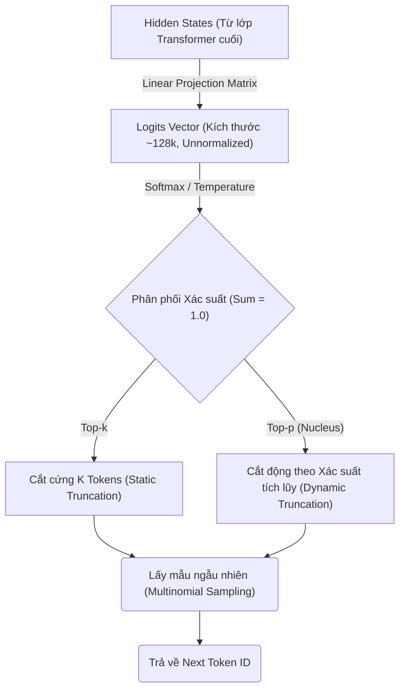

Khi tích hợp các Mô hình Ngôn ngữ Lớn (LLM) vào các sản phẩm Data Engineering, **Top-p (Nucleus Sampling)** và **Temperature** thường bị xem nhẹ như những "Nút vặn" (Knobs) ma thuật để chỉnh độ "Sáng tạo". 

Tuy nhiên, dưới góc nhìn Kỹ sư Hệ thống (System Engineer), Nucleus Sampling là một thuật toán can thiệp trực tiếp vào quy trình Giải mã (Decoding Pipeline) ở cấp độ Tensor/GPU. Việc cấu hình sai lệch không chỉ tạo ra các văn bản ảo giác (Hallucinations) mà còn đốt cháy tài nguyên Compute (GPU Cycles), làm tăng độ trễ (Latency) và ảnh hưởng trực tiếp đến bài toán FinOps.

---

## 1. Kiến trúc Giải mã: Từ Logits đến Top-p (System Architecture)

Để hiểu Nucleus Sampling, chúng ta cần nhìn vào điểm cuối (Tail-end) của kiến trúc mạng Transformer (Ví dụ: Llama 3, GPT-4). Sau khi đi qua hàng chục lớp Self-Attention và Feed-Forward, mô hình không sinh ra ngay một từ (Token) dạng chuỗi Text. 

Thay vào đó, Lớp Projection cuối cùng (Thường là một Ma trận Linear khổng lồ) sẽ xuất ra một Vector số thực gọi là **Logits** — với chiều dài (Dimension) bằng đúng kích thước Tập từ vựng (Vocabulary Size, thường từ 32,000 đến 128,000 Tokens).

Quá trình chuyển đổi từ Vector Logits thô này thành Token cuối cùng được gọi là **Decoding Pipeline**.



Các phương pháp đời đầu bộc lộ nhiều điểm yếu chí mạng ở quy mô sản xuất (Production):
- **Greedy Search (argmax):** Luôn chọn Token có xác suất cao nhất. Dẫn đến câu văn robot, khô khan, và đặc biệt dễ dính lỗi lặp từ cục bộ (Repetition Loop - Ví dụ: "I don't know, I don't know, I don't know").
- **Pure Sampling (Multinomial):** Lấy mẫu ngẫu nhiên trên toàn bộ phân phối. Có rủi ro cực cao rơi vào vùng "Long tail" (Đuôi dài - các từ có xác suất siêu nhỏ, vô nghĩa, gây ra Ảo giác nặng).
- **Top-k Sampling:** Chặn cứng $K$ token đầu tiên. Khi mô hình rất "Chắc chắn" (Chỉ có 1-2 từ đúng), Top-k vẫn giữ lại đủ $K$ từ, đẩy rác vào bộ lấy mẫu. Ngược lại, khi mô hình "Phân vân" (Cần tới 100 từ khả dĩ để mô tả một ý tưởng phức tạp), Top-k lại cắt cụt đi các từ hợp lý.

**Nucleus Sampling (Top-p)**, được giới thiệu bởi Ari Holtzman et al. (2019), giải quyết bài toán này bằng cách chặn linh hoạt (Dynamic Truncation). Thay vì chặn theo Số lượng ($K$), nó chặn theo **Khối lượng Xác suất ($P$)**.

---

## 2. Giải phẫu Thuật toán Top-p (Execution Logic)

Thuật toán Top-p hoạt động như một bộ lọc động, cắt bỏ phần đuôi (Tail) rác của phân phối xác suất. Luồng thực thi diễn ra ở cấp độ Tensor/GPU như sau:

1. **Sort (Sắp xếp):** Sắp xếp toàn bộ từ vựng theo xác suất giảm dần.
2. **Cumulative Sum (Cộng dồn):** Tính tổng tích lũy (Cumulative Probability) từ trên xuống.
3. **Masking/Truncation (Mặt nạ Cắt):** Tìm điểm "Cắt" (Cut-off) ngay khi tổng tích lũy vượt qua ngưỡng $p$. Đặt xác suất của tất cả token nằm sau điểm cắt về mức 0 (Hoặc logit = $-\infty$).
4. **Renormalize (Chuẩn hóa):** Chuẩn hóa lại các Token còn lại (Vùng Hạt nhân - Nucleus) để tổng xác suất quay về mức 1.0.
5. **Sample (Lấy mẫu):** Tung xúc xắc (Multinomial Sampling) từ tập Hạt nhân.

### Code Thực chiến (PyTorch / vLLM Simulation)

Hãy xem cách Top-p được implement ở cấp độ Tensor trong PyTorch (Đây là nền tảng logic bên trong thư viện `transformers` của HuggingFace hoặc các Optimized Kernels của `vLLM`):

```python
import torch
import torch.nn.functional as F

def apply_top_p_sampling(logits: torch.Tensor, top_p: float = 0.9, filter_value: float = -float('Inf')):
    """
    Mô phỏng hàm lọc Top-p trên GPU sử dụng PyTorch.
    Logits shape: (batch_size, vocab_size)
    """
    # 1. Chuyển Logits thành Xác suất [Probability Distribution]
    probs = F.softmax(logits, dim=-1)
    
    # 2. Sắp xếp giảm dần (LƯU Ý: Đây là bước đắt đỏ nhất O(V log V) trên GPU)
    sorted_probs, sorted_indices = torch.sort(probs, descending=True)
    
    # 3. Tính tổng tích lũy (Cumulative Sum)
    cumulative_probs = torch.cumsum(sorted_probs, dim=-1)
    
    # 4. Tạo Mask: Tìm các Token rác có tổng tích lũy vượt ngưỡng top_p
    # (Cần Shift-right 1 bước để luôn giữ lại ít nhất 1 Token trên ngưỡng, tránh mảng rỗng)
    sorted_indices_to_remove = cumulative_probs > top_p
    sorted_indices_to_remove[..., 1:] = sorted_indices_to_remove[..., :-1].clone[]
    sorted_indices_to_remove[..., 0] = 0 # Bảo hiểm: Luôn giữ lại Token có xác suất cao nhất
    
    # 5. Áp dụng Mask quay ngược lại thứ tự gốc của từ vựng [Scatter]
    indices_to_remove = sorted_indices_to_remove.scatter(1, sorted_indices, sorted_indices_to_remove)
    logits[indices_to_remove] = filter_value # Ép Logits thành -Inf
    
    # 6. Chuẩn hóa lại (Renormalize thông qua Softmax) và Sample
    filtered_probs = F.softmax(logits, dim=-1)
    next_token = torch.multinomial(filtered_probs, num_samples=1)
    
    return next_token

# Giả lập Logits cho tập từ vựng 128,000 từ (Llama-3)
mock_logits = torch.randn(1, 128000) 
next_token_id = apply_top_p_sampling(mock_logits, top_p=0.9)
print(f"Sampled Token ID: {next_token_id.item()}")
```

---

## 3. Rủi ro Vận hành (Operational Risks) & System Trade-offs

Dưới góc nhìn Hệ thống Data Platform, thao tác Sampling không hề "Miễn phí". Khi phục vụ LLM ở quy mô lớn (High QPS - Queries Per Second), Top-p sinh ra các nút thắt cổ chai mà Kỹ sư bắt buộc phải nắm rõ.

### 3.1. The Compute Tax (Thuế Tính Toán của Top-p)
Khác với Greedy Search chỉ cần toán tử `argmax` với độ phức tạp tuyến tính $O(V)$ (với $V$ là kích thước từ vựng), Top-p bắt buộc phải dùng thuật toán sắp xếp (Sorting). 

Sắp xếp trên mảng 128,000 phần tử tốn kém $O(V \log V)$. Khi Model phục vụ hàng nghìn Request qua cơ chế **Continuous Batching**, thao tác Sort này tạo ra áp lực cực lớn lên GPU Kernels, làm tăng đáng kể **TPOT (Time Per Output Token)**.

*Trade-off (Sự Đánh Đổi):* 
- Nếu tối ưu tuyệt đối cho **Throughput (RPS)** và **Latency**: Bạn nên ưu tiên các Sampling Kernels được viết bằng C++/CUDA tối ưu hóa cực đoan như **FlashInfer** trong vLLM.
- Trong nhiều hệ thống Production siêu tốc độ (Real-time Voice Chat), Kỹ sư thậm chí bỏ qua Top-p và quay về dùng Top-k (với $K$ nhỏ) vì toán tử `topk` trên CUDA chạy nhanh hơn hàm `sort` rất nhiều.

### 3.2. Real-world Incidents: Cấu hình sai lệch
- **Hallucination Spikes (Khi $p$ quá gần 1.0):** Nếu thiết lập $p=0.99$ hoặc $1.0$, vòng Nucleus quá rộng, kéo theo hàng loạt các "Long tail tokens" (Từ nhiễu có xác suất siêu bé). Điều này thường xuyên dẫn đến hiện tượng mô hình sinh ra JSON hỏng (Malformed JSON), nói lảm nhảm, hoặc bịa đặt (Hallucinations) số liệu.
- **Repetition Loops (Vòng lặp vĩnh cửu):** Ngược lại, nếu set $p$ quá thấp (ví dụ $p \le 0.1$), mô hình gần như quay lại trạng thái Greedy Search. Nếu kết hợp với việc thiếu `repetition_penalty` (hoặc `presence_penalty`), mô hình dễ dàng rơi vào một bẫy lặp từ vô tận. 
$\rightarrow$ Hậu quả FinOps: GPU bị kẹt ở Request này, sinh ra chuỗi lặp rác cho đến khi chạm mức `max_tokens` (Thường là 4096 hoặc 8192). Bạn vừa tốn hàng nghìn Token vô nghĩa, vừa chặn các Request khác trong hàng đợi (Queue).

---

## 4. Thực tiễn Kỹ thuật & FinOps (Engineering Best Practices)

### Cấu hình Tối ưu trên vLLM
Khi triển khai vLLM, các cấu hình Sampling ảnh hưởng trực tiếp đến hiệu năng Server và **FinOps (Tối ưu chi phí Compute Cloud)**:

```bash
# Lệnh chạy vLLM API server tối ưu hóa Compute
python3 -m vllm.entrypoints.openai.api_server \
    --model meta-llama/Llama-3-8B-Instruct \
    --enforce-eager \
    --gpu-memory-utilization 0.9 \
    --max-num-batched-tokens 8192 \
    --disable-log-requests # Tắt log để tối ưu Disk I/O
```

Khi Clients (Backend App) gọi API tới Server vLLM này, cần quy hoạch chặt chẽ thông số Payload trong Prompt Engineering:

```json
{
  "model": "meta-llama/Llama-3-8B-Instruct",
  "messages": [...],
  "top_p": 0.9,
  "temperature": 1.0, 
  "max_tokens": 1024,
  "presence_penalty": 0.1,
  "frequency_penalty": 0.1
}
```

**💡 Golden Rule [Nguyên tắc Vàng]: Đừng chỉnh đồng thời Top-p và Temperature**
- Cả hai thông số này đều điều chỉnh độ đa dạng (Diversity) của Output.
- **Temperature** làm Phẳng / Sắc nét toàn bộ đồ thị phân phối *TRƯỚC* khi áp dụng hàm kích hoạt Softmax.
- **Top-p** cắt đuôi đồ thị *SAU* khi đã tính xác suất.
- **Quy tắc Thiết kế:** Cố định `Temperature = 1.0` và điều chỉnh `Top-p` (Hoặc ngược lại). 
  - Nếu muốn văn bản an toàn, chính xác logic (Như SQL Parsing, Code Generation, RAG Extraction): $p = 0.1 - 0.3$. 
  - Nếu muốn Chatbot sáng tạo, phong phú: $p = 0.7 - 0.9$. 
  - Đừng bao giờ set `top_p = 0.9` VÀ `temperature = 1.5` cùng lúc, Output sẽ cực kỳ hỗn loạn và không thể kiểm soát.

### Min-p: Kẻ thách thức Top-p
Trong các Version gần đây của vLLM và Hugging Face, **Min-p** nổi lên như một giải pháp thay thế. Thay vì tính Tổng tích lũy, Min-p chỉ loại bỏ các Token có xác suất nhỏ hơn một *Tỷ lệ cố định* so với Token dẫn đầu (Token có xác suất cao nhất). 
Việc này cắt bỏ được hoàn toàn bước Sorting đắt đỏ, giúp **giảm Latency (TPOT)** đáng kể ở mức CUDA Kernel mà vẫn giữ được chất lượng văn bản tương đương Top-p.

---

## 5. Nguồn Tham Khảo (References)

*   [The Curious Case of Neural Text Degeneration (Holtzman et al., 2019)](https://arxiv.org/abs/1904.09751) - Whitepaper kinh điển đề xuất phương pháp Nucleus Sampling.
*   [Hugging Face - How to generate text: using different decoding methods](https://huggingface.co/blog/how-to-generate) - Bài phân tích trực quan về Sampling Pipeline.
*   [vLLM Documentation: Generation Parameters](https://docs.vllm.ai/en/latest/dev/sampling_params.html) - Chi tiết kỹ thuật về các Sampling Kernels và cấu hình tối ưu độ trễ trong môi trường Production.
*   [Attention Is All You Need (Vaswani et al., 2017)](https://arxiv.org/abs/1706.03762) - Kiến trúc cốt lõi sinh ra vector Logits trong các mô hình Transformer.
