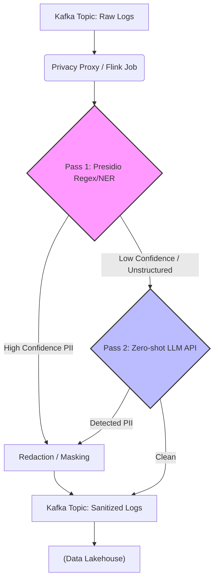

Đa số các tài liệu về Prompt Engineering mô tả **Zero-shot Prompting** như một phép màu: Bạn ra lệnh cho AI (Large Language Models - LLM) dịch một đoạn văn hoặc tóm tắt tài liệu mà không cần cung cấp bất kỳ ví dụ mẫu nào (Zero examples), và nó vẫn làm được. 

Tuy nhiên, dưới góc nhìn của một Kỹ sư Dữ liệu (Data Engineer), Zero-shot không phải là ma thuật. Nó là quá trình **Inference (Suy luận)** dựa hoàn toàn vào **Parametric Memory** (Trí nhớ tham số - kiến thức được nén trong các trọng số Weights của Neural Network sau quá trình Pre-training và Instruction Tuning), thay vì **Contextual Memory** (Trí nhớ ngữ cảnh - thông tin được tiêm vào qua Prompt).

Bài viết này sẽ mổ xẻ Zero-shot Prompting dưới lăng kính System Design, phân tích cách nhúng kỹ thuật này vào các Data Pipeline chịu tải cao, và những rủi ro vận hành (Operational Risks) đi kèm.

---

## 1. Bản chất Kỹ thuật: Parametric Memory vs. Contextual Grounding

Khi bạn gọi một API LLM (như OpenAI, Anthropic) với Zero-shot Prompting, bạn đang ép mô hình phải lục lọi trong không gian vector khổng lồ của nó để tìm ra pattern phù hợp nhất với yêu cầu.

*   **Zero-shot:** Phụ thuộc 100% vào Parametric Memory. Payload nhỏ (ít token), Network I/O thấp, TTFT (Time-To-First-Token) cực nhanh.
*   **Few-shot / RAG:** Phụ thuộc vào Contextual Grounding. Payload lớn, tiêu tốn VRAM cho KV Cache, tăng Compute Cost và Latency.

Trong thiết kế hệ thống, Zero-shot được xem là **Base Layer (Lớp cơ sở)** rẻ nhất và nhanh nhất. Chỉ khi Base Layer thất bại (chất lượng dữ liệu đầu ra không đạt yêu cầu SLA), chúng ta mới kích hoạt các chiến lược fallback tốn kém hơn như Few-shot hoặc RAG.

---

## 2. Kiến trúc Ứng dụng 1: Streaming PII Detection (Hybrid Approach)

Một trong những bài toán kinh điển của Data Engineering hiện đại là phát hiện và che giấu (Redaction) dữ liệu nhạy cảm (PII - Personally Identifiable Information) trong các luồng dữ liệu thời gian thực (Streaming Data) như Kafka hoặc Kinesis trước khi đổ vào Data Lakehouse.

Nếu dùng Zero-shot LLM để quét toàn bộ message, hệ thống sẽ gặp **Bottleneck khủng khiếp** về Latency và API Cost. Giải pháp thực chiến là kiến trúc **Hybrid Privacy Gateway**, kết hợp Regex/NER Engine (như Microsoft Presidio) làm Pass 1, và Zero-shot LLM làm Pass 2 cho các trường hợp nhập nhằng (Ambiguity).



### Triển khai Code (Python)

Dưới đây là mô phỏng luồng xử lý Fallback, nơi Zero-shot Prompting được cấu hình chặt chẽ để trả về JSON (bắt buộc trong Data Pipeline để tránh lỗi Parse):

```python
import json
from presidio_analyzer import AnalyzerEngine
# Giả sử chúng ta dùng một client LLM siêu nhẹ (như Llama-3-8B nội bộ)
from llm_client import invoke_llm 

analyzer = AnalyzerEngine()

def process_stream_record(record: str) -> str:
    # Pass 1: Deterministic Filtering (Zero Latency)
    results = analyzer.analyze(text=record, entities=["EMAIL_ADDRESS", "PHONE_NUMBER"], language='en')
    
    if len(results) > 0:
        return redact_deterministic(record, results)
        
    # Pass 2: Fallback to Zero-shot LLM for ambiguous context
    # (Chỉ trigger khi Pass 1 không tìm thấy nhưng message nằm trong topic nhạy cảm)
    system_prompt = """
    You are a strict PII detection API. 
    Analyze the text and output ONLY a valid JSON object. 
    Schema: {"has_pii": boolean, "entities": [string]}
    Do not include markdown blocks or explanations.
    """
    
    user_prompt = f"Text: {record}"
    
    # Zero-shot inference call
    llm_response = invoke_llm(system_prompt=system_prompt, prompt=user_prompt)
    
    try:
        # Trong Pipeline, mọi response từ LLM đều có nguy cơ làm sập Schema
        parsed_result = json.loads(llm_response)
        if parsed_result.get("has_pii"):
            return redact_llm_entities(record, parsed_result["entities"])
        return record
    except json.JSONDecodeError:
        # Operational Risk: LLM Hallucination / Format Breakage
        log_incident("LLM_FORMAT_ERROR", llm_response)
        # Fallback an toàn: Đẩy vào Dead Letter Queue (DLQ)
        send_to_dlq(record)
        return ""
```

---

## 3. Kiến trúc Ứng dụng 2: Zero-shot Text-to-SQL

Mô hình Text-to-SQL cho phép người dùng kinh doanh (Business Users) truy vấn Data Warehouse bằng ngôn ngữ tự nhiên. Tuy nhiên, gửi một Zero-shot prompt như *"Lấy doanh thu tháng này"* thẳng cho LLM sẽ dính ngay lỗi **Context Saturation (Bão hòa ngữ cảnh)** nếu Database của bạn có hàng nghìn bảng.

Kiến trúc chuẩn (Agentic Workflow) sẽ chia Text-to-SQL thành nhiều bước, trong đó Zero-shot được áp dụng cho từng Agent chuyên biệt:

1.  **Schema Routing Agent (Zero-shot):** Nhận câu hỏi và chọn ra 3-5 bảng có khả năng liên quan nhất từ Metadata Catalog.
2.  **SQL Generation Agent (Zero-shot / Few-shot):** Nhận câu hỏi + Lược đồ (Schema) của 5 bảng đã lọc -> Sinh ra SQL.
3.  **Guard Layer (Verification):** Chạy lệnh `EXPLAIN` trên Data Warehouse (Snowflake/BigQuery). Nếu lỗi Cú pháp, gửi lại Error Trace cho Generator Agent tự sửa (Self-Correction).

### Cấu hình Terraform cho Guard Layer (AWS WAF + Bedrock)

Bạn không bao giờ được phép thực thi trực tiếp SQL sinh ra từ Zero-shot LLM vào Database mà không có cơ chế Read-Only và Rate Limiting.

```hcl
# Thiết lập Role chỉ có quyền SELECT cho Text-to-SQL Agent
resource "aws_iam_role" "text_to_sql_executor" {
  name = "text-to-sql-readonly-role"

  assume_role_policy = jsonencode({
    Version = "2012-10-17"
    Statement = [
      {
        Action = "sts:AssumeRole"
        Effect = "Allow"
        Principal = {
          Service = "lambda.amazonaws.com"
        }
      }
    ]
  })
}

resource "aws_iam_policy" "athena_readonly_policy" {
  name        = "AthenaReadOnlyForLLM"
  description = "Chỉ cho phép chạy SELECT queries"
  policy      = jsonencode({
    Version = "2012-10-17"
    Statement = [
      {
        Action   = ["athena:StartQueryExecution", "athena:GetQueryExecution", "athena:GetQueryResults"]
        Effect   = "Allow"
        Resource = "*"
      },
      {
        Action   = ["s3:GetObject", "s3:ListBucket"]
        Effect   = "Allow"
        Resource = ["arn:aws:s3:::data-lake-prod/*", "arn:aws:s3:::data-lake-prod"]
      }
    ]
  })
}
```

---

## 4. Systemic Trade-offs (Đánh đổi Hệ thống) & FinOps

Khi quyết định sử dụng Zero-shot thay vì Fine-tuning hay Few-shot trong Data Pipelines, Staff Engineer cần cân nhắc các điểm mù sau:

| Tiêu chí | Zero-shot Prompting | Few-shot Prompting / RAG | Fine-Tuning |
| :--- | :--- | :--- | :--- |
| **Network I/O & TTFT** | **Tốt nhất.** Payload gọn nhẹ (vài trăm tokens). Phản hồi tính bằng ms. | Trung bình - Kém. Phải nhét ví dụ/context, làm phình to payload. | Tốt. Payload nhỏ tương đương Zero-shot. |
| **Compute Cost (FinOps)** | **Rẻ nhất.** Càng ít Input Token, hóa đơn API càng thấp. | Đắt đỏ do Input Tokens tăng theo cấp số nhân (đặc biệt với RAG). | Tốn chi phí MLOps và GPU khổng lồ để huấn luyện/host ban đầu. |
| **Accuracy (Tính chính xác)** | Thấp - Trung bình. Phụ thuộc vào Parametric Memory. Dễ sinh lỗi Format. | Cao. Được "Grounding" bởi các ví dụ cụ thể. | Rất Cao cho tác vụ đặc thù (Domain-specific). |

**Bài toán FinOps:** Giả sử bạn xử lý 10 triệu records/ngày. Nếu dùng Few-shot (1000 tokens/prompt) giá `\$5/1M tokens`, bạn mất `\$50/ngày`. Nếu tối ưu xuống Zero-shot (100 tokens/prompt), chi phí giảm 10 lần xuống còn `\$5/ngày`. Sự chênh lệch này là khổng lồ khi Scale lên quy mô Enterprise.

---

## 5. Rủi ro Vận hành (Operational Risks) & Real-world Incidents

Đưa Zero-shot vào Production không bao giờ là màu hồng. Dưới đây là các sự cố (Incidents) thường gặp và cách khắc phục:

### 1. Sự cố: Format Breakage (Vỡ định dạng JSON)
*   **Hiện tượng:** Pipeline sập vì hàm `json.loads()` văng lỗi. LLM (dù được dặn trả về JSON) thỉnh thoảng vẫn thêm câu mở đầu: *"Here is your JSON response: {..."*.
*   **Khắc phục:** 
    *   Sử dụng **Structured Outputs API** (như tính năng JSON Mode của OpenAI) để ép kiểu dữ liệu ở mức độ Tokenizer.
    *   Luôn bọc lời gọi LLM trong khối `try-catch` và đẩy records lỗi vào **Dead Letter Queue (DLQ)** để xử lý lại (Retry) với Temperature = 0 hoặc đổi sang mô hình thông minh hơn.

### 2. Sự cố: Silent Failures (Thất bại im lặng trong Text-to-SQL)
*   **Hiện tượng:** LLM sinh ra câu SQL hợp lệ (Valid Syntax), chạy thành công không báo lỗi, nhưng logic sai bét (ví dụ: `JOIN` nhầm bảng hoặc quên lọc `WHERE is_deleted = false`). Hậu quả là Dashboard báo cáo sai số liệu, CEO ra quyết định sai.
*   **Khắc phục:** 
    *   Zero-shot tuyệt đối **không** được dùng một mình trong Data Analytics.
    *   Phải thiết kế **Semantic Layer (Lớp ngữ nghĩa)**: LLM không viết SQL thuần mà sẽ gọi các dbt Metrics hoặc Cube.js API (vd: `SELECT * FROM metrics.monthly_revenue`).

### 3. Sự cố: Throttling & Retry Storms
*   **Hiện tượng:** Khi có một đợt Spike Traffic (ví dụ: Backfill dữ liệu lịch sử), hàng triệu lời gọi Zero-shot bắn về API của OpenAI/Anthropic gây ra lỗi `429 Too Many Requests`. Các node Worker liên tục Retry, tạo ra "Bão Retry" làm sập toàn bộ cluster.
*   **Khắc phục:** Triển khai cơ chế **Exponential Backoff with Jitter** và sử dụng Circuit Breaker pattern. Đối với Batch Processing cường độ cao, cân nhắc triển khai các mô hình Local (như Llama-3, Mistral) trên Kubernetes (vLLM, TGI) để làm chủ Throughput.

---

## 6. Nguồn Tham Khảo (References)

1.  [Kojima, T. et al. (2022). "Large Language Models are Zero-Shot Reasoners"](https://arxiv.org/abs/2205.11916) - *Nghiên cứu gốc về sức mạnh tiềm ẩn của Zero-shot thông qua kích hoạt "Let's think step by step".*
2.  [Building Multi-Agent Text-to-SQL Systems (Towards Data Science)](https://towardsdatascience.com/) - *Các mẫu kiến trúc cho hệ thống Data Analytics dựa trên LLM.*
3.  [Microsoft Presidio: Data Protection and Anonymization SDK](https://microsoft.github.io/presidio/) - *Tài liệu chính thức cho công cụ lọc PII Deterministic.*
4.  [AWS Architecture Blog: Real-time Data Streaming with LLMs](https://aws.amazon.com/blogs/architecture/) - *Tham chiếu cách thiết lập Guard Layers và API Gateways cho hệ thống AI phân tán.*
