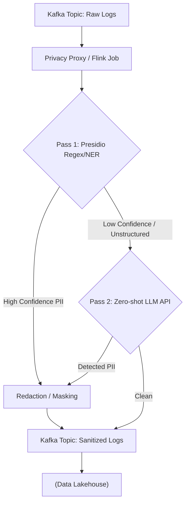

Đa số các tài liệu về Prompt Engineering mô tả **Zero-shot Prompting** như một phép màu: Bạn ra lệnh cho LLM dịch văn bản hoặc phân loại dữ liệu mà không cần cung cấp bất kỳ ví dụ mẫu nào, và nó vẫn làm được. 

Tuy nhiên, dưới góc nhìn Kỹ thuật hệ thống, Zero-shot không phải là ma thuật. Nó là quá trình **Inference (Suy luận)** dựa hoàn toàn vào **Parametric Memory** (Trí nhớ tham số - kiến thức được nén trong hàng tỷ trọng số của mô hình từ lúc Pre-training), thay vì **Contextual Memory** (Trí nhớ ngữ cảnh - thông tin tiêm vào qua Prompt).

Bài viết này mổ xẻ Zero-shot Prompting dưới lăng kính System Design và cách đưa nó vào Production.

---

## 1. Trí Nhớ Tham Số & Chiến Lược Fallback

Khi gọi API với Zero-shot Prompting, bạn ép mô hình lục lọi không gian vector nội tại của nó.
- **Ưu điểm:** Payload nhỏ (ít token), Network I/O thấp, **TTFT (Time-To-First-Token) cực nhanh** và chi phí API (FinOps) cực rẻ.
- **Nhược điểm:** Dễ bị **Ảo giác (Hallucination)** do thiếu cơ sở (Grounding).

Trong thiết kế kiến trúc, Zero-shot được xem là **Base Layer (Lớp cơ sở)**. Chỉ khi Base Layer thất bại (chất lượng đầu ra không đạt), hệ thống mới kích hoạt các chiến lược đắt tiền hơn như Few-shot hoặc RAG.

---

## 2. Kiến trúc 1: Streaming PII Detection (Hybrid)

Bảo vệ dữ liệu nhạy cảm (PII) trên luồng Streaming (Kafka) là bài toán kinh điển. Nếu dùng Zero-shot LLM quét toàn bộ message, hệ thống sẽ gặp **Bottleneck khủng khiếp** về Latency. 

Giải pháp thực chiến là **Hybrid Privacy Gateway**:
1. **Pass 1 (Deterministic):** Dùng Regex/NER (như Microsoft Presidio) để quét các mẫu cố định (Email, SĐT) với Latency 0ms.
2. **Pass 2 (Zero-shot LLM):** Chỉ kích hoạt khi Pass 1 bó tay trước các văn bản nhập nhằng.



### Triển khai Code (Python)
Zero-shot prompt phải cấu hình chặt chẽ để trả về JSON (bắt buộc trong Data Pipeline):

```python
import json
from presidio_analyzer import AnalyzerEngine
from llm_client import invoke_llm 

analyzer = AnalyzerEngine()

def process_stream_record(record: str) -> str:
    # Pass 1: Deterministic
    results = analyzer.analyze(text=record, entities=["EMAIL", "PHONE"], language='en')
    if len(results) > 0:
        return redact_deterministic(record, results)
        
    # Pass 2: Fallback to Zero-shot LLM
    system_prompt = """
    You are a strict PII detection API. Output ONLY a valid JSON object. 
    Schema: {"has_pii": boolean, "entities": [string]}
    """
    
    llm_response = invoke_llm(system_prompt=system_prompt, prompt=f"Text: {record}")
    
    try:
        parsed_result = json.loads(llm_response)
        if parsed_result.get("has_pii"):
            return redact_llm_entities(record, parsed_result["entities"])
        return record
    except json.JSONDecodeError:
        # Operational Risk: LLM Format Breakage
        send_to_dlq(record) # Fallback đẩy vào Dead Letter Queue
        return ""
```

---

## 3. Kiến trúc 2: Zero-shot Text-to-SQL

Gửi một Zero-shot prompt như *"Lấy doanh thu tháng này"* thẳng cho LLM sẽ dính lỗi **Context Saturation (Bão hòa ngữ cảnh)** nếu Data Warehouse của bạn có hàng nghìn bảng.

Kiến trúc chuẩn sẽ chia thành nhiều Agent (Task Induction):
1. **Schema Routing Agent (Zero-shot):** Lọc ra 3 bảng liên quan từ Metadata Catalog.
2. **SQL Generation Agent (Zero-shot):** Nhận câu hỏi + Schema 3 bảng $\rightarrow$ Sinh SQL.
3. **Guard Layer:** Cực kỳ quan trọng. LLM không được phép thực thi SQL trực tiếp.

### Terraform Guard Layer (AWS)
Bạn phải thiết lập Role chặn quyền `DROP`, `DELETE` bằng IAM Policy để bảo vệ Database khỏi "ảo giác" của LLM.

```hcl
resource "aws_iam_policy" "athena_readonly_for_llm" {
  name        = "AthenaReadOnlyForLLM"
  policy      = jsonencode({
    Version = "2012-10-17"
    Statement = [
      {
        Action   = ["athena:StartQueryExecution", "athena:GetQueryExecution", "athena:GetQueryResults"]
        Effect   = "Allow"
        Resource = "*"
      },
      {
        Action   = ["s3:GetObject", "s3:ListBucket"]
        Effect   = "Allow"
        Resource = ["arn:aws:s3:::data-lake-prod/*"]
      }
    ]
  })
}
```

---

## 4. Systemic Trade-offs & FinOps

| Tiêu chí | Zero-shot Prompting | Few-shot Prompting / RAG | Fine-Tuning |
| :--- | :--- | :--- | :--- |
| **Network I/O & TTFT** | **Tuyệt vời.** Payload vài trăm tokens. Độ trễ <100ms. | Kém. Context dài làm phình payload, tăng TTFT. | Tuyệt vời. Payload nhỏ. |
| **FinOps (Chi phí)** | **Rẻ nhất.** Càng ít Input Token, hóa đơn API càng thấp. | Đắt đỏ do Input Tokens cực lớn. | Đắt tiền train ban đầu. |
| **Accuracy & Hallucination**| Thấp. Rất dễ bị "Ảo giác" do trí nhớ tham số lỗi thời. | Cao. Được "neo" (Grounding) bởi tài liệu. | Rất Cao. |

**FinOps:** Xử lý 10 triệu records/ngày. Dùng Few-shot (1000 tokens) tốn `\$50/ngày`. Dùng Zero-shot (100 tokens) tốn `\$5/ngày`.

---

## 5. Rủi Ro Vận Hành (Operational Risks)

Đưa Zero-shot vào Production sẽ gặp các sự cố "đẫm máu" sau:

### A. Vỡ Định Dạng JSON (Format Breakage)
- **Căn nguyên:** LLM thỉnh thoảng thêm *"Here is your JSON:"* làm hàm `json.loads()` sập.
- **Khắc phục:** Sử dụng **Structured Outputs API** (Ép kiểu ở mức Tokenizer) hoặc nhốt vào khối `try-catch` đẩy vào Dead Letter Queue (DLQ).

### B. Thất Bại Im Lặng (Silent Failures trong SQL)
- **Căn nguyên:** LLM sinh ra SQL đúng cú pháp (chạy không báo lỗi), nhưng logic sai bét (ví dụ: `JOIN` nhầm bảng). Giám đốc ra quyết định sai dựa trên dữ liệu ảo.
- **Khắc phục:** Xây dựng **Semantic Layer**. Ép LLM gọi API của dbt Metrics hoặc Cube.js thay vì viết truy vấn thô vào Bảng vật lý.

### C. Bão Thử Lại (Retry Storms)
- **Căn nguyên:** Khi có Spike Traffic (Backfill dữ liệu), gọi LLM API liên tục sinh ra lỗi `429 Too Many Requests`. Hệ thống Retry mù quáng làm sập cluster.
- **Khắc phục:** Dùng pattern **Circuit Breaker** và **Exponential Backoff**.

---

## Nguồn Tham Khảo
* [Kojima et al. "Large Language Models are Zero-Shot Reasoners" [arXiv:2205.11916]][https://arxiv.org/abs/2205.11916]
* [AWS Architecture Blog: Real-time Data Streaming with LLMs][https://aws.amazon.com/blogs/architecture/]
* [Microsoft Presidio: Data Protection and Anonymization SDK](https://microsoft.github.io/presidio/]
