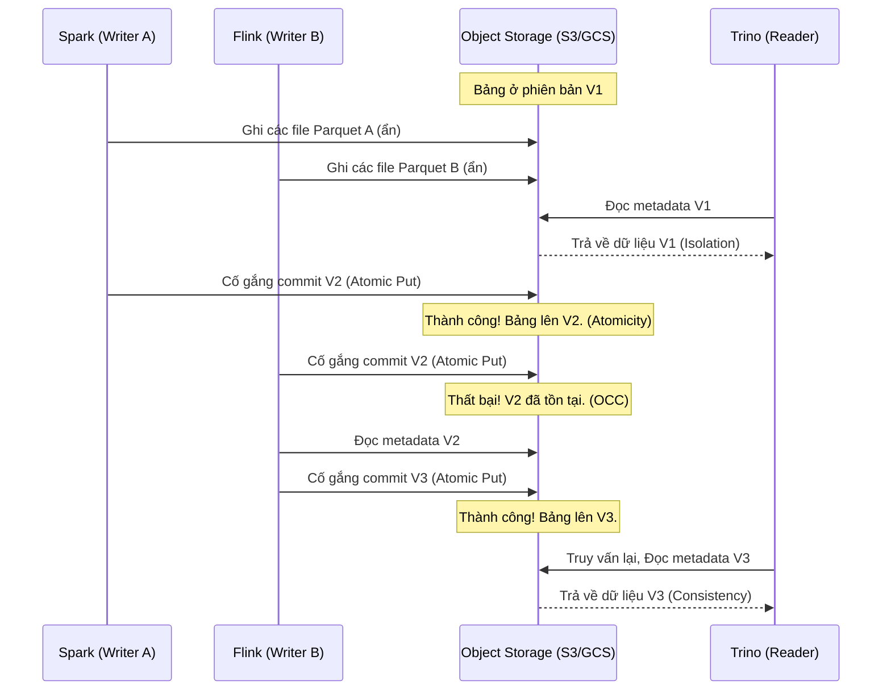

# ACID Transactions trên Data Lake

## Summary

ACID Transactions (Giao dịch ACID) trên Data Lake là tập hợp các cơ chế đảm bảo tính toàn vẹn của dữ liệu trên các hệ thống lưu trữ phân tán (như AWS S3, Google Cloud Storage, HDFS), vốn bản chất không hỗ trợ giao dịch. Bằng cách sử dụng các định dạng bảng hiện đại (Table Formats như Delta Lake, Apache Iceberg, Apache Hudi) kết hợp với kỹ thuật kiểm soát luồng đồng thời (Optimistic Concurrency Control), Data Lake giờ đây có thể hỗ trợ nhiều luồng ghi và đọc đồng thời một cách an toàn mà không làm hỏng dữ liệu.

---

## Definition

**ACID** là viết tắt của 4 đặc tính quan trọng trong cơ sở dữ liệu:
* **Atomicity (Tính nguyên tử)**: Một thao tác thay đổi (commit) gồm nhiều file hoặc thành công toàn bộ, hoặc không lưu lại bất cứ gì (không có trạng thái thành công một nửa).
* **Consistency (Tính nhất quán)**: Dữ liệu luôn tuân thủ các quy tắc đã định (ví dụ: lược đồ schema đúng chuẩn).
* **Isolation (Tính cô lập)**: Các truy vấn đọc sẽ không nhìn thấy dữ liệu đang được ghi dở dang. Các truy vấn ghi đồng thời không dẫm chân lên nhau.
* **Durability (Tính bền vững)**: Một khi thay đổi đã được xác nhận (commit), dữ liệu sẽ được an toàn dù hệ thống có sập.

**ACID Transactions trên Data Lake** ám chỉ khả năng cung cấp 4 đặc tính này khi nhiều Engine tính toán (Spark, Flink, Trino) cùng thao tác trên các tệp tin thô (Parquet/ORC) lưu tại nền tảng đám mây (Object Storage).

---

## Why it exists

Các hệ thống Object Storage như Amazon S3 được thiết kế cho khả năng mở rộng vô hạn và tính sẵn sàng cao, nhưng chúng chỉ cung cấp ngữ nghĩa "eventual consistency" (trước năm 2020) và hoàn toàn **không hỗ trợ khóa tệp tin (file locking)**. 

Trong Data Lake thế hệ cũ (Hadoop/Hive):
1. Khi có một tác vụ đang chạy để thêm dữ liệu (viết nhiều file vào thư mục), nếu tác vụ này sập giữa chừng, sẽ có một nửa số file nằm lại trên thư mục (vi phạm Atomicity).
2. Nếu một User chạy truy vấn (Read) đúng lúc dữ liệu đang được ghi vào, họ sẽ đọc được dữ liệu rác, chắp vá (vi phạm Isolation).
3. Hai tác vụ cùng cập nhật một phân vùng sẽ dễ dàng đè mất dữ liệu của nhau.

Sự trỗi dậy của kiến trúc **Data Lakehouse** buộc hệ thống phải phục vụ trực tiếp các báo cáo BI và cập nhật liên tục (Streaming, CDC), yêu cầu độ tin cậy như Data Warehouse truyền thống. Do đó, cơ chế ACID trên Data Lake được phát triển.

---

## Core idea

Ý tưởng chủ đạo để tạo ra ACID trên file system phân tán là **không sửa đổi dữ liệu trực tiếp**, mà dựa vào **Transaction Logs (Nhật ký giao dịch) và Metadata (Siêu dữ liệu)**.

1. **Write data, then commit**: Dữ liệu luôn được ghi vào các tệp tin vật lý mới (không bao giờ ghi đè lên file cũ). Các tệp này chưa hiển thị với người dùng cho đến khi một tệp siêu dữ liệu (metadata/log) được tạo ra.
2. **Atomic Commits**: Bước ghi siêu dữ liệu là thao tác duy nhất được coi là "commit". Thao tác này dựa vào các cơ chế nguyên tử của hệ thống file lưu trữ bên dưới (ví dụ: HDFS atomic rename hoặc S3 conditional put).
3. **Optimistic Concurrency Control (OCC)**: Kiểm soát đồng thời lạc quan. Khi hai quy trình cùng muốn ghi dữ liệu:
   * Cả hai đều đọc trạng thái hiện tại (version X).
   * Cả hai tạo ra file dữ liệu mới độc lập.
   * Cả hai cố gắng commit phiên bản mới là X+1.
   * Hệ thống sẽ cho phép một quá trình (A) chiến thắng. Quá trình kia (B) sẽ thất bại, phải load lại phiên bản X+1 từ quá trình (A), kiểm tra xung đột logic, và thử commit lại X+2.

---

## How it works

Quy trình hoạt động của một giao dịch thay đổi dữ liệu (ví dụ: ghi thêm dữ liệu) trên Delta Lake:

1. **Bắt đầu**: Máy khách yêu cầu ghi một lô dữ liệu mới.
2. **Ghi dữ liệu (Data Write)**: Engine (ví dụ Spark) ghi các tệp `part-0001.parquet`, `part-0002.parquet` lên S3. Giai đoạn này, mọi máy khách đọc dữ liệu (Reader) vẫn chỉ đọc theo phiên bản cũ, hoàn toàn không biết đến sự tồn tại của các file này.
3. **Ghi Nhật ký (Log Write)**: Spark tạo ra một file JSON mô tả thao tác: `"add file part-0001, add file part-0002"`. Sau đó cố gắng đặt tên nó là `00000005.json` (giả sử bảng đang ở phiên bản 4).
4. **Kiểm tra nguyên tử (Atomicity Test)**: Nếu tạo file `00000005.json` thành công (không có file nào tên đó đã tồn tại), giao dịch hoàn tất. Nếu có một người khác vừa tạo `00000005.json` trước đó 1 mili-giây, giao dịch của Spark bị từ chối.
5. **Thử lại (Retry)**: Nếu bị từ chối, Spark cập nhật bảng lên phiên bản 5 của người kia, đánh giá xem dữ liệu mình định ghi có xung đột (conflict) không, nếu không, cố gắng ghi ra file nhật ký tên là `00000006.json`.

---

## Architecture / Flow



---

## Practical example

Xét tình huống một tài khoản ngân hàng được lưu trên Data Lake. Số dư ban đầu (V1) = 100$.

* **Writer A (Giao dịch trừ tiền)**: Muốn trừ 20$. A đọc V1 (100$). A ghi file chứa số dư = 80$.
* **Writer B (Giao dịch cộng tiền)**: Muốn cộng 50$. B đọc V1 (100$). B ghi file chứa số dư = 150$.

* Xung đột: A commit thành công phiên bản V2 (80$). Khi B commit phiên bản V2, hệ thống từ chối (Concurrency check). B phải làm mới trạng thái (đọc được V2 là 80$), áp dụng phép logic cộng 50$ lên 80$, tạo file mới chứa số dư = 130$ và commit thành công phiên bản V3. Dữ liệu vẹn toàn. Nếu không có ACID, bản ghi của B sẽ ghi đè A và số dư sẽ thành 150$ (sai).

Ví dụ cấu hình Delta Lake bằng PySpark để thực hiện các thao tác ACID:

```python
from delta.tables import *

# 1. Khởi tạo bảng Delta
df = spark.createDataFrame([("acc_01", 100)], ["account_id", "balance"])
df.write.format("delta").save("/data/accounts")

deltaTable = DeltaTable.forPath(spark, "/data/accounts")

# 2. Update (Writer A trừ tiền, Writer B cộng tiền - Delta tự động xử lý ACID)
deltaTable.update(
    condition = "account_id = 'acc_01'",
    set = { "balance": "balance - 20" }
)

deltaTable.update(
    condition = "account_id = 'acc_01'",
    set = { "balance": "balance + 50" }
)

# Kết quả balance = 130
```

---

## Best practices

* **Quản lý kích thước giao dịch**: Không nên commit quá nhiều giao dịch tí hon (ví dụ ghi từng file một mỗi giây). Điều này tạo ra quá nhiều file metadata và tăng nguy cơ xung đột (conflict). Nêm gom các thay đổi thành các Micro-batch (ví dụ 1-5 phút/lần).
* **Partitioning để giảm xung đột**: Nếu hai Writer ghi vào hai phân vùng (partition) khác nhau (ví dụ: Writer A ghi dữ liệu ngày 1, Writer B ghi dữ liệu ngày 2), Engine có thể đánh giá không có xung đột logic và cho phép tiến hành song song.
* **Sử dụng Engine hỗ trợ tốt**: Sử dụng đúng Catalog System (AWS Glue, Nessie, Hive Metastore) với chức năng khóa mạnh mẽ để đảm bảo tính nguyên tử tuyệt đối trên S3.

---

## Common mistakes

* **Thao tác vật lý bỏ qua Table Format**: Dùng công cụ bên ngoài (ví dụ: AWS CLI hoặc Hadoop fs) xóa trực tiếp các tệp tin Parquet trong Data Lake thay vì dùng lệnh `DELETE FROM table`. Điều này phá vỡ tính nguyên tử, làm mất đồng bộ giữa metadata và dữ liệu vật lý (Data Corruption).
* **Tin tưởng tuyệt đối vào OCC trong hệ thống siêu lớn**: Optimistic Concurrency Control hoạt động cực tốt khi tần suất xung đột thấp. Nếu có 100 workers cùng update chung một file Parquet liên tục, OCC sẽ sinh ra tỷ lệ retry rất cao và gây nghẽn toàn bộ hệ thống.

---

## Trade-offs

### Ưu điểm
* Cho phép nhiều pipeline ETL phức tạp và người dùng BI làm việc song tương trên cùng một kho dữ liệu.
* Độ tin cậy ngang bằng Data Warehouse nhưng chi phí lưu trữ thấp của Data Lake.
* Cho phép Rollback (quay ngược giao dịch) nếu có lỗi xảy ra.

### Nhược điểm
* **Chi phí tính toán tăng**: Việc kiểm tra xung đột, quản lý lock và retry gây tốn tài nguyên và tăng thời gian thực thi đôi chút.
* **Yêu cầu dọn dẹp hệ thống**: Cấu trúc copy-on-write tạo ra "rác" (các tệp tin dữ liệu cũ không còn hiệu lực) yêu cầu việc chạy lệnh `VACUUM` thường xuyên để giải phóng không gian.

---

## When to use

* Bất cứ Data Lake hiện đại nào phục vụ phân tích nghiệp vụ nghiêm túc.
* Ứng dụng các quy tắc bảo mật quyền riêng tư (như GDPR) đòi hỏi cập nhật, xóa bản ghi người dùng thường xuyên và chính xác.
* Chạy các pipeline CDC (Change Data Capture) đổ trực tiếp từ DB vào Data Lake.

## When not to use

* Với các luồng log append-only cực lớn và không ai cần đọc dữ liệu realtime, việc thiết lập ACID có thể đem lại một chút độ trễ (overhead) không đáng có.

---

## Related concepts

* [Table Format](/concepts/table-format)
* [Delta Lake](/concepts/delta-lake)
* [Apache Iceberg](/concepts/apache-iceberg)
* [Data Lakehouse](/concepts/data-lakehouse)

---

## Interview questions

### 1. Giải thích Optimistic Concurrency Control (OCC) là gì và làm thế nào Delta/Iceberg dùng nó để giải quyết nhiều người viết (multi-writers)?
* **Người phỏng vấn muốn kiểm tra**: Hiểu biết cơ chế nền tảng của hệ thống phân tán và database.
* **Gợi ý trả lời (Strong Answer)**: 
  OCC (Kiểm soát đồng thời lạc quan) là cơ chế giả định rằng xung đột ghi rất hiếm khi xảy ra. Thay vì khóa bảng (Locking/Pessimistic) trước khi xử lý, các hệ thống Table Format cho phép các engine chuẩn bị dữ liệu mới thoải mái song song. Khi tiến hành thao tác commit, nó sẽ kiểm tra phiên bản bảng. Nếu phiên bản vẫn giống lúc nó bắt đầu đọc, commit thành công. Nếu phiên bản đã bị tăng lên bởi worker khác, nó sẽ lấy metadata mới để kiểm tra xem thao tác của worker kia có chạm đến file mà worker này định sửa hay không. Nếu độc lập phân vùng (không đụng nhau), commit tiếp tục; nếu xung đột, worker sẽ thử lại hoặc báo lỗi.

### 2. AWS S3 trước đây không hỗ trợ Atomic Put/Rename. Các Table Format đã xử lý tính toán ACID (Atomicity) trên S3 như thế nào?
* **Người phỏng vấn muốn kiểm tra**: Kiến thức sâu về đặc thù đám mây và catalog.
* **Gợi ý trả lời (Strong Answer)**: 
  S3 truyền thống thiếu tính toàn vẹn (mới được thêm tính năng Strongly Consistent gần đây). Do đó, để đảm bảo tính nguyên tử cho thao tác ghi siêu dữ liệu trên AWS S3, Iceberg hoặc Delta Lake phải nhờ vào một thành phần lưu trữ thứ ba hỗ trợ khóa cấp độ bản ghi. Thông thường, họ sử dụng **AWS DynamoDB** hoặc **AWS Glue Data Catalog**. Khi commit, engine sẽ khóa một dòng trong DynamoDB/Glue. Bất kỳ ai đến sau sẽ bị chặn (lock fail) và biết rằng phiên bản đã bị cập nhật, nhờ đó S3 "có được" tính ACID một cách gián tiếp. (Lưu ý: S3 hiện tại đã cung cấp conditional write, giúp đơn giản hóa đáng kể quy trình này).

---

## References

1. **"Delta Lake: High-Performance ACID Table Storage over Cloud Object Stores"** - (VLDB Paper 2020) Mô tả cách Delta Lake cung cấp ACID.
2. **"Designing Data-Intensive Applications"** - Martin Kleppmann (Chương 7: Transactions).
3. **Apache Iceberg Documentation** (iceberg.apache.org/reliability) - Đặc tả về OCC và Atomicity.

---

## English summary

ACID Transactions on a Data Lake guarantee Atomicity, Consistency, Isolation, and Durability over distributed object storage (like S3/GCS) which natively lacks file-locking and transactional support. Modern table formats (Delta Lake, Apache Iceberg, Apache Hudi) achieve this using a combination of metadata management, transaction logs, and Optimistic Concurrency Control (OCC). Instead of mutating physical data files directly, engines write new data files hidden from readers until a successful atomic commit updates the metadata snapshot. This allows concurrent readers and writers to operate reliably without data corruption or dirty reads, unlocking Data Warehouse capabilities directly on cheap Data Lake storage.
