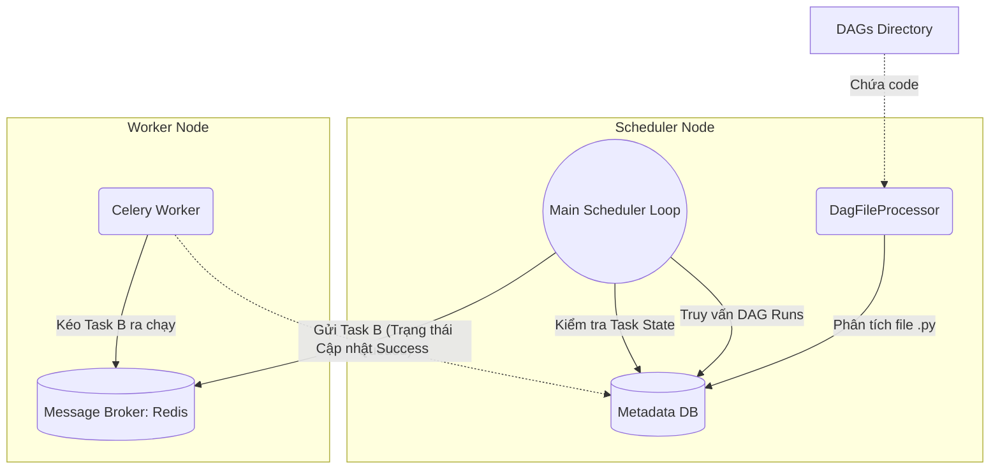

# Airflow Scheduler - Bộ não điều phối

## Summary

**Airflow Scheduler** là thành phần quan trọng nhất, đóng vai trò như "Bộ não" của toàn bộ hệ thống Apache Airflow. Nó là một tiến trình (daemon) chạy ngầm liên tục, chịu trách nhiệm đọc và phân tích các file mã nguồn Python (DAGs), theo dõi thời gian thực thi của chúng, kiểm tra trạng thái phụ thuộc (Dependencies), và đưa ra quyết định đưa tác vụ nào vào hàng đợi (Queue) để các Worker xử lý. Hiểu rõ cách Scheduler hoạt động là chìa khóa để tinh chỉnh hiệu năng và khắc phục sự cố hệ thống khi quản lý hàng ngàn Data Pipelines.

---

## Definition

Trong kiến trúc Airflow, **Scheduler** là một service chạy vòng lặp vô hạn (infinite loop). Nhiệm vụ cốt lõi của nó là cầu nối giữa Thư mục chứa code (DAG Directory) và Cơ sở dữ liệu Meta (Metadata DB). 

Nó thực hiện 3 hành động chính liên tục:
1. **Phân tích (Parsing)**: Đọc các file `.py` trong thư mục DAG, chuyển đổi chúng thành các đối tượng DAG logic trong bộ nhớ và ghi cập nhật lên Database.
2. **Lập lịch DAG (Scheduling DAG Runs)**: Kiểm tra thời gian (dựa trên tham số `schedule_interval`). Nếu đến giờ kích hoạt, nó tạo ra một "Bản ghi chạy DAG" (DAG Run).
3. **Lập lịch Tác vụ (Scheduling Task Instances)**: Với mỗi DAG Run đang hoạt động, nó duyệt qua các tác vụ bên trong. Nếu một Tác vụ có tất cả Upstream đã hoàn thành (Trạng thái phụ thuộc thỏa mãn), Scheduler sẽ đổi trạng thái tác vụ đó thành `Scheduled` và ném nó vào Executor Queue.

---

## Why it exists

Một hệ thống tự động hóa không thể hoạt động nếu thiếu một thực thể chủ động "nhìn đồng hồ" và "ra lệnh".
Webserver chỉ làm nhiệm vụ hiển thị tĩnh (UI). Worker chỉ là "công nhân" – bảo gì làm nấy, không tự quyết định lúc nào làm. Nếu không có Scheduler, code Python định nghĩa DAG của bạn chỉ là những đoạn văn bản vô tri, không ai kích hoạt chúng, không ai biết task này nối sau task kia. Scheduler sinh ra để gánh vác toàn bộ gánh nặng logic điều khiển thời gian và sự kiện này.

---

## Core idea

Ý tưởng cốt lõi của Scheduler là sự tách biệt thông minh (Decoupling) giữa việc **"Phân tích Code"** và việc **"Ra quyết định lập lịch"**:
* **DagFileProcessor**: Một nhóm tiến trình con chuyên đi mở từng file `.py` ra đọc, biên dịch mã Python. Việc này rất nặng nề và hay bị lỗi nếu user viết code dở (gặp Infinite loop, kết nối DB ngay trong file).
* **Scheduler Loop chính**: Một vòng lặp cực nhanh chỉ làm việc với cơ sở dữ liệu (Postgres). Nó truy vấn DB để xem DAG nào đã đến giờ chạy, Task nào đủ điều kiện, và chốt trạng thái.

Bằng cách tách biệt này, nếu một file DAG của người dùng bị lỗi Cú pháp (Syntax Error) hoặc bị đơ, nó chỉ làm chết tiến trình Processor phụ, vòng lặp điều phối chính của toàn bộ nền tảng vẫn không bị đứng.

---

## How it works

Dưới đây là một chu kỳ (Tick) của vòng lặp Scheduler (phiên bản Airflow 2.0+):

1. **Quét thư mục DAG**: Tiến trình `DagFileProcessorManager` tìm các file `.py` bị thay đổi và phân công cho các processor dịch lại. Các DAG hợp lệ được Serialize (chuyển thành JSON) và lưu vào Database.
2. **Tạo DAG Runs**: Vòng lặp chính truy vấn DB tìm các DAG đang bật (Active) có mốc thời gian `next_dagrun_create_after` nhỏ hơn thời gian hiện tại. Nó sinh ra một bản ghi DAG Run mới (Trạng thái `Running`).
3. **Kiểm tra Task Dependencies**: Với các DAG Runs đang `Running`, Scheduler kiểm tra trạng thái các Task bên trong. Nếu Task A đã `Success`, Trigger Rule của Task B thỏa mãn $\rightarrow$ Task B được đánh dấu là `Scheduled`.
4. **Enqueue (Đưa vào hàng đợi)**: Scheduler chuyển các Task `Scheduled` sang trạng thái `Queued` và đẩy chúng vào Broker (ví dụ: Redis/RabbitMQ với Celery Executor).
5. **Giao việc**: Executor kéo Task từ Broker ra và giao cho Worker rảnh. Trạng thái task thành `Running`.
6. **Vòng lại từ đầu**. Mặc định, vòng lặp này diễn ra liên tục từng giây một.

---

## Architecture / Flow



---

## Practical example

Mặc dù Scheduler chủ yếu hoạt động ngầm, người kỹ sư Dữ liệu thường phải cấu hình nó thông qua file `airflow.cfg` để tối ưu hiệu năng. Dưới đây là ví dụ về các tham số quan trọng cần tinh chỉnh cho Scheduler:

```ini
[scheduler]
# Số giây giữa các lần quét thư mục DAG để tìm file mới
dag_dir_list_interval = 30

# Số lượng tiến trình phân tích (parser) chạy song song
parsing_processes = 2

# Khoảng thời gian tối thiểu trước khi một file DAG được phân tích lại
min_file_process_interval = 30

# Bật tính năng dọn dẹp các task mồ côi (Zombie tasks)
job_heartbeat_sec = 5
zombie_detection_interval = 10
```

## Best practices

* **KHÔNG viết Top-level code trong file DAG**: Đây là lỗi tối kỵ ảnh hưởng trực tiếp đến Scheduler. Bất kỳ lệnh gọi API bên ngoài (Request) hoặc lệnh SQL (Connect Database) nào nằm ngoài ngữ cảnh Operator đều bị chạy MỖI LẦN Scheduler quét file (mặc định 30 giây/lần). Nó sẽ làm Scheduler quá tải CPU, gây ra lỗi "Scheduler Timeout" và làm sập Database. Mọi logic xử lý phải nằm bên trong các hàm được gọi bởi Operator.
* **Tinh chỉnh thông số Scheduler**: Nếu bạn có một máy chủ mạnh và hàng ngàn Task, hãy tăng `scheduler.parsing_processes` (Số luồng dịch code) và giảm `scheduler.min_file_process_interval` để file DAG được cập nhật nhanh hơn trên UI.
* **Chạy nhiều Scheduler (High Availability)**: Từ Airflow 2.0, Scheduler hỗ trợ chạy theo mô hình Active-Active. Hãy bật 2 hoặc 3 instances Scheduler chạy song song để tăng tốc độ quét hàng đợi (Throughput) và đảm bảo chống chịu lỗi (nếu 1 node Scheduler chết, hệ thống vẫn chạy bình thường).

---

## Common mistakes

* **Quên bật DAG trên UI**: Kỹ sư vừa push code DAG mới lên, nhưng thấy Scheduler không chịu chạy. Lý do là theo mặc định, DAG mới tạo sẽ ở trạng thái "Paused" (Nút gạt màu xám). Bạn phải gạt sang "Unpaused" (Màu xanh) thì Scheduler mới cho phép tạo DAG Run.
* **Zombie Tasks**: Đôi khi Worker đang chạy task thì bị tắt nóng (OOM killed). Database vẫn ghi Task đang `Running`. Scheduler có một tiến trình dọn dẹp chạy định kỳ để phát hiện các task "Running" nhưng không cập nhật heartbeat (nhịp tim) sau một thời gian, nó sẽ đánh dấu là Zombie và cho Fail để thử lại. Nếu cấu hình timeout không đúng, task sẽ bị kẹt vĩnh viễn ở trạng thái Running.

---

## Trade-offs

### Kiến trúc phân tích liên tục (Continuous Parsing)
* **Ưu điểm**: File code DAG được cập nhật nóng (Hot reload). Khi bạn sửa file code Python qua Git, Airflow sẽ nhận diện sự thay đổi trong vòng vài chục giây và cập nhật DAG lên UI mà không cần phải khởi động lại hệ thống.
* **Nhược điểm**: Đốt CPU liên tục. Kể cả khi hệ thống không có task nào chạy, Scheduler vẫn tốn một lượng CPU đáng kể chỉ để đi đọc lại các file `.py` lặp đi lặp lại. So với các hệ thống Compile 1 lần như dbt hay Spark, Airflow tốn tài nguyên quản lý (overhead) nhiều hơn rất nhiều.

---

## When to use

* Scheduler là thành phần BẮT BUỘC, không thể thiếu của Apache Airflow. Nếu bạn chạy Airflow, bạn phải cấp đủ CPU/RAM cho service này (tối thiểu 2 vCPU, 4GB RAM cho môi trường production nhỏ).

## When not to use

* Nếu bạn chỉ muốn chạy một script Python đơn lẻ bằng dòng lệnh `python script.py`, bạn không cần thiết lập hệ thống Scheduler khổng lồ này.

---

## Related concepts

* [Apache Airflow](/concepts/apache-airflow)
* [Directed Acyclic Graph (DAG)](/concepts/dag)
* [Task Dependency](/concepts/task-dependency)

---

## Interview questions

### 1. "Top-level code" trong file DAG là gì và tại sao nó lại là "sát thủ" giết chết Airflow Scheduler?
* **Người phỏng vấn muốn kiểm tra**: Kinh nghiệm code Airflow thực tế và hiểu biết về cơ chế Parsing.
* **Gợi ý trả lời (Strong Answer)**: Top-level code là những dòng code Python nằm ngoài hàm định nghĩa của các Operator (tức là nằm ở mức thụt lề cấp 0 trong file). Scheduler có một vòng lặp liên tục quét và biên dịch lại toàn bộ các file `.py` trong thư mục DAG (khoảng 30 giây/lần) để phát hiện thay đổi. Nếu ta gọi `requests.get("api")` hoặc `pd.read_csv()` ở top-level, các lệnh này sẽ bị thực thi cứ mỗi 30 giây một lần bởi tiến trình phân tích. Điều này gây đứng (block) tiến trình phân tích, CPU spike 100%, UI bị treo không load được DAG mới, và hệ thống ngoại vi bị spam API vô cớ. Mọi logic tính toán phải được bọc trong các `Callable` function bên trong Operator.

### 2. Sự khác biệt giữa Airflow 1.x và Airflow 2.x về mặt Scheduler HA (High Availability)?
* **Người phỏng vấn muốn kiểm tra**: Kiến thức cập nhật về kiến trúc hệ thống.
* **Gợi ý trả lời (Strong Answer)**: Ở Airflow 1.x, Scheduler là một điểm chết duy nhất (Single Point of Failure - SPOF). Bạn chỉ có thể chạy đúng 1 tiến trình Scheduler. Nếu bạn bật 2 cái, chúng sẽ dẫm chân lên nhau, đưa cùng 1 Task vào hàng đợi 2 lần, gây duplicate run. Ở Airflow 2.0, Scheduler được thiết kế lại hoàn toàn để hỗ trợ Active-Active HA bằng cơ chế Khóa hàng (Row-level Locking - `SELECT ... FOR UPDATE SKIP LOCKED`) trên Database Postgres/MySQL. Giờ đây, bạn có thể chạy 3-5 con Scheduler cùng lúc, chúng chia nhau công việc lấy Task an toàn, vừa tăng tốc độ điều phối vừa chống sập.

### 3. Bạn push một file DAG hợp lệ vào thư mục, nhưng trên Web UI không hiển thị DAG đó. Bạn sẽ debug như thế nào?
* **Người phỏng vấn muốn kiểm tra**: Kỹ năng xử lý sự cố (Troubleshooting) cơ bản.
* **Gợi ý trả lời (Strong Answer)**: Các bước debug:
  1. Kiểm tra log của tiến trình `DagProcessorManager` (nằm trong Scheduler logs) xem file `.py` đó có bị báo lỗi Cú pháp (Syntax Error) hoặc Import Error khi dịch không. (Đôi khi thiếu thư viện ở môi trường Scheduler).
  2. Kiểm tra xem file có thực sự có chữ "DAG" và "airflow" trong code không (Airflow mặc định bỏ qua các file không chứa 2 từ khóa này để tiết kiệm CPU).
  3. Kiểm tra thông số `dag_dir_list_interval` xem vòng lặp quét thư mục có bị cấu hình quá chậm không.
  4. Nếu mọi thứ đúng, thử restart nhẹ lại tiến trình Scheduler.

### 4. Scheduler Airflow phát hiện và xử lý Zombie Tasks như thế nào?
* **Người phỏng vấn muốn kiểm tra**: Kiến thức sâu về cơ chế tự phục hồi (Self-healing).
* **Gợi ý trả lời (Strong Answer)**: Zombie Task xảy ra khi Worker đang chạy task bị sập mạng hoặc chết đuối (OOM) mà không kịp gửi lệnh báo Failed về Database. Hệ quả là DB vẫn ghi trạng thái là `Running` mãi mãi. Để xử lý, các Worker chạy task khỏe mạnh sẽ liên tục bắn "Heartbeat" (nhịp tim) cập nhật trường `last_heartbeat` vào bảng Job trong DB. Scheduler có một luồng dọn dẹp định kỳ: Quét các task có trạng thái `Running` nhưng `last_heartbeat` đã quá cũ (ví dụ quá 5 phút). Nó sẽ đánh dấu các task này là Zombie, lập tức đổi trạng thái sang Failed để kích hoạt cơ chế Retry.

### 5. Tại sao không nên dùng `Variable.get()` (Variables UI của Airflow) ở Top-level code? Khắc phục bằng cách nào?
* **Người phỏng vấn muốn kiểm tra**: Best practices khi dùng config.
* **Gợi ý trả lời (Strong Answer)**: Vì Scheduler quét file liên tục, nếu ta để `Variable.get("my_config")` ở ngoài hàm, mỗi lần quét file, hệ thống sẽ mở một Session (kết nối) vào Metadata DB để lấy biến. Với 100 DAGs quét mỗi 30 giây, DB sẽ nhận hàng ngàn request đọc vô ích, dẫn đến sập DB (Connection Pool Exhaustion). Cách khắc phục tốt nhất là sử dụng Jinja Templating: `{{ var.value.my_config }}` gán trực tiếp vào tham số của Operator. Jinja chỉ được biên dịch và lấy giá trị từ DB tại thời điểm Worker thực sự chạy task (Runtime), chứ không bị gọi lúc Scheduler biên dịch file.

---

## References

1. **Apache Airflow Documentation** - Scheduler Architecture.
2. **Airflow Summit 2021** - The Airflow 2.0 Scheduler (A Deep Dive).

---

## English summary

The **Airflow Scheduler** is the persistent brain of the Apache Airflow platform. Running as an infinite loop, it decouples the heavy lifting of continuously parsing Python DAG files (handled by the DagFileProcessor) from the rapid, database-driven process of scheduling task instances. By evaluating DAG schedules, verifying upstream dependencies, and queueing ready tasks for executors, it dictates the entire flow of data orchestration. A critical best practice is to strictly avoid placing any heavy processing, external API calls, or database connection requests at the "top-level" of DAG files; doing so forces the Scheduler to re-execute them every parsing cycle, which can quickly exhaust system CPU and crash the orchestrator.
