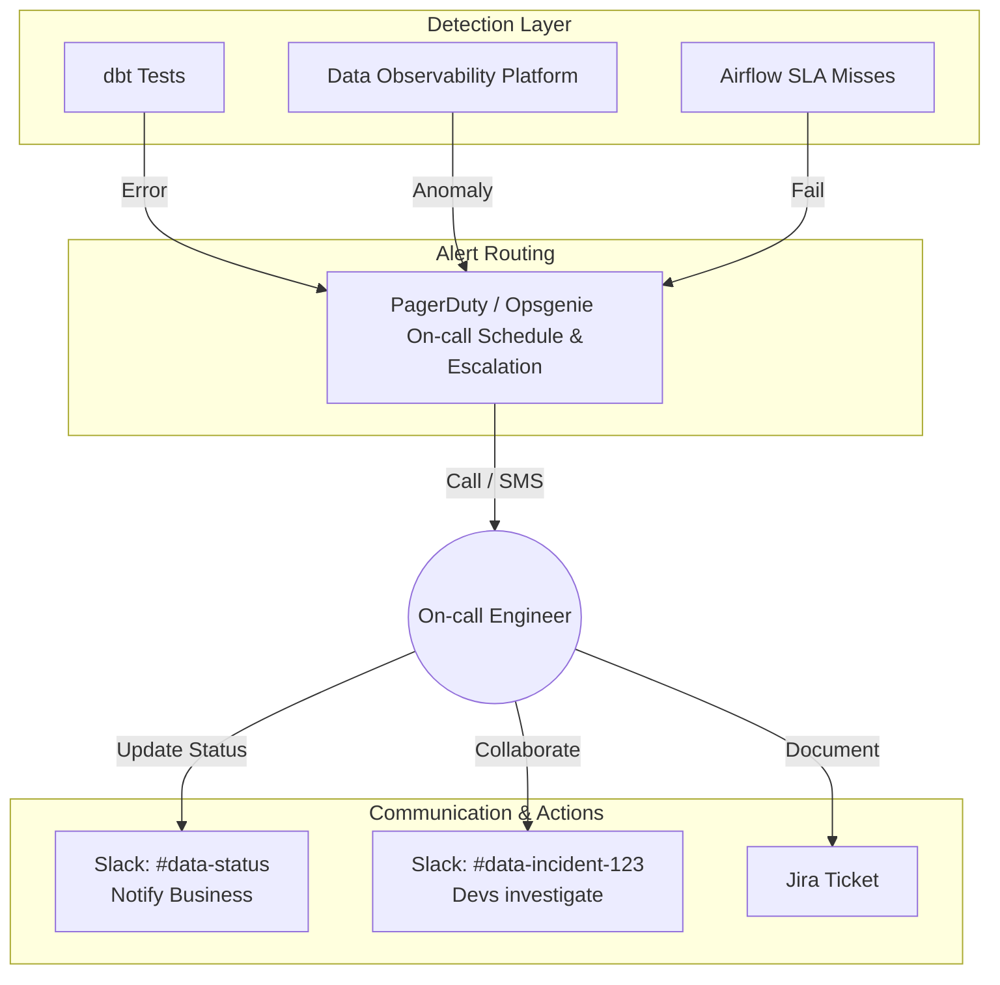

# Cảnh báo và phản ứng sự cố - Alerting & Incident Response

## Summary

Cảnh báo và phản ứng sự cố (Alerting & Incident Response) là giai đoạn "hành động" tiếp theo sau khi hệ thống Giám sát (Monitoring / Data Observability) phát hiện ra bất thường (ví dụ: Data downtime, Pipeline hỏng, Freshness chậm). Nó bao gồm các quy trình, công cụ và văn hóa làm việc nhằm đảm bảo mọi sự cố dữ liệu đều được nhận diện, phân công đúng người trực (on-call), đánh giá mức độ nghiêm trọng (Severity), khắc phục nhanh chóng và ngăn ngừa tái diễn trong tương lai.

---

## Definition

**Alerting (Cảnh báo)** là cơ chế tự động gửi thông báo (qua Slack, Email, SMS, PagerDuty) đến những cá nhân hoặc nhóm liên quan khi một chỉ số hệ thống dữ liệu vi phạm ngưỡng cho phép (threshold) hoặc mô hình phát hiện bất thường.

**Incident Response (Phản ứng sự cố)** là một khung quy trình vận hành (Operational framework) quy định cách thức con người tương tác để giải quyết cảnh báo đó. Trong thế giới Kỹ thuật Phần mềm, nó được định hình bởi SRE (Site Reliability Engineering). Trong thế giới Dữ liệu (Data Engineering/DataOps), quy trình này giải quyết câu hỏi: *"Khi pipeline dbt bị đỏ (failed) vào lúc 3 giờ sáng, ai sẽ là người thức dậy sửa, ưu tiên sửa như thế nào, và làm sao để thông báo cho CEO biết dashboard doanh thu đang sai?"*

---

## Why it exists

Ngay cả khi bạn có hệ thống Data Observability tốt nhất thế giới (Monte Carlo, Datadog), nhưng nếu không có quy trình Alerting và Incident Response bài bản, những vấn đề sau sẽ hủy hoại Data Team:
1. **Alert Fatigue (Mệt mỏi vì cảnh báo rác)**: Nhóm Slack `#data-alerts` có 500 tin nhắn mỗi ngày. Kỹ sư dữ liệu bị quá tải, dần dần tắt thông báo (Mute). Khi thảm họa thực sự xảy ra (mất sạch dữ liệu thanh toán), không ai để ý.
2. **Khủng hoảng trách nhiệm (Bystander Effect)**: Cảnh báo được gửi cho tất cả 10 kỹ sư. Mọi người đều nghĩ "Chắc ai đó đang sửa rồi", và kết quả là không ai sửa cả. Thời gian chết (Data Downtime) kéo dài hàng ngày.
3. **Mất niềm tin của Business (Loss of Trust)**: Users phát hiện dashboard bị sai và gửi phàn nàn trước khi Data Team tự nhận ra và thông báo. Niềm tin vào chất lượng dữ liệu sụp đổ.

---

## Core idea

Một hệ thống Alerting & Incident Response chuẩn mực dựa trên 4 yếu tố:
1. **Phân loại độ nghiêm trọng (Severity/SEV Levels)**: Không phải lỗi nào cũng giống nhau. SEV-1 (Sập toàn bộ hệ thống lõi) yêu cầu đánh thức kỹ sư lúc nửa đêm. SEV-4 (Bảng nháp bị lỗi) có thể đợi đến giờ làm việc sáng mai.
2. **Định tuyến và Trực ban (Routing & On-call Rotation)**: Cảnh báo phải được định tuyến chính xác đến team sở hữu dữ liệu đó (Data Ownership). Luôn có một người (Primary On-call) chịu trách nhiệm nhận cảnh báo tại mọi thời điểm.
3. **Giao tiếp minh bạch (Communication)**: Khi có sự cố, ưu tiên số một là phải giao tiếp (update status) cho người dùng cuối (Business users) biết rằng "Chúng tôi đã nhận thấy số liệu bị sai và đang sửa, dự kiến 1 tiếng nữa xong".
4. **Văn hóa không đổ lỗi (Blameless Post-mortem)**: Sau khi sửa xong, cả team họp lại tìm nguyên nhân gốc rễ (Root Cause) để sửa đổi hệ thống, chứ không phải tìm người để trừng phạt (Firefighting to Fireproofing).

---

## How it works

Vòng đời của một sự cố dữ liệu (Data Incident Lifecycle):
1. **Detection (Phát hiện)**: Hệ thống Data Observability phát hiện bảng `Fact_Sales` bị trễ (Freshness Anomaly).
2. **Alerting & Triage (Cảnh báo & Phân luồng)**:
   * Hệ thống tự động đẩy cảnh báo vào PagerDuty (hoặc Opsgenie).
   * PagerDuty gọi điện cho Kỹ sư A (đang trực On-call).
   * Kỹ sư A nhấn "Acknowledge" (Đã nhận) để xác nhận mình đang xử lý, ngăn hệ thống không gọi người quản lý (Escalation).
3. **Investigation & Mitigation (Điều tra & Khắc phục tạm)**: 
   * Kỹ sư A kiểm tra Lineage, tìm thấy kết nối Fivetran bị lỗi API token.
   * Cập nhật token, chạy lại (backfill) pipeline. Dữ liệu chạy lại thành công.
4. **Resolution (Giải quyết)**: Đánh dấu sự cố là "Resolved". Thông báo cho người dùng Dashboard có thể sử dụng lại.
5. **Post-mortem (Phân tích sau sự cố)**: Viết báo cáo giải thích tại sao token bị hết hạn mà không ai biết, và thiết lập cảnh báo tự động thông báo trước 3 ngày khi token sắp hết hạn để tránh lặp lại.

---

## Architecture / Flow



---

## Practical example

**Quy chuẩn SEV Levels (Severity) điển hình cho Data Team:**

* **SEV-1 (Critical)**: Các pipeline cốt lõi (Core pipelines) nạp dữ liệu tài chính đóng phiên thị trường bị sập. Báo cáo cho Ban Giám Đốc sai lệch. 
  * *Hành động*: PagerDuty gọi điện (Phone call) ngay lập tức (24/7). Kỹ sư phải bắt đầu sửa trong 15 phút. Update cho Business mỗi 30 phút.
* **SEV-2 (High)**: Dữ liệu phân tích Marketing ngày hôm nay không được tải lên. Các team không thể chạy chiến dịch hàng ngày.
  * *Hành động*: Báo Notification trên Slack kèm ping `@here`. Xử lý trong vòng 2 giờ. Chỉ gọi điện nếu xảy ra trong giờ hành chính.
* **SEV-3 (Medium)**: Một bài kiểm tra chất lượng dữ liệu tĩnh (Data Quality Test) báo lỗi cảnh báo (Warning) do xuất hiện vài giá trị NULL bất thường, nhưng tổng thể bảng vẫn chạy.
  * *Hành động*: Tạo thẻ Jira (Jira Ticket). Team sẽ đưa vào Sprint tiếp theo để điều tra.
* **SEV-4 (Low)**: Pipeline staging của môi trường Dev chạy lỗi.
  * *Hành động*: Ghi Log, không thông báo cho con người. Ai rảnh thì xem.

Dưới đây là ví dụ cấu hình cảnh báo bằng YAML trong **Prometheus Alertmanager** cho một pipeline dữ liệu:

```yaml
groups:
- name: DataPipelineAlerts
  rules:
  - alert: PipelineDowntime_SEV1
    expr: data_pipeline_status{job="core_finance_etl"} == 0
    for: 15m
    labels:
      severity: critical
      team: data-platform
    annotations:
      summary: "Pipeline cốt lõi đã ngừng hoạt động hơn 15 phút!"
      description: "Job core_finance_etl đã fail. Kích hoạt PagerDuty gọi on-call ngay lập tức."

  - alert: HighNullRate_SEV3
    expr: data_quality_null_percentage{table="marketing_events"} > 5
    for: 1h
    labels:
      severity: warning
      team: data-analytics
    annotations:
      summary: "Tỷ lệ NULL cao bất thường."
      description: "Cảnh báo chất lượng dữ liệu. Hãy tạo ticket Jira để kiểm tra."
```

---

## Best practices

* **Cảnh báo dựa trên Triệu chứng (Symptom-based Alerting)**: Thay vì cảnh báo vì "CPU của CSDL cao" (Nguyên nhân), hãy cảnh báo vì "Bảng dữ liệu báo cáo bị trễ 2 giờ" (Triệu chứng ảnh hưởng trực tiếp đến người dùng). CPU cao mà báo cáo vẫn ra đúng hạn thì không phải là SEV-1.
* **Gom nhóm cảnh báo (Alert Grouping)**: Khi một bảng nguồn (Raw) bị hỏng, hàng trăm bảng hạ nguồn (Marts) được xây dựng từ nó sẽ đỏ hàng loạt (Cascade failures). Hệ thống Alert phải thông minh gom 100 lỗi này thành 1 Sự cố (Incident) duy nhất trỏ về nguyên nhân gốc rễ, thay vì spam kỹ sư 100 tin nhắn.
* **Phân công On-call công bằng**: Việc trực On-call 24/7 vô cùng mệt mỏi và dễ gây trầm cảm (Burnout). Cần luân phiên (Rotation) hàng tuần, có chính sách đền bù (trực đêm được nghỉ bù) và quản lý phải hỗ trợ khi sự cố quá khó (Escalation policies).

---

## Common mistakes

* **Email Alerting**: Cấu hình cảnh báo đẩy về Email. Không ai kiểm tra hòm thư lúc 3h sáng hoặc giữa cuối tuần. Email dễ bị trôi vào mục rác (Spam). Cảnh báo nghiêm trọng bắt buộc phải dùng PagerDuty/SMS/Call.
* **"Ngăn chặn" thay vì "Chữa trị" (Ignoring Circuit Breakers)**: Phát hiện cảnh báo nhưng không có cơ chế chặn dòng chảy dữ liệu (Circuit Breaker). Dữ liệu sai vẫn được nạp lên BI Tool. Người dùng vẫn xem, rồi phải đi cãi nhau về con số. (Quy tắc đúng: Khi bảng nguồn đỏ, tự động ngừng chạy bảng đích).
* **Văn hóa đổ lỗi (Blame Culture)**: Trong buổi họp sau sự cố, sếp liên tục hỏi *"Ai là người đã gõ sai đoạn code SQL này?"*. Điều này khiến các kỹ sư sợ hãi, giấu giếm lỗi lầm lần sau thay vì khai báo sự cố sớm.

---

## Trade-offs

### Ưu điểm
* Giảm "Time-to-Resolution" (TTR - Thời gian khắc phục sự cố) từ vài ngày xuống còn vài giờ hoặc phút.
* Minh bạch hóa với các phòng ban khác (Business), giữ gìn sự uy tín của đội Data.
* Biến kiến thức cá nhân thành quy trình chuẩn (Playbooks) ai cũng có thể làm theo.

### Nhược điểm
* Yêu cầu văn hóa tổ chức cực kỳ trưởng thành và chuyên nghiệp.
* Gây stress (On-call anxiety) cho các Data Engineers nếu tần suất hệ thống lỗi quá cao (hệ thống rác nợ kỹ thuật).

---

## When to use

* Bất kỳ Data Team nào có từ 2 thành viên trở lên và phục vụ dữ liệu cho doanh nghiệp sản xuất (Production).
* Bắt buộc phải có để chuyển đổi mô hình từ Data Developer (Chỉ viết code) sang DataOps/SRE (Vận hành đường ống đáng tin cậy).

## When not to use

* Với các dự án cá nhân, các kịch bản phân tích một lần (ad-hoc analysis) hoặc môi trường PoC (Proof of Concept) nơi không có yêu cầu về SLA (cam kết dịch vụ).

---

## Related concepts

* [Phân tích nguyên nhân gốc rễ - Root Cause Analysis (RCA)](/concepts/root-cause-analysis)
* [Data Observability](/concepts/data-observability)
* [Data Lineage](/concepts/data-lineage)

---

## Interview questions

### 1. Alert Fatigue là gì và bạn làm thế nào để khắc phục nó trong hệ thống Data?
* **Người phỏng vấn muốn kiểm tra**: Kinh nghiệm thực chiến và tư duy quản lý vận hành.
* **Gợi ý trả lời**: Alert Fatigue là hội chứng các kỹ sư bị "nhờn" hoặc mệt mỏi vì phải nhận quá nhiều cảnh báo (phần lớn là cảnh báo rác/False positive), dẫn đến việc họ bỏ lỡ các cảnh báo quan trọng thực sự. Để khắc phục: (1) Xóa bỏ các cảnh báo cấp thấp (Chỉ mở Jira, không gửi thông báo chớp nháy), (2) Phân nhóm cảnh báo (Alert Grouping) theo Lineage, (3) Tinh chỉnh thuật toán độ nhạy (Tuning) thường xuyên, (4) Chia Data theo Tier (Chỉ báo động đỏ cho bảng Tier 1).

### 2. Sự cố xảy ra: Bảng doanh thu tháng báo cáo bị nhân đôi. Bạn với vai trò là người trực On-call, hãy trình bày các bước bạn sẽ xử lý sự cố này (Incident Response Steps)?
* **Người phỏng vấn muốn kiểm tra**: Kỹ năng tuân thủ khung quy trình (Process Framework) khi gặp khủng hoảng.
* **Gợi ý trả lời**:
  1. *Acknowledge (Ghi nhận)*: Nhấn xác nhận trên PagerDuty để team biết mình đang handle.
  2. *Containment (Cách ly)*: Tạm thời ngắt (disable) Dashboard hoặc thêm thông báo đỏ lên UI để báo cáo viên không đọc sai số. (Ngăn chặn lan rộng).
  3. *Investigation (Điều tra)*: Dùng Data Observability / Lineage / Airflow logs tìm xem lệnh nào chạy hai lần (ví dụ Airflow retry lỗi dẫn đến duplicate).
  4. *Mitigation/Resolution (Khắc phục)*: Viết lệnh DELETE/MERGE để xóa dữ liệu trùng lặp. Chạy lại pipeline. Bật lại Dashboard.
  5. *Post-mortem (Hậu kiểm)*: Tuần tới, viết tài liệu chỉ ra vì sao việc trùng lặp xảy ra và thêm ràng buộc UNIQUE (Primary Key enforcement) ở DWH để vĩnh viễn không lặp lại lỗi này.

---

## References

1. **Google SRE Book** - Chương 11: Being On-Call & Chương 15: Postmortem Culture.
2. **PagerDuty Incident Response Documentation** - Hướng dẫn tiêu chuẩn ngành về SEV levels và Triage.
3. **DataOps Cookbook** - Christopher Bergh. Hướng dẫn áp dụng triết lý sản xuất tinh gọn cho dữ liệu.

---

## English summary

Alerting & Incident Response forms the operational layer of Data Observability, defining how data teams react when anomalies (like schema drifts or SLA misses) are detected. Adapting Site Reliability Engineering (SRE) practices to data workflows, it involves categorizing alerts by severity (SEV levels), establishing an on-call rotation using tools like PagerDuty to route critical alerts to accountable engineers, and ensuring transparent communication with business stakeholders. The ultimate goal is to combat "alert fatigue," drastically reduce data downtime (Time-to-Resolution), and foster a blameless post-mortem culture that focuses on systemic improvements rather than finger-pointing.
