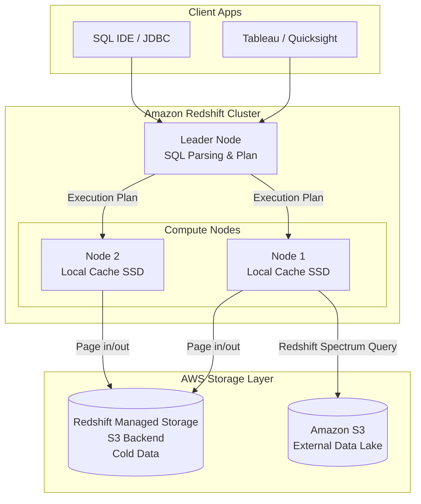

# Amazon Redshift

## Summary

Amazon Redshift là dịch vụ kho dữ liệu (Data Warehouse) đầu tiên trên đám mây ở quy mô Petabyte, được Amazon Web Services (AWS) ra mắt vào năm 2012. Redshift sử dụng kiến trúc Xử lý Song song Khổng lồ (Massively Parallel Processing - MPP) và lưu trữ dạng cột (Columnar Storage) để thực thi các truy vấn SQL phức tạp trên lượng dữ liệu cực lớn với tốc độ cực nhanh. Là một phần cốt lõi của hệ sinh thái AWS, Redshift đóng vai trò trung tâm trong nhiều cấu trúc dữ liệu doanh nghiệp (Enterprise Data Architecture).

---

## Definition

**Amazon Redshift** là một hệ thống cơ sở dữ liệu quan hệ (RDBMS) tối ưu hóa riêng cho phân tích (OLAP). Nó được tùy chỉnh lại (forked) từ lõi của hệ quản trị mã nguồn mở PostgreSQL, tuy nhiên kiến trúc bên dưới đã được viết lại hoàn toàn để xử lý Big Data.

Khi người dùng chạy một truy vấn trên Redshift, truy vấn đó không chạy trên một máy chủ đơn lẻ, mà được phân phát cho một cụm (Cluster) gồm hàng chục hoặc hàng trăm máy tính (Nodes) hoạt động song song để quét và tính toán kết quả đồng thời, mang lại tốc độ được AWS tuyên bố là nhanh hơn gấp 3 lần so với các kho dữ liệu truyền thống.

---

## Why it exists

Trước năm 2012, các tập đoàn lớn phải sử dụng các giải pháp phần cứng "đóng hộp" (Appliances) đắt tiền như Teradata, Oracle Exadata hoặc Netezza để xây dựng Data Warehouse. Quá trình này đòi hỏi:
1. Mua trước máy chủ vật lý tốn hàng triệu USD.
2. Vận hành tốn kém, cần nhiều quản trị viên hệ thống (DBA).
3. Chờ đợi hàng tháng trời để nâng cấp nếu hết dung lượng (Scale up).

Amazon Redshift ra đời nhằm "dân chủ hóa" sức mạnh tính toán này. Lần đầu tiên, một công ty startup cũng có thể thuê một cụm Data Warehouse mạnh ngang ngửa với các ngân hàng lớn chỉ với giá khởi điểm $0.25/giờ, bấm nút tạo trong 15 phút, và có thể tắt đi khi không dùng.

---

## Core idea: Kiến trúc MPP (Massively Parallel Processing)

Cấu trúc lõi của Redshift là cụm máy chủ (Cluster), bao gồm 2 thành phần chính:

1. **Leader Node (Nút chỉ huy)**: Đóng vai trò là cổng giao tiếp. Khi bạn (nhà phân tích dữ liệu) gửi câu lệnh SQL qua phần mềm BI, Leader Node sẽ nhận lệnh, phân tích cú pháp (parse), lập kế hoạch tối ưu hóa, và phát "lệnh điều động" (compile execution code) tới các máy con.
2. **Compute Nodes (Các nút tính toán)**: Đội quân phần cứng trực tiếp thực hiện công việc. Mỗi Compute Node được chia nhỏ thành các **Slices (lát cắt)**. Dữ liệu nạp vào Redshift sẽ được chia đều (phân phối) cho các Slices này. Mỗi Slice sở hữu một phần ổ cứng riêng, bộ nhớ riêng và xử lý câu SQL trên mảng dữ liệu của riêng nó một cách hoàn toàn độc lập (Không chia sẻ - Shared-nothing architecture). Sau khi xử lý xong, chúng gửi kết quả về cho Leader Node tổng hợp lại.

---

## Sự tiến hóa: Từ Shared-Nothing sang Kiến trúc RA3

Trong thiết kế Redshift truyền thống (Shared-nothing), CPU và Ổ cứng (Disk) bị gắn liền với nhau trong mỗi Compute Node. Nếu bảng dữ liệu phình to và ổ cứng đầy, bạn phải thuê thêm Node mới, vô tình trả tiền cho sức mạnh CPU dư thừa.

Để cạnh tranh với tính năng "Tách rời lưu trữ và tính toán (Decoupled Architecture)" của Snowflake và BigQuery, AWS đã phát triển dòng máy chủ mới gọi là **RA3 Instances (Redshift Managed Storage - RMS)**:
* Với máy chủ RA3, Redshift đẩy phần lớn khối lượng dữ liệu tĩnh (Cold Data) xuống Amazon S3 (Rất rẻ).
* Máy chủ RA3 chỉ lưu trữ cache SSD tốc độ cao (Hot Data) của những dữ liệu thường xuyên truy cập.
* Sự nâng cấp này giúp Redshift hiện nay có thể mở rộng khả năng lưu trữ vô tận với chi phí thấp mà không bị ràng buộc bởi số lượng Compute Nodes.

---

## How it works (Tính năng Nổi bật)

**1. Redshift Spectrum (Truy vấn hồ dữ liệu)**
Thay vì phải tốn công Copy (ETL) toàn bộ dữ liệu từ Amazon S3 vào trong ổ cứng của Redshift, tính năng Redshift Spectrum cho phép bạn viết câu lệnh SQL nối (JOIN) trực tiếp bảng đang nằm bên trong Redshift với các file Parquet/CSV đang nằm tự do bên ngoài hồ dữ liệu S3.

**2. Distribution Styles (Kiểu phân phối)**
Để kiến trúc xử lý song song (MPP) chạy nhanh nhất, dữ liệu khi nạp vào Redshift phải được phân bố đều. Người dùng có quyền định nghĩa các thuật toán:
* *EVEN*: Rải đều ngẫu nhiên theo kiểu chia bài (Round-robin).
* *KEY*: Rải dữ liệu có chung một ID (ví dụ: `user_id`) vào cùng một Node vật lý (Slice) để giảm thiểu độ trễ mạng khi JOIN hai bảng lớn với nhau.
* *ALL*: Copy nguyên vẹn cả một bảng (ví dụ bảng danh mục quốc gia - rất nhỏ) vào TẤT CẢ các node để truy cập cục bộ siêu nhanh.

**3. Serverless Option (Tùy chọn không máy chủ)**
Ra mắt gần đây (Redshift Serverless), AWS cuối cùng cũng cho phép khách hàng sử dụng Redshift theo phong cách pay-as-you-go. Redshift sẽ tự động bật (provision) công suất tính toán (RPU - Redshift Processing Units) khi có người chạy truy vấn và tự tắt khi nhàn rỗi, tương tự như BigQuery/Snowflake.

---

## Architecture / Flow



---

## Practical example

Mô phỏng sức mạnh tối ưu hóa cấu trúc vật lý của Data Engineer với Redshift.

Bảng `orders` (1 Tỷ dòng) và bảng `customers` (10 Triệu dòng). Bạn thường xuyên thực hiện truy vấn doanh thu theo khách hàng:
```sql
SELECT c.region, SUM(o.total_amount) 
FROM orders o 
JOIN customers c ON o.customer_id = c.id
GROUP BY c.region;
```

**Cách triển khai kém:** 
Không chỉ định Distribution Style. Redshift dùng `EVEN` (Mặc định). Các đơn hàng của `customer_id = 5` có thể nằm rải rác ở cả 10 node máy chủ khác nhau. Khi chạy hàm `JOIN`, Redshift phải copy dữ liệu xào xáo qua lại giữa các Node (Network Broadcast) khiến câu truy vấn mất 5 phút.

**Cách triển khai TỐT (Data Engineer can thiệp):**
```sql
-- Chỉ định Distribution Key để hai bảng sắp xếp vật lý giống nhau
CREATE TABLE orders (
    ...
    customer_id INT
) DISTSTYLE KEY DISTKEY (customer_id);

CREATE TABLE customers (
    id INT,
    region VARCHAR(50)
) DISTSTYLE KEY DISTKEY (id);
```
Vì cả hai bảng dùng chung `DISTKEY`, tất cả đơn hàng của `customer_id = 5` và thông tin của ông khách số 5 luôn luôn được phân phát nằm chung một ổ cứng máy tính vật lý (Collocated). Việc tính toán `JOIN` xảy ra cục bộ cực nhanh không cần qua mạng. Câu truy vấn giảm từ 5 phút xuống còn 10 giây.

---

## Best practices

* **Quản lý chân không (VACUUM)**: Khác với BigQuery, Redshift duy trì nhiều đặc tính của RDBMS truyền thống. Khi bạn chạy lệnh `DELETE` hay `UPDATE`, Redshift không thực sự xóa data trên ổ đĩa mà chỉ đánh dấu ẩn (mark for deletion). Bạn phải định kỳ lên lịch chạy lệnh `VACUUM` để dọn rác và tối ưu hóa lại phân mảnh ổ đĩa (Mặc dù gần đây AWS đã nâng cấp Auto-Vacuum).
* **Lựa chọn Sort Keys (Khóa sắp xếp)**: Tương tự như Clustering của BigQuery, thiết lập Sort Key trên các cột thời gian (`order_date`) giúp Redshift tối ưu việc bỏ qua các block dữ liệu (Zone Maps/Data skipping).
* **Phân tích truy vấn EXPLAIN**: Luôn dùng lệnh `EXPLAIN` trước các câu lệnh báo cáo phức tạp để kiểm tra xem hệ thống có đang thực hiện `DS_BCAST_INNER` (Phát sóng dữ liệu qua mạng - Dấu hiệu của sự kém hiệu quả phân phối dữ liệu) hay không.

---

## Common mistakes

* **Quản lý Redshift như một hệ thống OLTP (Database web)**: Tạo ra các bảng với Primary Key và Foreign Key và mong chờ Redshift thực thi quy tắc Ràng buộc Toàn vẹn (Enforcement constraints) giống như PostgreSQL. Redshift KHÔNG THỰC THI (không báo lỗi) ràng buộc duy nhất (Unique) để tối đa tốc độ nhập liệu. Việc dọn dữ liệu trùng lặp phải tự làm bằng mã (UPSERT/Merge logic).
* **Load dữ liệu bằng lệnh INSERT rời rạc**: Gửi 100,000 lệnh `INSERT INTO table VALUES(...)` liên tục. Điều này sẽ bóp nghẹt Leader Node. Bắt buộc phải đẩy dữ liệu vào S3 dưới dạng file CSV/Parquet, sau đó dùng duy nhất một lệnh `COPY` để hàng trăm Compute Nodes cùng kéo file song song vào kho dữ liệu.

---

## Trade-offs

### Ưu điểm
* Nằm sâu trong hệ sinh thái AWS, tích hợp cực kỳ hoàn hảo với các dịch vụ bảo mật (IAM, VPC) và các luồng xử lý dữ liệu (Glue, Kinesis) của Amazon.
* Cho phép kỹ sư kiểm soát sâu (Granular control) vào kiến trúc vật lý (Tuning DistKey, SortKey) mang lại hiệu năng cao nhất trên một đơn vị giá thành so với các nền tảng tự động hoàn toàn.

### Nhược điểm
* **Nặng tính vận hành (High Maintenance)**: Trừ khi sử dụng bản Serverless, phiên bản Provisioned truyền thống đòi hỏi kỹ sư dữ liệu giỏi phải liên tục tinh chỉnh bảng, dọn rác (Vacuum), và theo dõi cụm máy. Không phù hợp với người tay ngang.
* Giao diện UI/UX và trải nghiệm làm việc kém "xịn sò" (Clunky) hơn đáng kể so với môi trường hiện đại của Snowflake.

---

## When to use

* Doanh nghiệp đang sử dụng AWS làm nền tảng Cloud duy nhất và không có ý định sử dụng đa đám mây (Multi-cloud).
* Khi tổ chức có đội ngũ Data Engineering mạnh, muốn kiểm soát, cấu trúc cụm máy chủ và tối ưu chi phí hạ tầng ở mức cao nhất.
* Cần hiệu năng tính toán cực nhanh kết hợp dữ liệu kho (DWH) và hồ dữ liệu (S3) (Lakehouse concept qua Redshift Spectrum).

## When not to use

* Với tổ chức nhỏ không có ngân sách cao (cụm rẻ nhất của Redshift duy trì 24/7 tốn khoảng ~170$/tháng).
* Khi cần chạy trên Azure hoặc Google Cloud.
* Team dữ liệu của bạn đa số là Analysts không rành việc tối ưu hóa quản trị hệ thống cơ sở dữ liệu (Database Administration Tuning). (Nên chọn BigQuery/Snowflake).

---

## Related concepts

* [Google BigQuery](/concepts/google-bigquery)
* [Snowflake](/concepts/snowflake)
* [OLAP vs OLTP](/concepts/olap)
* [Data Lakehouse](/concepts/data-lakehouse)

---

## Interview questions

### 1. Giải thích sự khác biệt giữa ba kiểu phân phối (Distribution Styles) trong Redshift: EVEN, KEY, và ALL.
* **Người phỏng vấn muốn kiểm tra**: Kiến thức quản trị vật lý đặc thù của Redshift.
* **Gợi ý trả lời**:
  * **EVEN**: Rải đều dữ liệu từng dòng vào các Node theo chu kỳ (round-robin). Giúp cân bằng tải nhưng làm chậm các phép JOIN do phải truyền dữ liệu mạng.
  * **KEY**: Chọn một cột (ví dụ ID) băm (hash) và phân phát dữ liệu chung ID vào chung một Node. Tối ưu cực mạnh cho việc JOIN nếu hai bảng lớn cùng thiết lập DistKey giống nhau.
  * **ALL**: Bảng nhỏ (danh mục) được nhân bản 100% sang mọi Node. Tối ưu JOIN siêu việt vì dữ liệu nằm sẵn cục bộ, nhưng làm chậm việc tải dữ liệu mới (Insert/Update) và tốn dung lượng đĩa.

### 2. Sự khác biệt giữa mô hình tính tiền (Pricing) của Redshift và BigQuery là gì?
* **Người phỏng vấn muốn kiểm tra**: Hiểu biết FinOps trong Cloud Data.
* **Gợi ý trả lời**: Redshift truyền thống (Provisioned) hoạt động giống như cho thuê nhà: Bạn thuê cụm máy tính theo cấu hình (ví dụ 4 node RA3) và trả tiền cố định hàng giờ/hàng tháng, bất kể bạn có chạy SQL hay không. BigQuery (On-demand) hoạt động giống như đi Taxi: Không thuê máy, hệ thống Serverless thu tiền dựa trên số Byte dữ liệu được quét khi một câu lệnh SQL chạy. Gần đây Redshift cũng đã ra mắt bản Serverless (tính theo RPU capacity) để cạnh tranh với sự linh hoạt này.

### 3. Tại sao trong tài liệu Redshift người ta thường khuyên sử dụng lệnh COPY từ S3 thay vì INSERT?
* **Người phỏng vấn muốn kiểm tra**: Tư duy tải dữ liệu quy mô lớn (Bulk loading).
* **Gợi ý trả lời**: Lệnh `INSERT` đi qua Leader node duy nhất, tạo thành cổ chai nút thắt mạng. Ngược lại, kiến trúc MPP của lệnh `COPY` cho phép Leader Node ra lệnh để tất cả hàng chục Compute Nodes "tự động vươn tay" kéo dữ liệu song song trực tiếp từ các file S3, tận dụng toàn bộ băng thông mạng của cụm, nhanh hơn hàng nghìn lần so với Insert từng dòng.

---

## References

1. **Amazon Redshift Database Developer Guide** - Designing tables, Distribution styles, and Sort keys.
2. **AWS Architecture Center** - Building a Data Lake Foundation with Amazon S3 and Redshift.
3. **Fundamentals of Data Engineering** - Joe Reis & Matt Housley. (So sánh các kiến trúc Data Warehouse hiện đại).

---

## English summary

Amazon Redshift is AWS's flagship, petabyte-scale Cloud Data Warehouse powered by Massively Parallel Processing (MPP) and columnar storage. Historically utilizing a shared-nothing architecture, it recently evolved via RA3 instances (Redshift Managed Storage) to separate compute and storage layers, effectively competing with modern decoupled architectures. To achieve its industry-leading query speeds, data engineers must actively manage the physical layout of the database using Distribution Styles (KEY, ALL, EVEN) and Sort Keys to minimize network broadcast during massive JOINs. While it offers unparalleled integration with the AWS ecosystem and fine-grained hardware control, it traditionally demands a higher level of database administration and maintenance (e.g., periodic Vacuuming) compared to fully serverless alternatives like BigQuery, although Redshift Serverless now aims to bridge this gap.
