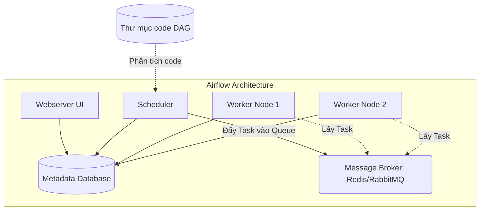

# Apache Airflow - Nền tảng điều phối dữ liệu

## Summary

**Apache Airflow** là một nền tảng mã nguồn mở phổ biến nhất thế giới được thiết kế để lập lịch (schedule), điều phối (orchestrate) và giám sát các luồng công việc phức tạp (workflows). Được phát triển ban đầu tại Airbnb vào năm 2014, Airflow sử dụng ngôn ngữ Python để định nghĩa Data Pipelines dưới dạng mã nguồn (Pipeline as Code). Nó cung cấp sự linh hoạt tuyệt đối, khả năng mở rộng mạnh mẽ và một giao diện web trực quan để các Data Engineers quản trị hàng ngàn luồng dữ liệu một cách dễ dàng.

---

## Definition

Apache Airflow là một trình điều phối luồng công việc (Workflow Orchestrator). Khác với các công cụ ETL kéo thả bằng chuột (GUI-based), Airflow yêu cầu người dùng định nghĩa luồng công việc hoàn toàn bằng code Python. 

Mỗi luồng công việc trong Airflow được biểu diễn dưới dạng một **DAG (Directed Acyclic Graph - Đồ thị có hướng không chu trình)**. Một DAG chứa nhiều **Tasks** (Tác vụ), và các mũi tên nối giữa các Task thể hiện thứ tự phụ thuộc (Dependency) để đảm bảo dữ liệu chảy theo đúng logic nghiệp vụ.

*(Lưu ý: Airflow KHÔNG phải là công cụ xử lý dữ liệu (như Spark hay Pandas). Nhiệm vụ của nó chỉ là "điều phối" - ra lệnh cho các hệ thống khác làm việc).*

---

## Why it exists

Vào những năm 2010, khi Big Data bùng nổ, quy trình xử lý dữ liệu trở nên cực kỳ rắc rối. Kỹ sư phải gọi API từ Salesforce, ném dữ liệu vào S3, gọi Spark Cluster xử lý, chờ Spark xong thì nạp vào Redshift, và gửi email báo cáo.
Sử dụng `cron` không thể giải quyết được việc "chờ hệ thống này xong mới gọi hệ thống kia". Việc viết các script bash rối rắm tự gọi nhau dẫn đến cảnh "mì ống" (spaghetti code), không ai biết luồng đang chạy đến đâu và lỗi ở chỗ nào.

Airflow ra đời mang đến 3 giải pháp đột phá:
1. **Dynamic (Tính động)**: Mọi thứ được định nghĩa bằng Python, bạn có thể dùng vòng lặp `for` để sinh ra hàng trăm tác vụ (tasks) tự động mà không cần hardcode.
2. **Extensible (Dễ mở rộng)**: Cấu trúc plugin/operator cho phép Airflow dễ dàng giao tiếp với hầu hết mọi dịch vụ Cloud hiện đại (AWS, GCP, Snowflake, Slack...).
3. **Elegant (Thanh lịch)**: Khái niệm xử lý theo "Khoảng thời gian thực thi" (Execution Date / Logical Date) giúp giải quyết triệt để bài toán chạy bù dữ liệu quá khứ (Backfilling).

---

## Core idea

Ý tưởng trung tâm của Airflow xoay quanh hệ sinh thái các "Viên gạch" (Building blocks):
* **DAG**: Khung xương định nghĩa cấu trúc luồng công việc.
* **Operator**: Khuôn mẫu (Template) quy định MỘT công việc cụ thể. Ví dụ: `BashOperator` để chạy lệnh bash, `PostgresOperator` để chạy lệnh SQL, `PythonOperator` để chạy một hàm Python.
* **Task**: Là một thực thể cụ thể (Instance) của Operator khi được thả vào DAG. 
* **Task Instance**: Là trạng thái chạy thực tế của một Task tại một thời điểm cụ thể (ví dụ: Task A chạy cho ngày 2026-06-07 trạng thái là SUCCESS).

---

## Architecture / Flow

Kiến trúc của Airflow bao gồm 4 thành phần dịch vụ vật lý phối hợp với nhau:

1. **Webserver**: Cung cấp giao diện đồ họa UI (dựa trên Flask). Nơi kỹ sư xem biểu đồ DAG, kiểm tra log lỗi, bấm nút Run/Clear.
2. **Scheduler**: "Trái tim" của hệ thống. Nó liên tục quét qua thư mục code DAGs, kiểm tra xem đã đến giờ chạy chưa, hoặc task nào đã thỏa mãn điều kiện phụ thuộc thì đóng gói đẩy vào Hàng đợi (Queue).
3. **Database (Metadata Store)**: Thường là PostgreSQL hoặc MySQL. Nơi lưu trữ toàn bộ trạng thái hệ thống: định nghĩa DAG, lịch sử chạy, cấu hình kết nối, variables.
4. **Executor / Workers**: Đội quân "chân tay" nhận lệnh từ Scheduler để thực thi các Task thực tế. Trong môi trường production, thường dùng Celery Executor (chia task cho nhiều server worker) hoặc Kubernetes Executor (mỗi task chạy trên một Pod riêng rẽ).



---

## Practical example

Một đoạn code tiêu chuẩn định nghĩa một DAG trên Airflow thực hiện 3 bước: In thông báo $\rightarrow$ Đợi 2 giây $\rightarrow$ In thông báo hoàn thành.

```python
from datetime import datetime, timedelta
from airflow import DAG
from airflow.operators.bash import BashOperator
from airflow.operators.python import PythonOperator
import time

# 1. Định nghĩa các tham số mặc định cho DAG
default_args = {
    'owner': 'data_engineering_team',
    'depends_on_past': False,
    'retries': 2,
    'retry_delay': timedelta(minutes=5),
}

# 2. Khởi tạo đối tượng DAG
with DAG(
    dag_id='example_daily_etl',
    default_args=default_args,
    description='A simple tutorial DAG',
    schedule_interval='@daily',      # Chạy mỗi ngày 1 lần
    start_date=datetime(2026, 6, 1), # Bắt đầu tính toán từ ngày 1/6/2026
    catchup=False,
) as dag:

    # 3. Định nghĩa các Tasks
    extract_task = BashOperator(
        task_id='extract_data',
        bash_command='echo "Extracting data for {{ ds }}"', # {{ ds }} là macro lấy ngày logic
    )

    def process_logic():
        print("Transforming data...")
        time.sleep(2)

    transform_task = PythonOperator(
        task_id='transform_data',
        python_callable=process_logic,
    )

    load_task = BashOperator(
        task_id='load_data',
        bash_command='echo "Loading successful!"',
    )

    # 4. Thiết lập sự phụ thuộc (Dependencies)
    extract_task >> transform_task >> load_task
```

---

## Best practices

* **Code DAG chỉ dùng để định nghĩa cấu trúc**: Đừng bao giờ viết code tải hàng triệu dòng dữ liệu trực tiếp trong file DAG (ở ngoài các Operator). Scheduler của Airflow mặc định quét các file DAG mỗi 30 giây để tìm sự thay đổi. Nếu bạn viết code nặng ở top-level, Scheduler sẽ quét file rất chậm, làm đứng toàn bộ hệ thống (Scheduler Timeout).
* **Quản lý Connections qua giao diện/Secret Manager**: Không được hardcode mật khẩu, token API vào trong file code Python. Hãy tận dụng hệ thống `Connections` của Airflow UI hoặc móc nối với Hashicorp Vault/AWS Secrets Manager.
* **Sử dụng Variables thận trọng**: Không dùng hàm `Variable.get("my_var")` ở bên ngoài cấu trúc Operator. Nó sẽ mở một kết nối database mỗi lần Scheduler quét file (hàng trăm lần mỗi phút), có thể đánh sập Metadata DB. Thay vào đó, hãy dùng Jinja templating `{{ var.value.my_var }}` bên trong Operator.

---

## Common mistakes

* **Hiểu lầm về Execution Date**: Đây là một trong những khái niệm "gây lú" nhất của Airflow. Khi bạn lập lịch chạy `@daily` cho ngày `2026-06-07`, DAG này sẽ thực sự khởi chạy trên server vào thời điểm kết thúc khoảng thời gian đó, tức là `00:00:00 ngày 2026-06-08`. Execution Date của DAG run đó vẫn là `2026-06-07`. Mục đích là để đảm bảo toàn bộ dữ liệu của ngày mùng 7 đã được thu thập đủ. (Từ bản Airflow 2.2+, khái niệm này đã được cải thiện thành `data_interval_start` và `data_interval_end` để rõ ràng hơn).
* **Chạy các Data Pipeline quá nặng trên Worker mặc định**: Sử dụng `PythonOperator` tải bảng dữ liệu 10GB vào pandas dataframe. Worker sẽ lập tức bị hệ điều hành "bóp cổ" bằng lỗi OOM (Out Of Memory).

---

## Trade-offs

### Ưu điểm
* Ngôn ngữ Python 100%, cộng đồng lớn nhất thế giới, gần như mọi dịch vụ bên thứ 3 đều có sẵn Provider Operator (Hook/Operator miễn phí).
* Giao diện UI xuất sắc nhất trong tầm giá (miễn phí), dễ dàng thao tác Clear/Rerun/Mark Success cho các task.
* Xử lý Backfill (chạy lại dữ liệu quá khứ) là tính năng cốt lõi vô đối của Airflow.

### Nhược điểm
* **Nặng nề**: Rất khó khăn để setup ban đầu trong môi trường production (cần hiểu Kubernetes, Celery, Postgres, RabbitMQ).
* **Truyền dữ liệu kém**: Việc truyền dữ liệu (Data passing) giữa các Task rất tệ. Airflow có XCom nhưng nó lưu dữ liệu đó vào Database, giới hạn kích thước siêu nhỏ (vài chục MB) và dễ gây lỗi chậm hệ thống.
* **Lập lịch cứng nhắc**: Dựa nhiều vào Cron-based scheduling. Dù Airflow 2.0+ đã cải thiện, nó vẫn yếu thế hơn các công cụ mới (như Prefect, Dagster) trong các luồng Event-driven hoặc Data-aware scheduling.

---

## When to use

* Là lựa chọn "Mặc định an toàn" (Industry Standard) cho bất kỳ Data Team nào cần thiết lập hệ thống Data Platform tập trung.
* Rất phù hợp với kiến trúc ELT/ETL truyền thống (Gọi dịch vụ bên thứ 3 thực thi và chờ kết quả).
* Đội ngũ có nền tảng tốt về Python và Kubernetes.

## When not to use

* Khi bạn cần Streaming data liên tục 24/7 (hãy dùng Flink, Kafka Streams).
* Khi pipeline có yêu cầu truyền lượng lớn Dataframes trực tiếp giữa các Task (nên cân nhắc Dagster, Prefect, hoặc Spark).

---

## Related concepts

* [Orchestration](/concepts/orchestration)
* [Directed Acyclic Graph (DAG)](/concepts/dag)
* [Task Dependency](/concepts/task-dependency)
* [Airflow Scheduler](/concepts/airflow-scheduler)

---

## Interview questions

### 1. Hãy giải thích cơ chế của Execution Date (hoặc Data Interval) trong Apache Airflow. Nếu một DAG có lịch `@daily`, Execution Date là `2026-06-01`, thì thực tế DAG đó kích hoạt chạy lúc nào?
* **Người phỏng vấn muốn kiểm tra**: Hiểu biết nền tảng về cơ chế lập lịch đặc thù của Airflow.
* **Gợi ý trả lời (Strong Answer)**: Đây là một thiết kế lịch sử của Airflow chuyên dùng cho Batch ETL. Nguyên lý là: Bạn chỉ xử lý xong báo cáo của ngày 1/6 khi ngày 1/6 đã kết thúc hoàn toàn. Do đó, một DAG với execution date là `2026-06-01` (`@daily`) sẽ chính thức được Scheduler kích hoạt (Trigger) vào thời điểm `00:00:00 ngày 2026-06-02`. Trong các bản Airflow mới, khái niệm này được làm rõ thành `data_interval_start = 2026-06-01` và `data_interval_end = 2026-06-02`. 
* **Lỗi cần tránh**: Trả lời sai rằng DAG kích hoạt vào ngày mùng 1.

### 2. Sự khác biệt giữa Operator và Task trong Airflow là gì?
* **Người phỏng vấn muốn kiểm tra**: Khái niệm OOP trong Airflow.
* **Gợi ý trả lời (Strong Answer)**: Operator đóng vai trò như một Class (Lớp) trong lập trình hướng đối tượng. Nó định nghĩa logic xử lý công việc chung (Ví dụ: `PostgresOperator` định nghĩa cách kết nối và chạy query Postgres). Task là một Object (Đối tượng) hay Instance của Operator cụ thể hóa bên trong một DAG (Ví dụ: Một task tên `create_table` sử dụng `PostgresOperator` để tạo bảng A).

### 3. XCom trong Airflow là gì? Giới hạn lớn nhất của nó là gì?
* **Người phỏng vấn muốn kiểm tra**: Kỹ năng giao tiếp giữa các Task.
* **Gợi ý trả lời (Strong Answer)**: XCom (Cross-Communication) là cơ chế mặc định của Airflow cho phép một Task này đẩy một mẩu thông tin (như một mảng JSON nhỏ, chuỗi ID, URL) cho một Task khác nằm sau nó trong DAG đọc. Giới hạn chết người của XCom là dữ liệu này được lưu trực tiếp vào Metadata Database của Airflow (Postgres/MySQL) dưới dạng Blob. Do đó KHÔNG BAO GIỜ được dùng XCom để truyền Dataframes hoặc lượng dữ liệu lớn (sẽ làm phình to DB, tràn RAM hệ thống). Để truyền dữ liệu lớn, hãy lưu file vào S3/GCS và chỉ truyền "đường dẫn URL" của file đó qua XCom.

### 4. Celery Executor khác với Kubernetes Executor như thế nào trong môi trường Production?
* **Người phỏng vấn muốn kiểm tra**: Kiến trúc triển khai hạ tầng.
* **Gợi ý trả lời (Strong Answer)**: Celery Executor duy trì một nhóm các Worker nodes luôn chạy (always-on). Khi có task, Scheduler đẩy vào Message Queue (Redis) và Worker rảnh sẽ bốc ra chạy. Tốc độ khởi động task rất nhanh, nhưng nhược điểm là tốn tiền duy trì server 24/7 và môi trường thư viện Python có thể xung đột giữa các task chạy trên cùng 1 worker. Kubernetes Executor không có worker tĩnh. Mỗi khi có Task, nó sẽ tự động gọi API K8s tạo ra một Pod (Container) mới tinh lẻ loi để chạy đúng task đó, xong thì hủy Pod đi. Tốc độ khởi động chậm hơn (tốn vài giây lên Pod), nhưng bù lại tiết kiệm chi phí do scale-to-zero và cách ly hoàn toàn môi trường thư viện giữa các tasks.

### 5. Cấu hình `catchup=True` trong định nghĩa DAG có tác dụng gì? Điều gì nguy hiểm có thể xảy ra?
* **Người phỏng vấn muốn kiểm tra**: Cảnh giác với thảm họa hệ thống.
* **Gợi ý trả lời (Strong Answer)**: Khi deploy một DAG mới với `start_date` lùi về quá khứ (VD lùi về 1 tháng trước), nếu `catchup=True` (giá trị mặc định cũ), Scheduler sẽ lập tức tính toán các khoảng thời gian bị lỡ và kích hoạt hàng loạt (hàng chục DAG Runs) đồng thời để "chạy bù" (backfill) cho kịp tiến độ hiện tại. Điều nguy hiểm là việc này có thể tạo ra hàng ngàn Task cùng một lúc, gây hiệu ứng DDOS tự đánh sập toàn bộ Database đích, cạn kiệt API quota và làm sập chính Airflow. Hiện nay best practice là luôn set `catchup=False` cho DAG mới.

---

## References

1. **Data Pipelines with Apache Airflow** - Bas P. Harenslak, Julian Rutger de Ruiter (Sách toàn diện nhất, O'Reilly xuất bản).
2. **Apache Airflow Documentation** - Architecture Overview.
3. **Astronomer Blog** - Airflow Execution Dates Explained.

---

## English summary

**Apache Airflow** is the industry-standard, open-source orchestration platform for authoring, scheduling, and monitoring data pipelines. It utilizes Python to define workflows as Directed Acyclic Graphs (DAGs), adhering to the "pipeline-as-code" paradigm. Its modular architecture—comprising a Scheduler, Webserver, Metadata Database, and Executors (like Celery or Kubernetes)—allows it to scale infinitely and interface with virtually any modern data service via its rich ecosystem of Operators. Airflow shines in managing complex task dependencies and historical backfilling (via its unique logical execution date system), but users must take care not to treat it as a data processing engine or pass large datasets between tasks via its XCom backend.
