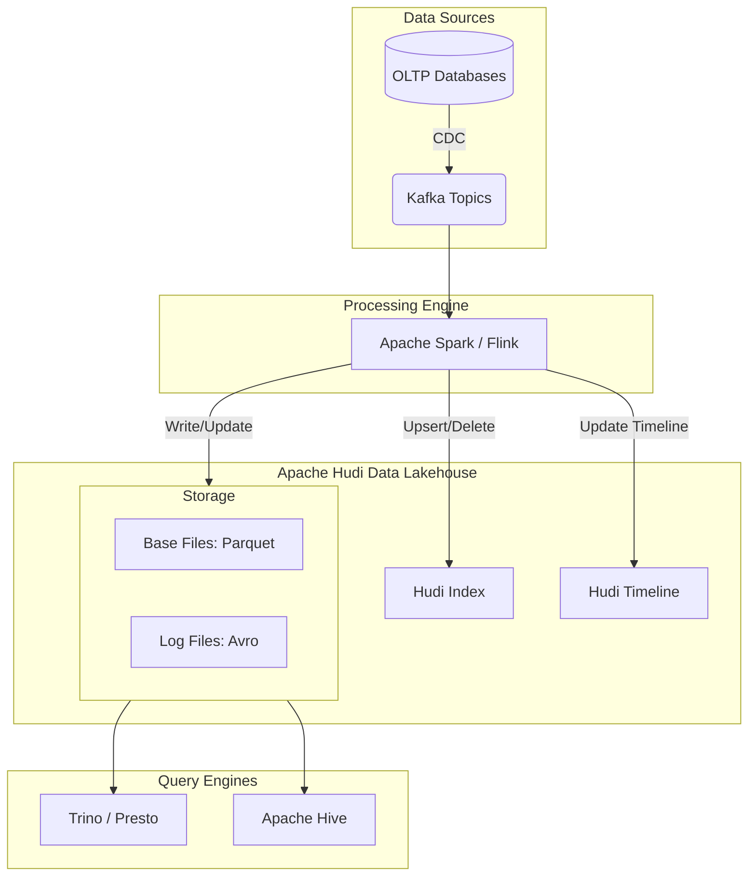

# Apache Hudi

## Summary

Apache Hudi (Hadoop Upserts Deletes and Incrementals) là một định dạng bảng (table format) mã nguồn mở được thiết kế để quản lý việc lưu trữ dữ liệu lớn trên các hệ thống lưu trữ phân tán (như HDFS, S3, GCS). Hudi mang lại các tính năng quan trọng như giao dịch ACID, cập nhật (upserts), xóa (deletes) và xử lý dữ liệu gia tăng (incremental processing) ngay trên nền tảng Data Lake.

---

## Definition

**Apache Hudi** là một tầng quản lý dữ liệu (data management layer) nằm giữa các engine tính toán (như Apache Spark, Flink, Presto, Trino) và các hệ thống lưu trữ phân tán hoặc đám mây (như Amazon S3, Google Cloud Storage, HDFS). Hudi cho phép thực hiện các thao tác thay đổi dữ liệu (mutations) ở cấp độ bản ghi (record-level) trên Data Lake, vốn dĩ trước đây chỉ được hỗ trợ tốt trên các cơ sở dữ liệu quan hệ hoặc Data Warehouse truyền thống.

---

## Why it exists

Trước khi có các table format như Hudi, việc quản lý dữ liệu trên Data Lake gặp rất nhiều khó khăn:
1. **Không hỗ trợ Upsert/Delete**: Dữ liệu trên Data Lake thường ở dạng append-only (chỉ thêm mới). Để cập nhật hoặc xóa một vài bản ghi, kỹ sư dữ liệu phải ghi lại toàn bộ tệp tin chứa dữ liệu đó hoặc toàn bộ một phân vùng (partition), gây tốn kém tài nguyên và thời gian vô ích.
2. **Khó khăn trong xử lý CDC (Change Data Capture)**: Khi tích hợp dữ liệu từ các database nguồn có những thay đổi liên tục, việc đồng bộ các thay đổi đó vào Data Lake gần như không thể thực hiện hiệu quả theo thời gian thực (real-time) hoặc gần thời gian thực (near real-time).
3. **Quản lý dữ liệu gia tăng kém**: Việc xác định dữ liệu nào mới được thêm vào hoặc thay đổi để chạy các pipeline hạ nguồn đòi hỏi logic rất phức tạp.

Hudi được Uber tạo ra để giải quyết chính những vấn đề này: khả năng cập nhật bản ghi nhanh chóng, đáp ứng yêu cầu đồng bộ CDC và hỗ trợ truy vấn gia tăng (incremental queries) mạnh mẽ.

---

## Core idea

Ý tưởng cốt lõi của Hudi xoay quanh 3 khái niệm:
1. **Record-level Indexing**: Hudi sử dụng các chỉ mục (indexes) như Bloom Filter hoặc HBase để nhanh chóng xác định vị trí của một bản ghi cần cập nhật hoặc xóa mà không cần quét toàn bộ tệp tin.
2. **Timeline (Dòng thời gian)**: Hudi duy trì một dòng thời gian cốt lõi lưu trữ tất cả các hành động (commits, rollbacks, compactions) thực hiện trên bảng. Điều này cho phép phục hồi trạng thái dữ liệu (time travel) và hỗ trợ giao dịch ACID.
3. **Table Types (Loại bảng)**: Hudi cung cấp hai loại hình lưu trữ dữ liệu khác nhau để cân bằng giữa hiệu suất ghi và đọc:
   - **Copy-on-Write (CoW)**: Dữ liệu được lưu trữ hoàn toàn trong các tệp tin cột (Parquet). Khi có cập nhật, tệp Parquet sẽ được sao chép và tạo mới kèm với bản ghi đã thay đổi. Phù hợp cho workload đọc nhiều (read-heavy).
   - **Merge-on-Read (MoR)**: Dữ liệu cập nhật được ghi nhanh vào các tệp tin dòng (Avro logs). Khi truy vấn, engine đọc sẽ hợp nhất dữ liệu từ Parquet và Avro. Các log sau đó sẽ được gộp (compacted) lại định kỳ. Phù hợp cho workload ghi nhanh/streaming (write-heavy).

---

## How it works

Quá trình hoạt động cơ bản của Hudi khi thực hiện Upsert (Cập nhật hoặc Thêm mới) trong bảng MoR:
1. **Ingestion**: Dữ liệu từ nguồn (ví dụ Kafka thông qua Spark Streaming) đi vào Hudi.
2. **Indexing**: Hudi kiểm tra chỉ mục để xem các khóa (keys) của dữ liệu đến đã tồn tại trong các tệp lưu trữ hay chưa.
3. **Writing**:
   - Đối với các bản ghi mới (Inserts), Hudi ghi chúng vào các tệp Parquet cơ sở mới.
   - Đối với các bản ghi đã tồn tại (Updates), Hudi ghi sự thay đổi vào tệp log (Avro) liên kết với tệp Parquet cơ sở chứa bản ghi đó.
4. **Compaction**: Định kỳ (ví dụ mỗi giờ), một tiến trình nền sẽ chạy để hợp nhất (merge) dữ liệu từ tệp log vào một phiên bản tệp Parquet cơ sở mới để tối ưu tốc độ đọc ở các lần sau.

---

## Architecture / Flow



---

## Practical example

Sử dụng Spark Shell (Scala) để thao tác với Apache Hudi:

**1. Tạo dữ liệu mẫu và ghi (Insert) vào Hudi table:**
```scala
import org.apache.hudi.QuickstartUtils._
import scala.collection.JavaConversions._
import org.apache.spark.sql.SaveMode._
import org.apache.hudi.DataSourceWriteOptions._
import org.apache.hudi.config.HoodieWriteConfig._

val tableName = "hudi_trips_cow"
val basePath = "file:///tmp/hudi_trips_cow"
val dataGen = new DataGenerator

val inserts = convertToStringList(dataGen.generateInserts(10))
val df = spark.read.json(spark.sparkContext.parallelize(inserts, 2))

df.write.format("hudi").
  options(getQuickstartWriteConfigs).
  option(PRECOMBINE_FIELD_OPT_KEY, "ts").
  option(RECORDKEY_FIELD_OPT_KEY, "uuid").
  option(PARTITIONPATH_FIELD_OPT_KEY, "partitionpath").
  option(TABLE_NAME, tableName).
  mode(Overwrite).
  save(basePath)
```

**2. Cập nhật dữ liệu (Upsert):**
```scala
val updates = convertToStringList(dataGen.generateUpdates(10))
val dfUpdates = spark.read.json(spark.sparkContext.parallelize(updates, 2))

dfUpdates.write.format("hudi").
  options(getQuickstartWriteConfigs).
  option(PRECOMBINE_FIELD_OPT_KEY, "ts").
  option(RECORDKEY_FIELD_OPT_KEY, "uuid").
  option(PARTITIONPATH_FIELD_OPT_KEY, "partitionpath").
  option(TABLE_NAME, tableName).
  mode(Append). // Sử dụng Append thay vì Overwrite cho Upsert
  save(basePath)
```

---

## Best practices

* **Lựa chọn đúng Table Type**: Sử dụng Copy-on-Write (CoW) cho các bảng có tần suất cập nhật thấp (batch jobs hàng ngày) và Merge-on-Read (MoR) cho các luồng dữ liệu thay đổi liên tục, độ trễ thấp (streaming CDC).
* **Quản lý Compaction**: Đối với MoR, hãy lập lịch Compaction thường xuyên để đảm bảo hiệu suất truy vấn không bị chậm do phải đọc và hợp nhất quá nhiều file log (delta files).
* **Partitioning**: Thiết kế chiến lược phân vùng hợp lý (ví dụ: theo ngày tạo) để giới hạn số lượng dữ liệu phải quét, đồng thời quản lý kích thước tệp (file sizing) tốt hơn.
* **Sử dụng Indexing hiệu quả**: Bloom Index là lựa chọn mặc định và phổ biến nhất, cung cấp hiệu suất tốt trong đa số trường hợp. Nếu dùng HBase Index, cần phải bảo trì cụm HBase độc lập.

---

## Common mistakes

* **Quên dọn dẹp các version cũ**: Không cấu hình các chính sách dọn dẹp (Cleaner policies), khiến hệ thống lưu trữ toàn bộ lịch sử file Parquet dẫn đến tốn kém chi phí lưu trữ S3/HDFS rất lớn.
* **Kích thước file quá nhỏ (Small files problem)**: Việc ghi theo streaming hoặc cập nhật lượng dữ liệu quá nhỏ liên tục dẫn đến việc tạo ra hàng ngàn file nhỏ, làm chậm quá trình liệt kê (listing) và truy vấn của Hudi. Cần kích hoạt tính năng tự động tối ưu hóa kích thước file.

---

## Trade-offs

### Ưu điểm
* Hỗ trợ tuyệt vời cho Upserts, Deletes ở mức bản ghi.
* Hỗ trợ Incremental Queries, cho phép luồng dữ liệu xử lý theo chuỗi nhẹ nhàng hơn.
* Hỗ trợ Time Travel: xem lại trạng thái của bảng ở một mốc thời gian quá khứ.
* Tích hợp sâu với hệ sinh thái Hadoop/Spark.

### Nhược điểm
* **Độ phức tạp trong cấu hình**: Hudi có hàng tá cấu hình về write, index, compaction, clean, clustering... đòi hỏi hiểu biết sâu để tinh chỉnh tối ưu.
* **Overhead**: Quá trình indexing và compaction tiêu tốn một lượng tài nguyên tính toán không nhỏ.

---

## When to use

* Xây dựng luồng dữ liệu tích hợp CDC từ Database (MySQL, Postgres, Oracle) lên Data Lake với độ trễ từ vài phút đến vài chục phút.
* Đảm bảo tính tuân thủ quy định xóa dữ liệu (như GDPR, CCPA) trên môi trường phân tán lớn.
* Khi cần tạo pipeline xử lý dữ liệu liên tục và chỉ phân tích các bản ghi thay đổi từ lần truy vấn cuối (incremental processing).

## When not to use

* Nếu hệ thống chỉ chạy luồng dữ liệu hoàn toàn là ghi thêm (append-only logs), ví dụ như lưu nhật ký truy cập (web logs). Khi đó việc ghi trực tiếp ra Parquet truyền thống sẽ đơn giản và nhẹ nhàng hơn.
* Khi dữ liệu có kích thước nhỏ và có thể dễ dàng quản lý trọn vẹn trong một RDBMS thông thường mà không cần Data Lake.

---

## Related concepts

* [Data Lake](/concepts/data-lake)
* [Data Lakehouse](/concepts/data-lakehouse)
* [Change Data Capture (CDC)](/concepts/change-data-capture)
* [Table Format](/concepts/table-format)
* [Compaction](/concepts/compaction)

---

## Interview questions

### 1. Phân biệt sự khác nhau giữa hai loại bảng Copy-on-Write (CoW) và Merge-on-Read (MoR) trong Hudi.
* **Người phỏng vấn muốn kiểm tra**: Sự am hiểu về cách Hudi quản lý lưu trữ và thiết kế kiến trúc hệ thống.
* **Gợi ý trả lời (Strong Answer)**: 
  * **CoW (Copy-on-Write)**: Mọi thao tác ghi (insert/update) sẽ trực tiếp tạo ra tệp cơ sở (Parquet) mới. Điều này làm cho việc ghi (write) diễn ra chậm hơn và tốn tài nguyên do chi phí sao chép lại những dữ liệu không đổi trong cùng file, nhưng bù lại, tác vụ đọc (read) là tối ưu nhất vì nó không cần hợp nhất gì cả. Phù hợp với ETL dạng lô (batch).
  * **MoR (Merge-on-Read)**: Các thay đổi (updates/deletes) được ghi nhanh vào các file log (Avro). Engine truy vấn sẽ đọc các file base (Parquet) và kết hợp chúng với các log on-the-fly (tại thời điểm truy vấn). Việc ghi cực kỳ nhanh (latency thấp, phù hợp cho streaming) nhưng việc đọc chậm hơn. Có cơ chế compaction nền để gom log vào base định kỳ.
* **Lỗi cần tránh**: Không nhắc đến cơ chế compaction trong MoR hoặc không phân biệt rõ tác động lên Write Amplification (CoW) và Read Amplification (MoR).

### 2. Làm thế nào Apache Hudi xử lý CDC từ một nguồn RDBMS vào Data Lake?
* **Người phỏng vấn muốn kiểm tra**: Kiến thức tổng quát về pipeline ETL hiện đại và kỹ năng kết hợp công cụ.
* **Gợi ý trả lời (Strong Answer)**: 
  Sử dụng một công cụ như Debezium theo dõi nhật ký transaction log (ví dụ binlog MySQL) để tạo ra các sự kiện thay đổi dữ liệu (insert, update, delete). Các sự kiện này được đẩy vào Kafka. Dùng Spark Streaming hoặc Flink đọc từ Kafka, sau đó sử dụng khả năng Upsert của Hudi (bảng MoR) với khóa chính (Record Key) và trường thời gian (Precombine Key) để tự động cập nhật hoặc xóa các bản ghi trên Data Lake, đảm bảo trạng thái dữ liệu nhất quán với nguồn RDBMS.

---

## References

1. **Apache Hudi Documentation**: (https://hudi.apache.org/docs/overview) - Tài liệu chính thức kiến trúc và hướng dẫn.
2. **"Data Engineering with Apache Spark, Delta Lake, and Lakehouse"** - Phân tích so sánh Hudi, Iceberg và Delta Lake.
3. **Uber Engineering Blog**: "Hudi: Uber Engineering’s Incremental Processing Framework on Hadoop".

---

## English summary

Apache Hudi (Hadoop Upserts Deletes and Incrementals) is an open-source data management framework and table format that simplifies incremental data processing and data pipeline development by providing record-level insert, update, delete, and upsert capabilities on data lakes (like HDFS or cloud object storage). It introduces ACID transactions and offers two table types—Copy-on-Write (optimized for read-heavy analytical workloads) and Merge-on-Read (optimized for write-heavy streaming scenarios). Core features like time travel, schema evolution, and automated compaction make Hudi essential for building modern Data Lakehouses and managing massive CDC pipelines.
