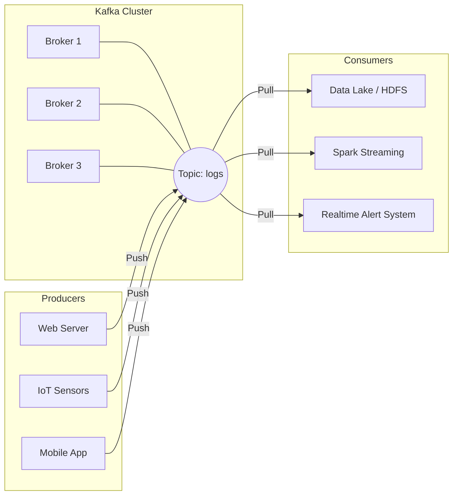

# Apache Kafka

## Summary

Apache Kafka là một nền tảng phân phối luồng sự kiện phân tán (Distributed Event Streaming Platform) mã nguồn mở. Được ví như "hệ thống thần kinh trung ương" của kiến trúc dữ liệu hiện đại, Kafka đóng vai trò là trạm trung chuyển (Message Broker) đệm giữa hàng trăm dịch vụ đẩy dữ liệu (Producers) và hàng trăm dịch vụ tiêu thụ (Consumers). Nó nổi tiếng bởi khả năng xử lý hàng triệu tin nhắn mỗi giây với độ trễ siêu thấp và khả năng lưu trữ tin nhắn cực kì bền bỉ.

---

## Definition

Được LinkedIn phát triển vào năm 2011, **Apache Kafka** không đơn thuần là một hàng đợi tin nhắn (Message Queue). Nó được thiết kế dựa trên khái niệm **Log nối tiếp** (Append-only Log). Thay vì xóa tin nhắn đi sau khi người dùng đã đọc như các hệ thống truyền thống (ActiveMQ, RabbitMQ), Kafka lưu trữ dữ liệu dưới dạng File vật lý trên đĩa cứng của các cụm máy chủ và giữ lại trong một khoảng thời gian thiết lập (ví dụ: 7 ngày).

Kafka triển khai mô hình **Publish-Subscribe (Phát hành - Đăng ký)**, cho phép nhiều bên cùng lúc đọc chung một luồng sự kiện một cách độc lập mà không ảnh hưởng tới nhau.

---

## Why it exists

Trước Kafka, khi doanh nghiệp muốn truyền dữ liệu từ dịch vụ A sang dịch vụ B, họ dùng kiến trúc Point-to-Point (gọi API trực tiếp).
Khi doanh nghiệp bành trướng, có 10 nguồn cấp dữ liệu và 10 kho lưu trữ/hệ thống phân tích khác nhau. Nếu liên kết API trực tiếp, ta sẽ có một mạng nhện `10 x 10 = 100` đường ống kết nối chằng chịt cực kỳ dễ vỡ. Nếu dịch vụ Database B bị sập 10 phút, tất cả dữ liệu từ App A gửi qua trong 10 phút đó sẽ thất thoát hoàn toàn.

Kafka ra đời làm một điểm trung chuyển (Hub) duy nhất.
1. 10 App chỉ cần gửi (Publish) dữ liệu vào Kafka.
2. Hệ thống kho dữ liệu tự do lấy (Subscribe) dữ liệu từ Kafka bất cứ khi nào nó rảnh rỗi.
3. Nếu kho dữ liệu chết 1 ngày, tin nhắn vẫn an toàn ở đĩa cứng của Kafka. Hôm sau bật lên, kho lấy lại không xót một tin.

---

## How it works

Hệ sinh thái Kafka gồm 4 nhân tố chính:

1. **Broker (Máy chủ trung gian)**: Mỗi máy chủ chạy Kafka gọi là một Broker. Một cụm (Cluster) Kafka gồm nhiều Brokers liên kết với nhau để chia sẻ tải và lưu trữ dự phòng. (Sử dụng Apache Zookeeper hoặc KRaft để bầu chọn Leader).
2. **Topic (Chủ đề)**: Là một kênh, một thư mục để phân loại tin nhắn. Ví dụ `user_clicks` (chứa dữ liệu click chuột) hay `payments_info` (chứa giao dịch).
3. **Producer (Nhà xuất bản)**: Các ứng dụng Client đẩy dữ liệu vào một Topic cụ thể của Kafka.
4. **Consumer (Người tiêu thụ)**: Các ứng dụng (Spark, Flink, Node.js App) đăng ký lấy dữ liệu từ Topic ra xử lý. Consumer lưu lại một biến `Offset` (đánh dấu trang) để biết mình đã đọc đến dòng thứ mấy.

---

## Architecture / Flow



---

## Practical example

```python
# Ví dụ tạo một Producer đẩy dữ liệu Log vào Kafka bằng Python
from kafka import KafkaProducer
import json

# Khởi tạo nhà xuất bản
producer = KafkaProducer(
    bootstrap_servers=['kafka-server1:9092'],
    value_serializer=lambda v: json.dumps(v).encode('utf-8')
)

# Hệ thống Web đẩy sự kiện mua hàng vào Topic 'purchases'
event_data = {"user": "Bob", "item": "Macbook", "price": 1500}
producer.send('purchases', value=event_data)

# Đảm bảo tin được đẩy đi
producer.flush()
```

Cùng lúc đó, 3 Team Data, Team Marketing và Team Security đều có thể chạy độc lập các script Consumer đăng ký vào kênh `purchases` để đọc chung cái message của Bob.

---

## Best practices

* **Kafka là nơi trung chuyển, không phải Database vĩnh viễn**: Mặc định Kafka lưu dữ liệu trong 7 ngày (retention period). Nếu cấu hình nó lưu vĩnh viễn, bạn đang tốn một lượng chi phí khổng lồ cho ổ đĩa SSD đắt đỏ. Dữ liệu lạnh nên được Consumer đẩy xuống Data Lake (S3).
* **Batching and Compression (Nén và gom lô)**: Để Kafka đạt thông lượng (Throughput) tối đa lên tới gigabytes/giây, Producer không nên gửi lẻ tẻ từng tin nhắn. Cấu hình `linger.ms` (chờ vài mili-giây gom tin nhắn) và dùng thuật toán nén `snappy` hoặc `lz4` để tiết kiệm I/O mạng.

---

## Common mistakes

* **Quản lý hệ thống Zookeeper yếu kém**: Đa số cụm Kafka chết vì dịch vụ quản trị cụm Zookeeper cạn RAM hoặc rớt mạng. Rất may mắn kể từ Kafka 3.3+, Zookeeper đã được loại bỏ và thay bằng giao thức KRaft nội bộ, làm cụm nhẹ và nhanh hơn.
* **Sử dụng Kafka sai mục đích cho các Job chạy chậm**: Nếu Consumer của bạn làm các thuật toán học máy khổng lồ mất 10 phút mới xử lý xong 1 bản ghi, hệ thống đệm Kafka sẽ bị dội ngược (Lag), Kafka không phù hợp cho Task Queue (Job Worker lâu dài), trường hợp này RabbitMQ hoặc Celery/Redis phù hợp hơn.

---

## Trade-offs

### Ưu điểm
* Bền bỉ và chịu lỗi (Fault tolerance) siêu hạng với dữ liệu được sao chép chéo.
* Tốc độ siêu việt nhờ cơ chế **Sequential I/O** (Ghi tịnh tiến xuống đĩa) kết hợp với **Zero-copy** (bắn dữ liệu trực tiếp từ ổ cứng vào card mạng bỏ qua RAM CPU).
* Nền tảng lõi cho mọi thiết kế kiến trúc Microservices và Streaming Data.

### Nhược điểm
* Rất khó vận hành và bảo trì cụm (Maintenance heavy). Yêu cầu kỹ sư hiểu sâu về Linux Disk I/O, Network OS.
* Thiếu tính năng hàng đợi phức tạp: Không thể ưu tiên (Priority queues), khó làm tính năng gửi tin nhắn hẹn giờ (Delayed messages) như RabbitMQ.

---

## When to use

* Thay thế các kết nối Point-to-point lộn xộn giữa các Microservices bằng kiến trúc Event-driven.
* Cổng vào (Ingestion) khổng lồ cho hệ thống Data Warehouse / Data Lake (Log aggregation).
* Hệ thống xử lý thông tin Streaming thời gian thực kết nối với Apache Flink / Spark.

---

## Related concepts

* [Streaming Processing](/concepts/streaming-processing)
* [Kafka Topics & Partitions](/concepts/kafka-topics-partitions)
* [Consumer Groups](/concepts/consumer-groups)

---

## Interview questions

### 1. Tại sao Kafka lưu dữ liệu xuống đĩa cứng (Disk) mà vẫn đạt tốc độ truyền tải cực nhanh?
* **Người phỏng vấn muốn kiểm tra**: Hiểu biết sâu sắc về kiến trúc nội bộ HĐH của Kafka.
* **Gợi ý trả lời**: Nhờ hai lý do. 1) *Sequential Disk I/O*: Ổ đĩa cứng truyền thống cực chậm ở thao tác Random Read/Write nhưng lại cực kì nhanh khi ghi nối tiếp (Append). Kafka chỉ ghi nối thêm dữ liệu vào đuôi file log. 2) *Zero Copy*: Để đẩy file ra network, thay vì đọc file lên Application Buffer (không gian RAM của ứng dụng) tốn CPU, Kafka mượn lệnh `sendfile()` của OS Linux để bắn trực tiếp từ PageCache của Kernel ra Socket Card Mạng.

### 2. Sự khác biệt cốt lõi giữa Kafka và RabbitMQ?
* **Gợi ý trả lời**: 
  - RabbitMQ là "Message Broker" cổ điển. Thiết kế đẩy tin nhắn tới client và **Xóa** ngay khi nhận phản hồi (Ack). Rất thích hợp cho Task Queue, cấu hình linh hoạt (Routing rules).
  - Kafka là "Log lưu trữ phân tán". Tin nhắn được ghi vào đĩa như nhật ký. Consumer tự duy trì trỏ chuột (Offset) để kéo tin về đọc, tin đọc xong vẫn nằm trên Kafka. Cho phép tua lại lịch sử tin nhắn. Rất thích hợp cho Big Data Analytics và Event Sourcing.

---

## References

* **Kafka: The Definitive Guide** - Neha Narkhede, Gwen Shapira, Todd Palino.
* Confluent Documentation (Các bài blog của những người sáng lập Kafka).

---

## English summary

Apache Kafka is a highly scalable, distributed event streaming platform used to collect, process, store, and integrate data at scale. Utilizing a distributed commit-log architecture and a publish-subscribe model, Kafka decouples producers of data from consumers, resolving the complexity of point-to-point integrations. It achieves exceptionally high throughput and low latency via sequential disk I/O and OS-level zero-copy optimization, making it the industry standard foundational layer for real-time data pipelines and microservices communication.
