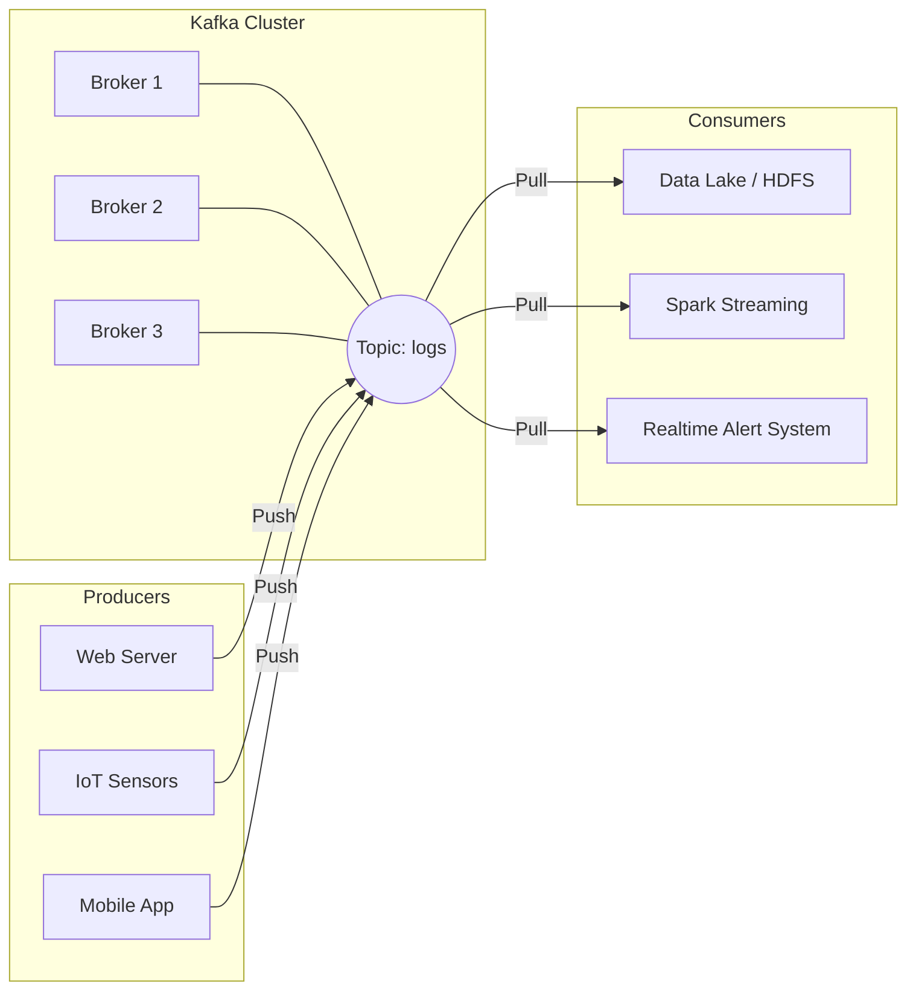

# Apache Kafka: Hệ thống thần kinh trung ương của kiến trúc dữ liệu hiện đại

Trong các hệ thống phần mềm lớn, dữ liệu không chỉ nằm im một chỗ mà cần phải di chuyển liên tục giữa các ứng dụng: dữ liệu nhấp chuột của người dùng từ trình duyệt cần truyền về hệ thống phân tích, dữ liệu thanh toán từ ứng dụng di động cần gửi sang dịch vụ kế toán và cảnh báo bảo mật.

Nếu bạn chỉ có hai ứng dụng, việc kết nối chúng cực kỳ đơn giản qua API trực tiếp. Nhưng nếu hệ thống của bạn mở rộng lên hàng chục ứng dụng và kho lưu trữ khác nhau, việc kết nối trực tiếp sẽ nhanh chóng biến thành một "mạng nhện" chằng chịt, cực kỳ dễ vỡ và khó bảo trì.

Để giải quyết bài toán phân phối dữ liệu khổng lồ này, LinkedIn đã phát triển và giới thiệu **Apache Kafka** vào năm 2011. Được ví như "hệ thống thần kinh trung ương" của kiến trúc dữ liệu hiện đại, Kafka đóng vai trò là một nền tảng phân phối luồng sự kiện phân tán (Distributed Event Streaming Platform) mạnh mẽ, giúp trung chuyển hàng triệu tin nhắn mỗi giây với độ trễ siêu thấp.

## Giải bài toán mạng nhện kết nối chằng chịt

Trước khi Kafka xuất hiện, kiến trúc kết nối trực tiếp (Point-to-Point) bộc lộ rõ những điểm yếu chí mạng khi hệ thống phình to:
* **Mạng nhện kết nối:** Với 10 nguồn dữ liệu và 10 hệ thống tiêu thụ, bạn sẽ cần tới `10 x 10 = 100` kết nối chằng chịt. Chỉ cần một hệ thống thay đổi cấu trúc API, hàng chục hệ thống khác sẽ bị ảnh hưởng.
* **Thất thoát dữ liệu khi mất kết nối:** Nếu hệ thống cơ sở dữ liệu đích bị sập 10 phút, tất cả dữ liệu gửi đi từ các ứng dụng nguồn trong 10 phút đó sẽ biến mất hoàn toàn.

Kafka ra đời và đóng vai trò như một trạm trung chuyển (Hub) trung tâm duy nhất:
1. Các ứng dụng nguồn (Producers) chỉ cần làm một việc duy nhất là đẩy (Publish) dữ liệu vào Kafka.
2. Các ứng dụng tiêu thụ (Consumers) sẽ tự động đăng ký (Subscribe) và kéo dữ liệu từ Kafka về xử lý bất cứ khi nào chúng sẵn sàng.
3. Nếu một ứng dụng tiêu thụ gặp sự cố tạm thời, dữ liệu vẫn được lưu trữ an toàn trên đĩa cứng của Kafka. Khi ứng dụng hoạt động trở lại, nó sẽ tiếp tục đọc tiếp phần dữ liệu bị gián đoạn mà không bỏ sót bất kỳ tin nhắn nào.

> [!NOTE]  
> Khác với các hệ thống hàng đợi tin nhắn cổ điển (như RabbitMQ) thường xóa bỏ tin nhắn ngay khi người dùng đọc xong, Kafka hoạt động dựa trên cơ chế **Log nối tiếp** (Append-only Log). Nó ghi dữ liệu xuống đĩa cứng vật lý và lưu trữ trong một khoảng thời gian cấu hình trước (ví dụ: 7 ngày), cho phép nhiều ứng dụng cùng đọc một luồng dữ liệu độc lập và xem lại lịch sử tin nhắn bất cứ lúc nào.

## Bên trong Kafka có gì? Bốn nhân tố cốt lõi

Hệ sinh thái hoạt động của Apache Kafka được xây dựng từ bốn thành phần cơ bản:

1. **Broker (Máy chủ trung gian):** Mỗi máy chủ chạy Kafka được gọi là một Broker. Một cụm (Cluster) Kafka gồm nhiều Broker phối hợp với nhau để chia sẻ tải và sao lưu dữ liệu dự phòng. Kafka sử dụng giao thức KRaft (hoặc Apache Zookeeper ở các phiên bản cũ) để quản lý cấu trúc cụm.
2. **Topic (Chủ đề):** Là các kênh hoặc thư mục dùng để phân loại dữ liệu tin nhắn. Ví dụ: topic `user_clicks` chứa dữ liệu nhấp chuột, topic `orders` chứa thông tin giao dịch mua hàng.
3. **Producer (Nhà xuất bản):** Các ứng dụng khách (Client) chịu trách nhiệm gửi dữ liệu vào các Topic cụ thể của Kafka.
4. **Consumer (Người tiêu thụ):** Các ứng dụng (như Spark Streaming, Flink, hoặc ứng dụng backend) đăng ký nhận dữ liệu từ các Topic ra để xử lý. Mỗi Consumer tự duy trì một con trỏ gọi là **Offset** (đánh dấu trang) để biết mình đã đọc đến dòng thứ mấy trong Topic.

## Sơ đồ kiến trúc luồng dữ liệu của Kafka

Dưới đây là sơ đồ trực quan minh họa cách Kafka làm trung gian điều phối dữ liệu từ nhiều nguồn khác nhau đến các hệ thống tiêu thụ phía sau:



## Practical example

Dưới đây là một đoạn code Python đơn giản sử dụng thư viện `kafka-python` để định nghĩa một Producer gửi dữ liệu giao dịch vào Kafka:

```python
from kafka import KafkaProducer
import json

# Khởi tạo Producer kết nối tới Broker Kafka
producer = KafkaProducer(
    bootstrap_servers=['kafka-server1:9092'],
    value_serializer=lambda v: json.dumps(v).encode('utf-8')
)

# Giả lập sự kiện mua sắm của khách hàng
event_data = {"user": "Bob", "item": "Macbook", "price": 1500}

# Gửi dữ liệu vào topic 'purchases'
producer.send('purchases', value=event_data)

# Đảm bảo dữ liệu đã được đẩy đi thành công trước khi kết thúc
producer.flush()
```

Cùng lúc đó, nhiều nhóm phát triển khác nhau có thể tự viết các script Consumer riêng biệt đăng ký vào topic `purchases` để cùng đọc và xử lý bản ghi giao dịch của Bob theo nhu cầu riêng (ví dụ: team phân tích nạp vào Data Lake, team bảo mật kiểm tra gian lận, team chăm sóc khách hàng gửi email cảm ơn).

## Những nguyên tắc vàng để vận hành Kafka hiệu quả

* **Kafka không phải là cơ sở dữ liệu vĩnh viễn:** Mặc định Kafka chỉ lưu trữ dữ liệu trong vòng 7 ngày (retention period). Đừng cố gắng biến Kafka thành kho lưu trữ vĩnh viễn vì chi phí cho ổ đĩa SSD tốc độ cao của cụm máy chủ Kafka là cực kỳ đắt đỏ. Hãy thiết lập Consumer nạp dữ liệu từ Kafka xuống các hồ dữ liệu giá rẻ như Amazon S3 để lưu trữ lâu dài.
* **Tận dụng cơ chế Gom lô (Batching) và Nén dữ liệu (Compression):** Để đạt được thông lượng xử lý cao nhất, Producer không nên gửi lẻ tẻ từng tin nhắn một. Hãy cấu hình tham số `linger.ms` (chờ vài mili-giây để gom nhiều tin nhắn lại thành một lô) và sử dụng các thuật toán nén hiệu quả như `snappy` hoặc `lz4` để giảm thiểu băng thông mạng và I/O ổ đĩa.

## Những sai lầm dễ mắc phải

* **Vận hành hệ thống Zookeeper yếu kém:** Trong các phiên bản Kafka cũ, cụm máy chủ Zookeeper phụ trách quản lý metadata thường là nguyên nhân hàng đầu gây sập hệ thống do tràn bộ nhớ RAM hoặc mất kết nối mạng. Rất may, từ phiên bản Kafka 3.3 trở đi, Zookeeper đã được thay thế hoàn toàn bằng giao thức KRaft tích hợp sẵn, giúp việc quản trị cụm trở nên đơn giản và nhẹ nhàng hơn nhiều.
* **Sử dụng Kafka làm hàng đợi cho các tác vụ tốn thời gian:** Nếu ứng dụng Consumer của bạn cần chạy các mô hình Machine Learning phức tạp mất tới 10 phút để xử lý xong một bản ghi, việc sử dụng Kafka sẽ gây ra hiện tượng ứ đọng dữ liệu (Consumer Lag). Kafka được tối ưu cho các luồng xử lý nhanh (event streaming), còn đối với các hàng đợi công việc lâu dài, các công cụ như RabbitMQ hay Celery/Redis sẽ là lựa chọn phù hợp hơn.

## Đánh đổi: Ưu và nhược điểm của Kafka

### Điểm mạnh (Pros):
* Khả năng chịu lỗi (Fault tolerance) và độ tin cậy cực cao nhờ cơ chế sao lưu dữ liệu tự động giữa các Broker.
* Tốc độ xử lý siêu việt nhờ tận dụng kỹ thuật **Sequential I/O** (ghi nối tiếp vào đĩa cứng) và cơ chế **Zero-copy** (truyền trực tiếp dữ liệu từ bộ đệm của nhân hệ điều hành ra card mạng, bỏ qua các bước trung gian ở tầng ứng dụng).
* Là nền tảng vững chắc cho kiến trúc Microservices và xử lý dữ liệu thời gian thực.

### Điểm yếu (Cons):
* **Chi phí vận hành và bảo trì lớn:** Việc quản trị một cụm Kafka đòi hỏi kỹ sư phải có kiến thức chuyên sâu về mạng, cấu hình hệ thống Linux Disk I/O.
* Thiếu các tính năng điều phối hàng đợi phức tạp như thiết lập độ ưu tiên tin nhắn (Priority Queue) hay hẹn giờ gửi tin nhắn (Delayed Message).

## Khi nào bạn thực sự cần đến Kafka?

* Xây dựng kiến trúc hướng sự kiện (Event-driven Architecture) để kết nối các dịch vụ Microservices.
* Làm cổng thu thập dữ liệu (Data Ingestion) khổng lồ từ các nguồn log, ứng dụng Web/App để đổ về Data Lake.
* Xây dựng các đường ống phân tích dữ liệu thời gian thực (Real-time Analytics) kết hợp với các công cụ như Apache Flink hoặc Spark Streaming.

## Các khái niệm liên quan

* [Streaming Processing](/concepts/streaming-processing)
* [Kafka Topics & Partitions](/concepts/kafka-topics-partitions)
* [Consumer Groups](/concepts/consumer-groups)

## Góc phỏng vấn: Chinh phục nhà tuyển dụng với kiến thức Kafka chuyên sâu

### 1. Tại sao Kafka ghi dữ liệu xuống đĩa cứng (Disk) mà vẫn đạt tốc độ đọc/ghi cực kỳ nhanh, không thua kém gì các hệ thống lưu trữ trên RAM?
* **Gợi ý trả lời:** Kafka đạt được hiệu năng siêu việt nhờ hai yếu tố kỹ thuật chính:
  1. **Sequential Disk I/O:** Ổ đĩa cứng thông thường xử lý rất chậm các thao tác đọc ghi ngẫu nhiên (Random Access), nhưng lại đạt tốc độ cực nhanh khi ghi nối tiếp (Sequential Access). Kafka thiết kế lưu trữ dạng append-only log, tức là chỉ ghi nối tiếp dữ liệu vào cuối file.
  2. **Zero-copy (sendfile):** Khi chuyển dữ liệu từ file ra card mạng, các ứng dụng thông thường phải copy dữ liệu từ nhân hệ điều hành (Kernel space) sang bộ nhớ ứng dụng (User space), rồi lại copy ngược về card mạng. Kafka sử dụng lệnh `sendfile` của Linux để đẩy dữ liệu trực tiếp từ Page Cache của nhân hệ điều hành ra card mạng, bỏ qua các bước trung gian giúp tiết kiệm tối đa tài nguyên CPU và bộ nhớ.

### 2. Sự khác biệt cốt lõi giữa Apache Kafka và RabbitMQ là gì?
* **Gợi ý trả lời:** 
  * **RabbitMQ:** Hoạt động theo mô hình hàng đợi tin nhắn truyền thống (Message Broker). Dữ liệu được đẩy tới ứng dụng tiêu thụ và sẽ bị **xóa đi ngay lập tức** sau khi ứng dụng xác nhận xử lý thành công. Phù hợp cho việc điều phối tác vụ (Task Queue) giữa các worker.
  * **Kafka:** Hoạt động theo mô hình nhật ký lưu trữ phân tán (Distributed Commit Log). Tin nhắn được ghi vào đĩa cứng và lưu trữ lâu dài. Các ứng dụng tự duy trì vị trí đọc (Offset) của mình để kéo dữ liệu về, tin nhắn đọc xong vẫn nằm trên Kafka. Phù hợp cho việc phân tích dữ liệu lớn, xử lý luồng sự kiện và hỗ trợ tua lại lịch sử tin nhắn.

## Tài liệu tham khảo

* **Kafka: The Definitive Guide** - Neha Narkhede, Gwen Shapira, Todd Palino.
* Confluent Documentation (Các bài blog của những người sáng lập Kafka).

## English Summary

Apache Kafka is a highly scalable, distributed event streaming platform used to collect, process, store, and integrate data at scale. Utilizing a distributed commit-log architecture and a publish-subscribe model, Kafka decouples producers of data from consumers, resolving the complexity of point-to-point integrations. It achieves exceptionally high throughput and low latency via sequential disk I/O and OS-level zero-copy optimization, making it the industry standard foundational layer for real-time data pipelines and microservices communication.
