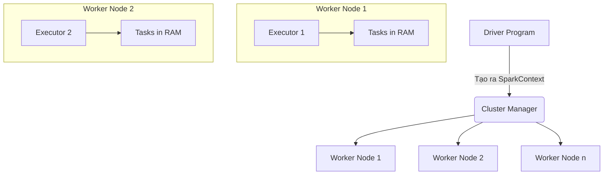

# Apache Spark

## Summary

Apache Spark là một hệ thống tính toán phân tán nguồn mở (Open-source distributed computing framework) được thiết kế đặc biệt cho mục đích xử lý dữ liệu siêu lớn (Big Data). Khác với các thế hệ trước (Hadoop MapReduce) phải đọc ghi liên tục xuống đĩa cứng, Spark đạt tốc độ ưu việt bằng cách thực hiện tính toán **In-Memory** (trong bộ nhớ RAM) trên quy mô cụm phân tán.

---

## Definition

Được phát triển ban đầu tại UC Berkeley AMPLab năm 2009, **Apache Spark** là một Unified Analytics Engine đa năng hỗ trợ nhiều loại tác vụ xử lý: Data Engineering (Spark SQL, Batch processing), Streaming (Spark Structured Streaming), và Machine Learning (MLlib).

Lõi của Spark sử dụng một cấu trúc dữ liệu nền tảng là RDD (Resilient Distributed Dataset), cho phép biểu diễn các luồng dữ liệu được chia nhỏ và phân phối trên nhiều máy tính trong cluster, kèm theo tính năng chịu lỗi cao. 

---

## Why it exists

Trước Spark, hệ thống phổ biến nhất để xử lý Big Data là **Hadoop MapReduce**. 
Tuy nhiên, MapReduce gặp phải một vấn đề chí mạng về hiệu suất: 
Trong một quy trình nhiều bước, sau mỗi bước Map hoặc Reduce, Hadoop buộc phải ghi toàn bộ dữ liệu trung gian (intermediate data) xuống ổ cứng (HDFS) để tránh mất dữ liệu, rồi bước tiếp theo lại phải đọc từ đĩa cứng lên. Quá trình Disk I/O chậm chạp này lặp đi lặp lại khiến các tác vụ lặp (Iterative algorithms như Machine Learning) chạy cực kỳ chậm.

Spark ra đời để thay đổi mô hình đó: Nó giữ dữ liệu trung gian nằm trực tiếp trên bộ nhớ RAM giữa các bước xử lý. Kết quả là Spark có thể xử lý dữ liệu nhanh hơn MapReduce tới 100 lần đối với một số tác vụ.

---

## How it works

Cơ chế sức mạnh của Spark dựa trên các trụ cột chính:
1. **In-Memory Computing**: Chỉ ghi ra ổ cứng khi RAM thực sự quá tải hoặc khi có yêu cầu dứt điểm (viết kết quả cuối ra File).
2. **Lazy Evaluation (Đánh giá lười biếng)**: Khi bạn viết các hàm biến đổi (Transformations như `map`, `filter`), Spark không thực thi ngay lập tức. Nó chỉ ghi chú lại vào một biểu đồ thực thi DAG (Directed Acyclic Graph). Chỉ khi bạn gọi một hàm hành động (Action như `count()`, `save()`), Spark mới tối ưu hóa toàn bộ chuỗi DAG đó và tính toán đồng loạt. Điều này cho phép Spark gộp nhiều bước tính toán lại với nhau một cách tối ưu.
3. **Resilient Distributed Dataset (RDD)**: Cấu trúc lõi đảm bảo dữ liệu nếu bị mất trên một máy do cúp điện, Spark có thể nhìn vào DAG để biết dữ liệu đó được tạo ra từ đâu và tái cấu trúc (recompute) lại chỉ mảnh dữ liệu bị mất, đảm bảo Fault-tolerance (tính chịu lỗi).

---

## Architecture / Flow

Kiến trúc thực thi của một ứng dụng Spark:



1. **Driver**: Tiến trình chính chạy mã nguồn của bạn, tạo ra kế hoạch thực thi.
2. **Cluster Manager**: Bộ quản lý tài nguyên (như YARN, Kubernetes, hoặc Standalone) phân bổ RAM và CPU.
3. **Executors**: Các tiến trình chạy trên các máy Worker, nhận Task từ Driver, tính toán và lưu trữ dữ liệu Cache trong bộ nhớ RAM của nó.

---

## Practical example

Một ứng dụng PySpark tính toán đơn giản lọc lấy khách hàng chi tiêu hơn 1000$ và lưu ra tệp Parquet.

```python
from pyspark.sql import SparkSession
from pyspark.sql.functions import col

# 1. Khởi tạo Spark Session (Bao bọc SparkContext)
spark = SparkSession.builder \
    .appName("HighValueCustomers") \
    .getOrCreate()

# 2. Đọc dữ liệu (Lazy operation - Chưa thực hiện ngay)
df = spark.read.csv("s3://data-lake/sales_data.csv", header=True, inferSchema=True)

# 3. Biến đổi dữ liệu (Lazy operation)
high_value_df = df.filter(col("total_amount") > 1000)

# 4. Action (Lúc này Spark mới tối ưu hóa toàn bộ các bước và chạy thực sự)
high_value_df.write.parquet("s3://data-lake/processed/high_value_customers/")
```

---

## Best practices

* **Ưu tiên DataFrame / Dataset API thay vì RDD**: Mã nguồn viết bằng DataFrame được trình tối ưu hóa Catalyst Optimizer tự động phân tích và chuyển sang ngôn ngữ máy cấp thấp cực kỳ tối ưu, nhanh hơn nhiều so với thao tác RDD thủ công bằng Python.
* **Điều chỉnh số lượng Partitions**: Mặc định sau khi `groupBy` hoặc `join`, Spark chia dữ liệu thành 200 partitions (biến `spark.sql.shuffle.partitions`). Hãy điều chỉnh con số này dựa trên số lượng CPU core và dung lượng dữ liệu (thường là 2-3 lần số lượng CPU core của cụm).
* **Caching đúng lúc**: Nếu một DataFrame được sử dụng lại ở nhiều bước tiếp theo, hãy dùng lệnh `df.cache()` để lưu tạm vào RAM, tránh việc Spark phải đọc lại từ S3. 

---

## Common mistakes

* **`collect()` dữ liệu lớn về Driver**: Lệnh `df.collect()` kéo toàn bộ dữ liệu phân tán ở Worker về một máy tính trung tâm (Driver). Nếu dữ liệu lớn, Driver sẽ cạn RAM (Out Of Memory) và chết ngay lập tức.
* **Lạm dụng Cache**: Lưu mọi thứ vào RAM sẽ đẩy rác (Garbage Collection) của JVM lên cao, làm chậm hệ thống. Chỉ cache những Dataframe đắt giá (tốn công tính toán) và được tái sử dụng nhiều lần.

---

## Trade-offs

### Ưu điểm
* Tốc độ cực nhanh so với MapReduce nhờ tính toán In-Memory và Lazy Evaluation.
* Hỗ trợ đa ngôn ngữ: Python (PySpark), Scala, Java, SQL, R.
* Hệ sinh thái thống nhất: Kết hợp được Batch, Streaming, và Machine Learning trong cùng một công cụ.

### Nhược điểm
* **Ăn RAM (Memory intensive)**: Yêu cầu tài nguyên bộ nhớ rất lớn, chi phí hạ tầng cao hơn so với tính toán trên đĩa.
* **Đường cong học tập dốc**: Quản lý bộ nhớ JVM, xử lý OutOfMemory, và tinh chỉnh cấu hình cluster yêu cầu kinh nghiệm sâu sắc.
* Không phù hợp cho xử lý giao dịch thời gian thực (OLTP) hoặc xử lý luồng cực thấp tính bằng phần nghìn giây (millisecond latency).

---

## When to use

* Xử lý khối lượng dữ liệu khổng lồ (Terabytes) trong các kho dữ liệu (Data Lake, Data Lakehouse).
* Quy trình ETL Batch hàng ngày hoặc hàng giờ phức tạp.
* Thực thi các thuật toán Machine Learning lặp đi lặp lại.

## When not to use

* Khi chỉ cần xử lý vài GB dữ liệu, các công cụ single-node như Pandas, Polars hoặc DuckDB nhanh hơn và rẻ hơn nhiều.
* Khi ứng dụng yêu cầu phản hồi theo thời gian thực khắt khe.

---

## Related concepts

* [Spark SQL](/concepts/spark-sql)
* [Spark Execution Model](/concepts/spark-execution-model)
* [Distributed Processing](/concepts/distributed-processing)
* [Resilient Distributed Dataset (RDD)](#)

---

## Interview questions

### 1. Giải thích sự khác biệt giữa Transformation và Action trong Apache Spark.
* **Người phỏng vấn muốn kiểm tra**: Hiểu biết lõi về cơ chế Lazy Evaluation của Spark.
* **Gợi ý trả lời**: 
  * Transformation (như `map`, `filter`, `join`) là các hàm biến đổi dữ liệu, nhưng chúng có tính chất "lười biếng" (Lazy). Khi gọi, Spark không tính toán mà chỉ lưu lại vào một biểu đồ DAG. Chúng trả về một DataFrame mới.
  * Action (như `count`, `collect`, `write`, `show`) là các hàm kích hoạt sự thực thi. Khi gặp Action, Spark mới lập kế hoạch và phân phối công việc cho cluster để thực thi toàn bộ luồng Transformations trước đó và trả về kết quả cuối cùng ra ngoài Spark context.

### 2. Tại sao Spark lại chạy nhanh hơn Hadoop MapReduce?
* **Gợi ý trả lời**: Hai lý do cốt lõi: 1) In-Memory Processing: Spark giữ dữ liệu trung gian trên RAM thay vì ghi xuống đĩa cứng HDFS như Hadoop, giảm tối đa Disk I/O. 2) Lazy Evaluation và DAG Scheduler: Cho phép Spark nhìn tổng thể quá trình, gộp các bước lại với nhau trên cùng một pipeline, hạn chế việc di chuyển dữ liệu qua mạng dư thừa.

---

## References

* **Spark: The Definitive Guide** - Bill Chambers, Matei Zaharia.
* **Learning Spark** - Jules S. Damji, Brooke Wenig, Tathagata Das.

---

## English summary

Apache Spark is an open-source, distributed processing system used for big data workloads. It achieves high performance through in-memory computing and lazy evaluation via a Directed Acyclic Graph (DAG) execution engine, circumventing the costly disk I/O bottlenecks of Hadoop MapReduce. Spark supports a unified stack of tools including Spark SQL, Streaming, and MLlib, operating primarily on foundational abstractions like RDDs and DataFrames across clusters.
