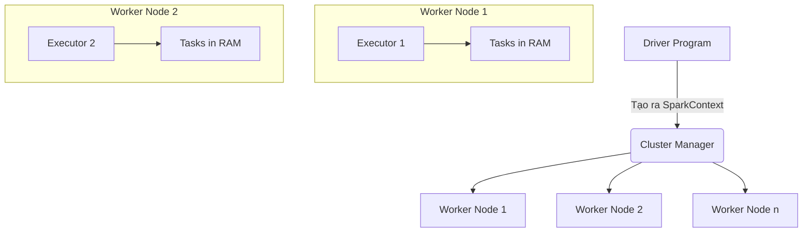

# Apache Spark: Động cơ tăng tốc xử lý dữ liệu lớn trong bộ nhớ

Khi lượng dữ liệu của doanh nghiệp tăng từ vài Gigabyte lên hàng Terabyte hoặc Petabyte, các công cụ xử lý trên một máy tính đơn lẻ (như Pandas) sẽ lập tức bị quá tải và sập nguồn do thiếu tài nguyên. Để giải quyết bài toán Big Data này, chúng ta cần một cơ chế tính toán phân tán: chia nhỏ dữ liệu và phân phối cho một cụm gồm nhiều máy tính cùng xử lý song song.

Trong số các công cụ tính toán phân tán hiện nay, **Apache Spark** chính là cái tên nổi bật nhất. Được thiết kế như một động cơ phân tích thống nhất (Unified Analytics Engine), Spark nổi tiếng nhờ khả năng xử lý dữ liệu siêu tốc bằng cách giữ toàn bộ các bước tính toán trung gian trực tiếp trên bộ nhớ RAM (In-Memory Computing), thay vì ghi xuống đĩa cứng chậm chạp như các thế hệ công nghệ đi trước.

## Cuộc đổi ngôi lịch sử: Tạm biệt kỷ nguyên đĩa cứng chậm chạp của Hadoop

Trước khi Spark ra đời và thống trị thế giới Big Data, chuẩn mực công nghệ thời đó là **Hadoop MapReduce**. Mặc dù Hadoop giải quyết tốt bài toán lưu trữ và xử lý phân tán, nó lại gặp một điểm nghẽn chí mạng về mặt hiệu năng:

Trong một chuỗi xử lý gồm nhiều bước (ETL hoặc chạy thuật toán học máy lặp đi lặp lại), sau khi kết thúc mỗi bước Map hoặc Reduce, Hadoop bắt buộc phải ghi toàn bộ dữ liệu trung gian xuống ổ đĩa cứng (HDFS) để đảm bảo an toàn dữ liệu, rồi bước tiếp theo lại phải đọc dữ liệu từ đĩa lên. Việc liên tục thực hiện các thao tác đọc/ghi file (Disk I/O) chậm chạp này khiến hệ thống mất rất nhiều thời gian chờ đợi.

Spark xuất hiện vào năm 2009 tại UC Berkeley và thay đổi hoàn toàn luật chơi. Thay vì ghi dữ liệu xuống đĩa sau mỗi bước, Spark giữ toàn bộ dữ liệu trung gian trên bộ nhớ RAM của cụm máy tính. Nhờ giảm thiểu được tối đa việc đọc ghi đĩa và truyền tải qua mạng, Spark đạt tốc độ xử lý nhanh hơn Hadoop MapReduce tới 100 lần đối với nhiều tác vụ.

## Những bí mật công nghệ giúp Spark đạt tốc độ ánh sáng

Sức mạnh vượt trội của Apache Spark được xây dựng dựa trên ba trụ cột kỹ thuật chính:

1. **Tính toán trong bộ nhớ (In-Memory Computing):** Dữ liệu được tải lên RAM và xử lý song song trên các node con. Spark chỉ ghi dữ liệu xuống đĩa cứng vật lý khi bộ nhớ RAM thực sự bị quá tải, hoặc khi người dùng gọi lệnh ghi kết quả cuối cùng ra file.
2. **Cơ chế đánh giá lười biếng (Lazy Evaluation):** Khi bạn viết các câu lệnh biến đổi dữ liệu (Transformations như `map`, `filter`, `join`), Spark sẽ không thực thi chúng ngay lập tức. Nó chỉ ghi nhận và vẽ ra một sơ đồ các bước thực thi dưới dạng đồ thị có hướng không chu trình (DAG). Chỉ khi bạn gọi một câu lệnh hành động yêu cầu xuất kết quả (Actions như `count()`, `collect()`, `write()`), Spark mới kích hoạt trình tối ưu hóa (Catalyst Optimizer) để gộp và sắp xếp các bước chạy một cách thông minh nhất rồi mới bắt đầu tính toán thực tế.
3. **Tập dữ liệu phân tán có khả năng tự phục hồi (Resilient Distributed Dataset - RDD):** RDD là cấu trúc dữ liệu nền tảng của Spark. Nếu một máy tính trong cụm bị sập nguồn giữa chừng làm mất mát một phần dữ liệu, Spark không cần phải chạy lại toàn bộ chương trình từ đầu. Nó chỉ cần nhìn vào đồ thị DAG để biết mảnh dữ liệu bị mất được tạo ra từ những bước nào, và tự động tính toán lại duy nhất mảnh dữ liệu đó trên một máy tính khác.

## Sơ đồ kiến trúc vận hành của ứng dụng Spark

Một ứng dụng Spark hoạt động theo mô hình Master-Slave (Chủ - Tớ) với sự phân chia vai trò rõ ràng:



* **Driver Program:** Đóng vai trò làm bộ não điều khiển chính. Nó chứa mã nguồn của bạn, tạo ra `SparkSession`, lập kế hoạch chạy (DAG) và phân phối các nhiệm vụ nhỏ xuống các nút con.
* **Cluster Manager (Bộ quản lý tài nguyên):** Có thể là YARN, Kubernetes, Mesos hoặc chế độ Standalone tích hợp sẵn. Thành phần này chịu trách nhiệm cấp phát tài nguyên phần cứng (CPU, RAM) cho ứng dụng.
* **Worker Nodes & Executors:** Các máy tính con trực tiếp thực thi công việc. Mỗi Worker chạy các tiến trình Executor để nhận các nhiệm vụ (Tasks) từ Driver, tính toán và lưu trữ dữ liệu đệm trực tiếp trong RAM.

## Thực hành nhanh: Viết script PySpark lọc dữ liệu đơn giản

Dưới đây là một đoạn code PySpark đơn giản để lọc ra danh sách các khách hàng VIP chi tiêu trên 1000$ và lưu kết quả xuống hồ dữ liệu dưới định dạng Parquet:

```python
from pyspark.sql import SparkSession
from pyspark.sql.functions import col

# 1. Khởi tạo SparkSession để làm việc với hệ thống
spark = SparkSession.builder \
    .appName("HighValueCustomers") \
    .getOrCreate()

# 2. Đọc file dữ liệu thô (Thao tác lười biếng - Lazy Operation)
df = spark.read.csv("s3://data-lake/sales_data.csv", header=True, inferSchema=True)

# 3. Thực hiện lọc dữ liệu (Thao tác lười biếng - Lazy Operation)
high_value_df = df.filter(col("total_amount") > 1000)

# 4. Thực thi ghi dữ liệu (Lúc này Spark mới tối ưu toàn bộ DAG và thực sự tính toán)
high_value_df.write.parquet("s3://data-lake/processed/high_value_customers/")
```

## Những "bí kíp" giúp Spark chạy mượt mà, tối ưu chi phí

* **Ưu tiên sử dụng DataFrame/Dataset API thay vì RDD:** Mặc dù RDD là nền tảng, việc viết code trực tiếp bằng RDD đòi hỏi bạn phải tự tối ưu hóa bằng tay rất vất vả. Khi bạn dùng DataFrame API, trình tối ưu hóa Catalyst Optimizer của Spark sẽ tự động phân tích cú pháp và chuyển dịch mã nguồn của bạn thành ngôn ngữ máy cấp thấp cực kỳ tối ưu.
* **Điều chỉnh số lượng phân vùng dữ liệu (Partitions):** Mặc định khi thực hiện các tác vụ xáo trộn dữ liệu (Shuffle) như `join` hay `groupBy`, Spark tự động chia dữ liệu thành 200 phân vùng (thông qua cấu hình `spark.sql.shuffle.partitions`). Nếu dữ liệu của bạn quá nhỏ, việc chia 200 phân vùng sẽ tạo ra nhiều tác vụ rác gây chậm hệ thống. Ngược lại, nếu dữ liệu quá lớn, 200 phân vùng sẽ khiến RAM của từng máy bị tràn. Quy tắc chung là hãy đặt số lượng phân vùng gấp 2 đến 3 lần tổng số nhân CPU (cores) của toàn bộ cụm máy chủ.
* **Sử dụng Cache đúng lúc, đúng chỗ:** Nếu một DataFrame phải tham gia vào nhiều bước tính toán độc lập phía sau, hãy sử dụng lệnh `df.cache()` hoặc `df.persist()` để lưu tạm nó vào RAM. Việc này giúp Spark không phải tốn công đọc và tính toán lại DataFrame đó từ đầu ở các bước sau.

## Những sai lầm kinh điển dễ làm sập cụm Spark

* **Lạm dụng lệnh `collect()` trên tập dữ liệu lớn:** Lệnh `collect()` sẽ bắt buộc tất cả các máy con (Executors) gom toàn bộ dữ liệu phân tán và gửi về cho máy chủ chính (Driver). Nếu dữ liệu vượt quá dung lượng RAM của Driver, chương trình sẽ lập tức bị lỗi tràn bộ nhớ (Out Of Memory) và sập cụm. Chỉ dùng `collect()` khi dữ liệu đã được lọc hoặc tổng hợp thành một tập siêu nhỏ.
* **Lạm dụng lưu trữ bộ nhớ (Cache):** Cố gắng cache mọi DataFrame trong chương trình sẽ nhanh chóng làm cạn kiệt dung lượng RAM khả dụng, buộc Spark phải giải phóng bộ nhớ liên tục (Garbage Collection), làm chậm tốc độ xử lý tổng thể. Chỉ cache các bảng dữ liệu thực sự đắt giá (tốn nhiều tài nguyên tính toán để tạo ra) và được gọi lại nhiều lần.

## Đánh đổi: Sức mạnh và giá trị thực tế của Spark

### Điểm mạnh (Pros):
* Tốc độ xử lý siêu tốc nhờ cơ chế tính toán trong bộ nhớ (In-Memory) kết hợp đánh giá lười biếng (Lazy Evaluation).
* Hỗ trợ đa ngôn ngữ linh hoạt: Python, Scala, Java, SQL, R.
* Nền tảng phân tích thống nhất: cho phép bạn viết các tác vụ batch, streaming thời gian thực và huấn luyện Machine Learning trong cùng một dự án.

### Điểm yếu (Cons):
* **Cực kỳ ngốn RAM:** Việc giữ dữ liệu trên bộ nhớ đòi hỏi cấu hình phần cứng đắt đỏ hơn nhiều so với việc tính toán ghi đĩa truyền thống.
* **Độ phức tạp vận hành cao:** Việc cấu hình các tham số phân bổ bộ nhớ JVM, xử lý lỗi OutOfMemory đòi hỏi kỹ sư phải có kinh nghiệm sâu sắc.
* Không phù hợp cho các cơ sở dữ liệu giao dịch (OLTP) yêu cầu phản hồi lập tức, hoặc các luồng streaming có độ trễ cực thấp dưới mức mili-giây.

## Khi nào Spark là lựa chọn số một?

* Bạn cần xử lý các tác vụ ETL hàng ngày, hàng giờ trên lượng dữ liệu khổng lồ (từ hàng trăm Gigabyte đến Terabyte) trong hồ dữ liệu (Data Lake).
* Bạn cần thực thi các thuật toán lặp đi lặp lại như huấn luyện mô hình Machine Learning quy mô lớn.
* Bạn muốn xây dựng một hệ thống phân tích dữ liệu thống nhất xử lý cả batch và stream.

## Khi nào không nên dùng Spark?

* Quy mô dữ liệu của bạn nhỏ (dưới vài chục Gigabyte). Việc sử dụng các thư viện chạy trên một máy tính như Pandas, Polars hoặc DuckDB sẽ cho tốc độ nhanh hơn, đơn giản hơn và tiết kiệm chi phí hơn nhiều so với việc khởi động một cụm máy chủ Spark cồng kềnh.

## Các khái niệm liên quan

* [Spark SQL](/concepts/spark-sql)
* [Spark Execution Model](/concepts/spark-execution-model)
* [Distributed Processing](/concepts/distributed-processing)

## Góc phỏng vấn: Chinh phục các câu hỏi hóc búa về Spark

### 1. Hãy phân biệt sự khác nhau giữa hai khái niệm: Transformation và Action trong Apache Spark.
* **Gợi ý trả lời:** 
  * **Transformation** (như `map`, `filter`, `join`): Là các hàm biến đổi dữ liệu đầu vào để tạo ra một DataFrame mới. Chúng mang tính chất "lười biếng" (Lazy Evaluation), nghĩa là khi gọi, Spark chỉ ghi nhận hành động vào đồ thị DAG chứ không thực thi tính toán ngay.
  * **Action** (như `count`, `collect`, `write`, `show`): Là các hàm yêu cầu xuất dữ liệu hoặc trả về kết quả cụ thể. Khi gặp một Action, Spark mới chính thức lập kế hoạch tối ưu và kích hoạt toàn bộ cụm máy thực thi các câu lệnh Transformation đã khai báo trước đó để trả về kết quả cuối cùng.

### 2. Tại sao Spark lại có tốc độ xử lý nhanh vượt trội hơn so với Hadoop MapReduce?
* **Gợi ý trả lời:** Spark vượt trội hơn nhờ hai lý do cốt lõi:
  1. **Tính toán trong bộ nhớ (In-Memory Processing):** Spark giữ các kết quả tính toán trung gian trên RAM của cụm máy, giảm thiểu tối đa các thao tác đọc ghi ổ đĩa cứng (Disk I/O) chậm chạp vốn là điểm nghẽn lớn nhất của Hadoop.
  2. **Đánh giá lười biếng (Lazy Evaluation & DAG):** Spark xây dựng đồ thị thực thi DAG để nhìn nhận tổng thể luồng công việc, từ đó tối ưu hóa đường đi của truy vấn, gộp các bước tính toán liên tiếp trên cùng một node để hạn chế việc di chuyển dữ liệu qua mạng (Network Shuffle) không cần thiết.

## Tài liệu tham khảo

* **Spark: The Definitive Guide** - Bill Chambers, Matei Zaharia.
* **Learning Spark** - Jules S. Damji, Brooke Wenig, Tathagata Das.

## English Summary

Apache Spark is an open-source, distributed processing system used for big data workloads. It achieves high performance through in-memory computing and lazy evaluation via a Directed Acyclic Graph (DAG) execution engine, circumventing the costly disk I/O bottlenecks of Hadoop MapReduce. Spark supports a unified stack of tools including Spark SQL, Streaming, and MLlib, operating primarily on foundational abstractions like RDDs and DataFrames across clusters.
