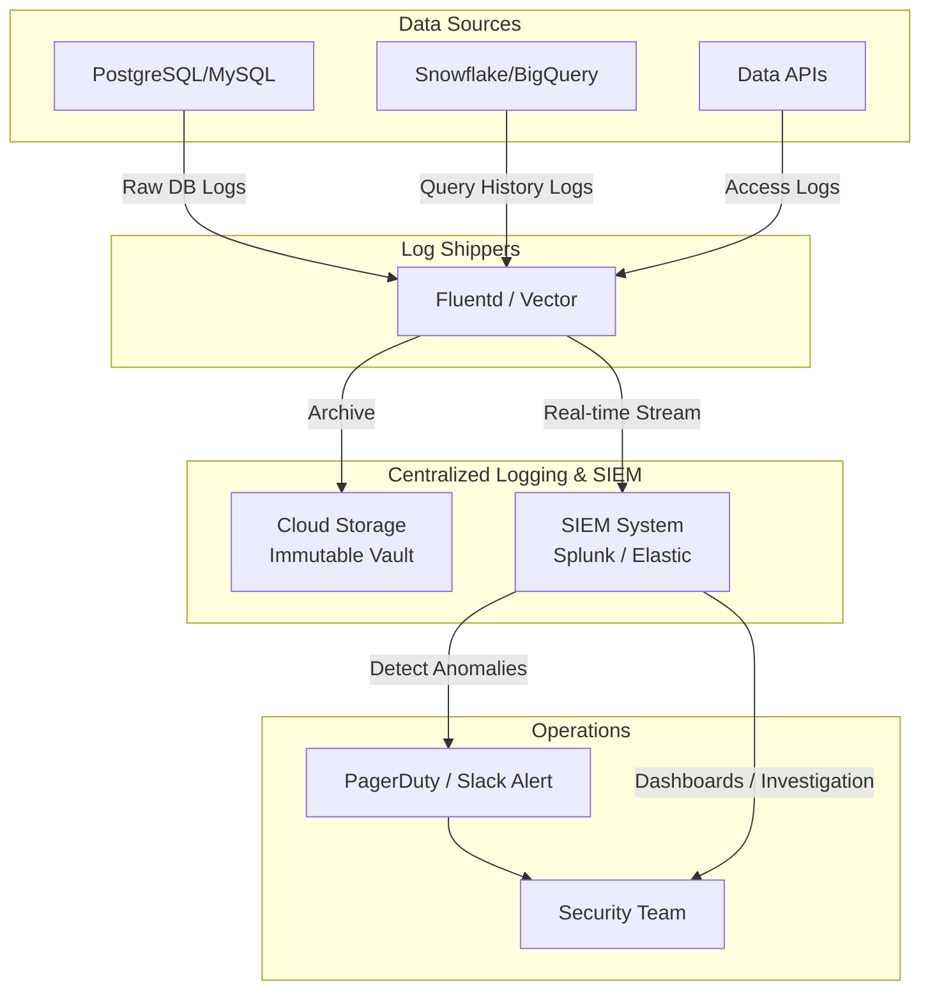

# Nhật ký kiểm toán - Audit Logging

## Summary

Nhật ký kiểm toán (Audit Logging) là quá trình tự động ghi lại một cách chi tiết, có hệ thống không thể thay đổi (immutable) mọi hoạt động, sự kiện và truy cập diễn ra trong hệ thống dữ liệu. Mục đích cốt lõi của Audit Logging là phục vụ việc truy vết (traceability), phát hiện xâm nhập (intrusion detection) và đáp ứng các tiêu chuẩn tuân thủ bảo mật khắt khe (Compliance) như SOC2, GDPR, hay HIPAA.

---

## Definition

**Audit Logging** là việc tạo ra một "hộp đen" cho các cơ sở dữ liệu và hệ thống phân tích. Khác với Application Logs (dùng để debug lỗi ứng dụng) hay Performance Logs (dùng để đo lường hiệu năng), Audit Logs trả lời các câu hỏi bảo mật theo mô hình **5W1H**:
* **Who** (Ai): Tên tài khoản, User ID hoặc Service Account đã thực hiện thao tác.
* **When** (Khi nào): Timestamp chính xác (có múi giờ) của sự kiện.
* **Where** (Ở đâu): Địa chỉ IP nguồn, thiết bị, ứng dụng gọi lệnh.
* **What** (Cái gì): Đối tượng bị tác động (Database, Table, Cột dữ liệu PII).
* **Why/How** (Thế nào): Câu lệnh SQL cụ thể đã chạy (SELECT, UPDATE, DROP), hoặc hành động API, và trạng thái (Thành công/Thất bại).

Một hệ thống Audit Log chuẩn phải đảm bảo tính **Append-only** (chỉ ghi thêm) và **Tamper-proof** (chống giả mạo), nghĩa là ngay cả Database Administrator (DBA) cũng không thể xóa hay sửa đổi các bản ghi log.

---

## Why it exists

1. **Tuân thủ pháp lý (Compliance)**: Các kiểm toán viên (Auditors) khi cấp chứng chỉ SOC2 hoặc ISO 27001 luôn yêu cầu doanh nghiệp chứng minh được: *"Làm sao bạn biết không có ai lén lút tải trộm dữ liệu khách hàng vào lúc nửa đêm?"*. Audit Logs chính là bằng chứng pháp lý duy nhất.
2. **Điều tra sự cố (Forensic Analysis)**: Khi hệ thống bị tấn công Ransomware hoặc lộ lọt dữ liệu nội bộ, Audit Log giúp đội bảo mật lần ngược dấu vết để tìm ra "Patient Zero" (điểm xâm nhập đầu tiên) và xác định phạm vi dữ liệu bị tổn hại.
3. **Phát hiện mối đe dọa nội bộ (Insider Threats)**: Cảnh báo khi một nhân viên bình thường đột nhiên tải xuống hàng triệu bản ghi (hành vi bất thường) ngay trước khi họ xin nghỉ việc.

---

## Core idea

* **Sự kiện thay đổi DDL/DML**: Bắt buộc ghi log mọi câu lệnh làm thay đổi cấu trúc schema (DDL như `CREATE`, `DROP`, `GRANT`) hoặc thay đổi dữ liệu (DML như `INSERT`, `UPDATE`, `DELETE`).
* **Sự kiện truy cập dữ liệu (Data Access / SELECT Logs)**: Đặc biệt quan trọng với các bảng chứa dữ liệu nhạy cảm (PII). Cần ghi nhận mọi thao tác `SELECT` chạm đến các dữ liệu này.
* **Sự kiện bảo mật**: Ghi log các lần đăng nhập (Login) thành công và thất bại, các lần thay đổi mật khẩu, hoặc thay đổi quyền hạn.
* **Lưu trữ bất biến (Immutability)**: Log sinh ra từ Database phải được đẩy ra ngoài vào một kho lưu trữ độc lập (ví dụ: AWS S3 có bật Object Lock) để tránh việc hacker chiếm quyền admin Database rồi xóa luôn log để xóa dấu vết.

---

## How it works

Quy trình thu thập và xử lý Audit Log chuẩn:
1. **Generation (Sinh log)**: Database Engine (như PostgreSQL, Snowflake, BigQuery) được cấu hình bật chế độ Audit Logging ở mức hệ thống. Mọi truy vấn sẽ được chặn lại và ghi một bản sao vào hệ thống file log nội bộ.
2. **Shipping (Chuyển tiếp log)**: Một tác nhân (Agent như Fluentd, Logstash, hoặc Datadog Agent) sẽ liên tục đọc các file log này và đẩy ra bên ngoài.
3. **Storage (Lưu trữ an toàn)**: Log được đưa vào một kho lưu trữ tập trung, thường là SIEM (Security Information and Event Management) như Splunk, Elastic Security, hoặc Data Lake với cơ chế WORM (Write Once, Read Many).
4. **Analysis & Alerting (Phân tích và cảnh báo)**: Hệ thống SIEM sẽ phân tích tập log theo thời gian thực để phát hiện các quy luật bất thường (ví dụ: 1 IP quét mật khẩu thất bại 50 lần, sau đó đăng nhập thành công và chạy lệnh `SELECT * FROM credit_cards`).

---

## Architecture / Flow



---

## Practical example

Xét việc cấu hình Audit Log cho PostgreSQL sử dụng extension `pgaudit` để theo dõi các truy cập vào bảng `patients` (dữ liệu y tế nhạy cảm).

**Cấu hình bắt log trong PostgreSQL (postgresql.conf):**
```ini
shared_preload_libraries = 'pgaudit'
pgaudit.log = 'READ, WRITE, DDL, ROLE'  # Ghi lại lệnh SELECT, UPDATE/INSERT, DROP/CREATE và GRANT
pgaudit.log_relation = on               # Chỉ ghi log trên các bảng được cấu hình cụ thể
```

**Kích hoạt audit trên bảng cụ thể (SQL):**
Để tránh việc ghi log mọi bảng gây quá tải, chúng ta chỉ audit bảng y tế:
```sql
-- Tạo một vai trò kiểm toán ảo
CREATE ROLE auditor;

-- Gán quyền đọc bảng cho auditor, pgaudit sẽ lợi dụng điều này để biết cần audit bảng nào
GRANT SELECT ON public.patients TO auditor;

-- Cấu hình pgaudit chỉ theo dõi các bảng mà 'auditor' có quyền
ALTER SYSTEM SET pgaudit.role = 'auditor';
SELECT pg_reload_conf();
```

**Log đầu ra (Output Log) trông sẽ như sau:**
```text
2026-06-07 10:15:30 UTC [User: doctor_smith] [IP: 192.168.1.55] LOG: AUDIT: SESSION,1,1,READ,SELECT,TABLE,public.patients,SELECT ssn, diagnosis FROM patients WHERE id = 123;
```
Bản log này chứa đầy đủ: Thời gian, Người dùng, IP, Loại hành động (READ), Bảng tác động và Câu lệnh chính xác. Bản log này sẽ được đẩy lên Splunk/Datadog.

---

## Best practices

* **Định tuyến log ra khỏi hệ thống nguồn ngay lập tức**: Không bao giờ lưu Audit Log trong cùng một Database bị theo dõi. Nếu Server sập hoặc bị hack, bạn sẽ mất luôn dữ liệu log.
* **Tách biệt log truy cập Dữ liệu nhạy cảm**: Ghi log mọi lệnh `SELECT` của mọi bảng sẽ sinh ra hàng Terabytes dữ liệu rác, gây tốn kém. Hãy tích hợp với Data Catalog để chỉ bật audit cho các bảng/cột được gắn thẻ PII/Confidential.
* **Mã hóa/Ẩn danh tham số truy vấn**: Rất nhiều khi mật khẩu hoặc PII bị lọt vào Audit Log qua các lệnh như `INSERT INTO users VALUES ('john', 'Password123')`. Hệ thống thu thập log cần có khả năng "làm mờ" (mask) các giá trị tham số này trước khi lưu trữ lâu dài.
* **Thiết lập vòng đời lưu trữ (Retention Policy)**: Giữ log chi tiết trong SIEM khoảng 30-90 ngày để điều tra sự cố tức thời (Hot storage), sau đó đẩy ra Cold Storage (như AWS S3 Glacier) và giữ 1-7 năm để phục vụ kiểm toán theo yêu cầu pháp luật.

---

## Common mistakes

* **Bật log mức cao nhất cho mọi thứ (Log everything)**: Ghi log mọi hoạt động kể cả các bảng tạm (temp tables) hoặc các truy vấn ping hệ thống, dẫn đến chi phí lưu log lớn hơn cả chi phí lưu dữ liệu gốc và làm chậm hệ thống (I/O Bottleneck).
* **Không test khả năng khôi phục log**: Tích lũy log nhiều năm nhưng chưa bao giờ thử query lại chúng trên SIEM. Khi sự cố thực sự xảy ra, định dạng log bị sai hoặc không parse được IP.
* **Để DBA (Admin) quản lý Audit Logs**: Vi phạm nguyên tắc phân chia nhiệm vụ (Segregation of Duties). Đội ngũ Data/DBA không được phép có quyền xóa hay chỉnh sửa cơ sở hạ tầng lưu trữ log; quyền này phải thuộc về Security/Compliance Team.

---

## Trade-offs

### Ưu điểm
* Là lớp phòng thủ cuối cùng và bằng chứng xác thực tuyệt đối trong điều tra sự cố bảo mật.
* Bắt buộc phải có để kinh doanh với các tập đoàn lớn (yêu cầu chứng chỉ bảo mật).
* Giúp phát hiện sớm các lỗ hổng về phân quyền (quá nhiều người truy cập dữ liệu không cần thiết).

### Nhược điểm
* **Hiệu năng hệ thống giảm**: Ghi log đồng bộ (Synchronous logging) làm chậm quá trình thực thi truy vấn của Database.
* **Chi phí lưu trữ và xử lý cực đắt**: Dữ liệu log thường phình to rất nhanh. Chi phí cho các công cụ SIEM như Splunk/Datadog được tính theo dung lượng Ingest (GB/ngày) có thể lên tới hàng triệu USD/năm.

---

## When to use

* Tất cả các hệ thống lưu trữ dữ liệu Production có chứa dữ liệu khách hàng, tài chính, y tế.
* Bắt buộc cho các công ty Fintech, Healthcare, SaaS nhắm đến khách hàng Enterprise.

## When not to use

* Các môi trường Dev/Test/Staging (sinh dữ liệu giả).
* Các hệ thống phân tích dữ liệu Web Analytics ẩn danh hoàn toàn (như đếm số lượt click không gắn user_id).

---

## Related concepts

* [Kiểm soát truy cập - Access Control](/concepts/access-control)
* [Phân loại dữ liệu - Data Classification](/concepts/data-classification)
* [Data Observability](/concepts/data-observability)

---

## Interview questions

### 1. Tại sao không dùng Application Logs thay cho Audit Logs của Database?
* **Người phỏng vấn muốn kiểm tra**: Hiểu biết về bề mặt tấn công bảo mật.
* **Gợi ý trả lời**: Application Logs chỉ ghi lại những gì ứng dụng gọi. Nếu một kỹ sư Data, DBA hoặc hacker truy cập trực tiếp vào Database thông qua SQL Client (DBeaver, DataGrip) vượt qua tầng ứng dụng, Application Log sẽ hoàn toàn mù mờ. Chỉ có Database Audit Log thực thi tại tầng engine mới đảm bảo bắt được 100% mọi truy cập.

### 2. Làm thế nào để giải quyết vấn đề hiệu năng khi phải ghi Audit Log cho hàng tỷ câu lệnh SELECT mỗi ngày trên một Data Warehouse?
* **Người phỏng vấn muốn kiểm tra**: Kỹ năng tối ưu hóa và kiến trúc hệ thống quy mô lớn.
* **Gợi ý trả lời**: Thay vì ghi log từng dòng `SELECT`, ta áp dụng 3 kỹ thuật: (1) Chỉ bật audit cho các bảng/cột nhạy cảm (PII) thông qua Tagging; (2) Sử dụng cơ chế ghi log bất đồng bộ (Asynchronous logging) hoặc batching để không chặn luồng trả kết quả truy vấn; (3) Sử dụng các Cloud DWH hiện đại (như BigQuery, Snowflake) vì chúng đã thiết kế kiến trúc phân tách riêng luồng Metadata Logging (Cloud Logging) khỏi luồng Compute, nên gần như không ảnh hưởng tới hiệu năng tính toán.

### 3. Nguyên tắc "Tách biệt nhiệm vụ" (Segregation of Duties) trong Audit Logging nghĩa là gì?
* **Người phỏng vấn muốn kiểm tra**: Tư duy tuân thủ quy trình bảo mật chuẩn (Compliance).
* **Gợi ý trả lời**: Người có quyền sinh ra log hoặc cấu hình Database (DBA, Data Engineer) tuyệt đối không được có quyền can thiệp vào kho lưu trữ log. File log phải được chuyển tiếp sang một hệ thống SIEM hoặc Storage bucket do nhóm Security/Infosec quản lý hoàn toàn độc lập với quyền "Write-Once-Read-Many" (WORM) để ngăn chặn hành vi che giấu dấu vết từ nội bộ.

---

## References

1. **NIST SP 800-92** - Guide to Computer Security Log Management.
2. **PostgreSQL pgAudit Documentation** - PostgreSQL Audit Extension.
3. **AWS CloudTrail & AWS S3 Object Lock** - Kiến trúc lưu trữ log bất biến.

---

## English summary

Audit Logging is the automated, immutable recording of all activities within a database or data system, answering the "Who, What, When, Where, and How" of data access and modifications. It is a critical component of Data Governance and Security, ensuring compliance with frameworks like SOC2, HIPAA, and GDPR. A robust audit logging architecture must capture DDL/DML changes and sensitive data queries, ship them asynchronously to a centralized, tamper-proof SIEM or storage vault, and maintain strict segregation of duties. While essential for forensic analysis and insider threat detection, audit logging requires careful configuration to avoid severe storage costs and database performance bottlenecks.
