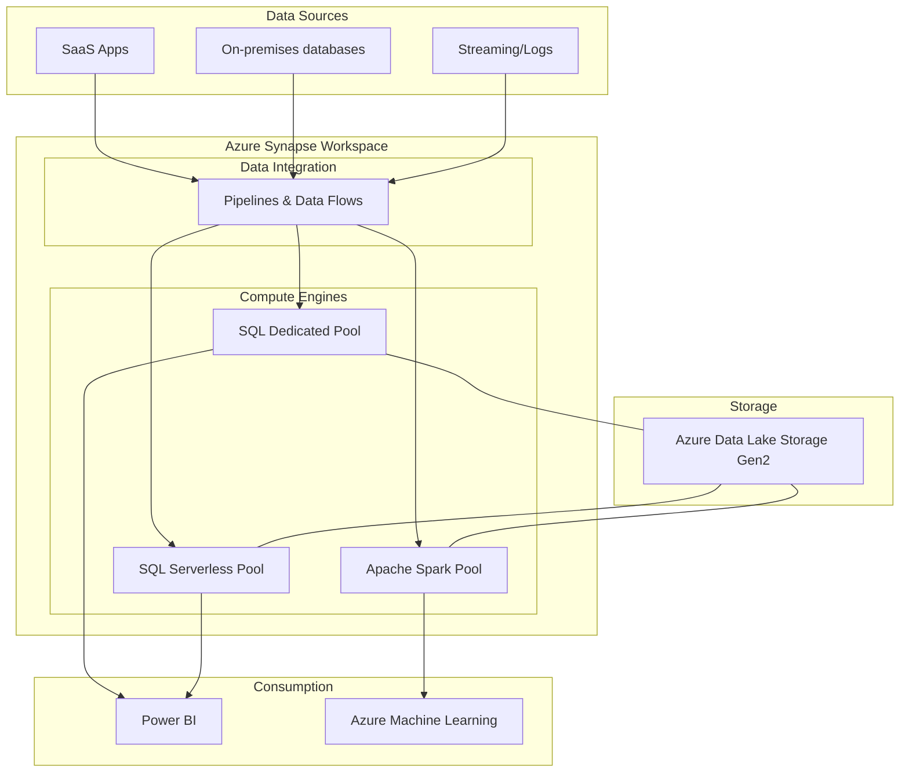

# Azure Synapse Analytics

## Summary

Azure Synapse Analytics là một dịch vụ phân tích vô hạn kết hợp tích hợp dữ liệu (data integration), lưu trữ dữ liệu doanh nghiệp (enterprise data warehousing) và phân tích dữ liệu lớn (big data analytics). Nó cung cấp trải nghiệm hợp nhất để chuẩn bị, quản lý và phục vụ dữ liệu cho các nhu cầu học máy và BI ngay lập tức, là công cụ trọng tâm trong hệ sinh thái dữ liệu của Microsoft Azure.

---

## Definition

**Azure Synapse Analytics** là sự tiến hóa của dịch vụ SQL Data Warehouse của Microsoft Azure. Nó kết hợp thế giới của cơ sở dữ liệu quan hệ truyền thống và công nghệ dữ liệu lớn phân tán (như Apache Spark) trong cùng một môi trường. Nền tảng này cho phép truy vấn dữ liệu theo các điều khoản của riêng bạn, có thể sử dụng tài nguyên serverless (không cần máy chủ) khi khám phá dữ liệu hoặc tính toán chuyên dụng (dedicated SQL pools) cho các hệ thống kho dữ liệu chịu tải cao.

---

## Why it exists

Trước đây, doanh nghiệp phải xây dựng các hệ thống kho dữ liệu riêng biệt (SQL Data Warehouse) để báo cáo có cấu trúc và hồ dữ liệu riêng biệt (Data Lake, Hadoop/Spark) để phân tích phi cấu trúc/khoa học dữ liệu. Sự phân mảnh này dẫn đến:
1. **Dữ liệu bị cô lập (Data Silos)**: Dữ liệu giữa Data Lake và Data Warehouse bị rời rạc, làm cho việc kết hợp để phân tích toàn diện trở nên khó khăn.
2. **Chi phí vận hành cao**: Quản lý nhiều công cụ tích hợp, bảo mật, và tài nguyên tính toán khác nhau làm tăng độ phức tạp và chi phí.
3. **Chậm trễ (Time-to-insight)**: Việc luân chuyển dữ liệu từ Data Lake vào kho dữ liệu tốn nhiều thời gian và các bước chuyển đổi dữ liệu (ETL/ELT).

Azure Synapse ra đời nhằm phá bỏ các ranh giới này, mang cả 2 thế giới lại với nhau trong một Azure Synapse Studio duy nhất.

---

## Core idea

Azure Synapse hoạt động dựa trên 3 trụ cột cốt lõi:
* **Tính toán đa dạng**: Cung cấp cả máy chủ SQL (Dedicated và Serverless) và máy chủ Apache Spark, cho phép xử lý dữ liệu với cả T-SQL quen thuộc và ngôn ngữ lập trình Python/Scala.
* **Synapse Studio**: Giao diện làm việc (workspace) hợp nhất, nơi kỹ sư dữ liệu, nhà khoa học dữ liệu và quản trị viên có thể cộng tác để xây dựng pipeline, viết code, khám phá dữ liệu và giám sát hệ thống.
* **Tích hợp sâu rộng**: Khả năng tích hợp trực tiếp và liền mạch với Azure Data Lake Storage (ADLS) Gen2, Power BI, Azure Machine Learning, và Purview, tạo nên một Data Stack hiện đại khép kín trên nền tảng Azure.

---

## How it works

Hệ thống hoạt động dựa trên cấu trúc phân tách giữa tính toán (Compute) và lưu trữ (Storage):
1. **Lưu trữ**: Dữ liệu thực sự được lưu trong Azure Data Lake Storage (với định dạng Parquet, CSV, Delta) hoặc các bảng lưu trữ tối ưu trong SQL pools.
2. **Dedicated SQL Pool**: Trước đây là Azure SQL Data Warehouse. Dữ liệu được lưu trữ phân tán và truy vấn trên cụm tính toán chuyên dụng với cấu hình định trước.
3. **Serverless SQL Pool**: Trực tiếp truy vấn dữ liệu từ Data Lake bằng T-SQL mà không cần khởi tạo, cấu hình hay di chuyển dữ liệu. Chi phí tính toán trên mỗi TB xử lý.
4. **Apache Spark Pool**: Phục vụ xử lý Big Data và Machine learning, đặc biệt với dữ liệu phi cấu trúc và bán cấu trúc.
5. **Data Integration**: Tích hợp các khả năng của Azure Data Factory để tạo và điều phối các pipeline (ETL/ELT) trực tiếp bên trong Synapse Studio.

---

## Architecture / Flow



---

## Practical example

Một công ty bán lẻ có dữ liệu giao dịch lưu trong ADLS Gen2 ở dạng Parquet. Họ muốn phân tích nhanh tổng doanh thu theo ngày mà không cần đưa dữ liệu vào một kho dữ liệu truyền thống.

Kỹ sư dữ liệu có thể sử dụng **Serverless SQL Pool** trong Synapse để viết một câu lệnh T-SQL đơn giản:

```sql
SELECT
    CAST(transaction_date AS DATE) AS date,
    SUM(amount) AS total_revenue
FROM
    OPENROWSET(
        BULK 'https://mystorage.dfs.core.windows.net/data/transactions/**/*.parquet',
        FORMAT = 'PARQUET'
    ) AS [rows]
GROUP BY
    CAST(transaction_date AS DATE)
ORDER BY
    date DESC;
```
Kết quả được hiển thị ngay lập tức và sau đó có thể được kết nối thẳng với Power BI để tạo báo cáo.

---

## Best practices

* **Thiết kế phân vùng (Partitioning)**: Partition dữ liệu trong Data Lake và Dedicated SQL pool theo trường thường xuyên được lọc nhất (ví dụ: ngày tháng) để tối ưu hóa việc loại bỏ dữ liệu dư thừa (Partition elimination) khi chạy truy vấn.
* **Phân phối bảng trong Dedicated SQL Pool**: Chọn đúng chiến lược phân phối dữ liệu (Hash, Round Robin, hay Replicated) dựa trên kích thước và mẫu truy vấn. Hash distribution cho bảng Fact lớn, Replicated cho Dimension nhỏ.
* **Sử dụng Serverless SQL cho khám phá dữ liệu**: Hãy dùng Serverless SQL Pool để khám phá, làm sạch sơ bộ và tạo các Data Mart logic trên Data Lake trước khi quyết định nạp vào Dedicated SQL pool để giảm thiểu chi phí.

---

## Common mistakes

* **Quản lý chi phí kém**: Để Dedicated SQL Pool chạy liên tục 24/7 kể cả khi không có khối lượng công việc, thay vì cấu hình tự động tạm dừng (pause) hoặc giảm quy mô (scale down).
* **Sử dụng sai loại phân phối dữ liệu**: Để chế độ mặc định (Round Robin) cho mọi bảng trong Dedicated SQL Pool làm cho các phép JOIN giữa các bảng Fact bị chậm đi nhiều do việc phải luân chuyển dữ liệu (data movement) giữa các node xử lý.
* **Bỏ qua quản lý tài nguyên**: Không thiết lập các nhóm công việc (Workload groups) dẫn đến việc một truy vấn phân tích khổng lồ có thể chặn các báo cáo BI thời gian thực của các phòng ban khác.

---

## Trade-offs

### Ưu điểm
* Hợp nhất Data Warehouse, Data Integration, và Big Data trên một nền tảng quản lý đồng nhất.
* Cung cấp tùy chọn linh hoạt giữa chi phí tính toán linh hoạt (Serverless) và chuyên dụng (Dedicated).
* Bảo mật cấp doanh nghiệp với sự tích hợp toàn diện cùng hệ sinh thái Azure (Entra ID, Purview, Azure Monitor).

### Nhược điểm
* Ràng buộc hệ sinh thái (Vendor lock-in): Hệ thống được tối ưu hóa đặc biệt tốt trong hạ tầng Azure, gây khó khăn nếu doanh nghiệp muốn triển khai đa đám mây (Multi-cloud).
* Độ phức tạp khi thiết lập: Do tính năng bao quát (all-in-one), nó yêu cầu sự hiểu biết rộng hơn về các thành phần khác nhau so với việc dùng một Data Warehouse đơn giản.

---

## When to use

* Doanh nghiệp đã đầu tư lớn vào hệ sinh thái của Microsoft Azure (Power BI, ADLS, Entra ID).
* Yêu cầu xử lý khối lượng lớn cả dữ liệu cấu trúc và bán cấu trúc/phi cấu trúc một cách linh hoạt.
* Cần một giải pháp trọn gói (end-to-end) không cần ghép nối quá nhiều công cụ từ các nhà cung cấp khác nhau.

## When not to use

* Kiến trúc đa đám mây (multi-cloud) nơi dữ liệu nằm phân tán ở AWS và GCP.
* Các doanh nghiệp vừa và nhỏ chỉ cần một cơ sở dữ liệu OLAP đơn giản, rẻ tiền và ít bảo trì.
* Hệ thống yêu cầu tích hợp quá nhiều luồng xử lý luồng (streaming) phức tạp (trong trường hợp này, Databricks hoặc Kafka sẽ chuyên dụng hơn).

---

## Related concepts

* [Databricks Platform](/concepts/databricks-platform)
* [Data Lake](/concepts/data-lake)
* [Data Warehouse](/concepts/data-warehouse)

---

## Interview questions

### 1. Phân biệt Serverless SQL Pool và Dedicated SQL Pool trong Azure Synapse. Khi nào nên dùng loại nào?
* **Người phỏng vấn muốn kiểm tra**: Hiểu biết về mô hình tính toán và tối ưu hóa chi phí.
* **Gợi ý trả lời (Strong Answer)**: Dedicated SQL pool cấp phát trước tài nguyên tính toán với mức giá cố định theo giờ, dữ liệu được lưu trữ phân tán, lý tưởng cho kho dữ liệu báo cáo thường xuyên, truy vấn tải cao (OLAP). Serverless SQL pool không dự trữ tài nguyên, thu phí dựa trên TB dữ liệu xử lý, truy vấn trực tiếp vào Data Lake, dùng cho mục đích ad-hoc, khám phá dữ liệu hoặc xây dựng Logical Data Warehouse.
* **Lỗi cần tránh (Weak Answer)**: Trả lời chung chung rằng serverless rẻ hơn dedicated mà không nói về kịch bản sử dụng.

### 2. Hash distribution và Replicated distribution trong Dedicated SQL pool là gì?
* **Người phỏng vấn muốn kiểm tra**: Kiến thức sâu về kiến trúc MPP (Massively Parallel Processing).
* **Gợi ý trả lời (Strong Answer)**: Hash distribution phân tán dữ liệu dựa trên giá trị băm (hash value) của một cột, tối ưu cho bảng Fact khổng lồ để giảm bớt di chuyển dữ liệu (data movement) khi JOIN với các bảng hash khác cùng khóa. Replicated distribution sẽ sao chép toàn bộ bảng lên tất cả các Compute nodes, tối ưu hóa cho các bảng Dimension nhỏ (dưới 2GB) vì các phép JOIN có thể diễn ra cục bộ tại node.
* **Lỗi cần tránh**: Không nhắc đến việc giảm thiểu data movement/shuffle khi JOIN.

---

## References

1. **Microsoft Learn** - Azure Synapse Analytics Documentation.
2. **DP-203 Data Engineering on Microsoft Azure** - Certification Guide.

---

## English summary

Azure Synapse Analytics is an integrated analytics service that brings together data integration, enterprise data warehousing, and big data analytics. It offers both dedicated and serverless SQL endpoints, as well as Apache Spark pools, unified within Synapse Studio. By unifying analytical processing capabilities, it breaks down data silos, enabling seamless end-to-end analytics and machine learning workflows deeply integrated with the Microsoft Azure ecosystem.
