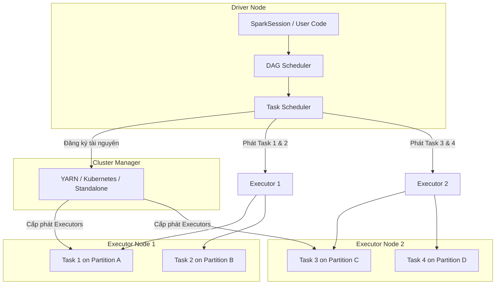

# Xử lý dữ liệu theo lô - Batch Processing

## Summary

Batch Processing (Xử lý dữ liệu theo lô) là phương pháp thực thi tính toán trên một tập hợp dữ liệu lớn có sẵn (bounded data) một cách định kỳ, không yêu cầu tương tác trực tiếp với người dùng cuối trong quá trình chạy. Trong kiến trúc dữ liệu hiện đại, Batch Processing tận dụng các mô hình tính toán phân tán (như Apache Spark, MapReduce) để chia nhỏ dữ liệu và thực thi song song trên cụm máy tính nhằm tối ưu hóa băng thông xử lý (throughput).

---

## Definition

**Batch Processing - Xử lý dữ liệu theo lô** là mô hình tính toán trong đó dữ liệu được thu thập, tích lũy thành từng nhóm hoặc lô (batches) trong một khoảng thời gian trước khi được đưa vào xử lý đồng thời thông qua một tiến trình chạy nền.

Ngược lại với xử lý dòng (Streaming Processing) xử lý từng sự kiện ngay khi nó xuất hiện với độ trễ thấp, Batch Processing làm việc với các nguồn dữ liệu có giới hạn biên (bounded dataset) và tập trung tối ưu hóa **High Throughput** (xử lý khối lượng dữ liệu lớn nhất trong một đơn vị thời gian) thay vì **Low Latency** (độ trễ xử lý nhanh nhất cho một bản ghi).

---

## Why it exists

Trong các hệ thống dữ liệu lớn, việc xử lý dữ liệu đơn lẻ trên một máy chủ gặp phải giới hạn vật lý về CPU, RAM và tốc độ đọc ổ đĩa (I/O). Khi doanh nghiệp cần xử lý Terabytes dữ liệu hàng ngày (ví dụ: tính toán báo cáo tài chính cuối ngày, huấn luyện lại mô hình đề xuất sản phẩm), Batch Processing phân tán ra đời để giải quyết 3 vấn đề lớn:
1. **Quá tải tài nguyên cục bộ**: Một máy chủ đơn lẻ không thể chứa toàn bộ tập dữ liệu lớn vào bộ nhớ để thực hiện các phép toán phức tạp (như JOIN hoặc Group By trên hàng tỷ dòng).
2. **Khả năng chịu lỗi (Fault Tolerance)**: Khi tính toán trên hàng trăm máy tính trong nhiều giờ, rủi ro một máy chủ bị sập giữa chừng là rất cao. Batch Processing phân tán cần có cơ chế tự động theo dõi và chạy lại (retry) các tác vụ bị lỗi trên các máy khác mà không phải chạy lại toàn bộ tiến trình từ đầu.
3. **Hiệu quả chi phí và tài nguyên**: Xử lý theo lô cho phép doanh nghiệp gom dữ liệu lại và chạy tính toán vào các giờ thấp điểm (ví dụ: chạy Spark Jobs vào nửa đêm) trên các tài nguyên đám mây có thể tự động bật/tắt (transient clusters) để tối ưu hóa chi phí vận hành hạ tầng.

---

## Core idea

Nguyên lý hoạt động cốt lõi của Batch Processing phân tán hiện đại dựa trên hai mô hình lập trình chính:

### 1. MapReduce (Mô hình đĩa vật lý)
Được phát triển bởi Google, chia tác vụ thành 2 pha chính:
* **Map**: Đọc dữ liệu từ đĩa, lọc, biến đổi và phát ra các cặp `(key, value)`.
* **Reduce**: Thu thập tất cả các giá trị có chung `key`, tổng hợp chúng lại và ghi kết quả trở lại đĩa.
* *Nhược điểm*: Giữa pha Map và Reduce, dữ liệu trung gian bắt buộc phải ghi xuống đĩa cứng vật lý (Disk I/O), khiến hiệu năng bị chậm đối với các thuật toán lặp đi lặp lại.

### 2. Apache Spark (Mô hình đồ thị bộ nhớ DAG)
Khắc phục nhược điểm của MapReduce bằng cách giữ dữ liệu trung gian trong bộ nhớ (In-memory) và tổ chức các bước xử lý dưới dạng đồ thị có hướng không chu trình **DAG (Directed Acyclic Graph)**. Spark chỉ thực sự tính toán khi có một hành động ghi dữ liệu đầu ra (Lazy Evaluation), giúp tối ưu hóa toàn bộ chuỗi thực thi trước khi chạy thực tế.

---

## How it works

Quy trình thực thi một Batch Processing Job phân tán (ví dụ trên Apache Spark) diễn ra như sau:
1. **Lập kế hoạch (Job Planning)**: Người dùng gửi mã thực thi (SQL hoặc Python/Scala API) đến nút điều khiển chính (**Driver Node**). Driver phân tích mã nguồn và xây dựng đồ thị logic DAG.
2. **Chia nhỏ dữ liệu (Partitioning)**: Tập dữ liệu lớn đầu vào được chia thành các phần nhỏ hơn gọi là các **Phân vùng (Partitions)** lưu trữ phân tán.
3. **Phân phối tác vụ (Task Scheduling)**: Driver chia đồ thị DAG thành các giai đoạn thực thi (**Stages**) ranh giới được xác định bởi các phép toán yêu cầu trao đổi dữ liệu qua mạng (**Shuffle**). Mỗi Stage chứa nhiều tác vụ nhỏ hơn (**Tasks**), mỗi Task xử lý trên một Partition dữ liệu cụ thể.
4. **Thực thi song song (Parallel Execution)**: Driver gửi các Task đến các nút tính toán (**Executor Nodes**). Mỗi Executor chạy các Task song song trên các luồng (CPU cores) của nó.
5. **Dọn dẹp và nạp (Loading & Cleanup)**: Sau khi các Task hoàn thành, kết quả cuối cùng được ghi xuống hệ thống lưu trữ đích (như Data Lake Parquet files hoặc DWH) và giải phóng tài nguyên cụm máy tính.

---

## Architecture / Flow

Dưới đây là sơ đồ kiến trúc điều phối và thực thi của một Apache Spark Batch Job:



---

## Practical example

Giả sử chúng ta có tệp dữ liệu giao dịch khổng lồ định dạng CSV lưu trên Cloud Storage. Chúng ta cần tính tổng doanh thu theo từng cửa hàng (`store_id`) sử dụng PySpark.

**Mã nguồn Batch Job (`process_sales.py`)**:
```python
from pyspark.sql import SparkSession
from pyspark.sql.functions import col, sum

# 1. Khởi tạo Spark Session
spark = SparkSession.builder \
    .appName("StoreRevenueBatch") \
    .config("spark.sql.shuffle.partitions", "200") \
    .getOrCreate()

# 2. Đọc tập dữ liệu giao dịch đầu vào (Bounded Dataset)
df_sales = spark.read.csv("s3://data-lake/raw/sales/year=2026/*.csv", header=True, inferSchema=True)

# 3. Biến đổi dữ liệu (Lazy Evaluation - Chưa chạy thực tế)
df_grouped = df_sales.groupBy("store_id") \
                     .agg(sum(col("quantity") * col("price")).alias("total_revenue"))

# 4. Action: Ghi dữ liệu đầu ra (Spark bắt đầu build DAG và chạy thực thi)
df_grouped.write \
          .mode("overwrite") \
          .parquet("s3://data-lake/curated/store_revenue_report/")

# 5. Đóng session
spark.stop()
```

---

## Best practices

* **Thiết lập số lượng phân vùng hợp lý**: Số lượng Partition mặc định của Spark khi thực hiện Shuffle là 200. Nếu dữ liệu của bạn quá nhỏ, 200 partition sẽ tạo ra nhiều task rác làm chậm hệ thống. Nếu dữ liệu quá lớn (hàng trăm GB), 200 partition sẽ khiến mỗi partition có kích thước quá lớn, gây lỗi tràn bộ nhớ (**Out Of Memory - OOM**). Hãy quy hoạch sao cho kích thước mỗi partition sau shuffle đạt khoảng **100MB đến 200MB**.
* **Tránh phép toán Shuffle không cần thiết**: Các phép toán như `.groupBy()`, `.join()`, `.distinct()` bắt buộc Spark phải phân phối lại dữ liệu qua đường truyền mạng mạng (Shuffle). Hãy lọc dữ liệu (`.filter()`) và loại bỏ các cột không cần thiết sớm nhất có thể trước khi thực hiện Shuffle để giảm dung lượng mạng.
* **Sử dụng Broadcast Joins cho bảng nhỏ**: Khi JOIN một bảng dữ liệu lớn với một bảng Dimension nhỏ (dưới 10MB), hãy sử dụng cơ chế Broadcast Join. Spark sẽ copy bảng nhỏ sang tất cả các Executor, giúp thực hiện phép JOIN cục bộ ngay tại chỗ mà không cần phải thực hiện Shuffle dịch chuyển bảng lớn qua mạng.
* **Tận dụng bộ đệm hợp lý (Caching)**: Nếu một DataFrame được sử dụng lại nhiều lần trong các nhánh tính toán khác nhau của DAG, hãy sử dụng hàm `.cache()` hoặc `.persist()` để giữ nó trong bộ nhớ RAM của Executor, tránh việc Spark phải tính toán lại DataFrame đó từ đầu nguồn.

---

## Common mistakes

* **Lỗi rò rỉ bộ nhớ do Caching quá đà**: Gọi hàm `.cache()` vô tội vạ trên mọi DataFrame mà không giải phóng bằng hàm `.unpersist()` sau khi dùng xong, dẫn đến việc cạn kiệt bộ nhớ RAM của Executor và gây lỗi OOM.
* **Gặp lỗi sập Executor do dữ liệu bị lệch (Data Skew)**: Khi thực hiện groupBy hoặc join theo một khóa có phân phối dữ liệu bị lệch nghiêm trọng (ví dụ: 90% giao dịch có `store_id` là `null` hoặc là mã của cửa hàng chính). Executor nhận partition chứa khóa lệch đó sẽ phải xử lý khối lượng dữ liệu khổng lồ và bị sập do quá tải RAM, trong khi các Executor khác đã hoàn thành và ngồi chơi.
* **Thu thập dữ liệu lớn về Driver bằng hàm `.collect()`**: Gọi hàm `.collect()` trên một DataFrame hàng triệu dòng. Hàm này sẽ kéo toàn bộ dữ liệu phân tán từ các Executor về duy nhất một nút Driver Node. Driver sẽ bị tràn bộ nhớ và sập ứng dụng ngay lập tức. Chỉ dùng `.collect()` cho các tập dữ liệu cực nhỏ đã được gom gọn.

---

## Trade-offs

### Ưu điểm
* Đạt hiệu suất băng thông (Throughput) tối đa trên dữ liệu lớn quy mô Petabytes.
* Cơ chế tự phục hồi lỗi mạnh mẽ nhờ khả năng tái tạo dữ liệu dựa trên DAG lịch sử (lineage graph).
* Dễ lập trình và kiểm thử hơn so với xử lý dòng (Streaming), do dữ liệu tĩnh không thay đổi trong suốt quá trình chạy.

### Nhược điểm
* **Độ trễ cao (High Latency)**: Không phù hợp cho các bài toán cần phản hồi ngay lập tức. Thời gian chạy job thường tính bằng phút đến giờ.
* **Tốn kém tài nguyên đột biến**: Khi bắt đầu chạy batch job, hệ thống yêu cầu lượng tài nguyên tính toán cực kỳ lớn (CPU/RAM spike), đòi hỏi khả năng scale-up và scale-down hạ tầng linh hoạt để tránh lãng phí.

---

## When to use

* Tính toán báo cáo tài chính, tổng kết doanh thu định kỳ hàng ngày, hàng tuần hoặc hàng tháng.
* Chạy các tiến trình gộp và dọn dẹp dữ liệu (Compaction pipelines) trên Data Lake.
* Huấn luyện các mô hình học máy (Machine Learning training jobs) trên dữ liệu lịch sử.
* Đồng bộ hóa dữ liệu định kỳ (Data Replication) từ các nguồn OLTP vào Kho dữ liệu.

## When not to use

* Hệ thống cảnh báo phát hiện lỗi bảo mật mạng thời gian thực (độ trễ yêu cầu dưới 5 giây).
* Cập nhật số dư tài khoản ngân hàng hoặc ví điện tử ngay khi người dùng thực hiện giao dịch.
* Xây dựng các dashboards hiển thị chỉ số trực tiếp (real-time live monitoring metrics).

---

## Related concepts

* [Distributed Processing](/concepts/distributed-processing)
* [Apache Spark](/concepts/apache-spark)
* [Shuffle (Distributed System)](/concepts/shuffle)
* [Data Skew](/concepts/data-skew)

---

## Interview questions

### 1. Giải thích cơ chế Shuffle trong hệ thống phân tán và tại sao nó được coi là kẻ thù của hiệu năng Spark.
* **Người phỏng vấn muốn kiểm tra**: Hiểu biết sâu sắc về chi phí truyền thông mạng và I/O đĩa trong lập trình phân tán.
* **Gợi ý trả lời (Strong Answer)**:
  * **Cơ chế**: Shuffle là quá trình phân phối lại dữ liệu trên toàn bộ cụm máy tính sao cho dữ liệu có cùng một khóa (key) sẽ được gom về cùng một phân vùng vật lý (partition) nằm trên cùng một Executor. Quá trình này xảy ra khi thực hiện các phép toán chuyển đổi rộng (wide transformations) như `groupByKey`, `reduceByKey`, hoặc `join`.
  * **Tại sao làm giảm hiệu năng**:
    * **Disk I/O**: Executor phía gửi phải ghi kết quả trung gian ra đĩa cứng cục bộ (shuffle write). Executor phía nhận phải tải dữ liệu đó qua mạng và lưu vào đĩa nếu vượt quá RAM (shuffle read).
    * **Network I/O**: Truyền tải lượng lớn dữ liệu qua mạng gây nghẽn băng thông giữa các máy chủ.
    * **CPU overhead**: Phải thực hiện serialization (chuyển đối tượng trong RAM thành chuỗi byte để truyền đi) và deserialization ở hai đầu, làm tăng tải CPU.
* **Lỗi cần tránh**: Chỉ nói chung chung là "Shuffle làm Spark chạy chậm" mà không phân tích được 3 yếu tố: Disk I/O, Network I/O và Serialization.

### 2. Làm thế nào để phát hiện và xử lý lỗi lệch dữ liệu (Data Skew) trong một Spark Job?
* **Người phỏng vấn muốn kiểm tra**: Kinh nghiệm gỡ lỗi (troubleshooting) thực chiến trên môi trường Production lớn.
* **Gợi ý trả lời (Strong Answer)**:
  * **Phát hiện**: Nhìn vào giao diện **Spark UI**: Nếu thấy một vài Task chạy mất hàng giờ trong khi phần lớn các Task khác chỉ chạy mất vài giây, hoặc thấy lượng dữ liệu đọc ghi (Shuffle Read/Write Size) của một vài Executor lớn gấp hàng chục lần phần còn lại, đó là dấu hiệu của Data Skew.
  * **Xử lý**:
    * **Lọc bỏ khóa lệch**: Nếu khóa lệch là các giá trị không cần thiết (như `null` hoặc rỗng), hãy filter bỏ chúng ngay từ đầu pipeline.
    * **Sử dụng Broadcast Join**: Nếu phép JOIN bị skew do bảng nhỏ JOIN bảng lớn, ép Spark thực hiện Broadcast Join để tránh shuffle hoàn toàn.
    * **Kỹ thuật Salting**: Thêm một hậu tố ngẫu nhiên (salt) vào khóa của bảng bị skew (ví dụ: biến khóa `store_A` thành `store_A_1`, `store_A_2`) và nhân bản tương ứng bên bảng đối chiếu. Phép JOIN lúc này sẽ phân phối dữ liệu đều ra các partition khác nhau, giải quyết triệt để nút thắt cổ chai.
* **Lỗi cần tránh**: Trả lời là tăng cấu hình RAM của Executor (đây chỉ là cách vá tạm thời, không giải quyết tận gốc vấn đề thiết kế phân vùng).

### 3. Phân biệt sự khác biệt giữa phép toán biến đổi hẹp (Narrow Transformation) và biến đổi rộng (Wide Transformation) trong Spark.
* **Người phỏng vấn muốn kiểm tra**: Kiến thức về cách Spark xây dựng DAG và phân chia Stages.
* **Gợi ý trả lời (Strong Answer)**:
  * **Narrow Transformation (Biến đổi hẹp)**: Mỗi phân vùng dữ liệu đầu vào chỉ được sử dụng bởi tối đa một phân vùng dữ liệu đầu ra. Không cần trao đổi dữ liệu qua mạng. Ví dụ: `.map()`, `.filter()`, `.flatMap()`. Spark có thể gom nhiều narrow transformations liên tiếp vào cùng một giai đoạn (**Stage**) để thực thi tối ưu (pipelining).
  * **Wide Transformation (Biến đổi rộng)**: Một phân vùng dữ liệu đầu vào sẽ đóng góp dữ liệu cho nhiều phân vùng dữ liệu đầu ra khác nhau trên các Executor khác nhau. Bắt buộc phải thực hiện Shuffle để chia lại dữ liệu qua mạng. Ví dụ: `.groupByKey()`, `.reduceByKey()`, `.join()`. Wide transformation xác định ranh giới và kết thúc một Stage cũ để mở ra một Stage mới trong DAG.
* **Lỗi cần tránh**: Nhầm lẫn giữa Stage và Job khi giải thích ranh giới của Wide Transformation.

### 4. Tại sao MapReduce lại chậm hơn Apache Spark đối với các tiến trình xử lý lặp đi lặp lại (Iterative algorithms)?
* **Người phỏng vấn muốn kiểm tra**: Hiểu biết lịch sử phát triển công nghệ dữ liệu lớn và tối ưu hóa bộ nhớ.
* **Gợi ý trả lời (Strong Answer)**:
  * Trong MapReduce, mỗi chu kỳ Map và Reduce là một Job độc lập. Đầu ra trung gian của pha Map bắt buộc phải ghi xuống đĩa cứng (local disk) và đầu ra của pha Reduce phải ghi xuống HDFS (đĩa phân tán với 3 bản sao). Các thuật toán lặp (như Machine Learning, PageRank) buộc phải đọc/ghi đĩa liên tục qua từng vòng lặp.
  * Apache Spark giữ toàn bộ dữ liệu trung gian trong bộ nhớ RAM (In-Memory Processing) xuyên suốt các bước của đồ thị DAG. Spark chỉ ghi xuống đĩa khi dữ liệu vượt quá dung lượng RAM cho phép hoặc khi có yêu cầu ghi đầu ra cuối cùng, giúp giảm thiểu độ trễ đọc/ghi đĩa vật lý đi hàng trăm lần.
* **Lỗi cần tránh**: Trả lời đơn giản là "Spark viết bằng Scala nên nhanh hơn MapReduce viết bằng Java" (đây là nhận định sai lầm về ngôn ngữ lập trình, hiệu năng thực sự nằm ở cơ chế I/O đĩa vs RAM).

### 5. Cơ chế Lazy Evaluation trong Spark hoạt động thế nào? Hãy nêu lợi ích của nó.
* **Người phỏng vấn muốn kiểm tra**: Hiểu biết về cơ chế biên dịch và tối ưu hóa truy vấn của Spark Catalyst Optimizer.
* **Gợi ý trả lời (Strong Answer)**:
  * **Cơ chế**: Khi ta viết các câu lệnh biến đổi (Transformations như map, filter, join), Spark không thực thi chúng ngay lập tức mà chỉ ghi lại các bước này vào đồ thị Lineage Graph (DAG). Spark chỉ thực sự biên dịch và chạy tính toán khi gặp một hành động trả kết quả đầu ra (Actions như `collect`, `count`, `write`).
  * **Lợi ích**: Giúp Catalyst Optimizer có cái nhìn toàn cảnh về toàn bộ chuỗi biến đổi. Từ đó, nó có thể tự động tối ưu hóa sơ đồ thực thi, ví dụ như thực hiện **Predicate Pushdown** (đẩy bộ lọc `filter` xuống sát nguồn đọc nhất để tránh tải các dòng dữ liệu thừa lên bộ nhớ) hoặc gộp các phép toán cột lại với nhau để giảm quét đĩa.
* **Lỗi cần tránh**: Không nhắc đến khái niệm Catalyst Optimizer hoặc Predicate Pushdown khi phân tích lợi ích của Lazy Evaluation.

---

## References

1. **Designing Data-Intensive Applications** - Martin Kleppmann (Chương 10: Batch Processing - Phân tích chi tiết về MapReduce và triết lý Unix Tools).
2. **Spark: The Definitive Guide** - Bill Chambers, Matei Zaharia (Cuốn sách chính thức giải thích cặn kẽ Spark Execution Model và cơ chế Shuffle).
3. **High Performance Spark** - Holden Karau, Rachel Warren (Cẩm nang nâng cao về tối ưu bộ nhớ, gỡ lỗi Data Skew và tối ưu hóa Joins).
4. **Research Paper**: *Resilient Distributed Datasets: A Spatio-Temporal Abstraction for In-Memory Cluster Computing* - Matei Zaharia et al. (Bài báo khoa học gốc khai sinh ra Apache Spark).
5. **Apache Spark Documentation** - Tuning Spark Guide (Tài liệu chính thức hướng dẫn cấu hình bộ nhớ, số lượng partition và tối ưu hóa hiệu năng).

---

## English summary

Batch Processing is a distributed computing paradigm optimized for processing bounded datasets at a high throughput, executing background tasks without user interaction. Modern batch engines like Apache Spark replace disk-bound MapReduce architectures by utilizing Directed Acyclic Graphs (DAGs) and in-memory execution models. Key stages of a batch job include DAG planning, data partitioning, parallel task execution across distributed executors, and data shuffles. Orchestrating efficient batch jobs requires careful partition sizing, choosing broadcast joins to bypass network shuffles, leveraging lazy evaluation for query optimizations (like predicate pushdown), and mitigating data skew through salting techniques.
