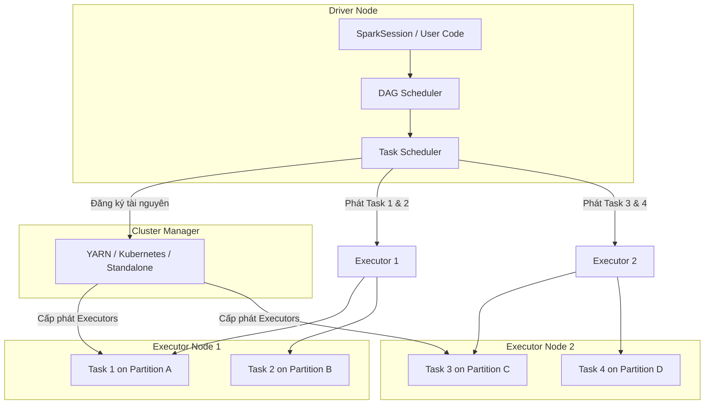

# Xử lý dữ liệu theo lô - Batch Processing

Trong thế giới kỹ thuật dữ liệu, nếu xử lý dòng (Streaming Processing) được ví như dòng nước chảy xiết liên tục thì **Batch Processing (Xử lý dữ liệu theo lô)** lại giống như những hồ chứa nước khổng lồ được xả định kỳ. Dù không mang lại cảm giác "tức thì" như streaming, Batch Processing vẫn luôn là xương sống vững chắc cho mọi hệ thống dữ liệu lớn nhờ khả năng giải quyết những tác vụ tính toán khổng lồ và phức tạp nhất.

## Batch Processing là gì?

Hiểu một cách đơn giản, **Batch Processing** là phương pháp thực thi tính toán trên một tập hợp dữ liệu lớn có sẵn và có giới hạn rõ ràng `(bounded data)` một cách định kỳ. Tiến trình này chạy nền và hoàn toàn không cần tương tác trực tiếp với người dùng cuối trong suốt thời gian thực thi. 

Khác với Streaming Processing – nơi mỗi bản ghi được xử lý ngay lập tức khi vừa xuất hiện để tối thiểu hóa độ trễ `(Low Latency)` – Batch Processing gom dữ liệu lại thành từng nhóm hoặc lô `(batches)`. Mục tiêu tối thượng của nó là tối ưu hóa **băng thông xử lý tối đa (High Throughput)**: làm sao để xử lý được khối lượng dữ liệu khổng lồ nhất trong một đơn vị thời gian với chi phí tài nguyên hợp lý nhất.

## Tại sao chúng ta cần xử lý dữ liệu theo lô?

Khi quy mô dữ liệu chạm ngưỡng Terabytes hay Petabytes mỗi ngày, một máy chủ đơn lẻ sẽ nhanh chóng chạm tới giới hạn vật lý về CPU, RAM cũng như tốc độ đọc ghi ổ đĩa `(I/O)`. Việc cố gắng tính toán các báo cáo tài chính cuối ngày hay huấn luyện lại các mô hình gợi ý sản phẩm trên một máy chủ cục bộ sẽ là "nhiệm vụ bất khả thi". 

Hệ thống Batch Processing phân tán ra đời để giải quyết triệt để ba bài toán hóc búa này:

1. **Vượt qua giới hạn tài nguyên cục bộ**: Nhờ cơ chế phân tán, hệ thống có thể chia nhỏ một tập dữ liệu khổng lồ thành nhiều phần và xử lý song song trên hàng chục, hàng trăm máy tính thay vì cố gắng nhồi nhét tất cả vào một thanh RAM duy nhất.
2. **Khả năng chịu lỗi tự động (Fault Tolerance)**: Hãy tưởng tượng một tác vụ chạy trong 5 tiếng đồng hồ trên 100 máy chủ, và đến tiếng thứ 4 thì có một máy bị sập. Hệ thống Batch Processing phân tán thông minh sẽ tự động phát hiện, phân bổ lại phần việc bị lỗi sang máy khác và tiếp tục chạy mà không bắt bạn phải khởi động lại toàn bộ tiến trình từ đầu.
3. **Tối ưu hóa chi phí hạ tầng**: Bạn không cần duy trì một cụm máy chủ cực mạnh 24/7. Với xử lý theo lô, doanh nghiệp có thể gom dữ liệu lại và lên lịch chạy vào các khung giờ thấp điểm (nửa đêm chẳng hạn) trên các cụm máy chủ ảo tạm thời `(transient clusters)` trên đám mây, sau khi chạy xong thì tự động tắt đi để tiết kiệm chi phí.

## Sự tiến hóa từ MapReduce đến Apache Spark

Để hiểu cách hoạt động của Batch Processing hiện đại, chúng ta cần nhìn lại chặng đường phát triển từ mô hình đĩa vật lý sang tính toán trong bộ nhớ:

### 1. Tượng đài MapReduce (Mô hình đĩa vật lý)
Được khai sinh bởi Google, MapReduce chia quy trình xử lý thành hai pha cốt lõi:
* **Map**: Đọc dữ liệu từ đĩa, lọc, biến đổi và phát ra các cặp khóa - giá trị `(key, value)`.
* **Reduce**: Thu thập các giá trị có chung `key`, tổng hợp chúng lại và ghi kết quả trở lại đĩa.

*Điểm hạn chế*: Giữa hai pha Map và Reduce, toàn bộ dữ liệu trung gian bắt buộc phải ghi xuống đĩa cứng vật lý `(Disk I/O)`. Điều này khiến các thuật toán lặp đi lặp lại (như học máy hay tính toán lặp) trở nên cực kỳ chậm chạp do nút thắt cổ chai ở đĩa cứng.

### 2. Kỷ nguyên Apache Spark (Mô hình đồ thị bộ nhớ DAG)
Spark ra đời như một cuộc cách mạng bằng cách giữ toàn bộ dữ liệu trung gian trong bộ nhớ RAM `(In-memory processing)`. Thay vì thực thi từng bước tuần tự ghi xuống đĩa, Spark tổ chức các bước biến đổi dưới dạng đồ thị có hướng không chu trình **DAG (Directed Acyclic Graph)**. 

Nhờ cơ chế **Lazy Evaluation** (đánh giá lười biếng), Spark không thực sự tính toán ngay lập tức khi bạn viết code. Nó chỉ ghi lại kế hoạch và chỉ bắt đầu chạy khi bạn thực hiện một hành động ghi dữ liệu đầu ra `(Action)`. Điều này giúp bộ tối ưu hóa Catalyst của Spark có cái nhìn toàn cảnh để sắp xếp và tối ưu hóa chuỗi thực thi một cách thông minh nhất.

## Cuộc hành trình của một Batch Job diễn ra như thế nào?

Để hình dung rõ hơn, chúng ta hãy xem sơ đồ kiến trúc điều phối và thực thi của một Apache Spark Batch Job dưới đây:



Khi bạn nhấn nút kích hoạt một Spark Job, chuỗi sự kiện sau sẽ diễn ra:
1. **Lập kế hoạch (Job Planning)**: Driver Node nhận mã thực thi của bạn, phân tích cấu trúc và xây dựng đồ thị logic DAG.
2. **Phân vùng dữ liệu (Partitioning)**: Tập dữ liệu khổng lồ đầu vào được chia nhỏ thành các phân vùng `(Partitions)` phân tán khắp cụm máy.
3. **Phân phối tác vụ (Task Scheduling)**: Driver chia đồ thị DAG thành các giai đoạn thực thi `(Stages)`. Ranh giới giữa các Stage chính là các điểm xảy ra quá trình xáo trộn dữ liệu qua mạng `(Shuffle)`. Mỗi Stage sẽ gồm nhiều tác vụ nhỏ `(Tasks)`, mỗi tác vụ xử lý trên một `Partition` cụ thể.
4. **Thực thi song song (Parallel Execution)**: Driver gửi các tác vụ này tới các Executor Node. Mỗi Executor chạy các tác vụ này song song trên các luồng CPU của mình.
5. **Ghi nhận và Dọn dẹp**: Sau khi tất cả các tác vụ hoàn tất, kết quả cuối cùng được ghi xuống Data Lake (ví dụ dưới định dạng Parquet) hoặc Data Warehouse, và cụm tài nguyên tính toán được giải phóng.

## Trải nghiệm thực tế với PySpark

Hãy cùng xem một ví dụ thực tế: Đọc tệp dữ liệu giao dịch khổng lồ định dạng CSV từ Cloud Storage (S3), tính tổng doanh thu theo từng cửa hàng `(store_id)` và lưu lại kết quả dưới định dạng tối ưu Parquet.

Dưới đây là mã nguồn Batch Job (`process_sales.py`):

```python
from pyspark.sql import SparkSession
from pyspark.sql.functions import col, sum

# 1. Khởi tạo Spark Session
spark = SparkSession.builder \
    .appName("StoreRevenueBatch") \
    .config("spark.sql.shuffle.partitions", "200") \
    .getOrCreate()

# 2. Đọc tập dữ liệu giao dịch đầu vào (Bounded Dataset)
df_sales = spark.read.csv("s3://data-lake/raw/sales/year=2026/*.csv", header=True, inferSchema=True)

# 3. Biến đổi dữ liệu (Lazy Evaluation - Chưa chạy thực tế)
df_grouped = df_sales.groupBy("store_id") \
                     .agg(sum(col("quantity") * col("price")).alias("total_revenue"))

# 4. Action: Ghi dữ liệu đầu ra (Spark bắt đầu build DAG và chạy thực thi)
df_grouped.write \
          .mode("overwrite") \
          .parquet("s3://data-lake/curated/store_revenue_report/")

# 5. Đóng session
spark.stop()
```

## Nghệ thuật làm chủ hiệu năng: Những bài học từ thực chiến

Thiết kế một batch job chạy được thì dễ, nhưng chạy nhanh, ổn định và tối ưu chi phí lại là một câu chuyện khác.

### Những kinh nghiệm xương máu (Best Practices)
* **Quy hoạch kích thước phân vùng hợp lý**: Spark mặc định chia 200 partition khi thực hiện Shuffle. Nếu dữ liệu quá nhỏ, 200 partition sẽ tạo ra rất nhiều tác vụ rác (overhead). Nếu dữ liệu quá lớn (hàng trăm GB), con số 200 lại quá ít khiến mỗi partition phình to, dễ gây lỗi tràn bộ nhớ `(Out Of Memory - OOM)`. Con số lý tưởng cho mỗi phân vùng sau shuffle là từ **100MB đến 200MB**.
* **Hạn chế tối đa các phép toán Shuffle**: Các thao tác như `.groupBy()`, `.join()`, `.distinct()` bắt buộc dữ liệu phải di chuyển qua lại giữa các máy chủ trong mạng (Shuffle). Hãy lọc dữ liệu bằng `.filter()` và loại bỏ các cột thừa càng sớm càng tốt trước khi shuffle để giảm bớt gánh nặng đường truyền.
* **Tận dụng Broadcast Joins**: Khi cần JOIN một bảng dữ liệu khổng lồ với một bảng danh mục (dimension table) kích thước nhỏ (dưới 10MB), hãy dùng Broadcast Join. Spark sẽ sao chép bảng nhỏ này tới mọi Executor, giúp thực hiện phép JOIN ngay tại chỗ mà không cần xáo trộn bảng lớn qua mạng.
* **Bộ đệm thông minh (Caching)**: Nếu một DataFrame được tái sử dụng nhiều lần ở các nhánh tính toán khác nhau, hãy gọi `.cache()` hoặc `.persist()` để giữ nó lại trên RAM, tránh việc Spark phải đọc lại file gốc và tính toán lại từ đầu.

### Những cạm bẫy dễ mắc phải (Common Mistakes)
* **Lạm dụng Caching**: Gọi `.cache()` vô tội vạ mà quên không giải phóng bằng `.unpersist()` sau khi dùng xong sẽ nhanh chóng làm cạn kiệt RAM của Executor và dẫn đến sập hệ thống (OOM).
* **Dữ liệu bị lệch (Data Skew)**: Lỗi này xảy ra khi thực hiện groupBy hoặc join trên một khóa phân phối không đồng đều (ví dụ: 90% giao dịch có `store_id` là `null` hoặc mã của cửa hàng trung tâm). Một vài Executor nhận trúng phân vùng bị lệch này sẽ phải gồng mình xử lý lượng dữ liệu khổng lồ và bị sập do quá tải RAM, trong khi các Executor còn lại đã làm xong và ngồi chơi.
* **Kéo dữ liệu lớn về Driver bằng `.collect()`**: Hàm `.collect()` sẽ kéo toàn bộ dữ liệu phân tán từ các Executor về duy nhất nút Driver Node. Nếu DataFrame có hàng triệu dòng, Driver chắc chắn sẽ sập ngay lập tức. Chỉ dùng `.collect()` cho các tập dữ liệu nhỏ đã được gom gọn.

## Điểm cân bằng khi lựa chọn Batch Processing

### Điểm mạnh
* Đạt hiệu suất băng thông tối ưu nhất trên các tập dữ liệu quy mô Petabytes.
* Khả năng tự phục hồi mạnh mẽ nhờ đồ thị dòng lịch sử dữ liệu (Lineage Graph) của DAG.
* Dễ lập trình, kiểm thử và tái hiện lỗi vì dữ liệu đầu vào là tĩnh và không thay đổi.

### Điểm yếu
* **Độ trễ cao**: Kết quả không xuất hiện ngay lập tức mà thường mất từ vài phút đến vài tiếng.
* **Tiêu hao tài nguyên đột biến**: Khi job bắt đầu chạy, hệ thống sẽ yêu cầu lượng CPU/RAM tăng vọt, đòi hỏi kiến trúc hạ tầng linh hoạt có khả năng tự động co giãn (autoscaling) tốt để tránh lãng phí.

## Khi nào nên và không nên chọn Batch Processing?

**Nên chọn khi:**
* Cần tính toán báo cáo tài chính, tổng kết doanh thu định kỳ hàng ngày, hàng tuần hoặc hàng tháng.
* Chạy các tiến trình gom và dọn dẹp file nhỏ (Compaction) trên Data Lake.
* Huấn luyện mô hình học máy (Machine Learning) trên dữ liệu lịch sử đồ sộ.
* Đồng bộ hóa dữ liệu định kỳ (Data Replication) từ các database nguồn (OLTP) vào Data Warehouse.

**Không nên chọn khi:**
* Cần phát hiện gian lận thẻ tín dụng hoặc cảnh báo bảo mật mạng theo thời gian thực (yêu cầu độ trễ dưới vài giây).
* Cần cập nhật số dư tài khoản ngân hàng hoặc ví điện tử ngay sau khi khách hàng quẹt thẻ.
* Xây dựng các màn hình giám sát trực tiếp (real-time dashboards) cần cập nhật từng giây.

## Góc phỏng vấn: Những câu hỏi thực chiến

### 1. Giải thích cơ chế Shuffle trong hệ thống phân tán và tại sao nó được coi là kẻ thù của hiệu năng Spark.
* **Mục đích câu hỏi**: Kiểm tra hiểu biết sâu sắc của ứng viên về chi phí truyền thông mạng và I/O đĩa trong môi trường phân tán.
* **Gợi ý trả lời**:
  * **Cơ chế**: Shuffle là quá trình phân phối lại dữ liệu trên toàn bộ cụm máy tính sao cho các dòng dữ liệu có cùng một khóa (key) sẽ được gom về cùng một phân vùng vật lý (partition) nằm trên cùng một Executor. Quá trình này xảy ra khi thực hiện các phép toán chuyển đổi rộng (wide transformations) như `groupByKey`, `reduceByKey`, hoặc `join`.
  * **Tại sao làm giảm hiệu năng**: Shuffle tác động tiêu cực lên 3 khía cạnh:
    * *Disk I/O*: Các Executor gửi phải ghi kết quả trung gian ra đĩa (shuffle write), trong khi các Executor nhận phải tải dữ liệu đó qua mạng và ghi ra đĩa nếu vượt quá RAM (shuffle read).
    * *Network I/O*: Di chuyển lượng lớn dữ liệu qua mạng gây nghẽn băng thông giữa các máy chủ.
    * *CPU overhead*: Việc tuần tự hóa (serialization) dữ liệu để truyền đi và giải tuần tự hóa (deserialization) ở đầu nhận tiêu tốn rất nhiều tài nguyên CPU.
* **Lỗi cần tránh**: Chỉ trả lời chung chung là "Shuffle làm Spark chạy chậm" mà không phân tích được các yếu tố Disk I/O, Network I/O và CPU serialization.

### 2. Làm thế nào để phát hiện và xử lý lỗi lệch dữ liệu (Data Skew) trong một Spark Job?
* **Mục đích câu hỏi**: Đánh giá kinh nghiệm thực chiến và gỡ lỗi (troubleshooting) trên môi trường Production lớn.
* **Gợi ý trả lời**:
  * **Phát hiện**: Dựa vào giao diện Spark UI. Nếu thấy một vài Task chạy mất hàng giờ trong khi phần lớn các Task khác chỉ mất vài giây, hoặc thấy lượng dữ liệu đọc ghi (Shuffle Read/Write Size) của một vài Executor lớn gấp hàng chục lần phần còn lại, đó là dấu hiệu của Data Skew.
  * **Xử lý**:
    * *Lọc bỏ khóa lệch*: Nếu khóa lệch là các giá trị không cần thiết (như `null` hoặc rỗng), hãy filter bỏ chúng ngay từ đầu pipeline.
    * *Sử dụng Broadcast Join*: Nếu phép JOIN bị skew do bảng nhỏ JOIN bảng lớn, ép Spark thực hiện Broadcast Join để tránh shuffle hoàn toàn.
    * *Kỹ thuật Salting (Rải muối)*: Thêm một hậu tố ngẫu nhiên (salt) vào khóa của bảng bị skew (ví dụ: biến khóa `store_A` thành `store_A_1`, `store_A_2`) và nhân bản tương ứng bên bảng đối chiếu. Phép JOIN lúc này sẽ phân phối dữ liệu đều ra các partition khác nhau, giải quyết triệt để nút thắt cổ chai.
* **Lỗi cần tránh**: Chỉ đề xuất tăng RAM hoặc CPU cho Executor (đây chỉ là giải pháp tình thế, không giải quyết được tận gốc lỗi thiết kế phân vùng).

### 3. Phân biệt sự khác biệt giữa phép toán biến đổi hẹp (Narrow Transformation) và biến đổi rộng (Wide Transformation) trong Spark.
* **Mục đích câu hỏi**: Kiểm tra kiến thức về cách Spark xây dựng DAG và phân chia Stages.
* **Gợi ý trả lời**:
  * **Narrow Transformation**: Mỗi phân vùng dữ liệu đầu vào chỉ được sử dụng bởi tối đa một phân vùng dữ liệu đầu ra. Không cần trao đổi dữ liệu qua mạng. Ví dụ: `.map()`, `.filter()`, `.flatMap()`. Spark có thể gộp nhiều narrow transformations liên tiếp vào cùng một giai đoạn (Stage) để thực thi tối ưu (pipelining).
  * **Wide Transformation**: Một phân vùng dữ liệu đầu vào sẽ đóng góp dữ liệu cho nhiều phân vùng dữ liệu đầu ra khác nhau trên các Executor khác nhau. Bắt buộc phải thực hiện Shuffle để chia lại dữ liệu qua mạng. Ví dụ: `.groupByKey()`, `.reduceByKey()`, `.join()`. Wide transformation chính là ranh giới kết thúc một Stage cũ và mở ra một Stage mới trong DAG.
* **Lỗi cần tránh**: Nhầm lẫn giữa Stage và Job khi giải thích ranh giới của Wide Transformation.

### 4. Tại sao MapReduce lại chậm hơn Apache Spark đối với các tiến trình xử lý lặp đi lặp lại (Iterative algorithms)?
* **Mục đích câu hỏi**: Hiểu biết lịch sử phát triển công nghệ dữ liệu lớn và tối ưu hóa bộ nhớ.
* **Gợi ý trả lời**:
  * Trong MapReduce, mỗi chu kỳ Map và Reduce là một Job độc lập. Đầu ra trung gian của pha Map bắt buộc phải ghi xuống đĩa cứng cục bộ và đầu ra của pha Reduce phải ghi xuống HDFS (với 3 bản sao). Các thuật toán lặp (như Machine Learning, PageRank) buộc phải đọc/ghi đĩa liên tục qua từng vòng lặp.
  * Apache Spark giữ toàn bộ dữ liệu trung gian trong bộ nhớ RAM xuyên suốt các bước của đồ thị DAG. Spark chỉ ghi xuống đĩa khi dữ liệu vượt quá dung lượng RAM hoặc khi ghi kết quả cuối cùng, giúp giảm thiểu độ trễ đọc/ghi đĩa vật lý đi hàng trăm lần.
* **Lỗi cần tránh**: Trả lời đơn giản là "Spark viết bằng Scala nên nhanh hơn MapReduce viết bằng Java" (đây là nhận định sai lầm, hiệu năng thực sự nằm ở cơ chế I/O đĩa vs RAM).

### 5. Cơ chế Lazy Evaluation trong Spark hoạt động thế nào? Hãy nêu lợi ích của nó.
* **Mục đích câu hỏi**: Hiểu biết về cơ chế biên dịch và tối ưu hóa truy vấn của Spark Catalyst Optimizer.
* **Gợi ý trả lời**:
  * **Cơ chế**: Khi ta viết các câu lệnh biến đổi (Transformations như map, filter, join), Spark không thực thi chúng ngay lập tức mà chỉ ghi lại các bước này vào đồ thị Lineage Graph (DAG). Spark chỉ thực sự biên dịch và chạy tính toán khi gặp một hành động trả kết quả đầu ra (Actions như `collect`, `count`, `write`).
  * **Lợi ích**: Giúp Catalyst Optimizer có cái nhìn toàn cảnh về toàn bộ chuỗi biến đổi. Từ đó, nó có thể tự động tối ưu hóa sơ đồ thực thi, ví dụ như thực hiện **Predicate Pushdown** (đẩy bộ lọc `filter` xuống sát nguồn đọc nhất để tránh tải các dòng dữ liệu thừa lên bộ nhớ) hoặc gộp các phép toán cột lại với nhau để giảm quét đĩa.
* **Lỗi cần tránh**: Không nhắc đến khái niệm Catalyst Optimizer hoặc Predicate Pushdown khi phân tích lợi ích của Lazy Evaluation.

## Khái niệm liên quan & Tài liệu tham khảo

**Khái niệm liên quan:**
* [Distributed Processing](/concepts/batch-processing/distributed-processing/)
* [Apache Spark](/concepts/batch-processing/apache-spark/)
* [Shuffle (Distributed System)](/concepts/batch-processing/shuffle/)
* [Data Skew](/concepts/batch-processing/data-skew/)

**Tài liệu tham khảo:**
1. **Designing Data-Intensive Applications** - Martin Kleppmann (Chương 10: Batch Processing - Phân tích chi tiết về MapReduce và triết lý Unix Tools).
2. **Spark: The Definitive Guide** - Bill Chambers, Matei Zaharia (Cuốn sách chính thức giải thích cặn kẽ Spark Execution Model và cơ chế Shuffle).
3. **High Performance Spark** - Holden Karau, Rachel Warren (Cẩm nang nâng cao về tối ưu bộ nhớ, gỡ lỗi Data Skew và tối ưu hóa Joins).
4. **Research Paper**: *Resilient Distributed Datasets: A Spatio-Temporal Abstraction for In-Memory Cluster Computing* - Matei Zaharia et al. (Bài báo khoa học gốc khai sinh ra Apache Spark).
5. **Apache Spark Documentation** - Tuning Spark Guide (Tài liệu chính thức hướng dẫn cấu hình bộ nhớ, số lượng partition và tối ưu hóa hiệu năng).

## English Summary

Batch Processing is a distributed computing paradigm optimized for processing bounded datasets at a high throughput, executing background tasks without user interaction. Modern batch engines like Apache Spark replace disk-bound MapReduce architectures by utilizing Directed Acyclic Graphs (DAGs) and in-memory execution models. Key stages of a batch job include DAG planning, data partitioning, parallel task execution across distributed executors, and data shuffles. Orchestrating efficient batch jobs requires careful partition sizing, choosing broadcast joins to bypass network shuffles, leveraging lazy evaluation for query optimizations (like predicate pushdown), and mitigating data skew through salting techniques.
