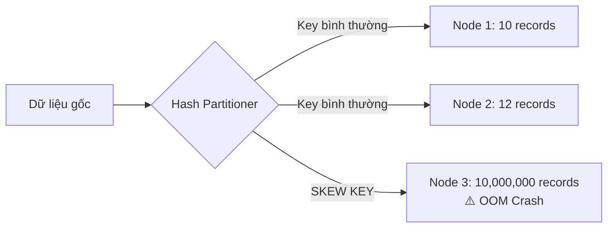

Hãy tưởng tượng bạn đang quản lý một đội công nhân gồm 200 người để dọn dẹp một đống đổ nát khổng lồ. Kế hoạch ban đầu là chia đều công việc cho tất cả mọi người để hoàn thành nhanh nhất. Nhưng do lỗi phân công, 199 người dọn xong phần của mình chỉ trong 10 giây và ra quán trà đá ngồi chơi, trong khi 1 người còn lại phải tự mình khuân vác một khối đá tảng nặng hàng chục tấn trong suốt 5 tiếng đồng hồ. Cả đội phải ngồi đợi người cuối cùng này làm xong thì mới được ra về.

Trong thế giới Big Data, hiện tượng tréo ngoe này được gọi là **Data Skew (Lệch dữ liệu)**. Đây là một trong những nguyên nhân hàng đầu khiến các pipeline Spark bị kẹt vô tận hoặc sập nguồn đột ngột do hết bộ nhớ (OOM - Out Of Memory).

## Data Skew thực chất là gì?

Trong các hệ thống tính toán phân tán như [Apache Spark](/concepts/batch-processing/apache-spark/), dữ liệu được chia nhỏ thành nhiều phần gọi là các phân vùng (partitions) và phân phối xuống các node xử lý khác nhau. **Data Skew** xảy ra khi dữ liệu phân bố không đồng đều giữa các phân vùng này.



Khi chúng ta thực hiện các phép toán gom nhóm (`GROUP BY`) hoặc kết nối (`JOIN`), hệ thống sẽ dựa vào giá trị của khóa (Key) để định tuyến dữ liệu. Bằng thuật toán băm (Hash Partitioner), các bản ghi có cùng một khóa sẽ bị gom về cùng một phân vùng xử lý. 

Nếu một khóa nào đó chiếm đa số trong tập dữ liệu (ví dụ: khóa NULL hoặc một giá trị phổ biến đột biến), toàn bộ hàng triệu dòng dữ liệu mang khóa đó sẽ dồn về duy nhất **MỘT** node. Node này sẽ bị quá tải, trong khi các node khác hoàn tất nhiệm vụ gần như lập tức và rơi vào trạng thái "ngồi chơi xơi nước".

## Tại sao dữ liệu trong thế giới thực luôn bị lệch?

Thế giới thực không hoạt động theo phân phối đều hoàn hảo, nó tuân theo quy luật tập trung (ví dụ quy luật Pareto 80/20). Do đó, dữ liệu tự nhiên sinh ra vốn dĩ đã bị lệch:

* **Bẫy giá trị rỗng (NULL values)**: Trong một bảng dữ liệu lớn, có tới 30-40% bản ghi bị trống cột khóa phụ (Foreign Key) và mang giá trị NULL hoặc chuỗi rỗng `""`. Khi thực hiện JOIN, Spark sẽ đẩy toàn bộ các dòng mang giá trị NULL này về cùng một máy chủ.
* **Người dùng "siêu sao"**: Trên mạng xã hội như Instagram hay Twitter, tài khoản của những người nổi tiếng như Cristiano Ronaldo có hàng trăm triệu lượt theo dõi và tương tác. Nếu bạn thực hiện JOIN bảng tương tác theo ID người dùng, máy chủ phụ trách ID của Ronaldo chắc chắn sẽ sập vì quá tải, trong khi máy phụ trách ID của một người dùng bình thường chỉ mất 1 phần nghìn giây để xử lý xong.
* **Sự chênh lệch địa lý**: Một ứng dụng giao hàng tại Việt Nam sẽ có lượng đơn hàng tập trung khổng lồ ở TP. Hồ Chí Minh và Hà Nội. Dữ liệu của hai thành phố này sẽ bóp nghẹt máy chủ xử lý so với dữ liệu của các tỉnh thành nhỏ hơn.

## Làm sao để nhận diện Data Skew?

Khi pipeline của bạn chạy chậm một cách bất thường hoặc đột ngột sập với lỗi `GC Overhead limit exceeded` hay `FetchFailedException`, hãy mở **Spark Web UI** và kiểm tra tab **Stages**:

1. **Xem danh sách Tasks**: Hãy kéo xuống bảng thống kê chi tiết các Task trong Stage đang gặp sự cố.
2. **So sánh thời gian thực thi (Duration)**: Nếu thấy thời gian chạy Min/Median chỉ khoảng vài giây, nhưng thời gian Max lại lên tới 40-50 phút, hoặc biểu đồ dòng thời gian (Timeline) hiển thị một vạch dài vô tận giữa hàng trăm vạch ngắn cũn cỡn.
3. **So sánh lượng dữ liệu truyền tải ([Shuffle](/concepts/batch-processing/shuffle/) Read Size)**: Nếu các Task thông thường chỉ đọc vài Megabytes dữ liệu, nhưng có một vài Task cá biệt phải "gánh" tới hàng chục Gigabytes.

Đây chính là những bằng chứng đanh thép cho thấy hệ thống của bạn đang bị Data Skew tàn phá.

---

## Các phương pháp "chữa trị" Data Skew hiệu quả

Giả sử bạn có một bảng hóa đơn (`sales`) 10 tỷ dòng muốn JOIN với bảng khách hàng (`customers`) dựa trên trường thành phố (`city`). Tuy nhiên, có tới 80% khách hàng sống ở `"Ho Chi Minh"`.

```python
# Phép JOIN thông thường dễ gây sập hệ thống do Data Skew
result_df = sales_df.join(customers_df, "city", "inner")
```

Dưới đây là các kỹ thuật giúp bạn giải quyết vấn đề này:

### 1. Lọc bỏ các giá trị rác hoặc NULL (Filter Nulls)
Nếu các bản ghi có khóa NULL không thực sự đóng góp vào kết quả JOIN (như trong phép INNER JOIN), hãy lọc sạch chúng trước khi tiến hành JOIN. Điều này ngăn không cho hàng triệu dòng NULL dồn về một máy.
```python
sales_valid = sales_df.filter(col("city").isNotNull())
```

### 2. Kỹ thuật Broadcast Join (Tuyệt chiêu tốt nhất)
Nếu bảng khách hàng (`customers`) có kích thước nhỏ (ví dụ dưới 1GB, có thể nhét vừa bộ nhớ của một máy), hãy bắt Spark gửi bản sao của toàn bộ bảng này đến tất cả các node (Broadcast). Khi đó, Spark sẽ thực hiện JOIN trực tiếp trên từng node mà không cần phải thực hiện quá trình Shuffle dữ liệu của bảng `sales` khổng lồ nữa.
```python
from pyspark.sql.functions import broadcast

result_df = sales_df.join(broadcast(customers_df), "city")
```

### 3. Kỹ thuật "Ướp muối" (Key Salting)
Nếu cả hai bảng đều quá lớn và không thể dùng Broadcast, chúng ta phải dùng đến kỹ thuật Salting. Ý tưởng là bẻ nhỏ từ khóa bị lệch (ví dụ `"Ho Chi Minh"`) thành nhiều mảnh nhỏ hơn bằng cách ghép thêm một số ngẫu nhiên vào sau nó.

* **Bên bảng Sales (bảng bị lệch)**: Thêm một cột `salt` chứa số nguyên ngẫu nhiên từ 0 đến $N-1$ (ví dụ $N = 5$). Giá trị `"Ho Chi Minh"` sẽ bị chia nhỏ thành `"Ho Chi Minh_0"`, `"Ho Chi Minh_1"`, ..., `"Ho Chi Minh_4"`. Dữ liệu sẽ được phân tán đều ra 5 máy khác nhau.
* **Bên bảng Customers**: Nhân bản mỗi dòng thành $N$ dòng (dùng hàm `explode`) với các hậu tố từ 0 đến $N-1$.
* **Thực hiện JOIN** trên cả khóa chính và khóa salt mới.

```python
import pyspark.sql.functions as F

# Bảng Sales: Thêm muối ngẫu nhiên từ 0 đến 4
sales_salted = sales_df.withColumn("salt", F.floor(F.rand() * 5))

# Bảng Customers: Nhân bản mỗi dòng lên 5 lần tương ứng với các giá trị muối
cust_salted = customers_df.withColumn("salt", F.explode(F.array([F.lit(i) for i in range(5)])))

# Thực hiện JOIN trên cả 2 khóa để phân tán tải
result_df = sales_salted.join(cust_salted, ["city", "salt"]).drop("salt")
```

---

## Kinh nghiệm thực chiến và Những điểm đánh đổi

### Các thói quen tốt khi làm việc với Spark (Best Practices)
* **Chủ động khám phá dữ liệu (Profiling)**: Trước khi viết code cho pipeline, hãy chạy thử lệnh gom nhóm để xem phân phối dữ liệu của các khóa JOIN:
  ```python
  df.groupBy("join_key").count().orderBy(F.desc("count")).show()
  ```
* **Kích hoạt AQE (Adaptive Query Execution)**: Từ Spark 3.0 trở đi, hãy đảm bảo tính năng AQE được bật. AQE có một cơ chế cực kỳ thông minh là `Optimize Skewed Join`. Khi đang chạy, nếu Spark phát hiện ra một phân vùng nào đó lớn bất thường, nó sẽ tự động bẻ vụn phân vùng đó ra và thực hiện các bước tương tự như tự động "ướp muối".

### Những sai lầm thường gặp
* **Tăng RAM hoặc CPU một cách mù quáng**: Khi hệ thống bị nghẽn do Skew, việc nâng cấp tài nguyên cụm lên gấp đôi hay gấp ba chỉ làm lãng phí tiền bạc. Vì dù cụm của bạn có mạnh đến đâu, toàn bộ lượng dữ liệu lệch vẫn sẽ đổ dồn vào một CPU duy nhất.
* **Tăng tham số Shuffle Partitions vô tội vạ**: Việc tăng `spark.sql.shuffle.partitions` từ 200 lên 2000 chỉ giúp chia nhỏ các phân vùng bình thường, còn những bản ghi có khóa giống hệt nhau (như cùng là `"Ho Chi Minh"`) vẫn bắt buộc phải đi về chung một chỗ theo thuật toán băm.

### Đánh đổi khi sử dụng Key Salting
* Làm cho mã nguồn của bạn trở nên phức tạp, khó đọc và khó bảo trì hơn đối với các phân tích viên thông thường.
* Việc nhân bản dữ liệu của bảng thứ hai (Explode) sẽ làm tăng dung lượng bộ nhớ tạm thời và tăng băng thông đọc ghi đĩa (I/O). Bạn nên chọn hệ số muối $N$ vừa phải (thường từ 10 đến 50) để cân bằng hiệu năng.

---

## Góc phỏng vấn

### 1. Bạn sẽ xử lý như thế nào nếu một Data Pipeline chạy bị treo và nghi ngờ do hiện tượng Data Skew?
* **Gợi ý trả lời**: Quy trình xử lý thực tế của tôi gồm các bước:
  * **Xác định lỗi**: Vào Spark UI kiểm tra Stage đang chạy lâu. Nếu thấy thời gian thực hiện của các Task lệch nhau quá lớn (ví dụ: hầu hết chạy dưới 1 phút, chỉ có 1-2 Task chạy hơn 1 tiếng) kèm theo lượng Shuffle Read vượt trội, tôi xác định hệ thống bị dính Skew.
  * **Lọc nhiễu**: Kiểm tra xem khóa JOIN có chứa nhiều giá trị NULL hoặc mặc định không để lọc bỏ trước khi JOIN.
  * **Chọn giải pháp tối ưu**: 
    * Nếu một trong hai bảng đủ nhỏ, tôi dùng Broadcast Join để loại bỏ hoàn toàn giai đoạn Shuffle dữ liệu.
    * Nếu cả hai bảng đều quá lớn, tôi sẽ tự tay thiết lập kỹ thuật Key Salting để phân tán các khóa bị lệch sang nhiều phân vùng khác nhau.

### 2. Tính năng AQE (Adaptive Query Execution) của Spark 3 có giải quyết triệt để vấn đề Data Skew không?
* **Gợi ý trả lời**: AQE hỗ trợ cực tốt cho phép JOIN bị lệch dữ liệu thông qua cơ chế tự động chia nhỏ phân vùng. Tuy nhiên, AQE không phải là phép màu vạn năng. Nó không giải quyết được hiện tượng Skew khi thực hiện các phép toán gom nhóm (`GROUP BY`), tính toán hàm cửa sổ (`Window Functions`) hoặc các logic tự định nghĩa phức tạp (UDFs). Trong những trường hợp đó, người kỹ sư vẫn phải tự can thiệp bằng các kỹ thuật như Salting.

---

## Các khái niệm liên quan

* **[Spark Joins](/concepts/batch-processing/spark-joins/)** - Tìm hiểu sâu hơn các cơ chế JOIN trong Spark.

## Tài liệu tham khảo

1. [Spark: The Definitive Guide](https://www.oreilly.com/library/view/spark-the-definitive/9781491912201/) - Comprehensive guide to using, tuning, and monitoring Spark by Bill Chambers and Matei Zaharia.
2. [Adaptive Query Execution: Speeding Up Spark SQL at Runtime](https://www.databricks.com/blog/2020/05/29/adaptive-query-execution-speeding-up-spark-sql-at-runtime.html) - Databricks engineering blog post detailing the mechanics of Spark's AQE framework, including skew joins.
3. [Apache Spark SQL Performance Tuning Guide](https://spark.apache.org/docs/latest/sql-performance-tuning.html) - Official documentation covering memory structures, join strategies, and adaptive query configurations.
4. [High Performance Spark](https://www.oreilly.com/library/view/high-performance-spark/9781491943199/) - Practical guide to optimizing and troubleshooting distributed Spark code, specifically addressing data skew and custom [partitioning](/concepts/database-storage/partitioning/), by Holden Karau and Rachel Warren.
5. [AWS Big Data Blog - Handling Data Skew in Apache Spark](https://aws.amazon.com/blogs/big-data/handle-data-skew-in-apache-spark-gaps-and-solutions/) - Guide on identifying and resolving data skew issues in Spark jobs.

## English Summary

**Data Skew** is a critical performance bottleneck in distributed computing where an uneven distribution of partition keys causes one or a few nodes to process a vastly disproportionate volume of data (often leading to Out-Of-Memory errors). It sabotages cluster parallelism. Mitigation strategies include identifying the "hot tasks" via the Spark UI, filtering out irrelevant null/default values, leveraging Broadcast Joins for asymmetric datasets, and implementing Key Salting (adding random suffixes and exploding the lookup table) to manually fracture and distribute massive key payloads evenly across the cluster. Modern Spark (3.0+) partially automates this via Adaptive Query Execution (AQE).
