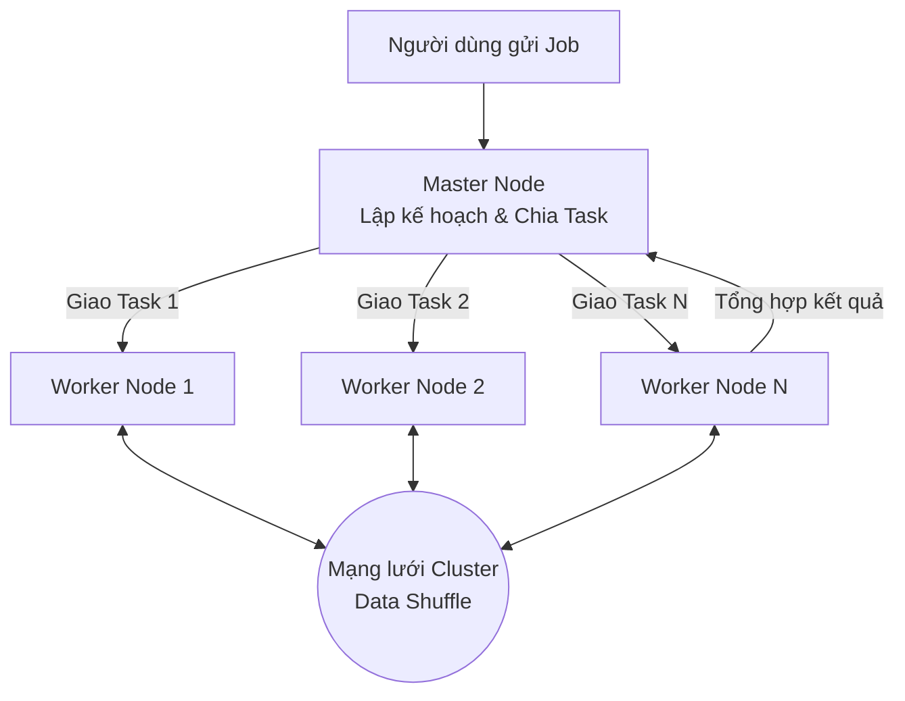

# Xử lý phân tán - Distributed Processing

Trong kỷ nguyên số ngày nay, lượng dữ liệu sinh ra mỗi giây từ mạng xã hội, thiết bị IoT, hay các giao dịch tài chính là khổng lồ. Hãy tưởng tượng bạn đang đối mặt với một file log nặng vài Terabyte và cần trích xuất thông tin hành vi người dùng. Nếu chỉ dùng một chiếc máy tính cá nhân hay thậm chí là một máy chủ cấu hình mạnh để đọc và xử lý tuần tự, bạn có thể phải đợi hàng ngày, thậm chí hàng tuần. 

Để giải quyết bài toán này, các kỹ sư dữ liệu không cố gắng chế tạo ra những siêu máy tính đắt đỏ vô hạn. Thay vào đó, họ kết nối hàng chục, hàng trăm chiếc máy tính bình thường lại với nhau và bắt chúng cùng làm việc. Đó chính là nền tảng của **Xử lý phân tán (Distributed Processing)** – triết lý công nghệ cốt lõi định hình nên kỷ nguyên Big Data.

## Kỷ nguyên Big Data và sự giới hạn của siêu máy chủ

Trước đây, khi dữ liệu của doanh nghiệp phình to, giải pháp đầu tiên người ta nghĩ đến thường là nâng cấp cấu hình cho máy chủ hiện tại: mua thêm RAM, cắm thêm CPU mạnh hơn, nâng cấp ổ cứng. Phương pháp này được gọi là **Mở rộng theo chiều dọc (Scale Up / Vertical Scaling)**. 

Tuy nhiên, Scale Up nhanh chóng vấp phải những giới hạn vật lý và tài chính khắc nghiệt:
* **Chi phí tăng theo cấp số nhân**: Một máy chủ có 8 core CPU giá rất rẻ, nhưng một cỗ máy khủng với 128 core CPU và 2TB RAM có giá lên tới hàng trăm nghìn USD.
* **Điểm nghẽn vật lý (Bottleneck)**: Dù CPU có nhanh đến đâu, tốc độ đọc ghi của ổ cứng và băng thông bo mạch chủ trên một máy đơn lẻ vẫn có giới hạn. Khi dữ liệu vượt ngưỡng hàng chục Terabyte, hệ thống I/O (Input/Output) sẽ bị nghẽn cổ chai.
* **Rủi ro Single Point of Failure**: Nếu cỗ máy siêu mạnh đó gặp sự cố phần cứng hoặc mất điện, toàn bộ hệ thống phân tích của doanh nghiệp lập tức tê liệt.

Để thoát khỏi chiếc bẫy Scale Up, mô hình xử lý phân tán chọn đi theo con đường **Mở rộng theo chiều ngang (Scale Out / Horizontal Scaling)**. Thay vì mua một siêu máy tính đắt đỏ, chúng ta ghép hàng trăm máy tính phổ thông (Commodity Hardware) lại thành một cụm (Cluster). Nếu dữ liệu tăng gấp đôi? Đơn giản là mua thêm vài máy tính bình thường cắm vào cụm. Nếu một máy trong cụm bị hỏng? Hệ thống tự động chuyển phần việc của nó sang máy khác mà không làm gián đoạn tiến trình chung.

## Triết lý "Chia để trị" (Divide and Conquer)

Về bản chất, xử lý phân tán hoạt động dựa trên triết lý **Chia để trị**. Một công việc tính toán khổng lồ (Job) sẽ được phần mềm quản lý phân tách thành hàng nghìn tác vụ nhỏ hơn (Tasks). Các tác vụ này được phân phối đồng thời đến các máy tính khác nhau trong cụm để thực thi song song.

Có một nguyên lý cực kỳ thú vị trong hệ thống phân tán gọi là **Data Locality (Tối ưu hóa dữ liệu cục bộ)**. Trong các hệ thống truyền thống, bạn thường phải tải dữ liệu từ nơi lưu trữ về nơi chạy chương trình tính toán qua mạng internet. Nhưng với Big Data, việc truyền tải hàng Terabyte dữ liệu qua mạng là một thảm họa về băng thông. Xử lý phân tán đảo ngược quy trình này: nó gửi đoạn code xử lý (chỉ nặng vài Kilobyte) đến chính chiếc máy đang lưu trữ phần dữ liệu đó để tính toán cục bộ (*Bring compute to data*).

## Mô hình Master - Worker hoạt động ra sao?

Hầu hết các framework xử lý phân tán nổi tiếng (như Apache Spark hay Hadoop MapReduce) đều tổ chức hệ thống theo mô hình điều khiển **Master - Worker** (hoặc Driver - Executor):



* **Master Node (Node điều khiển)**: Đóng vai trò như một vị "nhạc trưởng". Khi nhận yêu cầu từ người dùng, Master Node sẽ phân tích, lập kế hoạch thực thi tối ưu nhất, chia nhỏ công việc thành các Task và phân phối chúng xuống các máy trạm (Worker Nodes). Nó cũng liên tục giám sát sức khỏe của các Worker để sẵn sàng phân bổ lại Task nếu có máy nào bị "sập".
* **Worker Nodes (Node thực thi)**: Đây là những "công nhân" thực thụ sở hữu CPU, RAM và ổ cứng. Chúng nhận Task từ Master, lấy dữ liệu cục bộ và cặm cụi tính toán.
* **Shuffle (Trao đổi dữ liệu)**: Trong quá trình xử lý, đôi khi các Worker cần nhóm dữ liệu lại theo một tiêu chí nào đó (ví dụ: `GROUP BY` hay `JOIN`). Lúc này, các Worker buộc phải gửi dữ liệu trung gian qua lại cho nhau thông qua mạng lưới nội bộ của cụm. Quá trình trao đổi dữ liệu xuyên suốt các node này được gọi là **Shuffle**.

## Bài toán đếm 1 tỷ file text và lời giải từ Spark

Hãy hình dung bạn có 1 tỷ file văn bản và nhiệm vụ của bạn là đếm xem từ "Data" xuất hiện bao nhiêu lần.

* **Nếu chạy trên một máy đơn lẻ (Single-node)**: Chương trình sẽ mở từng file một, duyệt qua từng từ, cộng vào một biến đếm toàn cục. Công việc này có thể ngốn của bạn 100 giờ chạy liên tục.
* **Nếu chạy trên hệ thống phân tán (Distributed MapReduce với Apache Spark)**: 
  * Bạn có một cụm gồm 100 máy trạm.
  * **Bước Map**: Master Node phân bổ cho mỗi máy trạm đọc và đếm trên 10 triệu file độc lập. 100 máy này chạy song song hoàn toàn và trả về kết quả đếm nội bộ (Ví dụ: Máy 1 đếm được 500 từ, Máy 2 đếm được 600 từ...).
  * **Bước Reduce**: Master tập hợp kết quả đếm từ 100 máy trạm và cộng chúng lại với nhau để ra con số cuối cùng. Tổng thời gian hoàn thành lúc này rút ngắn xuống chỉ còn khoảng 1 giờ!

Với thư viện PySpark, lập trình viên có thể dễ dàng viết code mà không cần tự tay quản lý việc chia nhỏ Task hay kết nối mạng phức tạp, bởi Spark đã lo toàn bộ phần backend:

```python
from pyspark.sql import SparkSession

spark = SparkSession.builder.appName("WordCount").getOrCreate()

# Master chỉ đạo các Worker đọc song song 1 tỷ file text
text_file = spark.sparkContext.textFile("hdfs://cluster/data/1_billion_files/*.txt")

# Worker thực hiện chia tách từ (Map) và cộng dồn (Reduce)
counts = text_file.flatMap(lambda line: line.split(" ")) \
             .map(lambda word: (word, 1)) \
             .reduceByKey(lambda a, b: a + b)

# Thu thập kết quả về Master (Chỉ hiển thị từ 'Data')
data_word_count = counts.filter(lambda x: x[0] == "Data").collect()
print(f"Từ 'Data' xuất hiện: {data_word_count[0][1]} lần")
```

## Những lưu ý quan trọng để tối ưu hóa hiệu năng

Dù xử lý phân tán rất mạnh mẽ, nhưng việc cấu hình và thiết kế giải pháp sai cách có thể khiến hệ thống chạy chậm hơn cả một chiếc laptop bình thường. Dưới đây là những nguyên tắc thiết kế bạn cần nhớ:

### Nguyên tắc thiết kế (Best Practices)
* **Giảm thiểu tối đa Network Shuffle**: Việc truyền dữ liệu giữa các node qua mạng vật lý luôn là hoạt động chậm và tốn kém tài nguyên nhất. Hãy cố gắng thiết kế các bước biến đổi dữ liệu sao cho các Node có thể tự xử lý độc lập trên dữ liệu cục bộ trước khi cần trao đổi chéo.
* **Thiết kế cơ chế chịu lỗi (Fault Tolerance)**: Hãy luôn cấu hình để hệ thống tự động ghi nhận nhật ký tiến trình (lineage/checkpoint). Nếu một node tính toán bị hỏng ở giữa chừng, hệ thống có thể khôi phục lại task đó trên node khác từ điểm dừng gần nhất, thay vì phải chạy lại toàn bộ Job từ đầu.

### Sai lầm dễ mắc phải (Common Mistakes)
* **Áp dụng phân tán cho dữ liệu quá nhỏ**: Việc khởi động một cụm máy chủ, cấp phát tài nguyên RAM/CPU và truyền nhận lệnh qua mạng luôn tốn một khoản chi phí thời gian ban đầu (overhead). Nếu dữ liệu của bạn chỉ vài trăm Megabyte, một đoạn script Python chạy trên máy cá nhân sẽ nhanh hơn rất nhiều so với việc dựng lên một cụm Spark để xử lý.
* **Hiện tượng dữ liệu lệch (Data Skew)**: Đây là tình trạng dữ liệu phân bổ không đều giữa các Worker. Ví dụ: Node 1 chỉ phải xử lý 1 Megabyte dữ liệu và xong trong 1 giây, trong khi Node 2 phải gánh 100 Gigabyte dữ liệu. Cả hệ thống sẽ phải ngồi chờ Node 2 hoàn thành, làm mất đi hoàn toàn lợi thế của việc xử lý song song.

## Được và mất: Liệu có luôn cần đến Xử lý phân tán?

### Ưu thế vượt trội
* **Khả năng mở rộng không giới hạn**: Khi dữ liệu lớn lên, bạn chỉ cần cắm thêm máy vào cụm.
* **Tính sẵn sàng cao**: Tự động vượt qua lỗi phần cứng mà không làm hỏng công việc chung.
* **Hiệu quả về chi phí**: Tận dụng cơ sở hạ tầng Cloud để tạo lập cụm máy ảo giá rẻ tạm thời (Spot instances) và tắt chúng đi ngay khi chạy xong Job.

### Rào cản thách thức
* **Độ phức tạp kỹ thuật cao**: Việc viết code, kiểm thử và tìm lỗi (debug) trên một hệ thống phân tán khó khăn hơn rất nhiều so với ứng dụng đơn lẻ.
* **Chi phí khởi động (Cold Start)**: Cần thời gian để hệ thống điều phối cụm chuẩn bị tài nguyên trước khi thực sự bắt tay vào tính toán.

## Khi nào nên (và không nên) áp dụng?

**Nên sử dụng khi:**
* Tập dữ liệu lớn vượt ngưỡng giới hạn lưu trữ của RAM/ổ cứng trên một máy chủ đơn lẻ (hàng trăm Gigabyte cho tới Petabyte).
* Các tác vụ đòi hỏi lượng tính toán khổng lồ như phân tích log hệ thống, huấn luyện các mô hình Machine Learning lớn.

**Không nên sử dụng khi:**
* Dữ liệu ở quy mô vừa và nhỏ (dưới 10GB). Trong trường hợp này, các thư viện như Pandas hoặc DuckDB chạy trực tiếp trên một máy chủ có cấu hình RAM tương đối sẽ mang lại tốc độ vượt trội nhờ loại bỏ hoàn toàn độ trễ truyền thông qua mạng.

## Các khái niệm liên quan

* [Apache Spark](/concepts/batch-processing/apache-spark/)
* [Shuffle](/concepts/batch-processing/shuffle/)
* [Data Skew](/concepts/batch-processing/data-skew/)
* MapReduce

## Góc phỏng vấn

### 1. Sự khác biệt giữa Scale Up (Vertical Scaling) và Scale Out (Horizontal Scaling) là gì?
* **Gợi ý trả lời**: Scale Up là giải pháp tăng cường sức mạnh phần cứng (nâng CPU, RAM, ổ cứng) cho một máy chủ duy nhất. Phương pháp này có giới hạn vật lý rõ rệt, chi phí tăng theo cấp số nhân và mang rủi ro "Single Point of Failure" (nếu máy hỏng thì hệ thống sập). Scale Out là phương pháp mở rộng bằng cách thêm nhiều máy chủ cấu hình vừa phải vào một cụm (cluster) để làm việc song song dưới sự điều phối của phần mềm. Scale Out có chi phí tăng tuyến tính linh hoạt, tính chịu lỗi cao và là triết lý thiết kế cốt lõi của các hệ thống dữ liệu lớn ngày nay.

### 2. Triết lý "Bring compute to data" (Mang tính toán đến nơi có dữ liệu) mang lại lợi ích gì trong kiến trúc phân tán?
* **Gợi ý trả lời**: Trong các hệ thống phân tán quy mô lớn, việc truyền tải dữ liệu dung lượng lớn (ví dụ: hàng Terabyte) qua mạng từ node lưu trữ sang node tính toán sẽ gây nghẽn băng thông mạng nội bộ nghiêm trọng. Triết lý "Bring compute to data" giải quyết vấn đề này bằng cách gửi đoạn mã lệnh thực thi (kích thước rất nhỏ, chỉ vài Kilobyte) đến chính node đang lưu trữ phần dữ liệu đó để nó tự xử lý cục bộ. Điều này giúp loại bỏ điểm nghẽn I/O mạng và tối ưu hóa hiệu năng tính toán toàn hệ thống.

## Tài liệu tham khảo

* **Designing Data-Intensive Applications** - Martin Kleppmann (Cuốn sách kinh điển phân tích sâu về Batch Processing và MapReduce).
* **Hadoop: The Definitive Guide** - Tom White.

## Tóm tắt bằng tiếng Anh (English Summary)

Distributed Processing refers to the architecture and methodology of distributing massive computational workloads across a cluster of interconnected machines (nodes) that work in parallel. By embracing horizontal scaling (scale-out) and utilizing frameworks like Hadoop MapReduce or Apache Spark, organizations can process petabytes of data, overcoming the physical limitations and single-point-of-failure vulnerabilities associated with single-machine vertical scaling (scale-up). It typically employs a master-worker architecture where computation is brought closer to the data to minimize network I/O bottlenecks.
