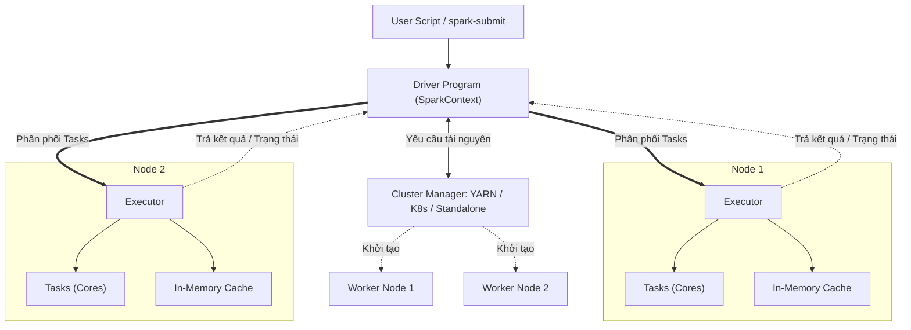

Khi viết một đoạn mã Apache Spark để xử lý dữ liệu lớn, chúng ta thường viết các câu lệnh trông rất tuần tự và đơn giản trên máy tính cá nhân. Thế nhưng, khi đoạn code đó được gửi lên một cụm máy chủ gồm hàng chục hay hàng trăm máy tính (Cluster), Spark làm thế nào để chia nhỏ công việc và điều phối chúng chạy song song một cách nhịp nhàng? 

Để trả lời câu hỏi đó, chúng ta cần tìm hiểu về **Spark Execution Model (Mô hình thực thi Spark)**.

## Spark Execution Model là gì? Cách thức vận hành của một cụm tính toán phân tán

Trong Apache Spark, ứng dụng của bạn không chạy độc lập trên một máy tính duy nhất. Khi bạn kích hoạt một Spark Application, hệ thống sẽ tự động tách biệt luồng điều khiển (Control Flow) và luồng dữ liệu (Data Flow). 

Mô hình thực thi này tổ chức ứng dụng theo kiến trúc **Master-Slave** (Chủ - Tớ) kinh điển. Nó bao gồm một tiến trình trung tâm đóng vai trò "bộ não" điều phối toàn bộ các tiến trình phân tán (JVM processes) chạy song song trên nhiều máy tính vật lý khác nhau trong mạng lưới cụm (Cluster).

## Bộ ba quyền lực: Driver, Cluster Manager và Executor

Kiến trúc thực thi của Spark được cấu thành từ ba thành phần cốt lõi hoạt động ăn ý với nhau:



1. **Driver Program (Tiến trình Master - Người điều hành)**: Đây chính là nơi khởi tạo đối tượng `SparkSession` hoặc `SparkContext`. Driver chịu trách nhiệm dịch mã nguồn của bạn thành các công việc (Jobs), xây dựng biểu đồ [DAG](/concepts/orchestration/dag/) (Directed Acyclic Graph), chia nhỏ chúng thành các Stage/Task và phân bổ các Task này đến các máy con.
2. **Cluster Manager (Trình quản lý tài nguyên)**: Một hệ thống độc lập bên ngoài (như Hadoop YARN, Kubernetes hoặc Spark Standalone). Nó đóng vai trò như phòng nhân sự: Driver sẽ yêu cầu: *"Tôi cần 10 máy, mỗi máy 4 CPU và 16GB RAM"*, Cluster Manager có nhiệm vụ đi tìm các máy chủ vật lý đang rảnh rỗi để cấp phát tài nguyên cho Driver.
3. **Executors (Tiến trình Slave - Những người công nhân)**: Đây là các tiến trình JVM được khởi chạy trên các máy con (Worker Nodes). Executors có nhiệm vụ nhận các công việc nhỏ (Tasks) được giao từ Driver, thực hiện tính toán trên các mảnh dữ liệu, lưu trữ kết quả tạm thời trên RAM (In-Memory Cache) và báo cáo tiến độ về cho Driver.

## Tại sao mô hình thực thi này lại cần thiết?

* **Quản lý tập trung**: Nhờ có Driver làm tổng chỉ huy, mọi tiến trình tính toán phân tán đều được lập kế hoạch và giám sát chặt chẽ, tránh tình trạng các máy con hoạt động hỗn loạn.
* **Linh hoạt hạ tầng**: Việc tách riêng thành phần Cluster Manager giúp Spark có thể chạy trên bất kỳ nền tảng nào. Bạn có thể chạy Spark trên hạ tầng on-premise cũ (dùng YARN) hoặc chuyển lên Cloud (dùng Kubernetes) mà không cần phải thay đổi một dòng code nghiệp vụ nào.
* **Khả năng tự phục hồi (Fault Tolerance)**: Nếu một máy con (Worker Node) đột ngột bị sập giữa chừng do quá tải, Driver sẽ lập tức phát hiện ra qua việc mất tín hiệu kết nối (Heartbeat). Driver sẽ tự động phân bổ lại các Task đang dang dở của máy đó sang các máy khác đang hoạt động bình thường, giúp ứng dụng không bị sập.

## Ví dụ thực tế: Điều gì xảy ra khi bạn chạy lệnh đếm số dòng?

Hãy xem một câu lệnh đếm số dòng rất quen thuộc:
```python
# 1. Đoạn code này được thực thi tại máy Driver
df = spark.read.parquet("s3://huge-logs/")
count = df.count()
print(count)
```

Quá trình thực thi diễn ra ở hậu trường như sau:
1. **Driver** quét qua file Parquet trên S3 và nhận thấy nó được tạo thành từ 1,000 mảnh file nhỏ (Partitions). Driver lập kế hoạch tạo ra 1,000 Tasks tương ứng.
2. Driver yêu cầu **Cluster Manager** cấp phát tài nguyên. Giả sử hệ thống cấp cho Driver 10 **Executors**, mỗi Executor có 4 CPU Cores (nghĩa là có thể chạy song song tối đa 40 Tasks cùng một lúc).
3. Driver phân phối 40 Tasks đầu tiên cho các Executor. Mỗi Task (chạy trên 1 core) sẽ kết nối lên S3 để đọc 1 partition dữ liệu, tự đếm số dòng của partition đó rồi lưu kết quả tạm thời.
4. Khi một Task hoàn thành, nó gửi kết quả đếm cục bộ (ví dụ: partition này có 50,000 dòng) về cho Driver. Driver ghi nhận và tiếp tục đẩy Task thứ 41 xuống cho Core vừa rảnh tay. Quá trình lặp lại cho đến khi đếm xong 1,000 partitions.
5. Cuối cùng, **Driver** thực hiện cộng tổng tất cả các kết quả cục bộ nhận được từ các Executor và in kết quả tổng thể ra màn hình cho người dùng.

## Những lưu ý để cấu hình tài nguyên tối ưu cho Spark

* **Đừng cấu hình Executor quá lớn**: Tránh cấp phát cấu hình "khủng long" cho một Executor (ví dụ: 64 Cores và 256GB RAM). Việc sở hữu một tiến trình JVM quá lớn sẽ khiến bộ dọn rác (Garbage Collector - GC) của Java mất rất nhiều thời gian để quét dọn, gây đóng băng ứng dụng. Cấu hình tối ưu được khuyên dùng trong thực tế thường là **5 Cores** và từ **16GB đến 32GB RAM** cho mỗi Executor.
* **Đảm bảo Driver đủ bộ nhớ RAM**: Mặc dù công việc tính toán nặng nhọc đã được bàn giao cho các Executor, nhưng nếu bạn lạm dụng hàm `.collect()` để gom dữ liệu phân tán về máy Master, Driver phải có đủ RAM để chứa toàn bộ lượng dữ liệu đó. Nếu dữ liệu quá lớn, tiến trình Driver sẽ bị sập vì lỗi tràn bộ nhớ (Out of Memory - OOM), kéo theo toàn bộ ứng dụng bị hủy hoại.
* **Tránh xử lý dữ liệu tuần tự trên Driver**: Một lỗi phổ biến của người mới bắt đầu là sử dụng các vòng lặp `for` thông thường của Python để duyệt qua các dòng của DataFrame. Việc này sẽ kéo toàn bộ dữ liệu từ các máy con về máy Driver để xử lý tuần tự bằng duy nhất một CPU, làm mất sạch ý nghĩa của việc tính toán phân tán.

| Thành phần | Vai trò chính | Môi trường chạy |
| :--- | :--- | :--- |
| **Driver** | Lập kế hoạch, phân rã task, giám sát tiến độ | Máy chạy client lệnh hoặc Master node |
| **Cluster Manager** | Quản lý và phân phối tài nguyên CPU/RAM | YARN, Kubernetes, Mesos |
| **Executor** | Nhận task, thực thi tính toán, lưu cache trên RAM | Worker nodes trong cụm |

## Khái niệm liên quan

* [Apache Spark](/concepts/batch-processing/apache-spark/): Công cụ tính toán phân tán hiệu năng cao.
* [Spark Jobs, Stages, Tasks](/concepts/batch-processing/spark-jobs-stages-tasks/): Cách Spark phân rã một ứng dụng.
* [Spark Partition](/concepts/batch-processing/spark-partition/): Cơ chế phân mảnh dữ liệu của Spark.

## Góc phỏng vấn: Đào sâu vào mô hình thực thi của Spark

### 1. Sự khác biệt giữa `Client Mode` và `Cluster Mode` khi submit một Spark Job là gì?
* **Gợi ý trả lời**: Sự khác biệt cốt lõi nằm ở **vị trí khởi chạy tiến trình Driver**:
  * Ở chế độ **Client Mode**, Driver Program sẽ chạy trực tiếp trên chính chiếc máy tính hoặc máy ảo nơi bạn gõ dòng lệnh `spark-submit`. Nếu bạn vô tình tắt terminal hoặc kết nối mạng của bạn bị rớt, Driver sẽ chết và làm job thất bại hoàn toàn. Chế độ này thường dùng khi viết code tương tác, chạy thử nghiệm và debug.
  * Ở chế độ **Cluster Mode**, Driver Program được Cluster Manager đưa vào chạy ngầm bên dưới một trong các Worker Node của cụm máy chủ. Bạn có thể tắt terminal cá nhân thoải mái, hệ thống cluster vẫn sẽ duy trì và chạy ngầm job cho đến khi hoàn thành. Đây là lựa chọn bắt buộc cho các môi trường chạy Production.

### 2. Điều gì xảy ra nếu một Executor đột ngột bị sập (do lỗi OOM hoặc mất nguồn điện) khi đang xử lý các Task?
* **Gợi ý trả lời**: Nhờ vào cơ chế Fault Tolerance, Driver liên tục giám sát trạng thái của các Executor thông qua việc gửi nhận tín hiệu Heartbeat định kỳ. Khi không nhận được phản hồi từ một Executor, Driver sẽ đánh dấu toàn bộ các Task đang chạy trên Executor đó là thất bại (`Failed`). 
  Dựa vào sơ đồ phụ thuộc DAG, Driver sẽ tự động xác định lại các Task này cần lấy dữ liệu từ đâu, sau đó tái phân bổ chúng sang các Executor khác đang hoạt động bình thường để hoàn tất công việc mà không làm sập toàn bộ Spark Application.

## Tài liệu tham khảo

1. [Apache Spark Cluster Mode Overview](https://spark.apache.org/docs/latest/cluster-overview.html) - Official Apache Spark documentation describing cluster architectures, driver-executor coordination, and cluster managers.
2. [Spark: The Definitive Guide](https://www.oreilly.com/library/view/spark-the-definitive/9781491912201/) - Essential book by Bill Chambers and Matei Zaharia covering Spark's application architecture and execution model.
3. [Spark in Action, Second Edition](https://www.manning.com/books/spark-in-action-second-edition) - Practical guide to Spark architecture and cluster management by Jean-Georges Perrin.
4. [Learning Spark, 2nd Edition](https://www.oreilly.com/library/view/learning-spark-2nd/9781492050032/) - Introduction to Spark structural APIs, architecture, and distributed execution mechanics by Jules S. Damji, Brooke Wenig, and Tathagata Das.
5. [Databricks Compute Documentation](https://docs.databricks.com/en/compute/index.html) - Technical documentation detailing hardware provisioning, executor allocation, and performance considerations.

## English Summary

The Spark Execution Model defines how applications distribute their workloads across a cluster. It relies on a central Driver Program that breaks logic into tasks, schedules them, and interacts with a Cluster Manager (like YARN or Kubernetes) to acquire resources. The actual data processing and caching happen concurrently on distributed worker nodes via Executor processes (JVMs). This Master-Slave architecture enables high scalability, fault tolerance, and data locality, though it requires precise resource tuning to prevent Out Of Memory errors and ensure optimal performance.
