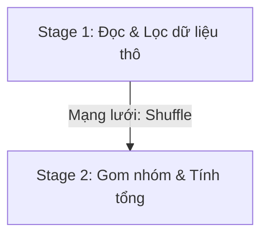

Để xử lý hàng Terabyte dữ liệu trên một mạng lưới gồm nhiều máy tính, Apache Spark không thể chỉ chạy code của bạn một cách tuần tự từ trên xuống dưới. Hệ thống buộc phải "mổ xẻ" chương trình thành nhiều phần nhỏ và điều phối chúng song song. 

Nếu mở công cụ giám sát Spark UI lên, bạn sẽ thấy hàng tá thuật ngữ như **Jobs**, **Stages**, và **Tasks**. Hiểu rõ mối liên kết giữa các khái niệm này là bước đệm tối thiểu giúp bạn đọc hiểu hiệu năng và tìm ra các điểm nghẽn (bottleneck) của luồng dữ liệu.

## Kiến trúc và Nguyên lý phân cấp thực thi

Khi một ứng dụng Spark chạy, hệ thống quản lý và điều phối các đơn vị công việc theo một cấu trúc phân cấp từ lớn xuống nhỏ bao gồm: **Application $\rightarrow$ Jobs $\rightarrow$ Stages $\rightarrow$ Tasks**.

### 1. Spark Application (Ứng dụng tổng thể)
Đây là chương trình chạy Spark hoàn chỉnh do bạn viết (ví dụ: một script Python `hourly_etl.py`). Khi bạn chạy script này, hệ thống sẽ cấp phát tài nguyên độc lập (gồm 1 Driver và nhiều Executors) để phục vụ cho ứng dụng này. Một Spark Application có thể chứa nhiều Jobs bên trong.

### 2. Spark Job (Công việc)
Mỗi khi mã nguồn của bạn kích hoạt một hàm **Action** (như `.count()`, `.show()`, hoặc `.write()`), Spark sẽ lập tức biên dịch và kích hoạt một **Spark Job** tương ứng để hoàn thành hành động đó. Nếu ứng dụng của bạn có 5 hàm ghi dữ liệu ra đĩa, nó sẽ sinh ra 5 Jobs độc lập chạy lần lượt.

### 3. Spark Stage (Giai đoạn)
Mỗi Job lớn sẽ được phân rã thành nhiều bước tính toán trung gian gọi là các **Stages**. 

Ranh giới để Spark quyết định bẻ đôi một sơ đồ tính toán thành các Stage chính là các phép toán yêu cầu xáo trộn dữ liệu qua mạng – **Shuffle** (do các hàm Wide Dependency như `groupBy()`, `join()` hoặc `distinct()` tạo ra). 

Các phép toán tính toán nội bộ (như `map`, `filter`) không cần chuyển dữ liệu qua mạng sẽ được gom chung vào cùng một Stage để xử lý cục bộ trên RAM của từng máy nhằm tiết kiệm thời gian.

### 4. Spark Task (Tác vụ nguyên tử)
Đây là đơn vị công việc nhỏ nhất và là thực thể thực tế chạy trên CPU Core của các Worker Nodes. 

Ở mỗi Stage, Spark sẽ chia dữ liệu thành nhiều phân mảnh nhỏ gọi là **Partitions**. Hệ thống sẽ tạo ra số lượng Tasks tương ứng với số lượng Partitions đó (ví dụ: dữ liệu có 100 partitions thì Stage sẽ sinh ra 100 Tasks chạy song song). Mỗi Task chạy trên duy nhất một CPU Core để xử lý một phân vùng dữ liệu cụ thể.

## Sức mạnh của DAG: Spark phân chia công việc ra sao?

Quá trình chia cắt này được thực hiện bởi một bộ phận đầu não gọi là **[DAG](/concepts/orchestration/dag/) Scheduler (Directed Acyclic Graph)**:

1. Bạn viết mã nguồn PySpark và áp dụng các phép biến đổi (Transformations). Do cơ chế trì hoãn thực thi (Lazy Evaluation), Spark chỉ ghi chép lại các bước này vào sơ đồ DAG chứ chưa chạy thực tế.
2. Ngay khi gặp một hàm ghi dữ liệu `df.write.parquet()`, Spark lập tức kích hoạt một **Job**.
3. DAG Scheduler nhìn ngược lại biểu đồ biến đổi dữ liệu. Cứ mỗi lần gặp một phép toán cần gom nhóm Key qua mạng (như `groupBy`), nó sẽ dùng chiếc kéo "cắt" sơ đồ DAG tại đó để tạo thành một ranh giới Stage mới.
4. Trong mỗi Stage, hệ thống đếm số lượng Partitions của dữ liệu hiện tại, phân rã Stage thành các **Tasks** tương ứng rồi phân bổ chúng xuống các Core của Executor để thực thi song song.



## Phân tích qua ví dụ thực tế

Hãy cùng giải phẫu một đoạn mã PySpark đơn giản để xem cách hệ thống phân chia công việc:

```python
# 1. Kích hoạt Spark Application trên cụm máy chủ
df = spark.read.csv("s3://data/users/")

# Phép lọc dữ liệu (Lazy Evaluation - chưa sinh ra Job nào)
adults_df = df.filter("age > 18")

# ACTION 1 -> Kích hoạt Spark Job số 1
print(adults_df.count()) 
# Job 1 này chỉ thực hiện đếm số dòng mà không cần gom nhóm, nên không có Shuffle. 
# Hệ thống sinh ra 1 Stage duy nhất. Nếu dữ liệu gốc có 10 Partitions, Job này sẽ có 10 Tasks.

# Gom nhóm dữ liệu theo tỉnh thành
city_count_df = adults_df.groupBy("city").count()

# ACTION 2 -> Kích hoạt Spark Job số 2
city_count_df.write.save("s3://output/")
# Job 2 này chứa phép toán groupBy (Wide Dependency), nên bắt buộc phải Shuffle dữ liệu qua mạng. 
# Spark bẻ đôi Job thành 2 Stages: 
#   - Stage 1: Đọc file, lọc tuổi > 18, và chuẩn bị dữ liệu.
#   - Stage 2: Kéo dữ liệu qua mạng để gom nhóm theo tỉnh thành và ghi kết quả ra S3.
# Nếu cấu hình mặc định, Stage 2 sẽ sinh ra đúng 200 Tasks tương đương 200 shuffle partitions.
```

## Ưu nhược điểm và Đánh đổi (Pros & Cons)

### Ưu điểm
* **Tối ưu hóa tài nguyên nhờ Pipelining**: Spark gộp các narrow transformations (như `map`, `filter`) vào chung một Stage để thực thi liên tiếp trên RAM, tránh hoàn toàn việc ghi dữ liệu tạm thời ra đĩa cứng hay truyền qua mạng.
* **Chịu lỗi thông minh (Fault Tolerance)**: Nhờ ranh giới Shuffle đóng vai trò là điểm chốt chặn dữ liệu, nếu Stage 2 bị lỗi giữa chừng, Spark chỉ cần tính toán lại dữ liệu của Stage 1 ở các phân vùng bị lỗi thay vì phải chạy lại toàn bộ ứng dụng từ đầu.

### Nhược điểm & Đánh đổi
* **Độ trễ do Shuffle (Shuffle Latency)**: Ranh giới giữa các Stage yêu cầu đồng bộ hóa toàn cụm. Một Stage phải đợi toàn bộ các Task của Stage trước đó hoàn thành mới được phép bắt đầu, dẫn đến tình trạng các Executor khỏe phải chờ Worker yếu nhất (lỗi Straggler).
* **Quá tải lập lịch (Scheduling Overhead)**: Nếu bạn chia nhỏ dữ liệu thành quá nhiều phân vùng nhỏ, Spark sẽ sinh ra hàng nghìn Task ngắn hạn. Việc này làm quá tải bộ điều phối của Spark Driver (Driver overhead) để lên lịch trình và theo dõi trạng thái các Task.

## Sai lầm thường gặp và Best Practices

* **Tối ưu hóa kích thước Task (Task Size)**: 
  * Nếu một Stage sinh ra tới 10,000 Tasks nhưng thời gian chạy trung bình của mỗi task chỉ có vài mili-giây, hệ thống của bạn đang bị lãng phí rất nhiều tài nguyên cho việc lập lịch (Scheduling Overhead). Hãy gom nhỏ số phân vùng lại (sử dụng hàm `.coalesce()`).
  * Ngược lại, nếu số lượng Task quá ít mà dung lượng dữ liệu quá lớn, các Task sẽ chạy rất lâu và dễ làm Executor bị sập vì tràn bộ nhớ. Lúc này, hãy tăng số lượng phân vùng lên (sử dụng `.repartition()`).
* **Tránh ranh giới Shuffle không cần thiết**: Hãy thiết kế các truy vấn hạn chế tối đa các phép toán như `join`, `groupByKey`, hoặc `distinct` trên các tập dữ liệu lớn. Hãy ưu tiên sử dụng Broadcast Join nếu một trong hai bảng có kích thước nhỏ để loại bỏ hoàn toàn việc phân Stage mới do Shuffle.

## Khái niệm liên quan

* [Apache Spark](/concepts/batch-processing/apache-spark/): Bộ máy tính toán phân tán.
* [Spark Execution Model](/concepts/batch-processing/spark-execution-model/): Mô hình phân bổ tài nguyên Master-Slave.
* [Shuffle](/concepts/batch-processing/shuffle/): Cơ chế xáo trộn dữ liệu qua mạng lưới.
* [Spark Partition](/concepts/batch-processing/spark-partition/): Các phân mảnh dữ liệu vật lý.

## Trọng tâm ôn luyện phỏng vấn

### 1. Giải thích sự khác biệt giữa Job, Stage và Task trong Apache Spark?
* **Gợi ý trả lời**: 
  * **Job** đại diện cho một chuỗi các phép toán xử lý dữ liệu được kích hoạt bởi một hành động Action cụ thể (như `.collect()`, `.write()`).
  * **Stage** là các phân đoạn thực thi vật lý trong một Job. Spark chia Job thành nhiều Stage dựa trên các ranh giới Shuffle (Wide Dependency). Các phép toán không cần truyền dữ liệu qua mạng (Narrow Dependency) sẽ được gộp chung vào một Stage để tối ưu tốc độ.
  * **Task** là đơn vị tính toán nhỏ nhất được gửi xuống cho một CPU Core xử lý. Một Stage sẽ được chia thành nhiều Task chạy song song, trong đó mỗi Task xử lý một phân vùng dữ liệu (Partition) độc lập.

### 2. Khi chạy lệnh hiển thị dữ liệu `df.show(20)`, tại sao số lượng Task thực thi thường ít hơn rất nhiều so với số lượng Partitions gốc của DataFrame?
* **Gợi ý trả lời**: Đây là tính năng tối ưu hóa thông minh của bộ công cụ Catalyst Optimizer trên Spark. Hàm `.show(20)` chỉ yêu cầu hiển thị 20 dòng dữ liệu đầu tiên. 
  Thay vì khởi chạy hàng trăm Task để quét toàn bộ dữ liệu trên HDFS/S3, Spark sẽ tạo ra một Job nhỏ và chỉ kích hoạt một vài Task trên phân vùng đầu tiên. Nếu thu thập đủ 20 dòng, Spark sẽ lập tức dừng công việc và hiển thị kết quả, giúp tiết kiệm tối đa tài nguyên CPU và băng thông mạng.

### 3. Làm thế nào để giải quyết tình trạng Executor bị lỗi OOM (Out of Memory) do "Task quá lớn" trong Spark?
* **Gợi ý trả lời**: Lỗi này xảy ra khi dung lượng của một phân vùng dữ liệu (Partition) vượt quá dung lượng bộ nhớ khả dụng của Executor Core được cấp phát. Để xử lý, ta có thể: (1) Tăng số lượng phân vùng bằng cách gọi `.repartition(N)` để chia nhỏ dữ liệu hơn, từ đó giảm dung lượng dữ liệu cho mỗi Task. (2) Kiểm tra xem dữ liệu có bị lệch ([data skew](/concepts/batch-processing/data-skew/)) hay không, nếu có thì áp dụng kỹ thuật salting hoặc phát sóng các bảng nhỏ (Broadcast Join) để tránh shuffle mất cân bằng.

## Tài liệu tham khảo

1. [Apache Spark Cluster Overview](https://spark.apache.org/docs/latest/cluster-overview.html) - Official documentation on cluster components, master-worker interactions, and scheduling.
2. [Spark: The Definitive Guide](https://www.oreilly.com/library/view/spark-the-definitive/9781491912201/) - Reference book by Bill Chambers and Matei Zaharia covering Spark jobs, stages, tasks, and Spark UI profiling.
3. [Spark in Action, Second Edition](https://www.manning.com/books/spark-in-action-second-edition) - Practical guide to Spark architecture and cluster management by Jean-Georges Perrin.
4. [Learning Spark, 2nd Edition](https://www.oreilly.com/library/view/learning-spark-2nd/9781492050032/) - Essential book detailing structured APIs, data flow, and job execution by Jules S. Damji, Brooke Wenig, and Tathagata Das.
5. Mastering Apache Spark: DAGScheduler - Community guide describing the inner workings of Spark's DAG Scheduler and task scheduling process by Jacek Laskowski.

## English Summary

The execution hierarchy of an Apache Spark application maps logical operations to physical execution resources. An Application spawns multiple Jobs triggered by Actions. A Job's Directed Acyclic Graph (DAG) is sliced into distinct Stages at shuffle boundaries (where wide dependencies necessitate network data movement). Within a Stage, the workload is distributed as discrete Tasks, each executing concurrently on an individual CPU core over a single Partition of data. Understanding this pipeline is the foundational prerequisite for debugging bottlenecks in the Spark UI.
